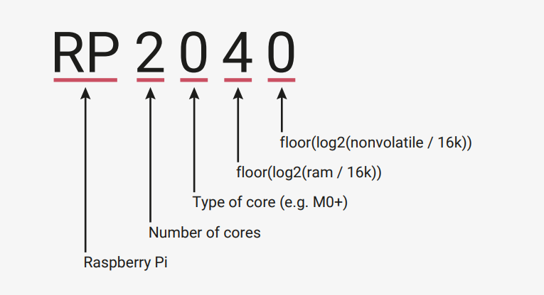
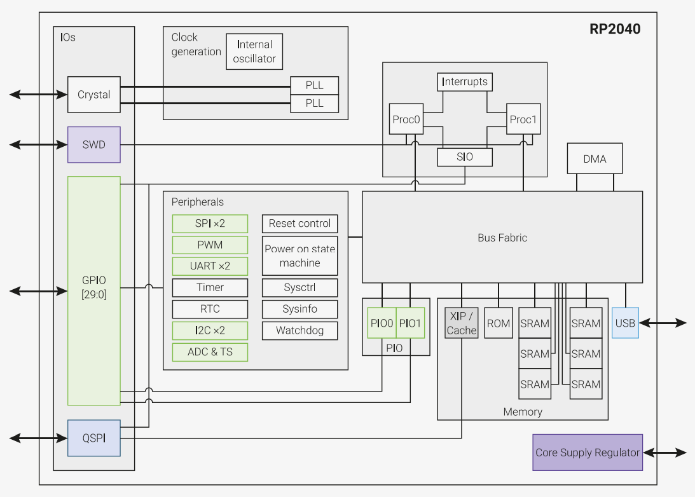
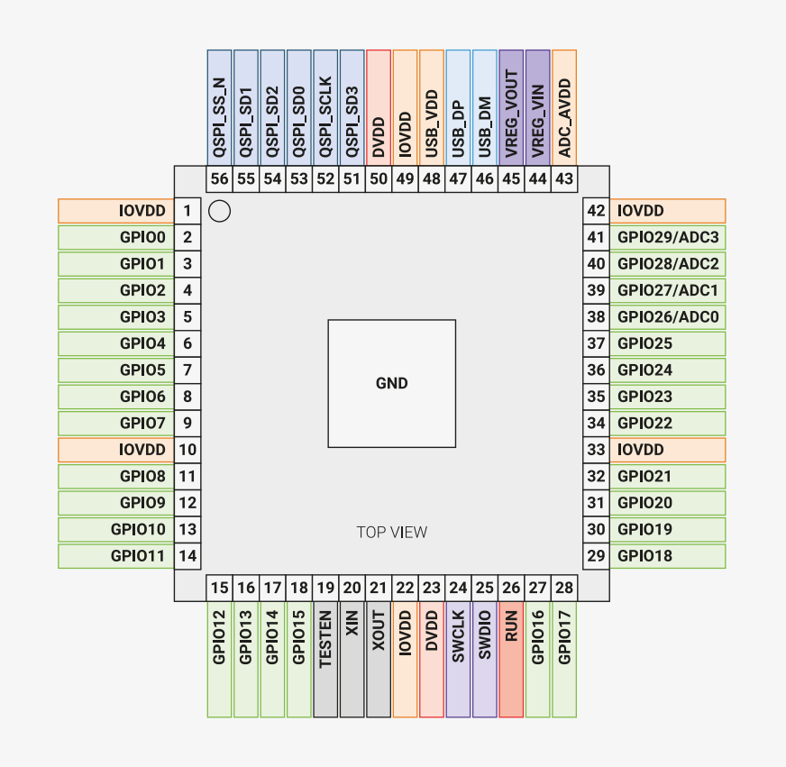

# Chapter 1. Introduction

Microcontrollers connect the world of software to the world of hardware. They allow developers to write software which
interacts with the physical world in the same deterministic, cycle-accurate manner as digital logic. They occupy the
bottom left corner of the price/performance space, outselling their more powerful brethren by a factor of ten to one.
They are the workhorses that power the digital transformation of our world.

RP2040 is the debut microcontroller from Raspberry Pi. It brings our signature values of high performance, low cost,
and ease of use to the microcontroller space.
With a large on-chip memory, symmetric dual-core processor complex, deterministic bus fabric, and rich peripheral set
augmented with our unique Programmable I/O (PIO) subsystem, it provides professional users with unrivalled power
and flexibility. With detailed documentation, a polished MicroPython port, and a UF2 bootloader in ROM, it has the
lowest possible barrier to entry for beginner and hobbyist users.
RP2040 is a stateless device, with support for cached execute-in-place from external QSPI memory. This design
decision allows you to choose the appropriate density of non-volatile storage for your application, and to benefit from
the low pricing of commodity Flash parts.
RP2040 is manufactured on a modern 40nm process node, delivering high performance, low dynamic power
consumption, and low leakage, with a variety of low-power modes to support extended-duration operation on battery
power.
Key features:

- Dual ARM Cortex-M0+ @ 133MHz
- 264kB on-chip SRAM in six independent banks
- Support for up to 16MB of off-chip Flash memory via dedicated QSPI bus
- DMA controller
- Fully-connected AHB crossbar
- Interpolator and integer divider peripherals
- On-chip programmable LDO to generate core voltage
- 2 on-chip PLLs to generate USB and core clocks
- 30 GPIO pins, 4 of which can be used as analogue inputs
- Peripherals
	- UARTs
	- SPI controllers
	- I2C controllers
	- PWM channels
	- USB 1.1 controller and PHY, with host and device support
	- 8 PIO state machines

Whatever your microcontroller application, from machine learning to motor control, from agriculture to audio, RP
has the performance, feature set, and support to make your product fly.

## 1.1. Why is the chip called RP2040?

The post-fix numeral on RP2040 comes from the following,

1.Number of processor cores (2)
2.Loosely which type of processor (M0+)
3.floor(log2(ram / 16k))
4.floor(log2(nonvolatile / 16k)) or 0 if no onboard nonvolatile storage

see Figure 1.

字 | 意味
---|----------------------------------
RP | Raspberry Pi
2 | Number of cores
0 | Type of core (e.g. M0+)
4 | floor(log2(ram / 16k))
0 | floor(log2(nonvolatile / 16k))

_Figure 1. An explanation for the name of the RP chip._

## 1.2. Summary

RP2040 is a low-cost, high-performance microcontroller device with flexible digital interfaces. Key features:

- Dual Cortex M0+ processor cores, up to 133MHz
- 264kB of embedded SRAM in 6 banks
- 30 multifunction GPIO
- 6 dedicated IO for SPI Flash (supporting XIP)
- Dedicated hardware for commonly used peripherals
- Programmable IO for extended peripheral support
- 4 channel ADC with internal temperature sensor, 500ksps, 12-bit conversion
- USB 1.1 Host/Device

## 1.3. The Chip

RP2040 has a dual M0+ processor cores, DMA, internal memory and peripheral blocks connected via AHB/APB bus
fabric.

_Figure 2. A system overview of the RP2040 chip_

Code may be executed directly from external memory through a dedicated SPI, DSPI or QSPI interface. A small cache
improves performance for typical applications.

Debug is available via the SWD interface.
Internal SRAM can contain code or data. It is addressed as a single 264 kB region, but physically partitioned into 6
banks to allow simultaneous parallel access from different masters.
DMA bus masters are available to offload repetitive data transfer tasks from the processors.
GPIO pins can be driven directly, or from a variety of dedicated logic functions.

Dedicated hardware for fixed functions such as SPI, I2C, UART.
Flexible configurable PIO controllers can be used to provide a wide variety of IO functions.

A USB controller with embedded PHY can be used to provide FS/LS Host or Device connectivity under software control.
Four ADC inputs which are shared with GPIO pins.
Two PLLs to provide a fixed 48MHz clock for USB or ADC, and a flexible system clock up to 133MHz.

An internal Voltage Regulator to supply the core voltage so the end product only needs supply the IO voltage.

## 1.4. Pinout Reference

This section provides a quick reference for pinout and pin functions. Full details, including electrical specifications and
package drawings, can be found in Chapter 5.

### 1.4.1. Pin Locations

_Figure 3. RP
Pinout for QFN-
7 ×7mm (reduced ePad
size)_

### 1.4.2. Pin Descriptions

_Table 1. The function
of each pin is briefly
described here. Full
electrical
specifications can be
found in Chapter 5._

Name | Description
-----|------------------------
GPIOx| General-purpose digital input and output. RP2040 can connect one of a number of internal peripherals to each GPIO, or control GPIOs directly from software.
GPIOx/ADCy | General-purpose digital input and output, with analogue-to-digital converter function. The RP ADC has an analogue multiplexer which can select any one of these pins, and sample the voltage.
QSPIx | Interface to a SPI, Dual-SPI or Quad-SPI flash device, with execute-in-place support. These pins can also be used as software-controlled GPIOs, if they are not required for flash access.
USB_DM and USB_DP | USB controller, supporting Full Speed device and Full/Low Speed host. A 27Ω series termination resistor is required on each pin, but bus pullups and pulldowns are provided internally.
XIN and XOUT | Connect a crystal to RP2040’s crystal oscillator. XIN can also be used as a single-ended CMOS clock input, with XOUT disconnected. The USB bootloader requires a 12MHz crystal or 12MHz clock input.
RUN | Global asynchronous reset pin. Reset when driven low, run when driven high. If no external reset is required, this pin can be tied directly to IOVDD.
SWCLK and SWDIO | Access to the internal Serial Wire Debug multi-drop bus. Provides debug access to both processors, and can be used to download code.
TESTEN | Factory test mode pin. Tie to GND.
GND | Single external ground connection, bonded to a number of internal ground pads on the RP2040 die.
IOVDD | Power supply for digital GPIOs, nominal voltage 1.8V to 3.3V
USB_VDD | Power supply for internal USB Full Speed PHY, nominal voltage 3.3V
ADC_AVDD | Power supply for analogue-to-digital converter, nominal voltage 3.3V
VREG_VIN | Power input for the internal core voltage regulator, nominal voltage 1.8V to 3.3V
VREG_VOUT | Power output for the internal core voltage regulator, nominal voltage 1.1V, 100mA max current
DVDD | Digital core power supply, nominal voltage 1.1V. Can be connected to VREG_VOUT, or to some other board-level power supply.

### 1.4.3. GPIO Functions

Each individual GPIO pin can be connected to an internal peripheral via the GPIO functions defined below. Some internal
peripheral connections appear in multiple places to allow some system level flexibility. SIO, PIO0 and PIO1 can connect
to all GPIO pins and are controlled by software (or software controlled state machines) so can be used to implement
many functions.

_Table 2. General
Purpose Input/Output
(GPIO) Bank 0
Functions_

GPIO  | F1       | F2        | F3       | F4     | F5   | F6   | F7   | F8           | F9
------|----------|-----------|----------|--------|------|------|------|--------------|-------
0     | SPI0 RX  | UART0 TX  | I2C0 SDA | PWM0 A | SIO  | PIO0 | PIO1 |              | USB OVCUR DET
1     | SPI0 CSn | UART0 RX  | I2C0 SCL | PWM0 B | SIO  | PIO0 | PIO1 |              | USB VBUS  DET
2     | SPI0 SCK | UART0 CTS | I2C1 SDA | PWM1 A | SIO  | PIO0 | PIO1 |              | USB VBUS  EN
3     | SPI0 TX  | UART0 RTS | I2C1 SCL | PWM1 B | SIO  | PIO0 | PIO1 |              | USB OVCUR DET
4     | SPI0 RX  | UART1 TX  | I2C0 SDA | PWM2 A | SIO  | PIO0 | PIO1 |              | USB VBUS  DET
5     | SPI0 CSn | UART1 RX  | I2C0 SCL | PWM2 B | SIO  | PIO0 | PIO1 |              | USB VBUS  EN
6     | SPI0 SCK | UART1 CTS | I2C1 SDA | PWM3 A | SIO  | PIO0 | PIO1 |              | USB OVCUR DET
7     | SPI0 TX  | UART1 RTS | I2C1 SCL | PWM3 B | SIO  | PIO0 | PIO1 |              | USB VBUS  DET
8     | SPI1 RX  | UART1 TX  | I2C0 SDA | PWM4 A | SIO  | PIO0 | PIO1 |              | USB VBUS  EN
9     | SPI1 CSn | UART1 RX  | I2C0 SCL | PWM4 B | SIO  | PIO0 | PIO1 |              | USB OVCUR DET
10    | SPI1 SCK | UART1 CTS | I2C1 SDA | PWM5 A | SIO  | PIO0 | PIO1 |              | USB VBUS  DET
11    | SPI1 TX  | UART1 RTS | I2C1 SCL | PWM5 B | SIO  | PIO0 | PIO1 |              | USB VBUS  EN
12    | SPI1 RX  | UART0 TX  | I2C0 SDA | PWM6 A | SIO  | PIO0 | PIO1 |              | USB OVCUR DET
13    | SPI1 CSn | UART0 RX  | I2C0 SCL | PWM6 B | SIO  | PIO0 | PIO1 |              | USB VBUS  DET
14    | SPI1 SCK | UART0 CTS | I2C1 SDA | PWM7 A | SIO  | PIO0 | PIO1 |              | USB VBUS EN
15    | SPI1 TX  | UART0 RTS | I2C1 SCL | PWM7 B | SIO  | PIO0 | PIO1 |              | USB OVCUR DET
16    | SPI0 RX  | UART0 TX  | I2C0 SDA | PWM0 A | SIO  | PIO0 | PIO1 |              | USB VBUS DET
17    | SPI0 CSn | UART0 RX  | I2C0 SCL | PWM0 B | SIO  | PIO0 | PIO1 |              | USB VBUS EN
18    | SPI0 SCK | UART0 CTS | I2C1 SDA | PWM1 A | SIO  | PIO0 | PIO1 |              | USB OVCUR DET
19    | SPI0 TX  | UART0 RTS | I2C1 SCL | PWM1 B | SIO  | PIO0 | PIO1 |              | USB VBUS DET
20    | SPI0 RX  | UART1 TX  | I2C0 SDA | PWM2 A | SIO  | PIO0 | PIO1 | CLOCK GPIN0  | USB VBUS EN
21    | SPI0 CSn | UART1 RX  | I2C0 SCL | PWM2 B | SIO  | PIO0 | PIO1 | CLOCK GPOUT0 | USB OVCUR DET
22    | SPI0 SCK | UART1 CTS | I2C1 SDA | PWM3 A | SIO  | PIO0 | PIO1 | CLOCK GPIN1  | USB VBUS DET
23    | SPI0 TX  | UART1 RTS | I2C1 SCL | PWM3 B | SIO  | PIO0 | PIO1 | CLOCK GPOUT1 | USB VBUS EN
24    | SPI1 RX  | UART1 TX  | I2C0 SDA | PWM4 A | SIO  | PIO0 | PIO1 | CLOCK GPOUT2 | USB OVCUR DET
25    | SPI1 CSn | UART1 RX  | I2C0 SCL | PWM4 B | SIO  | PIO0 | PIO1 | CLOCK GPOUT3 | USB VBUS DET
26    | SPI1 SCK | UART1 CTS | I2C1 SDA | PWM5 A | SIO  | PIO0 | PIO1 |              | USB VBUS EN
27    | SPI1 TX  | UART1 RTS | I2C1 SCL | PWM5 B | SIO  | PIO0 | PIO1 |              | USB OVCUR DET
28    | SPI1 RX  | UART0 TX  | I2C0 SDA | PWM6 A | SIO  | PIO0 | PIO1 |              | USB VBUS DET
29    | SPI1 CSn | UART0 RX  | I2C0 SCL | PWM6 B | SIO  | PIO0 | PIO1 |              | USB VBUS EN

_Table 3. GPIO bank 0
function descriptions_ 

Function Name | Description
--------------|-----------------------
SPIx | Connect one of the internal PL022 SPI peripherals to GPIO
UARTx | Connect one of the internal PL011 UART peripherals to GPIO
I2Cx | Connect one of the internal DW I2C peripherals to GPIO
PWMx A/B | Connect a PWM slice to GPIO. There are eight PWM slices, each with two output channels (A/B). The B pin can also be used as an input, for frequency and duty cycle measurement.
SIO | Software control of GPIO, from the single-cycle IO (SIO) block. The SIO function (F5) must be selected for the processors to drive a GPIO, but the input is always connected, so software can check the state of GPIOs at any time.
PIOx | Connect one of the programmable IO blocks (PIO) to GPIO. PIO can implement a wide variety of interfaces, and has its own internal pin mapping hardware, allowing flexible placement of digital interfaces on bank 0 GPIOs. The PIO function (F6, F7) must be selected for PIO to drive a GPIO, but the input is always connected, so the PIOs can always see the state of all pins.
CLOCK GPINx | General purpose clock inputs. Can be routed to a number of internal clock domains on RP2040, e.g. to provide a 1Hz clock for the RTC, or can be connected to an internal frequency counter.
CLOCK GPOUTx | General purpose clock outputs. Can drive a number of internal clocks (including PLL outputs) onto GPIOs, with optional integer divide.
USB OVCUR DET/VBUS DET/VBUS EN | USB power control signals to/from the internal USB controller

