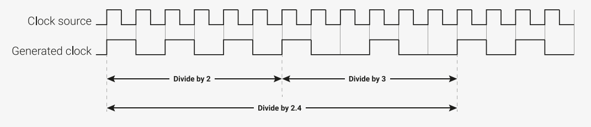

# Chapter 2. System Description


This chapter describes the RP2040 key system features including processor, memory, how blocks are connected,
clocks, resets, power, and IO. Refer to Figure 2 for an overview diagram.

## 2.1. Bus Fabric


The RP2040 bus fabric routes addresses and data across the chip.
Figure 4 shows the high-level structure of the bus fabric. The main AHB-Lite crossbar routes addresses and data
between its 4 upstream ports and 10 downstream ports: up to four bus transfers can take place each cycle. All data
paths are 32 bits wide. Memory devices have dedicated ports on the main crossbar, to satisfy their high bandwidth
requirements. High-bandwidth AHB-Lite peripherals have a shared port on the crossbar, and an APB bridge provides bus
access to system control registers and lower-bandwidth peripherals.

_Figure 4. RP2040 bus fabric overview._


The bus fabric connects 4 AHB-Lite masters, i.e. devices which generate addresses:

- Processor core 0
- Processor core 1
- DMA controller Read port
- DMA controller Write port

These are routed through to 10 downstream ports on the main crossbar:

- ROM
- Flash XIP
- SRAM 0 to 5 (one port each)
- Fast AHB-Lite peripherals: PIO0, PIO1, USB, DMA control registers, XIP aux (one shared port)
- Bridge to all APB peripherals, and system control registers

The four bus masters can access any four _different_ crossbar ports simultaneously, the bus fabric does not add wait
states to any AHB-Lite slave access. So at a system clock of 125MHz the maximum sustained bus bandwidth is
2.0GBps. The system address map has been arranged to make this parallel bandwidth available to as many software
use cases as possible  -  for example, the striped SRAM alias (Section 2.6.2) scatters main memory accesses across
four crossbar ports (SRAM0...3), so that more memory accesses can proceed in parallel.

### 2.1.1. AHB-Lite Crossbar


At the centre of the RP2040 bus fabric is a 4:10 fully-connected crossbar. Its 4 upstream ports are connected to the 4
system bus masters, and the 10 downstream ports connect to the highest-bandwidth AHB-Lite slaves (namely the
memory interfaces) and to lower layers of the fabric. Figure 5 shows the structure of a 2:3 AHB-Lite crossbar, arranged
identically to the 4:10 crossbar on RP2040, but easier to show in the diagram.

_Figure 5. A 2:3 AHB- Lite crossbar. Each upstream port connects to a splitter, which routes bus requests toward one of the 3 downstream ports, and routes responses back. Each downstream port connects to an arbiter, which safely manages concurrent access to the port._


The crossbar is built from two components:

- Splitters
	- Perform coarse address decode
	- Route requests (addresses, write data) to the downstream port indicated by the initial address decode
	- Route responses (read data, bus errors) from the correct arbiter back to the upstream port
- Arbiters
	- Manage concurrent requests to a downstream port
	- Route responses (read data, bus errors) to the correct splitter
	- Implement bus priority rules


The main crossbar on RP2040 consists of 4 1:10 splitters and 10 4:1 arbiters, with a mesh of 40 AHB-Lite bus channels
between them. Note that, as AHB-Lite is a pipelined bus, the splitter may be routing back a response to an earlier
request from downstream port A, whilst a new request to downstream port B is already in progress. This does not incur
any cycle penalty.

#### 2.1.1.1. Bus Priority


The arbiters in the main AHB-Lite crossbar implement a two-level bus priority scheme. Priority levels are configured per-
master, using the BUS_PRIORITY register in the BUSCTRL register block.
When there are multiple simultaneous accesses to same arbiter, any requests from high-priority masters (priority level
1) will be considered before any requests from low-priority masters (priority 0). If multiple masters of the same priority
level attempt to access the same slave simultaneously, a round-robin tie break is applied, i.e. the arbiter grants access
to each master in turn.

!> **NOTE**  
!> Priority arbitration only applies to multiple masters attempting to access the same slave on the same cycle.
!> Accesses to different slaves, e.g. different SRAM banks, can proceed simultaneously.


When accessing a slave with zero wait states, such as SRAM (i.e. can be accessed once per system clock cycle), high-
priority masters will never observe any slowdown or other timing effects caused by accesses from low-priority masters.
This allows guaranteed latency and throughput for hard real time use cases; it does however mean a low-priority master
may get stalled until there is a free cycle.

#### 2.1.1.2. Bus Performance Counters


The performance counters automatically count accesses to the main AHB-Lite crossbar arbiters. This can assist in
diagnosing performance issues, in high-traffic use cases.

There are four performance counters. Each is a 24-bit saturating counter. Counter values can be read from
BUSCTRL_PERFCTRx, and cleared by writing any value to BUSCTRL_PERFCTRx. Each counter can count one of the 20 available
events at a time, as selected by BUSCTRL_PERFSELx. The available bus events are:


PERFSEL x | Event | Description
---|----|----
0  | APB access, contested | Completion of an access to the APB arbiter (which is upstream of all APB peripherals), which was previously delayed due to an access by another master.
1  | APB access | Completion of an access to the APB arbiter
2  | FASTPERI access, contested | Completion of an access to the FASTPERI arbiter (which is upstream of PIOs, DMA config port, USB, XIP aux FIFO port), which was previously delayed due to an access by another master.
3  | FASTPERI access | Completion of an access to the FASTPERI arbiter
4  | SRAM5 access, contested | Completion of an access to the SRAM5 arbiter, which was previously delayed due to an access by another master.
5  | SRAM5 access | Completion of an access to the SRAM5 arbiter
6  | SRAM4 access, contested | Completion of an access to the SRAM4 arbiter, which was previously delayed due to an access by another master.
7  | SRAM4 access | Completion of an access to the SRAM4 arbiter
8  | SRAM3 access, contested | Completion of an access to the SRAM3 arbiter, which was previously delayed due to an access by another master.
9  | SRAM3 access | Completion of an access to the SRAM3 arbiter
10 | SRAM2 access, contested | Completion of an access to the SRAM2 arbiter, which was previously delayed due to an access by another master.
11 | SRAM2 access | Completion of an access to the SRAM2 arbiter
12 | SRAM1 access, contested | Completion of an access to the SRAM1 arbiter, which was previously delayed due to an access by another master.
13 | SRAM1 access | Completion of an access to the SRAM1 arbiter
14 | SRAM0 access, contested | Completion of an access to the SRAM0 arbiter, which was previously delayed due to an access by another master.
15 | SRAM0 access | Completion of an access to the SRAM0 arbiter
16 | XIP_MAIN access, contested | Completion of an access to the XIP_MAIN arbiter, which was previously delayed due to an access by another master.
17 | XIP_MAIN access | Completion of an access to the XIP_MAIN arbiter
18 | ROM access, contested | Completion of an access to the ROM arbiter, which was previously delayed due to an access by another master.
19 | ROM access | Completion of an access to the ROM arbiter

### 2.1.2. Atomic Register Access

Each peripheral register block is allocated 4kB of address space, with registers accessed using one of 4 methods,
selected by address decode.

- Addr + 0x0000 : normal read write access
- Addr + 0x1000 : atomic XOR on write
- Addr + 0x2000 : atomic bitmask set on write
- Addr + 0x3000 : atomic bitmask clear on write

This allows individual fields of a control register to be modified without performing a read-modify-write sequence in
software: instead the changes are posted to the peripheral, and performed in-situ. Without this capability, it is difficult to
safely access IO registers when an interrupt service routine is concurrent with code running in the foreground, or when
the two processors are running code in parallel.
The four atomic access aliases occupy a total of 16kB. Most peripherals on RP2040 provide this functionality natively,
and atomic writes have the same timing as normal read/write access. Some peripherals (I2C, UART, SPI and SSI)
instead have this functionality added using a bus interposer, which translates upstream atomic writes into downstream
read-modify-write sequences, at the boundary of the peripheral. This extends the access time by two system clock
cycles.
The SIO (Section 2.3.1), a single-cycle IO block attached directly to the cores' IO ports, does **not** support atomic
accesses at the bus level, although some individual registers (e.g. GPIO) have set/clear/xor aliases.

### 2.1.3. APB Bridge


The APB bridge interfaces the high-speed main AHB-Lite interconnect to the lower-bandwidth peripherals. Whilst the
AHB-Lite fabric offers zero-wait-state access everywhere, APB accesses have a cycle penalty:

- APB bus accesses take two cycles minimum (setup phase and access phase)
- The bridge adds an additional cycle to read accesses, as the bus request and response are registered
- The bridge adds **two** additional cycles to write accesses, as the APB setup phase can not begin until the AHB-Lite write data is valid

As a result, the throughput of the APB portion of the bus fabric is somewhat lower than the AHB-Lite portion. However,
there is more than sufficient bandwidth to saturate the APB serial peripherals.

### 2.1.4. Narrow IO Register Writes


Memory-mapped IO registers on RP2040 ignore the width of bus read/write accesses. They treat all writes as though
they were 32 bits in size. This means software can not use byte or halfword writes to modify part of an IO register: any
write to an address where the 30 address MSBs match the register address will affect the contents of the entire register.

To update part of an IO register, without a read-modify-write sequence, the best solution on RP2040 is atomic
set/clear/XOR (see Section 2.1.2). Note that this is more flexible than byte or halfword writes, as any combination of
fields can be updated in one operation.
Upon a 8-bit or 16-bit write (such as a strb instruction on the Cortex-M0+), an IO register will sample the entire 32-bit
write databus. The Cortex-M0+ and DMA on RP2040 will always replicate narrow data across the bus:

Pico Examples: [https://github.com/raspberrypi/pico-examples/blob/master/system/narrow_io_write/narrow_io_write.c](https://github.com/raspberrypi/pico-examples/blob/master/system/narrow_io_write/narrow_io_write.c) Lines 19 - 62

```c
19 int main() {
20 stdio_init_all();
21
22 // We'll use WATCHDOG_SCRATCH0 as a convenient 32 bit read/write register
23 // that we can assign arbitrary values to
24 io_rw_32 *scratch32 = &watchdog_hw->scratch[ 0 ];
25 // Alias the scratch register as two halfwords at offsets +0x0 and +0x
26 volatile uint16_t *scratch16 = (volatile uint16_t *) scratch32;
27 // Alias the scratch register as four bytes at offsets +0x0, +0x1, +0x2, +0x3:
28 volatile uint8_t *scratch8 = (volatile uint8_t *) scratch32;
29
30 // Show that we can read/write the scratch register as normal:
31 printf("Writing 32 bit value\n");
32 *scratch32 = 0xdeadbeef;
33 printf("Should be 0xdeadbeef: 0x%08x\n", *scratch32);
34
35 // We can do narrow reads just fine -- IO registers treat this as a 32 bit
36 // read, and the processor/DMA will pick out the correct byte lanes based
37 // on transfer size and address LSBs
38 printf("\nReading back 1 byte at a time\n");
39 // Little-endian!
40 printf("Should be ef be ad de: %02x ", scratch8[ 0 ]);
41 printf("%02x ", scratch8[ 1 ]);
42 printf("%02x ", scratch8[ 2 ]);
43 printf("%02x\n", scratch8[ 3 ]);
44
45 // The Cortex-M0+ and the RP2040 DMA replicate byte writes across the bus,
46 // and IO registers will sample the entire write bus always.
47 printf("\nWriting 8 bit value 0xa5 at offset 0\n");
48 scratch8[ 0 ] = 0xa5;
49 // Read back the whole scratch register in one go
50 printf("Should be 0xa5a5a5a5: 0x%08x\n", *scratch32);
51
52 // The IO register ignores the address LSBs [1:0] as well as the transfer
53 // size, so it doesn't matter what byte offset we use
54 printf("\nWriting 8 bit value at offset 1\n");
55 scratch8[ 1 ] = 0x3c;
56 printf("Should be 0x3c3c3c3c: 0x%08x\n", *scratch32);
57
58 // Halfword writes are also replicated across the write data bus
59 printf("\nWriting 16 bit value at offset 0\n");
60 scratch16[ 0 ] = 0xf00d;
61 printf("Should be 0xf00df00d: 0x%08x\n", *scratch32);
62 }
```

### 2.1.5. List of Registers


The Bus Fabric registers start at a base address of 0x40030000 (defined as BUSCTRL_BASE in SDK).

_Table 4. List of BUSCTRL registers_

Offset | Name | Info
----|----|----
0x00 | BUS_PRIORITY | Set the priority of each master for bus arbitration.
0x04 | BUS_PRIORITY_ACK | Bus priority acknowledge
0x08 | PERFCTR0 | Bus fabric performance counter 0
0x0c | PERFSEL0 | Bus fabric performance event select for PERFCTR0
0x10 | PERFCTR1 | Bus fabric performance counter 1
0x14 | PERFSEL1 | Bus fabric performance event select for PERFCTR1
0x18 | PERFCTR2 | Bus fabric performance counter 2
0x1c | PERFSEL2 | Bus fabric performance event select for PERFCTR2
0x20 | PERFCTR3 | Bus fabric performance counter 3
0x24 | PERFSEL3 | Bus fabric performance event select for PERFCTR3

#### BUSCTRL: BUS_PRIORITY Register


**Offset** : 0x00


**Description**


Set the priority of each master for bus arbitration.

_Table 5. BUS_PRIORITY Register_


Bits  | Name      | Description | Type | Reset
---| ---| ---| ---| ---
31:13 | Reserved. | - | - | -
12    | DMA_W     | 0 - low priority, 1 - high priority | RW | 0x0
11:9  | Reserved. | - | - | -
8     | DMA_R     | 0 - low priority, 1 - high priority | RW | 0x0
7:5   | Reserved. | - | - | -
4     | PROC1     | 0 - low priority, 1 - high priority | RW | 0x0
3:1   | Reserved. | - | - | -
0     | PROC0     | 0 - low priority, 1 - high priority | RW | 0x0

#### BUSCTRL: BUS_PRIORITY_ACK Register

**Offset** : 0x04


**Description**


Bus priority acknowledge

_Table 6. BUS_PRIORITY_ACK Register_

Bits  | Name      | Description | Type | Reset
---| ---| ---| ---| ---
31:1 | Reserved. | - | -
0 | Goes to 1 once all arbiters have registered the new global priority levels. Arbiters update their local priority when servicing a new nonsequential access. In normal circumstances this will happen almost immediately. | RO | 0x0

#### BUSCTRL: PERFCTR0 Register


**Offset** : 0x08


**Description**


Bus fabric performance counter 0

_Table 7. PERFCTR0 Register_ 

Bits  | Name      | Description | Type | Reset
---| ---| ---| ---| ---
31:24 | Reserved. | - | -
23:0 | Busfabric saturating performance counter 0 Count some event signal from the busfabric arbiters. Write any value to clear. Select an event to count using PERFSEL0 | WC | 0x000000

#### BUSCTRL: PERFSEL0 Register

**Offset** : 0x0c


**Description**


Bus fabric performance event select for PERFCTR0

_Table 8. PERFSEL0 Register_

Bits  | Name      | Description | Type | Reset
---| ---| ---| ---| ---
31:5 | Reserved. | - | -
4:0 | Select an event for PERFCTR0. Count either contested accesses, or all accesses, on a downstream port of the main crossbar.<br> 0x00 → apb_contested<br> 0x01 → apb<br> 0x02 → fastperi_contested<br> 0x03 → fastperi<br> 0x04 → sram5_contested<br> 0x05 → sram5<br> 0x06 → sram4_contested<br> 0x07 → sram4<br> 0x08 → sram3_contested<br> 0x09 → sram3<br> 0x0a → sram2_contested<br> 0x0b → sram2<br> 0x0c → sram1_contested<br> 0x0d → sram1<br> 0x0e → sram0_contested<br> 0x0f → sram0<br> 0x10 → xip_main_contested<br> 0x11 → xip_main<br> 0x12 → rom_contested<br> 0x13 → rom | RW  | 0x1f

#### BUSCTRL: PERFCTR1 Register

**Offset** : 0x10


**Description**


Bus fabric performance counter 1

_Table 9. PERFCTR1 Register_

Bits  | Name      | Description | Type | Reset
---| ---| ---| ---| ---
31:24 | Reserved. | - | -
23:0 | Busfabric saturating performance counter 1 Count some event signal from the busfabric arbiters. Write any value to clear. Select an event to count using PERFSEL1 | WC | 0x000000

#### BUSCTRL: PERFSEL1 Register

**Offset** : 0x14


**Description**


Bus fabric performance event select for PERFCTR1

_Table 10. PERFSEL1 Register_

Bits  | Name      | Description | Type | Reset
---| ---| ---| ---| ---
31:5 | Reserved. | - | -
4:0 | Select an event for PERFCTR1. Count either contested accesses, or all accesses, on a downstream port of the main crossbar.<br> 0x00 → apb_contested<br> 0x01 → apb<br> 0x02 → fastperi_contested<br> 0x03 → fastperi<br> 0x04 → sram5_contested<br> 0x05 → sram5<br> 0x06 → sram4_contested<br> 0x07 → sram4<br> 0x08 → sram3_contested<br> 0x09 → sram3<br> 0x0a → sram2_contested<br> 0x0b → sram2<br> 0x0c → sram1_contested<br> 0x0d → sram1<br> 0x0e → sram0_contested<br> 0x0f → sram0<br> 0x10 → xip_main_contested<br> 0x11 → xip_main<br> 0x12 → rom_contested<br> 0x13 → rom | RW |0x1f

#### BUSCTRL: PERFCTR2 Register

**Offset** : 0x18

**Description

Bus fabric performance counter 2

_Table 11. PERFCTR2 Register_

Bits  | Name      | Description | Type | Reset
---| ---| ---| ---| ---
31:24 | Reserved. | - | -
23:0 | Busfabric saturating performance counter 2 Count some event signal from the busfabric arbiters. Write any value to clear. Select an event to count using PERFSEL2 | WC | 0x000000

#### BUSCTRL: PERFSEL2 Register

**Offset** : 0x1c


**Description**


Bus fabric performance event select for PERFCTR2

_Table 12. PERFSEL2 Register_

Bits  | Name      | Description | Type | Reset
---| ---| ---| ---| ---
31:5 | Reserved. | - | -
4:0 | Select an event for PERFCTR2. Count either contested accesses, or all accesses, on a downstream port of the main crossbar.<br> 0x00 → apb_contested<br> 0x01 → apb<br> 0x02 → fastperi_contested<br> 0x03 → fastperi<br> 0x04 → sram5_contested<br> 0x05 → sram5<br> 0x06 → sram4_contested<br> 0x07 → sram4<br> 0x08 → sram3_contested<br> 0x09 → sram3<br> 0x0a → sram2_contested<br> 0x0b → sram2<br> 0x0c → sram1_contested<br> 0x0d → sram1<br> 0x0e → sram0_contested<br> 0x0f → sram0<br> 0x10 → xip_main_contested<br> 0x11 → xip_main<br> 0x12 → rom_contested<br> 0x13 → rom | RW | 0x1f

#### BUSCTRL: PERFCTR3 Register

**Offset** : 0x20


**Description**


Bus fabric performance counter 3

_Table 13. PERFCTR3 Register_

Bits  | Name      | Description | Type | Reset
---| ---| ---| ---| ---
31:24 | Reserved. | - | -
23:0 | Busfabric saturating performance counter 3 Count some event signal from the busfabric arbiters. Write any value to clear. Select an event to count using PERFSEL3 | WC | 0x000000

#### BUSCTRL: PERFSEL3 Register

**Offset** : 0x24


**Description**


Bus fabric performance event select for PERFCTR3

_Table 14. PERFSEL3 Register_ 

Bits  | Name      | Description | Type | Reset
---| ---| ---| ---| ---
31:5 | Reserved. | - | -
4:0 | Select an event for PERFCTR3. Count either contested accesses, or all<br> accesses, on a downstream port of the main crossbar.<br> 0x00 → apb_contested<br> 0x01 → apb<br> 0x02 → fastperi_contested<br> 0x03 → fastperi<br> 0x04 → sram5_contested<br> 0x05 → sram5<br> 0x06 → sram4_contested<br> 0x07 → sram4<br> 0x08 → sram3_contested<br> 0x09 → sram3<br> 0x0a → sram2_contested<br> 0x0b → sram2<br> 0x0c → sram1_contested<br> 0x0d → sram1<br> 0x0e → sram0_contested<br> 0x0f → sram0<br> 0x10 → xip_main_contested<br> 0x11 → xip_main<br> 0x12 → rom_contested<br> 0x13 → rom | RW |0x1f

## 2.2. Address Map

The address map for the device is split in to sections as shown in Table 15. Details are shown in the following sections.
Unmapped address ranges raise a bus error when accessed.

### 2.2.1. Summary

_Table 15. Address Map Summary_

_    | _
---- | ----
ROM | 0x00000000
XIP | 0x10000000
SRAM | 0x20000000
APB Peripherals | 0x40000000
AHB-Lite Peripherals | 0x50000000
IOPORT Registers | 0xd0000000
Cortex-M0+ internal registers | 0xe0000000

### 2.2.2. Detail

ROM:

_    | _
---|---
ROM_BASE | 0x00000000

XIP:

_    | _
---|---
XIP_BASE | 0x10000000
XIP_NOALLOC_BASE | 0x11000000
XIP_NOCACHE_BASE | 0x12000000
XIP_NOCACHE_NOALLOC_BASE | 0x13000000
XIP_CTRL_BASE | 0x14000000
XIP_SRAM_BASE | 0x15000000
XIP_SRAM_END | 0x15004000
XIP_SSI_BASE | 0x18000000


SRAM. SRAM0-3 striped:

_    | _
---|---
SRAM_BASE | 0x20000000
SRAM_STRIPED_BASE | 0x20000000
SRAM_STRIPED_END | 0x20040000

SRAM 4-5 are always non-striped:

_    | _
---|---
SRAM4_BASE | 0x20040000
SRAM5_BASE | 0x20041000
SRAM_END | 0x20042000

Non-striped aliases of SRAM0-3:

_    | _
---|---
SRAM0_BASE | 0x21000000
SRAM1_BASE | 0x21010000
SRAM2_BASE | 0x21020000
SRAM3_BASE | 0x21030000

APB Peripherals:

_    | _
---|---
SYSINFO_BASE | 0x40000000
SYSCFG_BASE | 0x40004000
CLOCKS_BASE | 0x40008000

2.2. Address Map **25**

_    | _
---|---
RESETS_BASE | 0x4000c000
PSM_BASE | 0x40010000
IO_BANK0_BASE | 0x40014000
IO_QSPI_BASE | 0x40018000
PADS_BANK0_BASE | 0x4001c000
PADS_QSPI_BASE | 0x40020000
XOSC_BASE | 0x40024000
PLL_SYS_BASE | 0x40028000
PLL_USB_BASE | 0x4002c000
BUSCTRL_BASE | 0x40030000
UART0_BASE | 0x40034000
UART1_BASE | 0x40038000
SPI0_BASE | 0x4003c000
SPI1_BASE | 0x40040000
I2C0_BASE | 0x40044000
I2C1_BASE | 0x40048000
ADC_BASE | 0x4004c000
PWM_BASE | 0x40050000
TIMER_BASE | 0x40054000
WATCHDOG_BASE | 0x40058000
RTC_BASE | 0x4005c000
ROSC_BASE | 0x40060000
VREG_AND_CHIP_RESET_BASE | 0x40064000
TBMAN_BASE | 0x4006c000

AHB-Lite peripherals:

_    | _
---|---
DMA_BASE | 0x50000000

USB has a DPRAM at its base followed by registers:

_    | _
---|---
USBCTRL_BASE | 0x50100000
USBCTRL_DPRAM_BASE | 0x50100000
USBCTRL_REGS_BASE | 0x50110000


Remaining AHB-Lite peripherals:

_    | _
---|---
PIO0_BASE | 0x50200000
PIO1_BASE | 0x50300000
XIP_AUX_BASE | 0x50400000


IOPORT Peripherals:

_    | _
---|---
SIO_BASE | 0xd0000000

Cortex-M0+ Internal Peripherals:

_    | _
---|---
PPB_BASE | 0xe0000000

## 2.3. Processor subsystem

The RP2040 processor subsystem consists of two Arm Cortex-M0+ processors  -  each with its standard internal Arm
CPU peripherals  -  alongside external peripherals for GPIO access and inter-core communication. Details of the Arm
Cortex-M0+ processors, including the specific feature configuration used on RP2040, can be found in Section 2.4.

_Figure 6. Two CortexM0+ processors, each with a dedicated 32-bit AHB-Lite bus port, for code fetch, loads and stores. The SIO is connected to the single-cycle IOPORT bus of each processor, and provides GPIO access, two-way communications, and other core-local peripherals. Both processors can be debugged via a single multi-drop Serial Wire Debug bus. 26 interrupts (plus NMI) are routed to the NVIC and WIC on each processor. _


!> **NOTE**  
!> The terms core0 and core1 , proc0 and proc1 are used interchangeably in RP2040’s registers and documentation to refer to processor 0, and processor 1 respectively.

The processors use a number of interfaces to communicate with the rest of the system:

- Each processor uses its own independent 32-bit AHB-Lite bus to access memory and memory-mapped peripherals (more detail in Section 2.1)
- The single-cycle IO block provides high-speed, deterministic access to GPIOs via each processor’s IOPORT
- 26 system-level interrupts are routed to both processors
- A multi-drop Serial Wire Debug bus provides debug access to both processors from an external debug host

### 2.3.1. SIO

The Single-cycle IO block (SIO) contains several peripherals that require low-latency, deterministic access from the
processors. It is accessed via each processor’s IOPORT: this is an auxiliary bus port on the Cortex-M0+ which can
perform rapid 32-bit reads and writes. The SIO has a dedicated bus interface for each processor’s IOPORT, as shown in
Figure 7. Processors access their IOPORT with normal load and store instructions, directed to the special IOPORT
address segment, 0xd0000000...0xdfffffff. The SIO appears as memory-mapped hardware within the IOPORT space.


!> **NOTE**  
!> The SIO is not connected to the main system bus due to its tight timing requirements. It can only be accessed by the processors, or by the debugger via the processor debug ports.

_Figure 7. The singlecycle IO block contains memorymapped hardware which the processors must be able to access quickly. The FIFOs and spinlocks support message passing and synchronisation between the two cores. The shared GPIO registers provide fast and concurrencysafe direct access to GPIO-capable pins. Some core-local arithmetic hardware can be used to accelerate common tasks on the processors. _


All IOPORT reads and writes (and therefore all SIO accesses) take place in exactly one cycle, unlike the main AHB-Lite
system bus, where the Cortex-M0+ requires two cycles for a load or store, and may have to wait longer due to
contention from other system bus masters. This is vital for interfaces such as GPIO, which have tight timing
requirements.


SIO registers are mapped to word-aligned addresses in the range 0xd0000000...0xd000017c. The remainder of the IOPORT
space is reserved for future use.
The SIO peripherals are described in more detail in the following sections.

#### 2.3.1.1. CPUID


The register CPUID is the first register in the IOPORT space. Core 0 reads a value of 0 when accessing this address, and
core 1 reads a value of 1. This is a convenient method for software to determine on which core it is running. This is
checked during the initial boot sequence: both cores start running simultaneously, core 1 goes into a deep sleep state,
and core 0 continues with the main boot sequence.


!> **IMPORTANT**  
!> CPUID should not be confused with the Cortex-M0+ CPUID register (Section 2.4.4.1.1) on each processor’s internal Private Peripheral Bus, which lists the processor’s part number and version.

#### 2.3.1.2. GPIO Control


The processors have access to GPIO registers for fast and direct control of pins with GPIO functionality. There are two
identical sets of registers:

- GPIO_x for direct control of IO bank 0 (user GPIOs 0 to 29, starting at the LSB)
- GPIO_HI_x for direct control of the QSPI IO bank (in the order SCLK, SSn, SD0, SD1, SD2, SD3, starting at the LSB)


!> **NOTE**  
!> To drive a pin with the SIO’s GPIO registers, the GPIO multiplexer for this pin must first be configured to select the SIO GPIO function. See Table 278.


These GPIO registers are shared between the two cores, and both cores can access them simultaneously. There are
three registers for each bank:

- Output registers, GPIO_OUT and GPIO_HI_OUT, are used to set the output level of the GPIO (1/0 for high/low)
- Output enable registers, GPIO_OE and GPIO_HI_OE, are used to enable the output driver. 0 for high-impedance, 1
    for drive high/low based on GPIO_OUT and GPIO_HI_OUT.
- Input registers, GPIO_IN and GPIO_HI_IN, allow the processor to sample the current state of the GPIOs
Reading GPIO_IN returns all 30 GPIO values (or 6 for GPIO_HI_IN) in a single read. Software can then mask out
individual pins it is interested in.


SDK: [https://github.com/raspberrypi/pico-sdk/blob/master/src/rp2_common/hardware_gpio/include/hardware/gpio.h](https://github.com/raspberrypi/pico-sdk/blob/master/src/rp2_common/hardware_gpio/include/hardware/gpio.h) Lines 674 - 676

```c
674 static inline bool gpio_get(uint gpio) {
675 return !!((1ul << gpio) & sio_hw->gpio_in);
676 }
```


The OUT and OE registers also have atomic SET, CLR, and XOR aliases, which allows software to update a subset of the
pins in one operation. This is vital not only for safe parallel GPIO access between the two cores, but also safe
concurrent GPIO access in an interrupt handler and foreground code running on one core.


SDK: [https://github.com/raspberrypi/pico-sdk/blob/master/src/rp2_common/hardware_gpio/include/hardware/gpio.h](https://github.com/raspberrypi/pico-sdk/blob/master/src/rp2_common/hardware_gpio/include/hardware/gpio.h) Lines 696 - 698

```c
696 static inline void gpio_set_mask(uint32_t mask) {
697 sio_hw->gpio_set = mask;
698 }
```


SDK: [https://github.com/raspberrypi/pico-sdk/blob/master/src/rp2_common/hardware_gpio/include/hardware/gpio.h](https://github.com/raspberrypi/pico-sdk/blob/master/src/rp2_common/hardware_gpio/include/hardware/gpio.h) Lines 705 - 707

```c
705 static inline void gpio_clr_mask(uint32_t mask) {
706 sio_hw->gpio_clr = mask;
707 }
```

SDK: [https://github.com/raspberrypi/pico-sdk/blob/master/src/rp2_common/hardware_gpio/include/hardware/gpio.h](https://github.com/raspberrypi/pico-sdk/blob/master/src/rp2_common/hardware_gpio/include/hardware/gpio.h) Lines 748 - 754

```c
748 static inline void gpio_put(uint gpio, bool value) {
749 uint32_t mask = 1ul << gpio;
750 if (value)
751 gpio_set_mask(mask);
752 else
753 gpio_clr_mask(mask);
754 }
```


If both processors write to an OUT or OE register (or any of its SET/CLR/XOR aliases) on the same clock cycle, the result is
as though core 0 wrote first, and core 1 wrote immediately afterward. For example, if core 0 SETs a bit, and core 1
simultaneously XORs it, the bit will be set to 0, irrespective of it original value.

!> **NOTE**  
!> This is a conceptual model for the result that is produced when two cores write to a GPIO register simultaneously.
!> The register does not actually contain this intermediate value at any point. In the previous example, if the pin is initially 0, and core 0 performs a SET while core 1 performs a XOR, the GPIO output remains low without any positive glitch.

#### 2.3.1.3. Hardware Spinlocks


The SIO provides 32 hardware spinlocks, which can be used to manage mutually-exclusive access to shared software
resources. Each spinlock is a one-bit flag, mapped to a different address (from SPINLOCK0 to SPINLOCK31). Software
interacts with each spinlock with one of the following operations:

- Read: attempt to claim the lock. Read value is nonzero if the lock was successfully claimed, or zero if the lock had already been claimed by a previous read.
- Write (any value): release the lock. The next attempt to claim the lock will be successful.

If both cores try to claim the same lock on the same clock cycle, core 0 succeeds.
Generally software will acquire a lock by repeatedly polling the lock bit ("spinning" on the lock) until it is successfully
claimed. This is inefficient if the lock is held for long periods, so generally the spinlocks should be used to protect the
short critical sections of higher-level primitives such as mutexes, semaphores and queues.
For debugging purposes, the current state of all 32 spinlocks can be observed via SPINLOCK_ST.

#### 2.3.1.4. Inter-processor FIFOs (Mailboxes)


The SIO contains two FIFOs for passing data, messages or ordered events between the two cores. Each FIFO is 32 bits
wide, and eight entries deep. One of the FIFOs can only be written by core 0, and read by core 1. The other can only be
written by core 1, and read by core 0.
Each core writes to its outgoing FIFO by writing to FIFO_WR, and reads from its incoming FIFO by reading from FIFO_RD.
A status register, FIFO_ST, provides the following status signals:

- Incoming FIFO contains data (VLD)
- Outgoing FIFO has room for more data (RDY)
- The incoming FIFO was read from while empty at some point in the past (ROE)
- The outgoing FIFO was written to while full at some point in the past (WOF)

Writing to the outgoing FIFO while full, or reading from the incoming FIFO while empty, does not affect the FIFO state.
The current contents and level of the FIFO is preserved. However, this does represent some loss of data or reception of
invalid data by the software accessing the FIFO, so a sticky error flag is raised (ROE or WOF).


The SIO has a FIFO IRQ output for each core, mapped to system IRQ numbers 15 and 16. Each IRQ output is the logical
OR of the VLD, ROE and WOF bits in that core’s FIFO_ST register: that is, the IRQ is asserted if any of these three bits is high,
and clears again when they are all low. The ROE and WOF flags are cleared by writing any value to FIFO_ST, and the VLD flag
is cleared by reading data from the FIFO until empty.

If the corresponding interrupt line is enabled in the Cortex-M0+ NVIC, then the processor will take an interrupt each time
data appears in its FIFO, or if it has performed some invalid FIFO operation (read on empty, write on full). Typically Core
0 will use IRQ15 and core 1 will use IRQ16. If the IRQs are used the other way round then it is difficult for the core that
has been interrupted to correctly identify the reason for the interrupt as the core doesn’t have access to the other core’s
FIFO status register.

!> **NOTE**  
!> ROE and WOF only become set if software misbehaves in some way. Generally, the interrupt handler will trigger when data appears in the FIFO (raising the VLD flag), and the interrupt handler clears the IRQ by reading data from the FIFO until VLD goes low once more.


The inter-processor FIFOs and the Cortex-M0+ Event signals are used by the bootrom (Section 2.8) wait_for_vector
routine, where core 1 remains in a sleep state until it is woken, and provided with its initial stack pointer, entry point and
vector table through the FIFO.

#### 2.3.1.5. Integer Divider


The SIO provides one 8-cycle signed/unsigned divide/modulo module to each of the cores. Calculation is started by
writing a dividend and divisor to the two argument registers, DIVIDEND and DIVISOR. The divider calculates the quotient /
and remainder % of this division over the next 8 cycles, and on the 9th cycle the results can be read from the two result
registers DIV_QUOTIENT and DIV_REMAINDER. A 'ready' bit in register DIV_CSR can be polled to wait for the calculation
to complete, or software can insert a fixed 8-cycle delay.


SDK: [https://github.com/raspberrypi/pico-sdk/blob/master/src/rp2_common/hardware_divider/divider.S](https://github.com/raspberrypi/pico-sdk/blob/master/src/rp2_common/hardware_divider/divider.S) Lines 8 - 12

```asm
8 regular_func_with_section hw_divider_divmod_s32
9 ldr r3, =(SIO_BASE)
10 str r0, [r3, #SIO_DIV_SDIVIDEND_OFFSET]
11 str r1, [r3, #SIO_DIV_SDIVISOR_OFFSET]
12 b hw_divider_divmod_return
```

!> **NOTE**  
!> Software is free to perform other non-divider operations during these 8 cycles.


There are two aliases of the operand registers: writing to the signed alias (DIV_SDIVIDEND and DIV_SDIVISOR) will
initiate a signed calculation, and the other (DIV_UDIVIDEND and DIV_UDIVISOR) will initiate an unsigned calculation.


SDK: [https://github.com/raspberrypi/pico-sdk/blob/master/src/rp2_common/hardware_divider/divider.S](https://github.com/raspberrypi/pico-sdk/blob/master/src/rp2_common/hardware_divider/divider.S) Lines 16 - 20

```asm
16 regular_func_with_section hw_divider_divmod_u32
17 ldr r3, =(SIO_BASE)
18 str r0, [r3, #SIO_DIV_UDIVIDEND_OFFSET]
19 str r1, [r3, #SIO_DIV_UDIVISOR_OFFSET]
20 b hw_divider_divmod_return
```


!> **NOTE**  
!> A new calculation begins immediately with every write to an operand register, and a new operand write immediately squashes any calculation currently in progress. For example, when dividing many numbers by the same divisor, only xDIVISOR needs to be written, and the signedness of each calculation is determined by whether SDIVIDEND or UDIVIDEND is written.


To support save and restore on interrupt handler entry/exit (or on e.g. an RTOS context switch), the result registers are
also writable. Writing to a result register will cancel any operation in progress at the time. The DIV_CSR.DIRTY flag can
help make save/restore more efficient: this flag is set when any divider register (operand or result) is written to, and
cleared when the quotient is read.

!> **NOTE**  
!> When enabled, the default divider AEABI support maps C level / and % to the hardware divider. When building software using the SDK and using the divider directly, it is important to read the quotient register last. This ensures the partial divider state will be correctly saved and restored by any interrupt code that uses the divider. You should read the quotient register whether you need the value or not.


The SDK module pico_divider https://github.com/raspberrypi/pico-sdk/blob/master/src/common/pico_divider/include/
pico/divider.h provides both the AEABI implementation needed to hook the C / and % operators for both 32-bit and 64-bit
integer division, as well as some additional C functions that return quotients and remainders at the same time. All of
these functions correctly save and restore the hardware divider state (when dirty) so that they can be used in either user
or IRQ handler code.

The SDK module hardware_divider https://github.com/raspberrypi/pico-sdk/blob/master/src/rp2_common/
hardware_divider/include/hardware/divider.h provides lower level macros and helper functions for accessing the
hardware_divider, but these do not save and restore the hardware divider state (although this header does provide
separate functions to do so).

#### 2.3.1.6. Interpolator


Each core is equipped with two interpolators (INTERP0 and INTERP1) which can accelerate tasks by combining certain pre-
configured operations into a single processor cycle. Intended for cases where the pre-configured operation is repeated
many times, this results in code which uses both fewer CPU cycles and fewer CPU registers in the time-critical sections
of the code.


The interpolators are used to accelerate audio operations within the SDK, but their flexible configuration makes it
possible to optimise many other tasks such as quantization and dithering, table lookup address generation, affine
texture mapping, decompression and linear feedback.


_Figure 8. An interpolator. The two accumulator registers and three base registers have singlecycle read/write access from the processor. The interpolator is organised into two lanes, which perform masking, shifting and sign-extension operations on the two accumulators. This produces three possible results, by adding the intermediate shift/mask values to the three base registers. From left to right, the multiplexers on each lane are controlled by the following flags in the CTRL registers: CROSS_RESULT, CROSS_INPUT, SIGNED, ADD_RAW._


The processor can write or read any interpolator register in one cycle, and the results are ready on the next cycle. The
processor can also perform an addition on one of the two accumulators ACCUM0 or ACCUM1 by writing to the corresponding
ACCUMx_ADD register.

The three results are available in the read-only locations PEEK0, PEEK1, PEEK2. Reading from these locations does not
change the state of the interpolator. The results are also aliased at the locations POP0, POP1, POP2; reading from a POPx alias
returns the same result as the corresponding PEEKx, and simultaneously writes back the lane results to the
accumulators. This can be used to advance the state of interpolator each time a result is read.

Additionally the interpolator supports simple fractional blending between two values as well as clamping values such
that they lie within a given range.
The following example shows a trivial example of popping a lane result to produce simple iterative feedback.


Pico Examples: [https://github.com/raspberrypi/pico-examples/blob/master/interp/hello_interp/hello_interp.c](https://github.com/raspberrypi/pico-examples/blob/master/interp/hello_interp/hello_interp.c) Lines 11 - 23

```c
11 void times_table() {
12 puts("9 times table:");
13
14 // Initialise lane 0 on interp0 on this core
15 interp_config cfg = interp_default_config();
16 interp_set_config(interp0, 0 , &cfg);
17
18 interp0->accum[ 0 ] = 0 ;
19 interp0->base[ 0 ] = 9 ;
20
21 for (int i = 0 ; i < 10 ; ++i)
22 printf("%d\n", interp0->pop[ 0 ]);
23 }
```

!> **NOTE**  
!> By sheer coincidence, the interpolators are extremely well suited to SNES MODE7-style graphics routines. For example, on each core, INTERP0 can provide a stream of tile lookups for some affine transform, and INTERP1 can provide offsets into the tiles for the same transform.

##### 2.3.1.6.1. Lane Operations

_Figure 9. Each lane of each interpolator can be configured to perform mask, shift and sign-extension on one of the accumulators. This is fed into adders which produces final results, which may optionally be fed back into the accumulators with each read. The datapath can be configured using a handful of 32-bit multiplexers. From left to right, these are controlled by the following CTRL flags: CROSS_RESULT, CROSS_INPUT, SIGNED, ADD_RAW. _


Each lane performs these three operations, in sequence:

- A right shift by CTRL_LANEx_SHIFT (0 to 31 bits)
- A mask of bits from CTRL_LANEx_MASK_LSB to CTRL_LANEx_MASK_MSB inclusive (each ranging from bit 0 to bit 31)
- A sign extension from the top of the mask, i.e. take bit CTRL_LANEx_MASK_MSB and OR it into all more-significant bits, if CTRL_LANEx_SIGNED is set

For example, if:

- ACCUM0 = 0xdeadbeef
- CTRL_LANE0_SHIFT = 8
- CTRL_LANE0_MASK_LSB = 4
- CTRL_LANE0_MASK_MSB = 7
- CTRL_SIGNED = 1

Then lane 0 would produce the following results at each stage:

- Right shift by 8 to produce 0x00deadbe
- Mask bits 7 to 4 to produce 0x00deadbe & 0x000000f0 = 0x000000b0
- Sign-extend up from bit 7 to produce 0xffffffb0

In software:


Pico Examples: [https://github.com/raspberrypi/pico-examples/blob/master/interp/hello_interp/hello_interp.c](https://github.com/raspberrypi/pico-examples/blob/master/interp/hello_interp/hello_interp.c) Lines 25 - 46

```c
25 void moving_mask() {
26     interp_config cfg = interp_default_config();
27     interp0->accum[ 0 ] = 0x1234abcd;
28
29     puts("Masking:");
30     printf("ACCUM0 = %08x\n", interp0->accum[ 0 ]);
31     for (int i = 0 ; i < 8 ; ++i) {
32         // LSB, then MSB. These are inclusive, so 0,31 means "the entire 32 bit register"
33         interp_config_set_mask(&cfg, i * 4 , i * 4 + 3 );
34         interp_set_config(interp0, 0 , &cfg);
35         // Reading from ACCUMx_ADD returns the raw lane shift and mask value, without BASEx added
36         printf("Nibble %d: %08x\n", i, interp0->add_raw[ 0 ]);
37     }
38
39     puts("Masking with sign extension:");
40     interp_config_set_signed(&cfg, true);
41     for (int i = 0 ; i < 8 ; ++i) {
42         interp_config_set_mask(&cfg, i * 4 , i * 4 + 3 );
43         interp_set_config(interp0, 0 , &cfg);
44         printf("Nibble %d: %08x\n", i, interp0->add_raw[ 0 ]);
45     }
46 }
```

The above example should print:

```
ACCUM0 = 1234abcd
Nibble 0: 0000000d
Nibble 1: 000000c0
Nibble 2: 00000b00
Nibble 3: 0000a000
Nibble 4: 00040000
Nibble 5: 00300000
Nibble 6: 02000000
Nibble 7: 10000000
Masking with sign extension:
Nibble 0: fffffffd
Nibble 1: ffffffc0
Nibble 2: fffffb00
Nibble 3: ffffa000
Nibble 4: 00040000
Nibble 5: 00300000
Nibble 6: 02000000
Nibble 7: 10000000
```


Changing the result and input multiplexers can create feedback between the accumulators. This is useful e.g. for audio dithering.


Pico Examples: [https://github.com/raspberrypi/pico-examples/blob/master/interp/hello_interp/hello_interp.c](https://github.com/raspberrypi/pico-examples/blob/master/interp/hello_interp/hello_interp.c) Lines 48 - 66

```C
48 void cross_lanes() {
49     interp_config cfg = interp_default_config();
50     interp_config_set_cross_result(&cfg, true);
51     // ACCUM0 gets lane 1 result:
52     interp_set_config(interp0, 0 , &cfg);
53     // ACCUM1 gets lane 0 result:
54     interp_set_config(interp0, 1 , &cfg);
55
56     interp0->accum[ 0 ] = 123 ;
57     interp0->accum[ 1 ] = 456 ;
58     interp0->base[ 0 ] = 1 ;
59     interp0->base[ 1 ] = 0 ;
60     puts("Lane result crossover:");
61     for (int i = 0 ; i < 10 ; ++i) {
62         uint32_t peek0 = interp0->peek[ 0 ];
63         uint32_t pop1 = interp0->pop[ 1 ];
64         printf("PEEK0, POP1: %d, %d\n", peek0, pop1);
65     }
66 }
```

This should print:

```
PEEK0, POP1: 124, 456
PEEK0, POP1: 457, 124
PEEK0, POP1: 125, 457
PEEK0, POP1: 458, 125
PEEK0, POP1: 126, 458
PEEK0, POP1: 459, 126
PEEK0, POP1: 127, 459
PEEK0, POP1: 460, 127
PEEK0, POP1: 128, 460
PEEK0, POP1: 461, 128
```

##### 2.3.1.6.2. Blend Mode


Blend mode is available on INTERP0 on each core, and is enabled by the CTRL_LANE0_BLEND control flag. It performs linear
interpolation, which we define as follows:

\\[ x = x_0 + \alpha( x_1 - x_0 ), \text{ for } 0 \le \alpha < 1 \\]

Where is the register BASE0, is the register BASE1, and is a fractional value formed from the least significant 8 bits
of the lane 1 shift and mask value.
Blend mode has the following differences from normal mode:

- PEEK0, POP0 return the 8-bit alpha value (the 8 LSBs of the lane 1 shift and mask value), with zeroes in result bits 31 down to 24.
- PEEK1, POP1 return the linear interpolation between BASE0 and BASE1
- PEEK2, POP2 do not include lane 1 result in the addition (i.e. it is BASE2 + lane 0 shift and mask value)

The result of the linear interpolation is equal to BASE0 when the alpha value is 0, and equal to BASE0 + 255/256 * (BASE1 - BASE0) when the alpha value is all-ones.


Pico Examples: [https://github.com/raspberrypi/pico-examples/blob/master/interp/hello_interp/hello_interp.c](https://github.com/raspberrypi/pico-examples/blob/master/interp/hello_interp/hello_interp.c) Lines 68 - 87

```c 
68 void simple_blend1() {
69     puts("Simple blend 1:");
70
71     interp_config cfg = interp_default_config();
72     interp_config_set_blend(&cfg, true);
73     interp_set_config(interp0, 0 , &cfg);
74
75     cfg = interp_default_config();
76     interp_set_config(interp0, 1 , &cfg);
77
78     interp0->base[ 0 ] = 500 ;
79     interp0->base[ 1 ] = 1000 ;
80
81     for (int i = 0 ; i <= 6 ; i++) {
82         // set fraction to value between 0 and 255
83         interp0->accum[ 1 ] = 255 * i / 6 ;
84         // $2248 500 + (1000 - 500) * i / 6;
85         printf("%d\n", (int) interp0->peek[ 1 ]);
86     }
87 }
```


This should print (note the 255/256 resulting in 998 not 1000 ):

```
500
582
666
748
832
914
998
```


CTRL_LANE1_SIGNED controls whether BASE0 and BASE1 are sign-extended for this interpolation (this sign extension is required
because the interpolation produces an intermediate product value 40 bits in size). CTRL_LANE0_SIGNED continues to control
the sign extension of the lane 0 intermediate result in PEEK2, POP2 as normal.


Pico Examples: [https://github.com/raspberrypi/pico-examples/blob/master/interp/hello_interp/hello_interp.c](https://github.com/raspberrypi/pico-examples/blob/master/interp/hello_interp/hello_interp.c) Lines 90 - 121

```c
 90 void print_simple_blend2_results(bool is_signed) {
 91     // lane 1 signed flag controls whether base 0/1 are treated as signed or unsigned
 92     interp_config cfg = interp_default_config();
 93     interp_config_set_signed(&cfg, is_signed);
 94     interp_set_config(interp0, 1 , &cfg);
 95
 96     for (int i = 0 ; i <= 6 ; i++) {
 97         interp0->accum[ 1 ] = 255 * i / 6 ;
 98         if (is_signed) {
 99             printf("%d\n", (int) interp0->peek[ 1 ]);
100         } else {
101             printf("0x%08x\n", (uint) interp0->peek[ 1 ]);
102         }
103     }
104 }
105
106 void simple_blend2() {
107     puts("Simple blend 2:");
108
109     interp_config cfg = interp_default_config();
110     interp_config_set_blend(&cfg, true);
111     interp_set_config(interp0, 0 , &cfg);
112
113     interp0->base[ 0 ] = (uint32_t) - 1000 ;
114     interp0->base[ 1 ] = 1000 ;
115
116     puts("signed:");
117     print_simple_blend2_results(true);
118
119     puts("unsigned:");
120     print_simple_blend2_results(false);
121 }
```

This should print:

```
signed:
-1000
-672
-336
-8
328
656
992
unsigned:
0xfffffc18
0xd5fffd60
0xaafffeb0
0x80fffff8
0x56000148
0x2c000290
0x010003e0
```

Finally, in blend mode when using the BASE_1AND0 register to send a 16-bit value to each of BASE0 and BASE1 with a single
32-bit write, the sign-extension of these 16-bit values to full 32-bit values during the write is controlled by
CTRL_LANE1_SIGNED for both bases, as opposed to non-blend-mode operation, where CTRL_LANE0_SIGNED affects extension
into BASE0 and CTRL_LANE1_SIGNED affects extension into BASE1.


Pico Examples: [https://github.com/raspberrypi/pico-examples/blob/master/interp/hello_interp/hello_interp.c ](https://github.com/raspberrypi/pico-examples/blob/master/interp/hello_interp/hello_interp.c ) Lines 124 - 145

```c
124 void simple_blend3() {
125     puts("Simple blend 3:");
126
127     interp_config cfg = interp_default_config();
128     interp_config_set_blend(&cfg, true);
129     interp_set_config(interp0, 0 , &cfg);
130
131     cfg = interp_default_config();
132     interp_set_config(interp0, 1 , &cfg);
133
134     interp0->accum[ 1 ] = 128 ;
135     interp0->base01 = 0x30005000;
136     printf("0x%08x\n", (int) interp0->peek[ 1 ]);
137     interp0->base01 = 0xe000f000;
138     printf("0x%08x\n", (int) interp0->peek[ 1 ]);
139
140     interp_config_set_signed(&cfg, true);
141     interp_set_config(interp0, 1 , &cfg);
142
143     interp0->base01 = 0xe000f000;
144     printf("0x%08x\n", (int) interp0->peek[ 1 ]);
145 }
```


This should print:

```
0x00004000
0x0000e800
0xffffe800
```

##### 2.3.1.6.3. Clamp Mode


Clamp mode is available on INTERP1 on each core, and is enabled by the CTRL_LANE0_CLAMP control flag. In clamp mode, the
PEEK0/POP0 result is the lane value (shifted, masked, sign-extended ACCUM0) clamped between BASE0 and BASE1. In other
words, if the lane value is greater than BASE1, a value of BASE1 is produced; if less than BASE0, a value of BASE0 is produced;
otherwise, the value passes through. No addition is performed. The signedness of these comparisons is controlled by
the CTRL_LANE0_SIGNED flag.
Other than this, the interpolator behaves the same as in normal mode.


Pico Examples: [https://github.com/raspberrypi/pico-examples/blob/master/interp/hello_interp/hello_interp.c](https://github.com/raspberrypi/pico-examples/blob/master/interp/hello_interp/hello_interp.c) Lines 193 - 211

```c
193 void clamp() {
194     puts("Clamp:");
195     interp_config cfg = interp_default_config();
196     interp_config_set_clamp(&cfg, true);
197     interp_config_set_shift(&cfg, 2 );
198     // set mask according to new position of sign bit..
199     interp_config_set_mask(&cfg, 0 , 29 );
200     // ...so that the shifted value is correctly sign extended
201     interp_config_set_signed(&cfg, true);
202     interp_set_config(interp1, 0 , &cfg);
203
204     interp1->base[ 0 ] = 0 ;
205     interp1->base[ 1 ] = 255 ;
206
207     for (int i = - 1024 ; i <= 1024 ; i += 256 ) {
208         interp1->accum[ 0 ] = i;
209         printf("%d\t%d\n", i, (int) interp1->peek[ 0 ]);
210     }
211 }
```


This should print:

```
-1024 0
-768  0
-512  0
-256  0
0     0
256   64
512   128
768   192
1024  255
```

##### 2.3.1.6.4. Sample Use Case: Linear Interpolation


Linear interpolation is a more complete example of using blend mode in conjunction with other interpolator functionality:

In this example, ACCUM0 is used to track a fixed point (integer/fraction) position within a list of values to be interpolated.

Lane 0 is used to produce an address into the value array for the integer part of the position. The fractional part of the
position is shifted to produce a value from 0-255 for the blend. The blend is performed between two consecutive values
in the array.

Finally the fractional position is updated via a single write to ACCUM0_ADD_RAW.

Pico Examples: [https://github.com/raspberrypi/pico-examples/blob/master/interp/hello_interp/hello_interp.c](https://github.com/raspberrypi/pico-examples/blob/master/interp/hello_interp/hello_interp.c) Lines 147 - 191

```c
147 void linear_interpolation() {
148     puts("Linear interpolation:");
149     const int uv_fractional_bits = 12 ;
150
151     // for lane 0
152     // shift and mask XXXX XXXX XXXX XXXX XXXX FFFF FFFF FFFF (accum 0)
153     // to 0000 0000 000X XXXX XXXX XXXX XXXX XXX0
154     // i.e. non fractional part times 2 (for uint16_t)
155     interp_config cfg = interp_default_config();
156     interp_config_set_shift(&cfg, uv_fractional_bits - 1 );
157     interp_config_set_mask(&cfg, 1 , 32 - uv_fractional_bits);
158     interp_config_set_blend(&cfg, true);
159     interp_set_config(interp0, 0 , &cfg);
160
161     // for lane 1
162     // shift XXXX XXXX XXXX XXXX XXXX FFFF FFFF FFFF (accum 0 via cross input)
163     // to 0000 XXXX XXXX XXXX XXXX FFFF FFFF FFFF
164
165     cfg = interp_default_config();
166     interp_config_set_shift(&cfg, uv_fractional_bits - 8 );
167     interp_config_set_signed(&cfg, true);
168     interp_config_set_cross_input(&cfg, true); // signed blending
169     interp_set_config(interp0, 1 , &cfg);
170
171     int16_t samples[] = { 0 , 10 , - 20 , - 1000 , 500 };
172
173     // step is 1/4 in our fractional representation
174     uint step = ( 1 << uv_fractional_bits) / 4 ;
175
176     interp0->accum[ 0 ] = 0 ; // initial sample_offset;
177     interp0->base[ 2 ] = (uintptr_t) samples;
178     for (int i = 0 ; i < 16 ; i++) {
179         // result2 = samples + (lane0 raw result)
180         // i.e. ptr to the first of two samples to blend between
181         int16_t *sample_pair = (int16_t *) interp0->peek[ 2 ];
182         interp0->base[ 0 ] = sample_pair[ 0 ];
183         interp0->base[ 1 ] = sample_pair[ 1 ];
184         uint32_t peek1 = interp0->peek[ 1 ];
185         uint32_t add_raw1 = interp0->add_raw[ 1 ];
186         printf("%d\t(%d%% between %d and %d)\n", (int) peek1,
187                 100 * (add_raw1 & 0xff) / 0xff,
188                 sample_pair[ 0 ], sample_pair[ 1 ]);
189         interp0->add_raw[ 0 ] = step;
190     }
191 }
```


This should print:

```
0      (0% between 0 and 10)
2      (25% between 0 and 10)
5      (50% between 0 and 10)
7      (75% between 0 and 10)
10     (0% between 10 and -20)
2      (25% between 10 and -20)
-5     (50% between 10 and -20)
-13    (75% between 10 and -20)
-20    (0% between -20 and -1000)
-265   (25% between -20 and -1000)
-510   (50% between -20 and -1000)
-755   (75% between -20 and -1000)
-1000  (0% between -1000 and 500)
-625   (25% between -1000 and 500)
-250   (50% between -1000 and 500)
125    (75% between -1000 and 500)
```

This method is used for fast approximate audio upscaling in the SDK

##### 2.3.1.6.5. Sample Use Case: Simple Affine Texture Mapping


Simple affine texture mapping can be implemented by using fixed point arithmetic for texture coordinates, and stepping
a fixed amount in each coordinate for every pixel in a scanline. The integer part of the texture coordinates are used to
form an address within the texture to lookup a pixel colour.


By using two lanes, all three base values and the CTRL_LANEx_ADD_RAW flag, it is possible to reduce what would be quite an
expensive CPU operation to a single cycle iteration using the interpolator.


Pico Examples: https://github.com/raspberrypi/pico-examples/blob/master/interp/hello_interp/hello_interp.c Lines 214 - 272

```c
214 void texture_mapping_setup(uint8_t *texture, uint texture_width_bits, uint texture_height_bits,
215                             uint uv_fractional_bits) {
216     interp_config cfg = interp_default_config();
217     // set add_raw flag to use raw (un-shifted and un-masked) lane accumulator value when adding
218     // it to the the lane base to make the lane result
219     interp_config_set_add_raw(&cfg, true);
220     interp_config_set_shift(&cfg, uv_fractional_bits);
221     interp_config_set_mask(&cfg, 0 , texture_width_bits - 1 );
222     interp_set_config(interp0, 0 , &cfg);
223
224     interp_config_set_shift(&cfg, uv_fractional_bits - texture_width_bits);
225     interp_config_set_mask(&cfg, texture_width_bits, texture_width_bits + texture_height_bits - 1 );
226     interp_set_config(interp0, 1 , &cfg);
227
228     interp0->base[ 2 ] = (uintptr_t) texture;
229 }
230
231 void texture_mapped_span(uint8_t *output, uint32_t u, uint32_t v, uint32_t du, uint32_t dv, uint count) {
232     // u, v are texture coordinates in fixed point with uv_fractional_bits fractional bits
233     // du, dv are texture coordinate steps across the span in same fixed point.
234     interp0->accum[ 0 ] = u;
235     interp0->base[ 0 ] = du;
236     interp0->accum[ 1 ] = v;
237     interp0->base[ 1 ] = dv;
238     for (uint i = 0 ; i < count; i++) {
239         // equivalent to
240         // uint32_t sm_result0 = (accum0 >> uv_fractional_bits) & (1 << (texture_width_bits -
1);
241         // uint32_t sm_result1 = (accum1 >> uv_fractional_bits) & (1 << (texture_height_bits -
1);
242         // uint8_t *address = texture + sm_result0 + (sm_result1 << texture_width_bits);
243         // output[i] = *address;
244         // accum0 = du + accum0;
245         // accum1 = dv + accum1;
246
247         // result2 is the texture address for the current pixel;
248         // popping the result advances to the next iteration
249         output[i] = *(uint8_t *) interp0->pop[ 2 ];
250     }
251 }
252
253 void texture_mapping() {
254     puts("Affine Texture mapping (with texture wrap):");
255
256     uint8_t texture[] = {
257     0x00, 0x01, 0x02, 0x03,
258     0x10, 0x11, 0x12, 0x13,
259     0x20, 0x21, 0x22, 0x23,
260     0x30, 0x31, 0x32, 0x33,
261     };
262     // 4x4 texture
263     texture_mapping_setup(texture, 2 , 2 , 16 );
264     uint8_t output[ 12 ];
265     uint32_t du = 65536 / 2 ; // step of 1/2
266     uint32_t dv = 65536 / 3 ; // step of 1/3
267     texture_mapped_span(output, 0 , 0 , du, dv, 12 );
268
269     for (uint i = 0 ; i < 12 ; i++) {
270         printf("0x%02x\n", output[i]);
271     }
272 }
```


This should print:

```
0x00
0x00
0x01
0x01
0x12
0x12
0x13
0x23
0x20
0x20
0x31
0x31
```

#### 2.3.1.7. List of Registers


The SIO registers start at a base address of 0xd0000000 (defined as SIO_BASE in SDK).

_Table 16. List of SIO registers_ 

Offset | Name | Info
-------|------|---------
0x000  | CPUID         | Processor core identifier
0x004  | GPIO_IN       | Input | value for GPIO pins
0x008  | GPIO_HI_IN    | Input value for QSPI pins
0x010  | GPIO_OUT GPIO | output value
0x014  | GPIO_OUT_SET  | GPIO output value set
0x018  | GPIO_OUT_CLR  | GPIO output value clear
0x01c  | GPIO_OUT_XOR  | GPIO output value XOR
0x020  | GPIO_OE       | GPIO output enable
0x024  | GPIO_OE_SET   | GPIO output enable set
0x028  | GPIO_OE_CLR   | GPIO output enable clear
0x02c  | GPIO_OE_XOR   | GPIO output enable XOR
0x030  | GPIO_HI_OUT   | QSPI output value
0x034  | GPIO_HI_OUT_SET  | QSPI output value set
0x038  | GPIO_HI_OUT_CLR  | QSPI output value clear
0x03c  | GPIO_HI_OUT_XOR  | QSPI output value XOR
0x040  | GPIO_HI_OE       | QSPI output enable
0x044  | GPIO_HI_OE_SET   | QSPI output enable set
0x048  | GPIO_HI_OE_CLR   | QSPI output enable clear
0x04c  | GPIO_HI_OE_XOR   | QSPI output enable XOR
0x050  | FIFO_ST          | Status register for inter-core FIFOs (mailboxes).
0x054  | FIFO_WR          | Write access to this core’s TX FIFO
0x058  | FIFO_RD          | Read access to this core’s RX FIFO
0x05c  | SPINLOCK_ST      | Spinlock state
0x060  | DIV_UDIVIDEND    | Divider unsigned dividend
0x064  | DIV_UDIVISOR | Divider unsigned divisor
0x068  | DIV_SDIVIDEND | Divider signed dividend
0x06c  | DIV_SDIVISOR | Divider signed divisor
0x070  | DIV_QUOTIENT | Divider result quotient
0x074  | DIV_REMAINDER | Divider result remainder
0x078  | DIV_CSR | Control and status register for divider.
0x080  | INTERP0_ACCUM0 | Read/write access to accumulator 0
0x084  | INTERP0_ACCUM1 | Read/write access to accumulator 1
0x088  | INTERP0_BASE0 | Read/write access to BASE0 register.
0x08c  | INTERP0_BASE1 | Read/write access to BASE1 register.
0x090  | INTERP0_BASE2 | Read/write access to BASE2 register.
0x094  | INTERP0_POP_LANE0 | Read LANE0 result, and simultaneously write lane results to both accumulators (POP).
0x098  | INTERP0_POP_LANE1 | Read LANE1 result, and simultaneously write lane results to both accumulators (POP).
0x09c  | INTERP0_POP_FULL | Read FULL result, and simultaneously write lane results to both accumulators (POP).
0x0a0  | INTERP0_PEEK_LANE0 | Read LANE0 result, without altering any internal state (PEEK).
0x0a4  | INTERP0_PEEK_LANE1 | Read LANE1 result, without altering any internal state (PEEK).
0x0a8  | INTERP0_PEEK_FULL | Read FULL result, without altering any internal state (PEEK).
0x0ac  | INTERP0_CTRL_LANE0 | Control register for lane 0
0x0b0  | INTERP0_CTRL_LANE1 | Control register for lane 1
0x0b4  | INTERP0_ACCUM0_ADD | Values written here are atomically added to ACCUM0
0x0b8  | INTERP0_ACCUM1_ADD | Values written here are atomically added to ACCUM1
0x0bc  | INTERP0_BASE_1AND0 | On write, the lower 16 bits go to BASE0, upper bits to BASE1 simultaneously.
0x0c0  | INTERP1_ACCUM0 | Read/write access to accumulator 0
0x0c4  | INTERP1_ACCUM1 | Read/write access to accumulator 1
0x0c8  | INTERP1_BASE0 | Read/write access to BASE0 register.
0x0cc  | INTERP1_BASE1 | Read/write access to BASE1 register.
0x0d0  | INTERP1_BASE2 | Read/write access to BASE2 register.
0x0d4  | INTERP1_POP_LANE0 | Read LANE0 result, and simultaneously write lane results to both accumulators (POP).
0x0d8  | INTERP1_POP_LANE1 | Read LANE1 result, and simultaneously write lane results to both accumulators (POP).
0x0dc  | INTERP1_POP_FULL | Read FULL result, and simultaneously write lane results to both accumulators (POP).
0x0e0  | INTERP1_PEEK_LANE0 | Read LANE0 result, without altering any internal state (PEEK).
0x0e4  | INTERP1_PEEK_LANE1 | Read LANE1 result, without altering any internal state (PEEK).
0x0e8  | INTERP1_PEEK_FULL | Read FULL result, without altering any internal state (PEEK).
0x0ec  | INTERP1_CTRL_LANE0 | Control register for lane 0
0x0f0  | INTERP1_CTRL_LANE1 | Control register for lane 1
0x0f4  | INTERP1_ACCUM0_ADD | Values written here are atomically added to ACCUM0
0x0f8  | INTERP1_ACCUM1_ADD | Values written here are atomically added to ACCUM1
0x0fc  | INTERP1_BASE_1AND0 | On write, the lower 16 bits go to BASE0, upper bits to BASE1 simultaneously.
0x100  | SPINLOCK0 | Spinlock register 0
0x104  | SPINLOCK1 | Spinlock register 1
0x108  | SPINLOCK2 | Spinlock register 2
0x10c  | SPINLOCK3 | Spinlock register 3
0x110  | SPINLOCK4 | Spinlock register 4
0x114  | SPINLOCK5 | Spinlock register 5
0x118  | SPINLOCK6 | Spinlock register 6
0x11c  | SPINLOCK7 | Spinlock register 7
0x120  | SPINLOCK8 | Spinlock register 8
0x124  | SPINLOCK9 | Spinlock register 9
0x128  | SPINLOCK10 | Spinlock register 10
0x12c  | SPINLOCK11 | Spinlock register 11
0x130  | SPINLOCK12 | Spinlock register 12
0x134  | SPINLOCK13 | Spinlock register 13
0x138  | SPINLOCK14 | Spinlock register 14
0x13c  | SPINLOCK15 | Spinlock register 15
0x140  | SPINLOCK16 | Spinlock register 16
0x144  | SPINLOCK17 | Spinlock register 17
0x148  | SPINLOCK18 | Spinlock register 18
0x14c  | SPINLOCK19 | Spinlock register 19
0x150  | SPINLOCK20 | Spinlock register 20
0x154  | SPINLOCK21 | Spinlock register 21
0x158  | SPINLOCK22 | Spinlock register 22
0x15c  | SPINLOCK23 | Spinlock register 23
0x160  | SPINLOCK24 | Spinlock register 24
0x164  | SPINLOCK25 | Spinlock register 25
0x168  | SPINLOCK26 | Spinlock register 26
0x16c  | SPINLOCK27 | Spinlock register 27
0x170  | SPINLOCK28 | Spinlock register 28
0x174  | SPINLOCK29 | Spinlock register 29
0x178  | SPINLOCK30 | Spinlock register 30
0x17c  | SPINLOCK31 | Spinlock register 31

### SIO: CPUID Register

**Offset** : 0x000


**Description**


Processor core identifier

_Table 17. CPUID Register_

Bits | Description | Type | Reset
-----|-------------|------|--------
31:0 | Value is 0 when read from processor core 0, and 1 when read from processor core 1. | RO | -

### SIO: GPIO_IN Register

**Offset** : 0x004


**Description**


Input value for GPIO pins

_Table 18. GPIO_IN Register_

Bits | Description | Type | Reset
-----|-------------|------|--------
31:30 | Reserved. | - | -
29:0 | Input value for GPIO0...29 | RO | 0x00000000

### SIO: GPIO_HI_IN Register

**Offset** : 0x008


**Description**


Input value for QSPI pins

_Table 19. GPIO_HI_IN Register_ 

Bits | Description | Type | Reset
-----|-------------|------|--------
31:6 | Reserved. | - | -
5:0 | Input value on QSPI IO in order 0..5: SCLK, SSn, SD0, SD1, SD2, SD3 | RO | 0x00

### SIO: GPIO_OUT Register

**Offset** : 0x010


**Description**


GPIO output value

_Table 20. GPIO_OUT Register_ 

Bits | Description | Type | Reset
-----|-------------|------|--------
31:30 | Reserved. | -  |-
29:0 | Set output level (1/0 → high/low) for GPIO0...29. Reading back gives the last value written, NOT the input value from the pins. If core 0 and core 1 both write to GPIO_OUT simultaneously (or to a SET/CLR/XOR alias), the result is as though the write from core 0 took place first, and the write from core 1 was then applied to that intermediate result. | RW | 0x00000000

### SIO: GPIO_OUT_SET Register

**Offset** : 0x014


**Description**


GPIO output value set

_Table 21. GPIO_OUT_SET Register_

Bits | Description | Type | Reset
-----|-------------|------|--------
31:30 | Reserved. | - | -
29:0 | Perform an atomic bit-set on GPIO_OUT, i.e. GPIO_OUT |= wdata | WO | 0x00000000

### SIO: GPIO_OUT_CLR Register

**Offset** : 0x018


**Description**


GPIO output value clear

_Table 22. GPIO_OUT_CLR Register_


Bits | Description | Type | Reset
-----|-------------|------|--------
31:30 | Reserved. | - | -
29:0 | Perform an atomic bit-clear on GPIO_OUT, i.e. GPIO_OUT &= ~wdata | WO | 0x00000000

### SIO: GPIO_OUT_XOR Register

**Offset** : 0x01c


**Description**


GPIO output value XOR

_Table 23. GPIO_OUT_XOR Register_

Bits | Description | Type | Reset
-----|-------------|------|--------
31:30 | Reserved. | - | -
29:0 | Perform an atomic bitwise XOR on GPIO_OUT, i.e. GPIO_OUT ^= wdata | WO | 0x00000000

### SIO: GPIO_OE Register

**Offset** : 0x020


**Description**


GPIO output enable

_Table 24. GPIO_OE Register_

Bits | Description | Type | Reset
-----|-------------|------|--------
31:30 | Reserved. | - | -
29:0 | Set output enable (1/0 → output/input) for GPIO0...29. Reading back gives the last value written. If core 0 and core 1 both write to GPIO_OE simultaneously (or to a SET/CLR/XOR alias), the result is as though the write from core 0 took place first, and the write from core 1 was then applied to that intermediate result. | RW | 0x00000000

### SIO: GPIO_OE_SET Register

**Offset** : 0x024


**Description**


GPIO output enable set

_Table 25. GPIO_OE_SET Register_

Bits | Description | Type | Reset
-----|-------------|------|--------
31:30 | Reserved. | - | -
29:0 | Perform an atomic bit-set on GPIO_OE, i.e. GPIO_OE |= wdata | WO | 0x00000000

### SIO: GPIO_OE_CLR Register

**Offset** : 0x028


**Description**


GPIO output enable clear

_Table 26. GPIO_OE_CLR Register_ 

Bits | Description | Type | Reset
-----|-------------|------|--------
31:30 | Reserved. | - | -
29:0 | Perform an atomic bit-clear on GPIO_OE, i.e. GPIO_OE &= ~wdata | WO | 0x00000000

### SIO: GPIO_OE_XOR Register

**Offset** : 0x02c


**Description**


GPIO output enable XOR

_Table 27. GPIO_OE_XOR Register_

Bits | Description | Type | Reset
-----|-------------|------|--------
31:30 | Reserved. | - | -
29:0 | Perform an atomic bitwise XOR on GPIO_OE, i.e. GPIO_OE ^= wdata | WO | 0x00000000

### SIO: GPIO_HI_OUT Register

**Offset** : 0x030


**Description**


QSPI output value

_Table 28. GPIO_HI_OUT Register_

Bits | Description | Type | Reset
-----|-------------|------|--------
31:6 | Reserved. | - | -
5:0 | Set output level (1/0 → high/low) for QSPI IO0...5. Reading back gives the last value written, NOT the input value from the pins. If core 0 and core 1 both write to GPIO_HI_OUT simultaneously (or to a SET/CLR/XOR alias), the result is as though the write from core 0 took place first, and the write from core 1 was then applied to that intermediate result. | RW | 0x00

### SIO: GPIO_HI_OUT_SET Register

**Offset** : 0x034

**Description**

QSPI output value set

_Table 29. GPIO_HI_OUT_SET Register_

Bits | Description | Type | Reset
-----|-------------|------|--------
31:6 | Reserved. | - | -
5:0 | Perform an atomic bit-set on GPIO_HI_OUT, i.e. GPIO_HI_OUT |= wdata | WO | 0x00

### SIO: GPIO_HI_OUT_CLR Register

**Offset** : 0x038


**Description**


QSPI output value clear

_Table 30. GPIO_HI_OUT_CLR Register_

Bits | Description | Type | Reset
-----|-------------|------|--------
31:6 | Reserved. | - | -
5:0 | Perform an atomic bit-clear on GPIO_HI_OUT, i.e. GPIO_HI_OUT &= ~wdata | WO | 0x00

### SIO: GPIO_HI_OUT_XOR Register

**Offset** : 0x03c


**Description**


QSPI output value XOR

_Table 31. GPIO_HI_OUT_XOR Register_

Bits | Description | Type | Reset
-----|-------------|------|--------
31:6 | Reserved. | - | -
5:0 | Perform an atomic bitwise XOR on GPIO_HI_OUT, i.e. GPIO_HI_OUT ^= wdata | WO | 0x00

### SIO: GPIO_HI_OE Register

**Offset** : 0x040


**Description**


QSPI output enable

_Table 32. GPIO_HI_OE Register_

Bits | Description | Type | Reset
-----|-------------|------|--------
31:6 | Reserved. | - | -
5:0 | Set output enable (1/0 → output/input) for QSPI IO0...5. Reading back gives the last value written. If core 0 and core 1 both write to GPIO_HI_OE simultaneously (or to a SET/CLR/XOR alias), the result is as though the write from core 0 took place first, and the write from core 1 was then applied to that intermediate result. | RW |0x00

### SIO: GPIO_HI_OE_SET Register

**Offset** : 0x044


**Description**


QSPI output enable set

_Table 33. GPIO_HI_OE_SET Register_

Bits | Description | Type | Reset
-----|-------------|------|--------
31:6 | Reserved. | - | -
5:0 | Perform an atomic bit-set on GPIO_HI_OE, i.e. GPIO_HI_OE |= wdata | WO | 0x00

### SIO: GPIO_HI_OE_CLR Register

**Offset** : 0x048


**Description**


QSPI output enable clear

_Table 34. GPIO_HI_OE_CLR Register_

Bits | Description | Type | Reset
-----|-------------|------|--------
31:6 | Reserved. | - | -
5:0 | Perform an atomic bit-clear on GPIO_HI_OE, i.e. GPIO_HI_OE &= ~wdata | WO | 0x00

### SIO: GPIO_HI_OE_XOR Register

**Offset** : 0x04c

**Description**

QSPI output enable XOR

_Table 35. GPIO_HI_OE_XOR Register_

Bits | Description | Type | Reset
-----|-------------|------|--------
31:6 | Reserved. | - | -
5:0 | Perform an atomic bitwise XOR on GPIO_HI_OE, i.e. GPIO_HI_OE ^= wdata | WO | 0x00

### SIO: FIFO_ST Register

**Offset** : 0x050

**Description**

Status register for inter-core FIFOs (mailboxes).
There is one FIFO in the core 0 → core 1 direction, and one core 1 → core 0. Both are 32 bits wide and 8 words deep.
Core 0 can see the read side of the 1→0 FIFO (RX), and the write side of 0→1 FIFO (TX).
Core 1 can see the read side of the 0→1 FIFO (RX), and the write side of 1→0 FIFO (TX).
The SIO IRQ for each core is the logical OR of the VLD, WOF and ROE fields of its FIFO_ST register.


_Table 36. FIFO_ST Register_

Bits | Name |  Description | Type | Reset
-----|------|--------------|------|--------
31:4 | Reserved. | - | - | -
3 | ROE | Sticky flag indicating the RX FIFO was read when empty. This read was ignored by the FIFO. | WC | 0x0
2 | WOF Sticky flag indicating the TX FIFO was written when full. This write was ignored by the FIFO. | WC | 0x0
1 | RDY Value is 1 if this core’s TX FIFO is not full (i.e. if FIFO_WR is ready for more data) | RO | 0x1
0 | VLD Value is 1 if this core’s RX FIFO is not empty (i.e. if FIFO_RD is valid) | RO | 0x0

### SIO: FIFO_WR Register

**Offset** : 0x054

_Table 37. FIFO_WR Register_

Bits | Description | Type | Reset
-----|------------|------|--------
31:0 | Write access to this core’s TX FIFO | WF | 0x00000000

### SIO: FIFO_RD Register

**Offset** : 0x058

_Table 38. FIFO_RD Register_ 

Bits | Description | Type | Reset
-----|------------|------|--------
31:0 | Read access to this core’s RX FIFO | RF | -

### SIO: SPINLOCK_ST Register

**Offset** : 0x05c

_Table 39. SPINLOCK_ST Register_

Bits | Description | Type | Reset
-----|-------------|------|--------
31:0 | Spinlock state | A bitmap containing the state of all 32 spinlocks (1=locked). Mainly intended for debugging. | RO | 0x00000000

### SIO: DIV_UDIVIDEND Register

**Offset** : 0x060

_Table 40. DIV_UDIVIDEND Register_

Bits | Description | Type | Reset
-----|-------------|------|--------
31:0 | Divider unsigned dividend Write to the DIVIDEND operand of the divider, i.e. the p in `p / q`. Any operand write starts a new calculation. The results appear in QUOTIENT, REMAINDER. UDIVIDEND/SDIVIDEND are aliases of the same internal register. The U alias starts an unsigned calculation, and the S alias starts a signed calculation. | RW | 0x00000000

### SIO: DIV_UDIVISOR Register

**Offset** : 0x064

_Table 41. DIV_UDIVISOR Register_


Bits | Description | Type | Reset
-----|-------------|------|--------
31:0 | Divider unsigned divisor Write to the DIVISOR operand of the divider, i.e. the q in `p / q`. Any operand write starts a new calculation. The results appear in QUOTIENT, REMAINDER. UDIVISOR/SDIVISOR are aliases of the same internal register. The U alias starts an unsigned calculation, and the S alias starts a signed calculation. | RW  | 0x00000000

### SIO: DIV_SDIVIDEND Register

**Offset** : 0x068

_Table 42. DIV_SDIVIDEND Register_


Bits | Description | Type | Reset
-----|-------------|------|--------
31:0 | Divider signed dividend The same as UDIVIDEND, but starts a signed calculation, rather than unsigned. | RW | 0x00000000

### SIO: DIV_SDIVISOR Register

**Offset** : 0x06c

_Table 43. DIV_SDIVISOR Register_

Bits | Description | Type | Reset
-----|-------------|------|--------
31:0 | Divider signed divisor The same as UDIVISOR, but starts a signed calculation, rather than unsigned. | RW  | 0x00000000

### SIO: DIV_QUOTIENT Register

**Offset** : 0x070

_Table 44. DIV_QUOTIENT Register_


Bits | Description | Type | Reset
-----|-------------|------|--------
31:0 | Divider result quotient The result of DIVIDEND / DIVISOR (division). Contents undefined while CSR_READY is low. For signed calculations, QUOTIENT is negative when the signs of DIVIDEND and DIVISOR differ. This register can be written to directly, for context save/restore purposes. This halts any in-progress calculation and sets the CSR_READY and CSR_DIRTY flags. Reading from QUOTIENT clears the CSR_DIRTY flag, so should read results in the order REMAINDER, QUOTIENT if CSR_DIRTY is used. | RW  | 0x00000000

### SIO: DIV_REMAINDER Register

**Offset** : 0x074

_Table 45. DIV_REMAINDER Register_

Bits | Description | Type | Reset
-----|-------------|------|--------
31:0 | Divider result remainder The result of DIVIDEND % DIVISOR (modulo). Contents undefined while CSR_READY is low. For signed calculations, REMAINDER is negative only when DIVIDEND is negative. This register can be written to directly, for context save/restore purposes. This halts any in-progress calculation and sets the CSR_READY and CSR_DIRTY flags. | RW|  0x00000000

### SIO: DIV_CSR Register

**Offset** : 0x078

**Description**

Control and status register for divider.

_Table 46. DIV_CSR Register_

Bits | Name | Description | Type | Reset
-----|------|------|------|--------
31:2 | Reserved. | - | - | -
1 | DIRTY | Changes to 1 when any register is written, and back to 0 when QUOTIENT is read. Software can use this flag to make save/restore more efficient (skip if not DIRTY). If the flag is used in this way, it’s recommended to either read QUOTIENT only, or REMAINDER and then QUOTIENT, to prevent data loss on context switch. | RO | 0x0
0 | READY | Reads as 0 when a calculation is in progress, 1 otherwise. Writing an operand (xDIVIDEND, xDIVISOR) will immediately start a new calculation, no matter if one is already in progress. Writing to a result register will immediately terminate any in-progress calculation and set the READY and DIRTY flags. | RO | 0x1

### SIO: INTERP0_ACCUM0 Register

**Offset** : 0x080

_Table 47. INTERP0_ACCUM0 Register_

Bits | Description | Type | Reset
-----|-------------|------|--------
31:0 | Read/write access to accumulator 0 | RW | 0x00000000

### SIO: INTERP0_ACCUM1 Register

**Offset** : 0x084

_Table 48. INTERP0_ACCUM1 Register_

Bits | Description | Type | Reset
-----|-------------|------|--------
31:0 | Read/write access to accumulator 1 | RW | 0x00000000

### SIO: INTERP0_BASE0 Register

**Offset** : 0x088

_Table 49. INTERP0_BASE0 Register_

Bits | Description | Type | Reset
-----|-------------|------|--------
31:0 | Read/write access to BASE0 register. | RW | 0x00000000

## SIO: INTERP0_BASE1 Register

**Offset** : 0x08c

_Table 50. INTERP0_BASE1 Register_


Bits | Description | Type | Reset
-----|-------------|------|--------
31:0 | Read/write access to BASE1 register. | RW | 0x00000000

### SIO: INTERP0_BASE2 Register

**Offset** : 0x090

_Table 51. INTERP0_BASE2 Register_

Bits | Description | Type | Reset
-----|-------------|------|--------
31:0 | Read/write access to BASE2 register. | RW | 0x00000000

### SIO: INTERP0_POP_LANE0 Register

**Offset** : 0x094

_Table 52. INTERP0_POP_LANE0 Register_

Bits | Description | Type | Reset
-----|-------------|------|--------
31:0 | Read LANE0 result, and simultaneously write lane results to both accumulators (POP). | RO |  0x00000000

## SIO: INTERP0_POP_LANE1 Register

**Offset** : 0x098

_Table 53. INTERP0_POP_LANE1 Register_

Bits | Description | Type | Reset
-----|-------------|------|--------
31:0 | Read LANE1 result, and simultaneously write lane results to both accumulators (POP). | RO | 0x00000000

### SIO: INTERP0_POP_FULL Register

**Offset** : 0x09c

_Table 54. INTERP0_POP_FULL Register_

Bits | Description | Type | Reset
-----|-------------|------|--------
31:0 | Read FULL result, and simultaneously write lane results to both accumulators (POP). | RO 0x00000000

### SIO: INTERP0_PEEK_LANE0 Register

**Offset** : 0x0a0

_Table 55. INTERP0_PEEK_LANE 0 Register_

Bits | Description | Type | Reset
-----|-------------|------|--------
31:0 | Read LANE0 result, without altering any internal state (PEEK). | RO | 0x00000000

## **SIO: INTERP0_PEEK_LANE1 Register

**Offset** : 0x0a4

_Table 56. INTERP0_PEEK_LANE 1 Register_

Bits | Description | Type | Reset
-----|-------------|------|--------
31:0 | Read LANE1 result, without altering any internal state (PEEK). | RO | 0x00000000

### SIO: INTERP0_PEEK_FULL Register

**Offset** : 0x0a8

_Table 57. INTERP0_PEEK_FULL Register_

Bits | Description | Type | Reset
-----|-------------|------|--------
31:0 | Read FULL result, without altering any internal state (PEEK). | RO | 0x00000000

### SIO: INTERP0_CTRL_LANE0 Register

**Offset** : 0x0ac

**Description**

Control register for lane 0

_Table 58. INTERP0_CTRL_LANE 0 Register_

Bits | Name | Description | Type | Reset
-----|------|-------|------|--------
31:26 | Reserved. | - | - | -
25 | OVERF | Set if either OVERF0 or OVERF1 is set. | RO | 0x0
24 | OVERF1 | Indicates if any masked-off MSBs in ACCUM1 are set. | RO | 0x0
23 | OVERF0 | Indicates if any masked-off MSBs in ACCUM0 are set. | RO | 0x0
22 | Reserved. | - | - | -
21 | BLEND | Only present on INTERP0 on each core. If BLEND mode is enabled:<br> LANE1 result is a linear interpolation between BASE0 and BASE1, controlled by the 8 LSBs of lane 1 shift and mask value (a fractional number between 0 and 255/256ths)<br> LANE0 result does not have BASE0 added (yields only the 8 LSBs of lane 1 shift+mask value)<br> FULL result does not have lane 1 shift+mask value added (BASE2 + lane 0 shift+mask) LANE1 SIGNED flag controls whether the interpolation is signed or unsigned. | RW | 0x0
20:19 | FORCE_MSB | ORed into bits 29:28 of the lane result presented to the processor on the bus. No effect on the internal 32-bit datapath. Handy for using a lane to generate sequence of pointers into flash or SRAM. | RW  | 0x0
18 | ADD_RAW | If 1, mask + shift is bypassed for LANE0 result. This does not affect FULL result. | RW | 0x0
17 | CROSS_RESULT | If 1, feed the opposite lane’s result into this lane’s accumulator on POP. | RW | 0x0
16 | CROSS_INPUT | If 1, feed the opposite lane’s accumulator into this lane’s shift + mask hardware. Takes effect even if ADD_RAW is set (the CROSS_INPUT mux is before the shift+mask bypass) | RW | 0x0
15 | | SIGNED | If SIGNED is set, the shifted and masked accumulator value is sign-extended to 32 bits before adding to BASE0, and LANE0 PEEK/POP appear extended to 32 bits when read by processor. | RW | 0x0
14:10 MASK_MSB | The most-significant bit allowed to pass by the mask (inclusive) Setting MSB < LSB may cause chip to turn inside-out | RW | 0x00
9:5 | MASK_LSB | The least-significant bit allowed to pass by the mask (inclusive) | RW | 0x00
4:0 | SHIFT | Logical right-shift applied to accumulator before masking | RW | 0x00

### SIO: INTERP0_CTRL_LANE1 Register

**Offset** : 0x0b0

**Description**

Control register for lane 1

_Table 59. INTERP0_CTRL_LANE 1 Register_

Bits | Name | Description | Type | Reset
-----|------|------|------|--------
31:21 | Reserved. | - | - | -
20:19 | FORCE_MSB | ORed into bits 29:28 of the lane result presented to the processor on the bus. No effect on the internal 32-bit datapath. Handy for using a lane to generate sequence of pointers into flash or SRAM. | RW | 0x0
18 | ADD_RAW | If 1, mask + shift is bypassed for LANE1 result. This does not affect FULL result. | RW | 0x0
17 | CROSS_RESULT | If 1, feed the opposite lane’s result into this lane’s accumulator on POP. | RW | 0x0
16 | CROSS_INPUT | If 1, feed the opposite lane’s accumulator into this lane’s shift + mask hardware. Takes effect even if ADD_RAW is set (the CROSS_INPUT mux is before the shift+mask bypass) | RW | 0x0
15 | SIGNED | If SIGNED is set, the shifted and masked accumulator value is sign-extended to 32 bits before adding to BASE1, and LANE1 PEEK/POP appear extended to 32 bits when read by processor. | RW | 0x0
14:10 | MASK_MSB | The most-significant bit allowed to pass by the mask (inclusive) Setting MSB < LSB may cause chip to turn inside-out | RW | 0x00
9:5 | MASK_LSB | The least-significant bit allowed to pass by the mask (inclusive) | RW | 0x00
4:0 | SHIFT | Logical right-shift applied to accumulator before masking | RW | 0x00

### SIO: INTERP0_ACCUM0_ADD Register

**Offset** : 0x0b4

_Table 60. INTERP0_ACCUM0_ADD Register_

Bits | Description | Type | Reset
-----|-------------|------|--------
31:24 | Reserved. | - | -
23:0 | Values written here are atomically added to ACCUM0 Reading yields lane 0’s raw shift and mask value (BASE0 not added). | RW | 0x000000

### SIO: INTERP0_ACCUM1_ADD Register

**Offset** : 0x0b8

_Table 61. INTERP0_ACCUM1_ADD Register_


Bits | Description | Type | Reset
-----|-------------|------|--------
31:24 | Reserved. | - | -
23:0 | Values written here are atomically added to ACCUM1 Reading yields lane 1’s raw shift and mask value (BASE1 not added). | RW | 0x000000

### SIO: INTERP0_BASE_1AND0 Register

**Offset** : 0x0bc

_Table 62. INTERP0_BASE_1AND 0 Register_

Bits | Description | Type | Reset
-----|-------------|------|--------
31:0 | On write, the lower 16 bits go to BASE0, upper bits to BASE1 simultaneously. Each half is sign-extended to 32 bits if that lane’s SIGNED flag is set.
WO 0x00000000

**SIO: INTERP1_ACCUM0 Register**


**Offset** : 0x0c0

_Table 63. INTERP1_ACCUM0 Register_

Bits | Description | Type | Reset
-----|-------------|------|--------
31:0 | Read/write access to accumulator 0 | RW | 0x00000000

### SIO: INTERP1_ACCUM1 Register

**Offset** : 0x0c4

_Table 64. INTERP1_ACCUM1 Register_


Bits | Description | Type | Reset
-----|-------------|------|--------
31:0 | Read/write access to accumulator 1 | RW | 0x00000000

### SIO: INTERP1_BASE0 Register

**Offset** : 0x0c8

_Table 65. INTERP1_BASE0 Register_

Bits | Description | Type | Reset
-----|-------------|------|--------
31:0 | Read/write access to BASE0 register. | RW | 0x00000000

### SIO: INTERP1_BASE1 Register

**Offset** : 0x0cc

_Table 66. INTERP1_BASE1 Register_

Bits | Description | Type | Reset
-----|-------------|------|--------
31:0 | Read/write access to BASE1 register. | RW | 0x00000000

### SIO: INTERP1_BASE2 Register

**Offset** : 0x0d0

_Table 67. INTERP1_BASE2 Register_

Bits | Description | Type | Reset
-----|-------------|------|--------
31:0 | Read/write access to BASE2 register. | RW | 0x00000000

### SIO: INTERP1_POP_LANE0 Register


**Offset** : 0x0d4

_Table 68. INTERP1_POP_LANE0 Register_

Bits | Description | Type | Reset
-----|-------------|------|--------
31:0 | Read LANE0 result, and simultaneously write lane results to both accumulators (POP).| RO | 0x00000000

### SIO: INTERP1_POP_LANE1 Register

**Offset** : 0x0d8

_Table 69. INTERP1_POP_LANE1 Register_

Bits | Description | Type | Reset
-----|-------------|------|--------
31:0 | Read LANE1 result, and simultaneously write lane results to both accumulators (POP).| RO | 0x00000000

### SIO: INTERP1_POP_FULL Register

**Offset** : 0x0dc

_Table 70. INTERP1_POP_FULL Register_

Bits | Description | Type | Reset
-----|-------------|------|--------
31:0 | Read FULL result, and simultaneously write lane results to both accumulators (POP).| RO | 0x00000000

### SIO: INTERP1_PEEK_LANE0 Register

**Offset** : 0x0e0

_Table 71. INTERP1_PEEK_LANE 0 Register_

Bits | Description | Type | Reset
-----|-------------|------|--------
31:0 | Read LANE0 result, without altering any internal state (PEEK). | RO | 0x00000000

### SIO: INTERP1_PEEK_LANE1 Register

**Offset** : 0x0e4

_Table 72. INTERP1_PEEK_LANE 1 Register_


Bits | Description | Type | Reset
-----|-------------|------|--------
31:0 | Read LANE1 result, without altering any internal state (PEEK). | RO | 0x00000000

### SIO: INTERP1_PEEK_FULL Register

**Offset** : 0x0e8

_Table 73. INTERP1_PEEK_FULL Register_


Bits | Description | Type | Reset
-----|-------------|------|--------
31:0 | Read FULL result, without altering any internal state (PEEK). | RO | 0x00000000

**SIO: INTERP1_CTRL_LANE0 Register**


**Offset** : 0x0ec

**Description**

Control register for lane 0

_Table 74.
INTERP1_CTRL_LANE
0 Register_


Bits | Name | Description | Type | Reset
-----|------|------|------|--------
31:26 | Reserved. | - | - | -
25 | OVERF | Set if either OVERF0 or OVERF1 is set. | RO | 0x0
24 | OVERF1 | Indicates if any masked-off MSBs in ACCUM1 are set. | RO | 0x0
23 | OVERF0 | Indicates if any masked-off MSBs in ACCUM0 are set. | RO | 0x0
22 | CLAMP | Only present on INTERP1 on each core. If CLAMP mode is enabled:<br> LANE0 result is shifted and masked ACCUM0, clamped by a lower bound of BASE0 and an upper bound of BASE1.<br> Signedness of these comparisons is determined by LANE0_CTRL_SIGNED | RW | 0x0
21 | Reserved. | - | - | -
20:19 | FORCE_MSB | ORed into bits 29:28 of the lane result presented to the processor on the bus. No effect on the internal 32-bit datapath. Handy for using a lane to generate sequence of pointers into flash or SRAM. | RW | 0x0
18 | ADD_RAW | If 1, mask + shift is bypassed for LANE0 result. This does not affect FULL result. | RW | 0x0
17 | CROSS_RESULT | If 1, feed the opposite lane’s result into this lane’s accumulator on POP. | RW | 0x0
16 | CROSS_INPUT | If 1, feed the opposite lane’s accumulator into this lane’s shift + mask hardware. Takes effect even if ADD_RAW is set (the CROSS_INPUT mux is before the shift+mask bypass) | RW | 0x0
15 | SIGNED | If SIGNED is set, the shifted and masked accumulator value is sign-extended to 32 bits before adding to BASE0, and LANE0 PEEK/POP appear extended to 32 bits when read by processor. | RW | 0x0
14:10 | MASK_MSB | The most-significant bit allowed to pass by the mask (inclusive) Setting MSB < LSB may cause chip to turn inside-out | RW | 0x00
9:5 | MASK_LSB | The least-significant bit allowed to pass by the mask (inclusive) | RW | 0x00
4:0 | SHIFT | Logical right-shift applied to accumulator before masking | RW | 0x00

### SIO: INTERP1_CTRL_LANE1 Register

**Offset** : 0x0f0

**Description**

Control register for lane 1

_Table 75. INTERP1_CTRL_LANE 1 Register_


Bits | Description | Type | Reset
-----|-------------|------|--------
31:21 | Reserved. | - | - | -
20:19 | FORCE_MSB | ORed into bits 29:28 of the lane result presented to the processor on the bus. No effect on the internal 32-bit datapath. Handy for using a lane to generate sequence of pointers into flash or SRAM. | RW | 0x0
18 | ADD_RAW | If 1, mask + shift is bypassed for LANE1 result. This does not affect FULL result. | RW | 0x0
17 | CROSS_RESULT | If 1, feed the opposite lane’s result into this lane’s accumulator on POP. | RW | 0x0
16 | CROSS_INPUT | If 1, feed the opposite lane’s accumulator into this lane’s shift + mask hardware. Takes effect even if ADD_RAW is set (the CROSS_INPUT mux is before the shift+mask bypass) | RW | 0x0
15 | SIGNED | If SIGNED is set, the shifted and masked accumulator value is sign-extended to 32 bits before adding to BASE1, and LANE1 PEEK/POP appear extended to 32 bits when read by processor. | RW | 0x0
14:10 | MASK_MSB | The most-significant bit allowed to pass by the mask (inclusive) Setting MSB < LSB may cause chip to turn inside-out | RW | 0x00
9:5 | MASK_LSB | The least-significant bit allowed to pass by the mask (inclusive) | RW | 0x00
4:0 | SHIFT | Logical right-shift applied to accumulator before masking | RW | 0x00

### SIO: INTERP1_ACCUM0_ADD Register

**Offset** : 0x0f4

_Table 76. INTERP1_ACCUM0_ADD Register_

Bits | Description | Type | Reset
-----|-------------|------|--------
31:24 | Reserved. | - | -
23:0 | Values written here are atomically added to ACCUM0 Reading yields lane 0’s raw shift and mask value (BASE0 not added). | RW | 0x000000

### SIO: INTERP1_ACCUM1_ADD Register

**Offset** : 0x0f8

_Table 77. INTERP1_ACCUM1_ADD Register_


Bits | Description | Type | Reset
-----|-------------|------|--------
31:24 | Reserved. | - | -
23:0 | Values written here are atomically added to ACCUM1 Reading yields lane 1’s raw shift and mask value (BASE1 not added). | RW | 0x000000

### SIO: INTERP1_BASE_1AND0 Register

**Offset** : 0x0fc

_Table 78. INTERP1_BASE_1AND0 Register_

Bits | Description | Type | Reset
-----|-------------|------|--------
31:0 | On write, the lower 16 bits go to BASE0, upper bits to BASE1 simultaneously. Each half is sign-extended to 32 bits if that lane’s SIGNED flag is set. | WO | 0x00000000

### SIO: SPINLOCK0, SPINLOCK1, ..., SPINLOCK30, SPINLOCK31 Registers

**Offsets** : 0x100, 0x104, ..., 0x178, 0x17c

_Table 79. SPINLOCK0, SPINLOCK1, ..., SPINLOCK30, SPINLOCK31 Registers_


Bits | Description | Type | Reset
-----|-------------|------|--------
31:0 | Reading from a spinlock address will:<br> Return 0 if lock is already locked<br> Otherwise return nonzero, and simultaneously claim the lock<br> Writing (any value) releases the lock. If core 0 and core 1 attempt to claim the same lock simultaneously, core 0 wins. The value returned on success is 0x1 << lock number. | RW | 0x00000000

### 2.3.2. Interrupts

Each core is equipped with a standard ARM Nested Vectored Interrupt Controller (NVIC) which has 32 interrupt inputs.
Each NVIC has the same interrupts routed to it, with the exception of the GPIO interrupts: there is one GPIO interrupt per
bank, per core. These are completely independent, so e.g. core 0 can be interrupted by GPIO 0 in bank 0, and core 1 by
GPIO 1 in the same bank.
On RP2040, only the lower 26 IRQ signals are connected on the NVIC, and IRQs 26 to 31 are tied to zero (never firing).
The core can still be forced to enter the relevant interrupt handler by writing bits 26 to 31 in the NVIC ISPR register.

_Table 80. Interrupts_

IRQ | Interrupt Source | IRQ | Interrupt Source | IRQ | Interrupt Source | IRQ | Interrupt Source | IRQ | Interrupt Source
----|------------------|-----|------------------|-----|------------------|-----|------------------|-----|--------------------
0 | TIMER_IRQ_0 | 6 | XIP_IRQ | 12 | DMA_IRQ_1 | 18 | SPI0_IRQ | 24 | I2C1_IRQ
1 | TIMER_IRQ_1 | 7 | PIO0_IRQ_0 | 13 | IO_IRQ_BANK0 | 19 | SPI1_IRQ | 25 | RTC_IRQ
2 | TIMER_IRQ_2 | 8 | PIO0_IRQ_1 | 14 | IO_IRQ_QSPI | 20 | UART0_IRQ ||
3 | TIMER_IRQ_3 | 9 | PIO1_IRQ_0 | 15 | SIO_IRQ_PROC0 | 21 | UART1_IRQ ||
4 | PWM_IRQ_WRAP | 10 | PIO1_IRQ_1 | 16 | SIO_IRQ_PROC1 | 22 | ADC_IRQ_FIFO ||
5 | USBCTRL_IRQ | 11 | DMA_IRQ_0 | 17 | CLOCKS_IRQ | 23 | I2C0_IRQ ||

!> **NOTE**  
!> XIP_IRQ is from the SSI block that makes up part of the XIP block. It could be used in a configuration where code is running from SRAM instead of flash. In this configuration, the XIP block could be used as a normal SSI peripheral.


Nested interrupts are supported in hardware: a lower-priority interrupt can be preempted by a higher-priority interrupt (or
another exception e.g. HardFault), and the lower-priority interrupt will resume once higher-priority exceptions have
completed. The priority order is determined by:

- First, the dynamic priority level configured per interrupt by the NVIC_IPR0-7 registers. The Cortex-M0+ implements the two most significant bits of an 8-bit priority field, so four priority levels are available, and the numerically-lowest level (level 0) is the highest priority.
- Second, for interrupts with the same dynamic priority level, the lower-numbered IRQ has higher priority (using the IRQ numbers given in the table above).

Some care has gone into arranging the RP2040 interrupt table to give a sensible default priority ordering, but individual
interrupts can be raised or lowered in priority, using NVIC_IPR0 through NVIC_IPR7, to suit a particular use case.
The 26 system IRQ signals are masked (NMI mask) and then ORed together creating the NMI signal for the core. The
NMI mask for each core can be configured using PROC0_NMI_MASK and PROC1_NMI_MASK in the Syscfg register
block. Each of these registers has one bit for each system interrupt, and the each core’s NMI is asserted if a system
interrupt is asserted **and** the corresponding NMI mask bit is set for that core.

!> **CAUTION**  
!> If the watchdog is armed, and some bits are set on the core 1 NMI mask, the RESETS block (and hence Syscfg) should be included in the watchdog reset list. Otherwise, following a watchdog event, core 1 NMI may be asserted when the core enter the bootrom. It is safe for core 0 to take an NMI when entering the bootrom (the handler will clear the NMI mask).

### 2.3.3. Event Signals


The Cortex-M0+ can enter a sleep state until an "event" (or interrupt) takes place, using the WFE instruction. It can also
generate events, using the SEV instruction. On RP2040 the event signals are cross-wired between the two processors, so
that an event sent by one processor will be received on the other.

!> **NOTE**  
!> The event flag is "sticky", so if both processors send an event (SEV) simultaneously, and then both go to sleep (WFE), they will both wake immediately, rather than getting stuck in a sleep state.

While in a WFE (or WFI) sleep state, the processor can shut off its internal clock gates, consuming much less power. When
**both** processors are sleeping, and the DMA is inactive, RP2040 as a whole can enter a sleep state, disabling clocks on
unused infrastructure such as the busfabric, and waking automatically when one of the processors wakes. See Section 2.11.2.

### 2.3.4. Debug

The 2-wire Serial Wire Debug (SWD) port provides access to hardware and software debug features including:

- Loading firmware into SRAM or external flash memory
- Control of processor execution: run/halt, step, set breakpoints, other standard Arm debug functionality
- Access to processor architectural state
- Access to memory and memory-mapped IO via the system bus

The SWD bus is exposed on two dedicated pins and is immediately available after power-on.

!> **NOTE**  
!> We recommend a max SWD frequency of 24MHz. This depends heavily on your setup. You may need to run much slower (1MHz) depending on the quality and length of your cables.


Debug access is via independent DAPs (one per core) attached to a shared multidrop SWD bus (SWD v2). Each DAP will
only respond to debug commands if correctly addressed by a SWD TARGETSEL command; all others tristate their outputs.
Additionally, a Rescue DP (see Section 2.3.4.2) is available which is connected to system control features. Default
addresses of each debug port are given below:

- Core 0: 0x01002927
- Core 1: 0x11002927
- Rescue DP: 0xf1002927

The Instance IDs (top 4 bits of ID above) can be changed via a sysconfig register which may be useful in a multichip
application. However note that ID=0xf is reserved for the internal Rescue DP (see Section 2.3.4.2).

_Figure 10. RP2040 Debugging_


#### 2.3.4.1. Software control of SWD pins


The SWD pins for Core 0 and Core 1 can be bit-banged via registers in syscfg (see DBGFORCE). This means that Core 1
could run a USB application that allows debug of Core 0, or similar.

#### 2.3.4.2. Rescue DP


The Rescue DP (debug port) is available over the SWD bus and is only intended for use in the specific case where the
chip has locked up, for example if code has been programmed into flash which permanently halts the system clock: in
such a case, the normal debugger can not communicate with the processors to return the system to a working state, so
more drastic action is needed. A rescue is invoked by setting the CDBGPWRUPREQ bit in the Rescue DP’s CTRL/STAT
register.
This causes a hard reset of the chip (functionally similar to a power-on-reset), and sets a flag in the Chip Level Reset
block to indicate that a rescue reset took place. The bootrom checks this flag almost immediately in the initial boot
process (before watchdog, flash or USB boot), acknowledges by clearing the bit, then halts the processor. This leaves
the system in a safe state, with the system clock running, so that the debugger can reattach to the cores and load fresh
code.
For a practical example of using the Rescue DP, see the Hardware design with RP2040 book.

## 2.4. Cortex-M0+

> ARM Documentation
> Excerpted from the Cortex-M0+ Technical Reference Manual. Used with permission.


The ARM Cortex-M0+ processor is a very low gate count, highly energy efficient processor that is intended for
microcontroller and deeply embedded applications that require an area optimized, low-power processor.

### 2.4.1. Features


The ARM Cortex-M0+ processor features and benefits are:

- Tight integration of system peripherals reduces area and development costs.
- Thumb instruction set combines high code density with 32-bit performance.
- Support for single-cycle I/O access.
- Power control optimization of system components.
- Integrated sleep modes for low-power consumption.
- Fast code execution enables running the processor with a slower clock or increasing sleep mode time.
- Optimized code fetching for reduced flash and ROM power consumption.
- Hardware multiplier.
- Deterministic, high-performance interrupt handling for time-critical applications.
- Deterministic instruction cycle timing.
- Support for system level debug authentication.
- Serial Wire Debug reduces the number of pins required for debugging.

#### 2.4.1.1. Interfaces


The interfaces included in the processor for external access include:

- External AHB-Lite interface to busfabric
- Debug Access Port (DAP)
- Single-cycle I/O Port to SIO peripherals

**2.4.1.2. Configuration**

Each processor is configured with the following features:

- Architectural clock gating (for power saving)
- Little Endian bus access
- Four Breakpoints
- Debug support (via 2-wire debug pins SWD/SWCLK)
- 32-bit instruction fetch (to match 32-bit data bus)
- IOPORT (for low latency access to local peripherals (see SIO)
- 26 interrupts
- 8 MPU regions
- All registers reset on powerup
- Fast multiplier (MULS 32×32 single cycle)
- SysTick timer
- Vector Table Offset Register (VTOR)
- 34 WIC (Wake-up Interrupt Controller) lines (32 IRQ and NMI, RXEV)
- DAP feature: Halt event support
- DAP feature: SerialWire debug interface (protocol 2 with multidrop support)
- DAP feature: Micro Trace Buffer (MTB) is not implemented

Architectural clock gating allows the processor core to support SLEEP and DEEPSLEEP power states by disabling the
clock to parts of the processor core. Note that power gating is not supported.
Each M0+ core has its own interrupt controller which can individually mask out interrupt sources as required. The same
interrupts are routed to both M0+ cores.

#### 2.4.1.3. ARM architecture


The processor implements the ARMv6-M architecture profile. See the ARMv6-M Architecture Reference Manual, and for
further details refer to the ARM Cortex M0+ Technical Reference Manual.

### 2.4.2. Functional Description

#### 2.4.2.1. Overview

The Cortex-M0+ processor is a configurable, multistage, 32-bit RISC processor. It has an AMBA AHB-Lite interface and
includes an NVIC component. It also has hardware debug, single-cycle I/O interfacing, and memory-protection
functionality. The processor can execute Thumb code and is compatible with other Cortex-M profile processors.

Figure 11 shows the functional blocks of the processor and surrounding blocks._


_Figure 11. Cortex M0+ Functional block diagram_


#### 2.4.2.2. Features

The M0+ features:

- The ARMv6-M Thumb$00AE instruction set.
- Thumb-2 technology.
- An ARMv6-M compliant 24-bit SysTick timer.
- A 32-bit hardware multiplier. This is the standard single-cycle multiplier
- The ability to have deterministic, fixed-latency, interrupt handling.
- Load/store multiple instructions that can be abandoned and restarted to facilitate rapid interrupt handling.
- C Application Binary Interface compliant exception model. This is the ARMv6-M, C Application Binary Interface (C- ABI) compliant exception model that enables the use of pure C functions as interrupt handlers.
- Low power sleep-mode entry using Wait For Interrupt (WFI), Wait For Event (WFE) instructions, or the return from interrupt sleep-on-exit feature.

#### 2.4.2.3. NVIC features

The Nested Vectored Interrupt Controller (NVIC) features are:

- 26 external interrupt inputs, each with four levels of priority.
- Dedicated Non-Maskable Interrupt (NMI) input (which can be driven from any standard interrupt source)
- Support for both level-sensitive and pulse-sensitive interrupt lines.
- Wake-up Interrupt Controller (WIC), providing ultra-low power sleep mode support.
- Relocatable vector table.

!> **NOTE**  
!> The NVIC supports hardware nesting of exceptions, e.g. an interrupt handler may itself be interrupted if a higher- priority interrupt request arrives whilst the handler is running.

Further details available in Section 2.4.5.

#### 2.4.2.4. Debug features


Debug features are:

- Four hardware breakpoints.
- Two watchpoints.
- Program Counter Sampling Register (PCSR) for non-intrusive code profiling.
- Single step and vector catch capabilities.
- Support for unlimited software breakpoints using BKPT instruction.
- Non-intrusive access to core peripherals and zero-waitstate system slaves through a compact bus matrix. A debugger can access these devices, including memory, even when the processor is running.
- Full access to core registers when the processor is halted.
- CoreSight compliant debug access through a Debug Access Port (DAP) supporting Serial Wire debug connections.

##### 2.4.2.4.1. Debug Access Port


The processor is implemented with a low gate count Debug Access Port (DAP). The low gate count Debug Access Port
(DAP) provides a Serial Wire debug-port, and connects to the processor slave port to provide full system-level debug
access. For more information on DAP, see the ADI v5.1 version of the ARM Debug Interface v5, Architecture
Specification


#### 2.4.2.5. MPU features


Memory Protection Unit (MPU) features are:

- Eight user-configurable memory regions.
- Eight sub-region disables per region.
- Execute never (XN) support.
- Default memory map support.
Further details available in Section 2.4.6.

#### 2.4.2.6. AHB-Lite interface


Transactions on the AHB-Lite interface are always marked as non-sequential. Processor accesses and debug accesses
share the external interface to external AHB peripherals. The processor accesses take priority over debug accesses.
Any vendor-specific components can populate this bus.

!> **NOTE**  
!> Instructions are only fetched using the AHB-Lite interface. To optimize performance, the Cortex-M0+ processor fetches ahead of the instruction it is executing. To minimize power consumption, the fetch ahead is limited to a maximum of 32 bits.

#### 2.4.2.7. Single-cycle I/O port


The processor implements a single-cycle I/O port that provides high speed access to tightly-coupled peripherals, such
as general-purpose-I/O (GPIO). The port is accessible both by loads and stores from either the processor or the
debugger. You cannot execute code from the I/O port.

#### 2.4.2.8. Power Management Unit


Each processor has its own Power Management Unit (PMU) which allows power saving by turning off clocks to parts of
the processor core. There are no separate power domains on RP2040.
The PMU runs from the processor clock which is controlled from the chip level clocks block. The PMU can control the
following clock domains within the processor:

- A debug clock containing the processor debug resources and the rest of the DAP.
- A system clock containing the NVIC.
- A processor clock containing the core and associated interfaces

Control is limited to clock enable/disable. When enabled, all domains run at the same clock speed.
The PMU also interfaces with the WIC, to ensure that power-down and wake-up behaviours are transparent to software
and work with clocking and sleeping requirements. This includes SLEEP or DEEPSLEEP support as controlled in SCR
register.

##### 2.4.2.8.1. Power Management


RP2040 ARM Cortex M0+ uses ARMv6-M which supports the use of Wait For Interrupt (WFI) and Wait For Event (WFE)
instructions as part of system power management:


WFI provides a mechanism for hardware support of entry to one or more sleep states. Hardware can suspend execution
until a wakeup event occurs.

WFE provides a mechanism for software to suspend program execution until a wakeup condition occurs with minimal or
no impact on wakeup latency. Both WFI and WFE are hint instructions that might have no effect on program execution.
Normally, they are used in software idle loops that resume program execution only after an interrupt or event of interest
occurs.

**NOTE**  
Code using WFE and WFI must handle any spurious wakeup events caused by a debug halt or other reasons.

Refer to the SDK and ARMv6-M guide for further information.

##### 2.4.2.8.2. Wait For Event and Send Event

RP2040 can support software-based synchronization to system events using the Send-Event (SEV) and WFE hint
instructions. Software can:

- use the WFE instruction to indicate that it is able to suspend execution of a process or thread until an event occurs, permitting hardware to enter a low power state.
- rely on a mechanism that is transparent to software and provides low latency wakeup.

The WFE mechanism relies on hardware and software working together to achieve energy saving. For example, stalling
execution of a processor until a device or another processor has set a flag:

- the hardware provides the mechanism to enter the WFE low-power state.
- software enters a polling loop to determine when the flag is set:
- the polling processor issues a WFE instruction as part of a polling loop if the flag is clear.
- an event is generated (hardware interrupt or Send-Event instruction from another processor) when the flag is set.

**WFE wake up events**

The following events are WFE wake up events:

- the execution of an SEV instruction on the other processor
- any exception entering the pending state if SEVONPEND in the System Control Register is set to 1.
- an asynchronous exception at a priority that preempts any currently active exceptions.
- a debug event with debug enabled.

**The Event Register**

The Event Register is a single bit register. When set, an Event Register indicates that an event has occurred, since the register was last cleared, that might prevent the processor having to suspend operation on issuing a WFE instruction. The following conditions apply to the Event Register:

- A reset clears the Event Register.
- Any WFE wakeup event, or the execution of an exception return instruction, sets the Event Register.
- A WFE instruction clears the Event Register.
- Software cannot read or write the value of the Event Register directly.

**The Send-Event instruction**

The Send-Event (SEV) instruction causes an event to be signalled to the other processor. The Send-Event instruction generates a wakeup event.

**The Wait For Event instruction**

The action of the WFE instruction depends on the state of the Event Register:

- If the Event Register is set, the instruction clears the register and returns immediately.
- If the Event Register is clear the processor can suspend execution and enter a low-power state. It can remain in that state until the processor detects a WFE wakeup event or a reset. When the processor detects a WFE wakeup event, the WFE instruction completes.

WFE wakeup events can occur before a WFE instruction is issued. Software using the WFE mechanism must tolerate
spurious wake up events, including multiple wakeups.


##### 2.4.2.8.3. Wait For Interrupt

RP2040 supports Wait For Interrupt through the hint instruction, WFI.

When a processor issues a WFI instruction it can suspend execution and enter a low-power state. It can remain in that
state until the processor detects one of the following WFI wake up events:

- A reset.
- An asynchronous exception at a priority that, if PRIMASK.PM was set to 0, would preempt any currently active exceptions.

**Note**  
If PRIMASK.PM is set to 1, an asynchronous exception that has a higher group priority than any active exception
results in a WFI instruction exit. If the group priority of the exception is less than or equal to the execution group
priority, the exception is ignored.

- If debug is enabled, a debug event.
- A WFI wakeup event.

The WFI instruction completes when the hardware detects a WFI wake up event.
The processor recognizes WFI wake up events only after issuing the WFI instruction.

##### 2.4.2.8.4. Wakeup Interrupt Controller

The Wakeup Interrupt Controller (WIC) is used to wake the processor from a DEEPSLEEP state as controlled by the SCR
register. In a DEEPSLEEP state clocks to the processor core and NVIC are not running. It can take a few cycles to wake
from a DEEPSLEEP state.
The WIC takes inputs from the receive event signal (from the other processor), 32 interrupts lines, and NMI.


For more power saving, RP2040 supports system level power saving modes as defined in Section 2.11 which also
includes code examples.

#### 2.4.2.9. Reset Control

The Cortex M0+ Reset Control block controls the following resets:

- Debug reset
- M0+ core reset
- PMU reset

After power up, both processors are released from reset (see details in Section 2.13.2). This releases reset to Debug,
M0+ core and PMU.

Once running, resets can be triggered from the Debugger, NVIC (using AIRCR.SYSRESETREQ), or the RP2040 Power On State
Machine controller (see details in Section 2.13). The NVIC only resets the Cortex-M0+ processor core (not the Debug or
PMU), whereas the Power On State Machine controller can reset the processor subsystem which asserts all resets in
the subsystem (Debug, M0+ core, PMU).


### 2.4.3. Programmer’s model

#### 2.4.3.1. About the programmer’s model


The ARMv6-M Architecture Reference Manual provides a complete description of the programmer’s model. This chapter gives an overview of the Cortex-M0+ programmer’s model that describes the implementation-defined options. It also contains the ARMv6-M Thumb instructions it uses and their cycle counts for the processor. Additional details are in following chapters

- Section 2.4.4 summarizes the system control features of the programmer’s model.
- Section 2.4.5 summarizes the NVIC features of the programmer’s model.
- Section 2.3.4 summarizes the Debug features of the programmer’s model.

#### 2.4.3.2. Modes of operation and execution

See the ARMv6-M Architecture Reference Manual for information about the modes of operation and execution.

#### 2.4.3.3. Instruction set summary

The processor implements the ARMv6-M Thumb instruction set, including a number of 32-bit instructions that use
Thumb-2 technology. The ARMv6-M instruction set comprises:

- All of the 16-bit Thumb instructions from ARMv7-M excluding CBZ, CBNZ and IT.
- The 32-bit Thumb instructions BL, DMB, DSB, ISB, MRS and MSR.

Table 81 shows the Cortex-M0+ instructions and their cycle counts. The cycle counts are based on a system with zero wait-states.

_Table 81. Cortex-M0+ instruction summary_

Operation | Description | Assembler | Cycles
----------|----------|---------------|--------------
Move      | 8-bit immediate | MOVS Rd, #<imm> | 1
          | Lo to Lo                              | MOVS Rd, Rm | 1
          | Any to Any                            | MOV Rd, Rm | 1
          | Any to PC                             | MOV PC, Rm | 2
Add       | 3-bit immediate                       | ADDS Rd, Rn, #<imm> | 1
          | All registers Lo                      | ADDS Rd, Rn, Rm | 1
          | Any to Any                            | ADD Rd, Rd, Rm | 1
          | Any to PC                             | ADD PC, PC, Rm | 2
          | 8-bit immediate                       | ADDS Rd, Rd, #<imm> | 1
          | With carry                            | ADCS Rd, Rd, Rm | 1
          | Immediate to SP                       | ADD SP, SP, #<imm> | 1
          | Form address from SP                  | ADD Rd, SP, #<imm> | 1
          | Form address from PC                  | ADR Rd, <label> | 1
Subtract  | Lo and Lo                             | SUBS Rd, Rn, Rm | 1
          | 3-bit immediate                       | SUBS Rd, Rn, #<imm> | 1
          | 8-bit immediate                       | SUBS Rd, Rd, #<imm> | 1
          | With carry                            | SBCS Rd, Rd, Rm | 1
          | Immediate from SP                     | SUB SP, SP, #<imm> | 1
          | Negate                                | RSBS Rd, Rn, #0 | 1
Multiply  | Multiply                              | MULS Rd, Rm, Rd | 1
Compare   | Compare                       | CMP Rn, Rm | 1
          | Negative                              | CMN Rn, Rm | 1
          | Immediate                             | CMP Rn, #<imm> | 1
Logical   | AND                           | ANDS Rd, Rd, Rm | 1
          | Exclusive OR                          | EORS Rd, Rd, Rm | 1
          | OR                                    | ORRS Rd, Rd, Rm | 1
          | Bit clear                             | BICS Rd, Rd, Rm | 1
          | Move NOT                              | MVNS Rd, Rm | 1
          | AND test                              | TST Rn, Rm | 1
Shift     | Logical shift left by immediate       | LSLS Rd, Rm, #<shift> | 1
          | Logical shift left by register        | LSLS Rd, Rd, Rs | 1
          | Logical shift right by immediate      | LSRS Rd, Rm, #<shift> | 1
          | Logical shift right by register       | LSRS Rd, Rd, Rs | 1
          | Arithmetic shift right                | ASRS Rd, Rm, #<shift> | 1
          | Arithmetic shift right by register    | ASRS Rd, Rd, Rs | 1
Rotate    | Rotate Rotate right by register       | RORS Rd, Rd, Rs | 1
Load      | Word, immediate offset                | LDR Rd, [Rn, #<imm>] | 2 or 1[^a]
          | Halfword, immediate offset            | LDRH Rd, [Rn, #<imm>] | 2 or 1[^a]
          | Byte, immediate offset                | LDRB Rd, [Rn, #<imm>] | 2 or 1[^a]
          | Word, register offset                 | LDR Rd, [Rn, Rm] | 2 or 1[^a]
          | Halfword, register offset             | LDRH Rd, [Rn, Rm] | 2 or 1[^a]
          | Signed halfword, register offset      | LDRSH Rd, [Rn, Rm] | 2 or 1[^a]
          | Byte, register offset                 | LDRB Rd, [Rn, Rm] | 2 or 1[^a]
          | Signed byte, register offset          | LDRSB Rd, [Rn, Rm] | 2 or 1[^a]
          | PC-relative                           | LDR Rd, <label> | 2 or 1[^a]
          | SP-relative                           | LDR Rd, [SP, #<imm>] | 2 or 1[^a]
          | Multiple, excluding base              | LDM Rn!, {<loreglist>} | 1+N[^b]
          | Multiple, including base              | LDM Rn, {<loreglist>} | 1+N[^b]
Store     | Word, immediate offset                | STR Rd, [Rn, #<imm>] | 2 or 1[^a]
          | Halfword, immediate offset            | STRH Rd, [Rn, #<imm>] | 2 or 1[^a]
          | Byte, immediate offset                | STRB Rd, [Rn, #<imm>] | 2 or 1[^a]
          | Word, register offset                 | STR Rd, [Rn, Rm] | 2 or 1[^a]
          | Halfword, register offset             | STRH Rd, [Rn, Rm] | 2 or 1[^a]
          | Byte, register offset                 | STRB Rd, [Rn, Rm] | 2 or 1[^a]
          | SP-relative                           | STR Rd, [SP, #<imm>] | 2 or 1[^a]
          | Multiple                              | STM Rn!, {<loreglist>} | 1+N[^b]
Push      | Push                                  | PUSH {<loreglist>} | 1+N[^b]
          | Push with link register               | PUSH {<loreglist>, LR} | 1+N[^c]
Pop       | Pop                                   | POP {<loreglist>} | 1+N[^b]
          | Pop and return                        | POP {<loreglist>, PC} | 3+N[^c]
Branch    | Conditional                           | B<cc> <label> | 1 or 2[^d]
          | Unconditional                         | B <label> | 2
          | With link                             | BL <label> | 3
          | With exchange                         | BX Rm | 2
          | With link and exchange                | BLX Rm | 2
Extend    | Signed halfword to word               | SXTH Rd, Rm | 1
          | Signed byte to word                   | SXTB Rd, Rm | 1
          | Unsigned halfword                     | UXTH Rd, Rm | 1
          | Unsigned byte                         | UXTB Rd, Rm | 1
          | Reverse Bytes in word                 | REV Rd, Rm | 1
          | Bytes in both halfwords               | REV16 Rd, Rm | 1
          | Signed bottom half word               | REVSH Rd, Rm | 1
State     | change Supervisor Call                | SVC #<imm> | - [^e]
          | Disable interrupts                    | CPSID i | 1
          | Enable interrupts                     | CPSIE i | 1
          | Read special register                 | MRS Rd, <specreg> | 3
          | Write special register                | MSR <specreg>, Rn | 3
          | Breakpoint                            | BKPT #<imm> | - [^e]
Hint      | Send-Event                            | SEV | 1
          | Wait For Event                        | WFE | 2[^f]
          | Wait For Interrupt                    | WFI | 2[^f]
          | Yield                                 | YIELD | 1[^f]
          | No operation                          | NOP | 1
Barriers  | Instruction synchronization           | ISB | 3
          | Data memory                           | DMB | 3
          | Data synchronization                  | DSB | 3


** Table Notes**  

[^a] 2 if to AHB interface or SCS, 1 if to single-cycle I/O port.
[^2].4. Cortex-M0+ **71**
[^b] N is the number of elements in the list.
[^c] N is the number of elements in the list including PC or LR.
[^d] 2 if taken, 1 if not-taken.
[^e] Cycle count depends on processor and debug configuration.
[^f] Excludes time spent waiting for an interrupt or event.
[^g] Executes as NOP.

See the ARMv6-M Architecture Reference Manual for more information about the ARMv6-M Thumb instructions.

#### 2.4.3.4. Memory model


The processor contains a bus matrix that arbitrates the processor core and Debug Access Port (DAP) memory
accesses to both the external memory system and to the internal NVIC and debug components.


Priority is always given to the processor to ensure that any debug accesses are as non-intrusive as possible. For a zero
wait-state system, all debug accesses to system memory, NVIC, and debug resources are completely non-intrusive for
typical code execution.


The system memory map is ARMv6-M architecture compliant, and is common both to the debugger and processor
accesses. Transactions are routed as follows:

- All accesses below 0xd0000000 or above 0xefffffff appear as AHB-Lite transactions on the AHB-Lite master port of the processor.
- Accesses in the range 0xd0000000 to 0xdfffffff are handled by the SIO.
- Accesses in the range 0xe0000000 to 0xefffffff are handled within the processor and do not appear on the AHB-Lite master port of the processor.

The processor supports only word size accesses in the range 0xd0000000 - 0xefffffff.


Table 82 shows the code, data, and device suitability for each region of the default memory map. This is the memory
map used by implementations when the MPU is disabled. The attributes and permissions of all regions, except that
targeting the Cortex-M0+ NVIC and debug components, can be modified using an implemented MPU.

_Table 82. M0+ Default memory map usage_

Address | range | Code | Data | Device
--------|-------|------|------|---------------
0xf0000000 - 0xffffffff | No  | No  | Yes
0xe0000000 - 0xefffffff | No  | No  | No Space reserved for Cortex-M0+ NVIC and debug components.
0xa0000000 - 0xdfffffff | No  | No  | Yes
0x60000000 - 0x9fffffff | Yes | Yes | No
0x40000000 - 0x5fffffff | No  | No  | Yes
0x20000000 - 0x3fffffff | Yes | Yes | No
0x00000000 - 0x1fffffff | Yes | Yes | No


**Note**  

Regions not marked as suitable for code behave as eXecute-Never (XN) and generate a HardFault exception if code attempts to execute from this location.
See the ARMv6-M Architecture Reference Manual for more information about the memory model.

#### 2.4.3.5. Processor core registers summary

Table 83 shows the processor core register set summary. Each of these registers is 32 bits wide.

_Table 83. M0+ processor core register set summary_

Name | Description
-----|---------------
R0-R12 | R0-R12 are general-purpose registers for data operations. MSP/PSP (R13) The Stack Pointer (SP) is register R13. In Thread mode, the CONTROL register indicates the stack pointer to use, Main Stack Pointer (MSP) or Process Stack Pointer (PSP).
LR (R14) | The Link Register (LR) is register R14. It stores the return information for subroutines, function calls, and exceptions.
PC (R15) | The Program Counter (PC) is register R15. It contains the current program address.
PSR | The | Program Status Register (PSR) combines:<br> Application Program Status Register (APSR).<br> Interrupt Program Status Register (IPSR).<br> Execution Program Status Register (EPSR).<br> These registers provide different views of the PSR.
PRIMASK | The PRIMASK register prevents activation of all exceptions with configurable priority.
CONTROL | The CONTROL register controls the stack used, the code privilege level, when the processor is in Thread mode.

**Note**

See the ARMv6-M Architecture Reference Manual for information about the processor core registers and their
addresses, access types, and reset values.

#### 2.4.3.6. Exceptions

This section describes the exception model of the processor.


##### 2.4.3.6.1. Exception handling


The processor implements advanced exception and interrupt handling, as described in the ARMv6-M Architecture
Reference Manual. To minimize interrupt latency, the processor abandons any load-multiple or store-multiple instruction
to take any pending interrupt. On return from the interrupt handler, the processor restarts the load-multiple or store-
multiple instruction from the beginning.

This means that software must not use load-multiple or store-multiple instructions when a device is accessed in a
memory region that is read-sensitive or sensitive to repeated writes. The software must not use these instructions in
any case where repeated reads or writes might cause inconsistent results or unwanted side-effects.

The processor implementation can ensure that a fixed number of cycles are required for the NVIC to detect an interrupt
signal and the processor fetch the first instruction of the associated interrupt handler. If this is done, the highest priority
interrupt is jitter-free. This will depend on where the interrupt handler is located and if another higher priority master is
accessing that memory. SRAM4 and SRAM5 are provided that may be allocated to interrupt handlers for each processor
so this is jitter-free.

To reduce interrupt latency and jitter, the Cortex-M0+ processor implements both interrupt late-arrival and interrupt tail-
chaining mechanisms, as defined by the ARMv6-M architecture. The worst case interrupt latency, for the highest priority
active interrupt in a zero wait-state system not using jitter suppression, is 15 cycles.
The processor exception model has the following implementation-defined behaviour in addition to the architecture


specified behaviour:

- Exceptions on stacking from HardFault to NMI lockup at NMI priority.
- Exceptions on unstacking from NMI to HardFault lockup at HardFault priority.

### 2.4.4. System control

#### 2.4.4.1. System control register summary

Table 84 gives the system control registers. Each of these registers is 32 bits wide.

_Table 84. M0+ System control registers_ 

Name | Description
-----|-----------------------------------------------
SYST_CSR | SysTick Control and Status Register
SYST_RVR | SysTick Reload Value Register
SYST_CVR | SysTick Current Value Register
SYST_CALIB | SysTick Calibration value Register
CPUID | See CPUID Register
ICSR | Interrupt Control State Register
AIRCR | Application Interrupt and Reset Control Register
CCR | Configuration and Control Register
SHPR2 | System Handler Priority Register
SHPR3 | System Handler Priority Register
SHCSR | System Handler Control and State Register
VTOR | Vector table Offset Register
ACTLR | Auxiliary Control Register

**Note**

- All system control registers are only accessible using word transfers. Any attempt to read or write a halfword or byte is Unpredictable.
- See the List of Registers or ARMv6-M Architecture Reference Manual for more information about the system control registers, and their addresses and access types, and reset values.

##### 2.4.4.1.1. CPUID Register

The CPUID contains the part number, version, and implementation information that is specific to the processor.

!> **IMPORTANT**  
!> This standard internal Arm register contains information about the type of processor. It should not be confused with CPUID (Section 2.3.1.1), an RP2040 SIO register which reads as 0 on core 0 and 1 on core 1.

### 2.4.5. NVIC

#### 2.4.5.1. About the NVIC


External interrupt signals connect to the Nested Vectored Interrupt Controller (NVIC), and the NVIC prioritizes the
interrupts. Software can set the priority of each interrupt. The NVIC and the Cortex-M0+ processor core are closely
coupled, providing low latency interrupt processing and efficient processing of late arriving interrupts.

!> **NOTE**  
!> "Nested" refers to the fact that interrupts can themselves be interrupted, by higher-priority interrupts. "Vectored" refers to the hardware dispatching each interrupt to a distinct handler routine, specified by the vector table. Details of nesting and vectoring behaviour are given in the ARMv6-M Architecture Reference Manual.

All NVIC registers are only accessible using word transfers. Any attempt to read or write a halfword or byte individually is unpredictable.
NVIC registers are always little-endian.

Processor exception handling is described in Exceptions section.

##### 2.4.5.1.1. SysTick timer

A 24-bit SysTick system timer, extends the functionality of both the processor and the NVIC and provides:

- A 24-bit system timer (SysTick).
- Additional configurable priority SysTick interrupt.

The SysTick timer uses a 1μs pulse as a clock enable. This is generated in the watchdog block as timer_tick. Accuracy of SysTick timing depends upon accuracy of this timer_tick. The SysTick timer can also run from the system clock (see SYST_CALIB).

See the ARMv6-M Architecture Reference Manual for more information.


##### 2.4.5.1.2. Low power modes

The implementation includes a WIC. This enables the processor and NVIC to be put into a very low-power sleep mode leaving the WIC to identify and prioritize interrupts.

The processor fully implements the Wait For Interrupt (WFI), Wait For Event (WFE) and the Send Event (SEV) instructions. In addition, the processor also supports the use of SLEEPONEXIT, that causes the processor core to enter sleep mode when it returns from an exception handler to Thread mode. See the ARMv6-M Architecture Reference Manual for more information.

#### 2.4.5.2. NVIC register summary

Table 85 shows the NVIC registers. Each of these registers is 32 bits wide.

_Table 85. M0+ NVIC registers_ 

Name | Description
-----|--------------------
NVIC_ISER | Interrupt Set-Enable Register.
NVIC_ICER | Interrupt Clear-Enable Register.
NVIC_ISPR | Interrupt Set-Pending Register.
NVIC_ICPR | Interrupt Clear-Pending Register.
NVIC_IPR0 - NVIC_IPR7 | Interrupt Priority Registers.

**Note**

See the List of Registers or ARMv6-M Architecture Reference Manual for more information about the NVIC registers
and their addresses, access types, and reset values.

### 2.4.6. MPU

#### 2.4.6.1. About the MPU

The MPU is a component for memory protection which allows the processor to support the ARMv6 Protected Memory
System Architecture model. The MPU provides full support for:

- Eight unified protection regions.
- Overlapping protection regions, with ascending region priority:
	- 7 = highest priority.
	- 0 = lowest priority.
- Access permissions.
- Exporting memory attributes to the system.

MPU mismatches and permission violations invoke the HardFault handler. See the ARMv6-M Architecture Reference Manual for more information.

You can use the MPU to:

- Enforce privilege rules.
- Separate processes.
- Manage memory attributes.

#### 2.4.6.2. MPU register summary

Table 86 shows the MPU registers. Each of these registers is 32 bits wide.

_Table 86. M0+ MPU registers_ 
Name | Description
-----|---------------------
MPU_TYPE | MPU Type Register.
MPU_CTRL | MPU Control Register.
MPU_RNR  | MPU Region Number Register.
MPU_RBAR | MPU Region Base Address Register.
MPU_RASR | MPU Region Attribute and Size Register.

**Note**

- See the ARMv6-M Architecture Reference Manual for more information about the MPU registers and their addresses, access types, and reset values.
- The MPU supports region sizes from 256-bytes to 4Gb, with 8-sub regions per region.

### 2.4.7. Debug

Basic debug functionality includes processor halt, single-step, processor core register access, Reset and HardFault
Vector Catch, unlimited software breakpoints, and full system memory access. See the ARMv6-M Architecture Reference Manual.

The debug features for this device are:

- A breakpoint unit supporting 4 hardware breakpoints.
- A watchpoint unit supporting 2 watchpoints.

### 2.4.8. List of Registers

The ARM Cortex-M0+ registers start at a base address of 0xe0000000 (defined as PPB_BASE in SDK).

_Table 87. List of M0PLUS registers_ 

Offset | Name | Info
-------|------|---------------------------------
0xe010 | SYST_CSR | SysTick Control and Status Register
0xe014 | SYST_RVR | SysTick Reload Value Register
0xe018 | SYST_CVR | SysTick Current Value Register
0xe01c | SYST_CALIB | SysTick Calibration Value Register
0xe100 | NVIC_ISER | Interrupt Set-Enable Register
0xe180 | NVIC_ICER | Interrupt Clear-Enable Register
0xe200 | NVIC_ISPR | Interrupt Set-Pending Register
0xe280 | NVIC_ICPR | Interrupt Clear-Pending Register
0xe400 | NVIC_IPR0 | Interrupt Priority Register 0
0xe404 | NVIC_IPR1 | Interrupt Priority Register 1
0xe408 | NVIC_IPR2 | Interrupt Priority Register 2
0xe40c | NVIC_IPR3 | Interrupt Priority Register 3
0xe410 | NVIC_IPR4 | Interrupt Priority Register 4
0xe414 | NVIC_IPR5 | Interrupt Priority Register 5
0xe418 | NVIC_IPR6 | Interrupt Priority Register 6
0xe41c | NVIC_IPR7 | Interrupt Priority Register 7
0xed00 | CPUID | CPUID Base Register
0xed04 | ICSR | Interrupt Control and State Register
0xed08 | VTOR | Vector Table Offset Register
0xed0c | AIRCR | Application Interrupt and Reset Control Register
0xed10 | SCR | System Control Register
0xed14 | CCR | Configuration and Control Register
0xed1c | SHPR2 | System Handler Priority Register 2
0xed20 | SHPR3 | System Handler Priority Register 3
0xed24 | SHCSR | System Handler Control and State Register
0xed90 | MPU_TYPE | MPU Type Register
0xed94 | MPU_CTRL | MPU Control Register
0xed98 | MPU_RNR | MPU Region Number Register
0xed9c | MPU_RBAR | MPU Region Base Address Register
0xeda0 | MPU_RASR | MPU Region Attribute and Size Register

### M0PLUS: SYST_CSR Register

**Offset** : 0xe010

**Description**

Use the SysTick Control and Status Register to enable the SysTick features.

_Table 88. SYST_CSR Register_

Bits | Description | Type | Reset
-----|-------------|------|--------
31:17 | Reserved. | - | - | -
16 | COUNTFLAG Returns 1 if timer counted to 0 since last time this was read. Clears on read by application or debugger. | RO | 0x0
15:3 | Reserved. | - | - | -
2 | CLKSOURCE SysTick clock source. Always reads as one if SYST_CALIB reports NOREF. Selects the SysTick timer clock source:<br> 0 = External reference clock.<br> 1 = Processor clock. | RW | 0x0
1 | TICKINT Enables SysTick exception request:<br> 0 = Counting down to zero does not assert the SysTick exception request.<br> 1 = Counting down to zero to asserts the SysTick exception request. | RW | 0x0
0 | ENABLE Enable SysTick counter:<br> 0 = Counter disabled.<br> 1 = Counter enabled. | RW | 0x0

### M0PLUS: SYST_RVR Register

**Offset** : 0xe014

**Description**

Use the SysTick Reload Value Register to specify the start value to load into the current value register when the
counter reaches 0. It can be any value between 0 and 0x00FFFFFF. A start value of 0 is possible, but has no effect
because the SysTick interrupt and COUNTFLAG are activated when counting from 1 to 0. The reset value of this
register is UNKNOWN.

To generate a multi-shot timer with a period of N processor clock cycles, use a RELOAD value of N-1. For example,
if the SysTick interrupt is required every 100 clock pulses, set RELOAD to 99.

_Table 89. SYST_RVR Register_

Bits | Description | Type | Reset
-----|-------------|------|--------
31:24 | Reserved. | - | - | -
23:0 | RELOAD Value to load into the SysTick Current Value Register when the counter reaches 0. | RW | 0x000000

### M0PLUS: SYST_CVR Register

**Offset** : 0xe018

**Description**

Use the SysTick Current Value Register to find the current value in the register. The reset value of this register is UNKNOWN.

_Table 90. SYST_CVR Register_

Bits | Name   | Description | Type | Reset
-----|--------|----|------|--------
31:24 | Reserved. | - | - | -
23:0 | CURRENT Reads return the current value of the SysTick counter. This register is write-clear. Writing to it with any value clears the register to 0. Clearing this register also clears the COUNTFLAG bit of the SysTick Control and Status Register. | RW | 0x000000

### M0PLUS: SYST_CALIB Register

**Offset** : 0xe01c

**Description**

Use the SysTick Calibration Value Register to enable software to scale to any required speed using divide and multiply.

_Table 91. SYST_CALIB Register_

Bits | Description | Type | Reset
-----|-------------|------|--------
31 | NOREF If reads as 1, the Reference clock is not provided - the CLKSOURCE bit of the SysTick Control and Status register will be forced to 1 and cannot be cleared to 0. | RO | 0x0
30 | SKEW If reads as 1, the calibration value for 10ms is inexact (due to clock frequency). | RO | 0x0
29:24 | Reserved. | - | - | -
23:0 | TENMS An optional Reload value to be used for 10ms (100Hz) timing, subject to system clock skew errors. If the value reads as 0, the calibration value is not known. | RO | 0x000000

### M0PLUS: NVIC_ISER Register

**Offset** : 0xe100

**Description**

Use the Interrupt Set-Enable Register to enable interrupts and determine which interrupts are currently enabled.
If a pending interrupt is enabled, the NVIC activates the interrupt based on its priority. If an interrupt is not enabled,
asserting its interrupt signal changes the interrupt state to pending, but the NVIC never activates the interrupt,
regardless of its priority.

_Table 92. NVIC_ISER Register_

Bits | Description | Type | Reset
-----|-------------|------|--------
31:0 | SETENA Interrupt set-enable bits.<br> Write:<br> 0 = No effect.<br> 1 = Enable interrupt.<br> Read:<br> 0 = Interrupt disabled.<br> 1 = Interrupt enabled. | RW | 0x00000000

### M0PLUS: NVIC_ICER Register

**Offset** : 0xe180

**Description**

Use the Interrupt Clear-Enable Registers to disable interrupts and determine which interrupts are currently enabled.

_Table 93. NVIC_ICER Register_

Bits | Description | Type | Reset
-----|-------------|------|--------
31:0 | CLRENA Interrupt clear-enable bits.<br> Write:<br> 0 = No effect.<br> 1 = Disable interrupt.<br> Read:<br> 0 = Interrupt disabled.<br> 1 = Interrupt enabled. | RW | 0x00000000

### M0PLUS: NVIC_ISPR Register

**Offset** : 0xe200

**Description**

The NVIC_ISPR forces interrupts into the pending state, and shows which interrupts are pending.

_Table 94. NVIC_ISPR Register_

Bits | Description | Type | Reset
-----|-------------|------|--------
31:0 | SETPEND Interrupt set-pending bits.<br> Write:<br> 0 = No effect.<br> 1 = Changes interrupt state to pending.<br> Read:<br> 0 = Interrupt is not pending.<br> 1 = Interrupt is pending.<br> Note: Writing 1 to the NVIC_ISPR bit corresponding to:<br> An interrupt that is pending has no effect.<br> A disabled interrupt sets the state of that interrupt to<br> pending. | RW | 0x00000000

### M0PLUS: NVIC_ICPR Register

**Offset** : 0xe280

**Description**

Use the Interrupt Clear-Pending Register to clear pending interrupts and determine which interrupts are currently pending.

_Table 95. NVIC_ICPR Register_

Bits | Description | Type | Reset
-----|-------------|------|--------
31:0 | CLRPEND Interrupt clear-pending bits.<br> Write:<br> 0 = No effect.<br> 1 = Removes pending state and interrupt.<br> Read:<br> 0 = Interrupt is not pending.<br> 1 = Interrupt is pending. | RW | 0x00000000

### M0PLUS: NVIC_IPR0 Register

**Offset** : 0xe400

**Description**

Use the Interrupt Priority Registers to assign a priority from 0 to 3 to each of the available interrupts. 0 is the highest
priority, and 3 is the lowest.
Note: Writing 1 to an NVIC_ICPR bit does not affect the active state of the corresponding interrupt.
These registers are only word-accessible


_Table 96. NVIC_IPR0 Register_

Bits | Description | Type | Reset
-----|-------------|------|--------
31:30 | IP_3 Priority of interrupt 3 | RW | 0x0
29:24 | Reserved. | - | - | -
23:22 | IP_2 Priority of interrupt 2 | RW | 0x0
21:16 | Reserved. | - | - | -
15:14 | IP_1 Priority of interrupt 1 | RW | 0x0
13:8 | Reserved. | - | - | -
7:6 | IP_0 Priority of interrupt 0 | RW | 0x0
5:0 | Reserved. | - | - | -

### M0PLUS: NVIC_IPR1 Register

**Offset** : 0xe404

**Description**

Use the Interrupt Priority Registers to assign a priority from 0 to 3 to each of the available interrupts. 0 is the highest priority, and 3 is the lowest.

_Table 97. NVIC_IPR1 Register_

Bits | Description | Type | Reset
-----|-------------|------|--------
31:30 | IP_7 Priority of interrupt 7 | RW | 0x0
29:24 | Reserved. | - | - | -
23:22 | IP_6 Priority of interrupt 6 | RW | 0x0
21:16 | Reserved. | - | - | -
15:14 | IP_5 Priority of interrupt 5 | RW | 0x0
13:8 | Reserved. | - | - | -
7:6 | IP_4 Priority of interrupt 4 | RW | 0x0
5:0 | Reserved. | - | - | -

### M0PLUS: NVIC_IPR2 Register

**Offset** : 0xe408

**Description**

Use the Interrupt Priority Registers to assign a priority from 0 to 3 to each of the available interrupts. 0 is the highest priority, and 3 is the lowest.

_Table 98. NVIC_IPR2 Register_

Bits | Description | Type | Reset
-----|-------------|------|--------
31:30 | IP_11 Priority of interrupt 11 | RW | 0x0
29:24 | Reserved. | - | - | -
23:22 | IP_10 Priority of interrupt 10 | RW | 0x0
21:16 | Reserved. | - | - | -
15:14 | IP_9 Priority of interrupt 9 | RW | 0x0
13:8 | Reserved. | - | - | -
7:6 | IP_8 Priority of interrupt 8 | RW | 0x0
5:0 | Reserved. | - | - | -

### M0PLUS: NVIC_IPR3 Register

**Offset** : 0xe40c

**Description**

Use the Interrupt Priority Registers to assign a priority from 0 to 3 to each of the available interrupts. 0 is the highest priority, and 3 is the lowest.

_Table 99. NVIC_IPR3 Register_

Bits | Description | Type | Reset
-----|-------------|------|--------
31:30 | IP_15 Priority of interrupt 15 | RW | 0x0
29:24 | Reserved. | - | - | -
23:22 | IP_14 Priority of interrupt 14 | RW | 0x0
21:16 | Reserved. | - | - | -
15:14 | IP_13 Priority of interrupt 13 | RW | 0x0
13:8 | Reserved. | - | - | -
7:6 | IP_12 Priority of interrupt 12 | RW | 0x0
5:0 | Reserved. | - | - | -

### M0PLUS: NVIC_IPR4 Register

**Offset** : 0xe410

**Description**

Use the Interrupt Priority Registers to assign a priority from 0 to 3 to each of the available interrupts. 0 is the highest priority, and 3 is the lowest.

_Table 100. NVIC_IPR4 Register_

Bits | Description | Type | Reset
-----|-------------|------|--------
31:30 | IP_19 Priority of interrupt 19 | RW | 0x0
29:24 | Reserved. | - | - | -
23:22 | IP_18 Priority of interrupt 18 | RW | 0x0
21:16 | Reserved. | - | - | -
15:14 | IP_17 Priority of interrupt 17 | RW | 0x0
13:8 | Reserved. | - | - | -
7:6 | IP_16 Priority of interrupt 16 | RW | 0x0
5:0 | Reserved. | - | - | -


### M0PLUS: NVIC_IPR5 Register

**Offset** : 0xe414

**Description**

Use the Interrupt Priority Registers to assign a priority from 0 to 3 to each of the available interrupts. 0 is the highest priority, and 3 is the lowest.

_Table 101. NVIC_IPR5 Register_

Bits | Description | Type | Reset
-----|-------------|------|--------
31:30 | IP_23 Priority of interrupt 23 | RW | 0x0
29:24 | Reserved. | - | - | -
23:22 | IP_22 Priority of interrupt 22 | RW | 0x0
21:16 | Reserved. | - | - | -
15:14 | IP_21 Priority of interrupt 21 | RW | 0x0
13:8 | Reserved. | - | - | -
7:6 | IP_20 Priority of interrupt 20 | RW | 0x0
5:0 | Reserved. | - | - | -

### M0PLUS: NVIC_IPR6 Register

**Offset** : 0xe418

**Description**

Use the Interrupt Priority Registers to assign a priority from 0 to 3 to each of the available interrupts. 0 is the highest priority, and 3 is the lowest.

_Table 102. NVIC_IPR6 Register_

Bits | Description | Type | Reset
-----|-------------|------|--------
31:30 | IP_27 Priority of interrupt 27 | RW | 0x0
29:24 | Reserved. | - | - | -
23:22 | IP_26 Priority of interrupt 26 | RW | 0x0
21:16 | Reserved. | - | - | -
15:14 | IP_25 Priority of interrupt 25 | RW | 0x0
13:8 | Reserved. | - | - | -
7:6 | IP_24 Priority of interrupt 24 | RW | 0x0
5:0 | Reserved. | - | - | -

### M0PLUS: NVIC_IPR7 Register

**Offset** : 0xe41c

**Description**

Use the Interrupt Priority Registers to assign a priority from 0 to 3 to each of the available interrupts. 0 is the highest priority, and 3 is the lowest.

_Table 103. NVIC_IPR7 Register_

Bits | Description | Type | Reset
-----|-------------|------|--------
31:30 | IP_31 Priority of interrupt 31 | RW | 0x0
29:24 | Reserved. | - | - | -
23:22 | IP_30 Priority of interrupt 30 | RW | 0x0
21:16 | Reserved. | - | - | -
15:14 | IP_29 Priority of interrupt 29 | RW | 0x0
13:8 | Reserved. | - | - | -
7:6 | IP_28 Priority of interrupt 28 | RW | 0x0
5:0 | Reserved. | - | - | -

### M0PLUS: CPUID Register

**Offset** : 0xed00

**Description**

Read the CPU ID Base Register to determine: the ID number of the processor core, the version number of the processor core, the implementation details of the processor core.

_Table 104. CPUID Register_

Bits | Description | Type | Reset
-----|-------------|------|--------
31:24 | IMPLEMENTER Implementor code: 0x41 = ARM | RO | 0x41
23:20 | VARIANT Major revision number n in the rnpm revision status:<br> 0x0 = Revision 0. | RO | 0x0
19:16 | ARCHITECTURE Constant that defines the architecture of the processor:<br> 0xC = ARMv6-M architecture. | RO | 0xc
15:4  | PARTNO Number of processor within family: 0xC60 = Cortex-M0+ | RO | 0xc60
3:0   | REVISION Minor revision number m in the rnpm revision status:<br> 0x1 = Patch 1. | RO | 0x1

### M0PLUS: ICSR Register

**Offset** : 0xed04

**Description**

Use the Interrupt Control State Register to set a pending Non-Maskable Interrupt (NMI), set or clear a pending
PendSV, set or clear a pending SysTick, check for pending exceptions, check the vector number of the highest
priority pended exception, check the vector number of the active exception.

_Table 105. ICSR Register_

Bits | Name | Description | Type | Reset
-----|------|------|------|--------
31 | NMIPENDSET | Setting this bit will activate an NMI. Since NMI is the<br> highest priority exception, it will activate as soon as it is<br> registered.<br> NMI set-pending bit.<br> Write:<br> 0 = No effect.<br> 1 = Changes NMI exception state to pending.<br> Read:<br> 0 = NMI exception is not pending.<br> 1 = NMI exception is pending.<br> Because NMI is the highest-priority exception, normally<br> the processor enters the NMI<br> exception handler as soon as it detects a write of 1 to this<br> bit. Entering the handler then clears<br> this bit to 0. This means a read of this bit by the NMI<br> exception handler returns 1 only if the<br> NMI signal is reasserted while the processor is executing<br> that handler. | RW | 0x0
30:29 | Reserved. | - | - | -
28 | PENDSVSET | PendSV set-pending bit.<br> Write:<br> 0 = No effect.<br> 1 = Changes PendSV exception state to pending.<br> Read:<br> 0 = PendSV exception is not pending.<br> 1 = PendSV exception is pending.<br> Writing 1 to this bit is the only way to set the PendSV<br> exception state to pending. | RW | 0x0
27 | PENDSVCLR | PendSV clear-pending bit.<br> Write:<br> 0 = No effect.<br> 1 = Removes the pending state from the PendSV<br> exception. | RW | 0x0
26 | PENDSTSET | SysTick exception set-pending bit.<br> Write:<br> 0 = No effect.<br> 1 = Changes SysTick exception state to pending.<br> Read:<br> 0 = SysTick exception is not pending.<br> 1 = SysTick exception is pending. | RW | 0x0
25 | PENDSTCLR | SysTick exception clear-pending bit.<br> Write:<br> 0 = No effect.<br> 1 = Removes the pending state from the SysTick<br> exception.<br> This bit is WO. On a register read its value is Unknown. | RW | 0x0
24 | Reserved. | - | - | -
23 | ISRPREEMPT|  The system can only access this bit when the core is halted. It indicates that a pending interrupt is to be taken in the next running cycle. If C_MASKINTS is clear in the Debug Halting Control and Status Register, the interrupt is serviced. | RO | 0x0
22 | ISRPENDING | External interrupt pending flag | RO | 0x0
21 | Reserved. | - | - | -
20:12 | VECTPENDING | Indicates the exception number for the highest priority<br> pending exception: 0 = no pending exceptions. Non zero =<br> The pending state includes the effect of memory-mapped<br> enable and mask registers. It does not include the<br> PRIMASK special-purpose register qualifier. | RO | 0x000
11:9 | Reserved. | - | - | -
8:0 | VECTACTIVE | Active exception number field. Reset clears the VECTACTIVE field. | RO | 0x000

### M0PLUS: VTOR Register

**Offset** : 0xed08

**Description**

The VTOR holds the vector table offset address.

_Table 106. VTOR Register_

Bits | Name | Description | Type | Reset
-----|------|------|------|--------
31:8 | TBLOFF | Bits [31:8] of the indicate the vector table offset address. | RW | 0x000000
7:0 | Reserved. | - | - | -

### M0PLUS: AIRCR Register

**Offset** : 0xed0c

**Description**

Use the Application Interrupt and Reset Control Register to: determine data endianness, clear all active state
information from debug halt mode, request a system reset.

_Table 107. AIRCR Register_

Bits | Name | Description | Type | Reset
-----|------|-------------|------|--------
31:16 | VECTKEY | Register key: Reads as Unknown On writes, write 0x05FA to VECTKEY, otherwise the write is ignored. | RW | 0x0000
15 | ENDIANESS | Data endianness implemented: <br>0 = Little-endian. | RO | 0x0
14:3 | Reserved. | - | - | -
2 | SYSRESETREQ | Writing 1 to this bit causes the SYSRESETREQ signal to the outer system to be asserted to request a reset. The intention is to force a large system reset of all major components except for debug. The C_HALT bit in the DHCSR is cleared as a result of the system reset requested. The debugger does not lose contact with the device. | RW | 0x0
1 | VECTCLRACTIVE Clears all active state information for fixed and configurable exceptions. This bit: is self-clearing, can only be set by the DAP when the core is halted. When set: clears all active exception status of the processor, forces a return to Thread mode, forces an IPSR of 0. A debugger must re-initialize the stack. | RW | 0x0
0 | Reserved. | - | - | -

### M0PLUS: SCR Register

**Offset** : 0xed10

**Description**

System Control Register. Use the System Control Register for power-management functions: signal to the system
when the processor can enter a low power state, control how the processor enters and exits low power states.

_Table 108. SCR Register_

Bits | Name | Description | Type | Reset
-----|------|-------------|------|--------
31:5 | Reserved. | - | - | -
4 | SEVONPEND | Send Event on Pending bit:<br> 0 = Only enabled interrupts or events can wakeup the processor, disabled interrupts are excluded.<br> 1 = Enabled events and all interrupts, including disabled interrupts, can wakeup the processor. When an event or interrupt becomes pending, the event signal wakes up the processor from WFE. If the processor is not waiting for an event, the event is registered and affects the next WFE. The processor also wakes up on execution of an SEV instruction or an external event. | RW | 0x0
3 | Reserved. | - | - | -
2 | SLEEPDEEP | Controls whether the processor uses sleep or deep sleep as its low power mode:<br> 0 = Sleep.<br> 1 = Deep sleep. | RW | 0x0
1 | SLEEPONEXIT | Indicates sleep-on-exit when returning from Handler mode to Thread mode:<br> 0 = Do not sleep when returning to Thread mode.<br> 1 = Enter sleep, or deep sleep, on return from an ISR to Thread mode. Setting this bit to 1 enables an interrupt driven application to avoid returning to an empty main application. | RW | 0x0
0 | Reserved. | - | - | -

### M0PLUS: CCR Register

**Offset** : 0xed14

**Description**

The Configuration and Control Register permanently enables stack alignment and causes unaligned accesses to result in a Hard Fault.

_Table 109. CCR Register_

Bits | Name | Description | Type | Reset
-----|------|-------------|------|--------
31:10 | Reserved. | - | - | -
9 | STKALIGN | Always reads as one, indicates 8-byte stack alignment on exception entry. On exception entry, the processor uses bit[9] of the stacked PSR to indicate the stack alignment. On return from the exception it uses this stacked bit to restore the correct stack alignment. | RO | 0x0
8:4 | Reserved. | - | - | -
3 | UNALIGN_TRP | Always reads as one, indicates that all unaligned accesses generate a HardFault. | RO | 0x0
2:0 | Reserved. | - | - | -

### M0PLUS: SHPR2 Register

**Offset** : 0xed1c

**Description**

System handlers are a special class of exception handler that can have their priority set to any of the priority levels.
Use the System Handler Priority Register 2 to set the priority of SVCall.

_Table 110. SHPR2 Register_

Bits | Name | Description | Type | Reset
-----|------|-------------|------|--------
31:30 | PRI_11 | Priority of system handler 11, SVCall | RW | 0x0
29:0 | Reserved. | - | - | -

### M0PLUS: SHPR3 Register

**Offset** : 0xed20

**Description**

System handlers are a special class of exception handler that can have their priority set to any of the priority levels.
Use the System Handler Priority Register 3 to set the priority of PendSV and SysTick.

_Table 111. SHPR3 Register_

Bits | Name | Description | Type | Reset
-----|------|-------------|------|--------
31:30  | PRI_15  | Priority of system handler 15, SysTick | RW | 0x0
29:24 | Reserved. | - | - | -
23:22  | PRI_14  | Priority of system handler 14, PendSV | RW | 0x0
21:0 | Reserved. | - | - | -

### M0PLUS: SHCSR Register

**Offset** : 0xed24

**Description**

Use the System Handler Control and State Register to determine or clear the pending status of SVCall.

_Table 112. SHCSR Register_

Bits | Name | Description | Type | Reset
-----|------|-------------|------|--------
31:16 | Reserved. | - | - | -
15   | SVCALLPENDED | Reads as 1 if SVCall is Pending. Write 1 to set pending SVCall, write 0 to clear pending SVCall. | RW | 0x0
14:0 | Reserved. | - | - | -

### M0PLUS: MPU_TYPE Register

**Offset** : 0xed90

**Description**

Read the MPU Type Register to determine if the processor implements an MPU, and how many regions the MPU supports.

_Table 113. MPU_TYPE Register_

Bits | Name | Description | Type | Reset
-----|------|-------------|------|--------
31:24 | Reserved. | - | - | -
23:16 | IREGION | Instruction region. Reads as zero as ARMv6-M only supports a unified MPU. | RO | 0x00
15:8 | DREGION | Number of regions supported by the MPU. | RO | 0x08
7:1 | Reserved. | - | - | -
0 | SEPARATE | Indicates support for separate instruction and data address maps. Reads as 0 as ARMv6-M only supports a unified MPU. | RO | 0x0

### M0PLUS: MPU_CTRL Register

**Offset** : 0xed94

**Description**

Use the MPU Control Register to enable and disable the MPU, and to control whether the default memory map is
enabled as a background region for privileged accesses, and whether the MPU is enabled for HardFaults and NMIs.

_Table 114. MPU_CTRL Register_

Bits | Name | Description | Type | Reset
-----|------|-------------|------|--------
31:3 | Reserved. | - | - | -
2 | PRIVDEFENA | Controls whether the default memory map is enabled as a background region for privileged accesses. This bit is ignored when ENABLE is clear.<br> 0 = If the MPU is enabled, disables use of the default memory map. Any memory access to a location not covered by any enabled region causes a fault.<br> 1 = If the MPU is enabled, enables use of the default memory map as a background region for privileged software accesses.<br> When enabled, the background region acts as if it is region number -1. Any region that is defined and enabled has priority over this default map. | RW | 0x0
1 | HFNMIENA | Controls the use of the MPU for HardFaults and NMIs. Setting this bit when ENABLE is clear results in UNPREDICTABLE behaviour. When the MPU is enabled:<br> 0 = MPU is disabled during HardFault and NMI handlers, regardless of the value of the ENABLE bit.<br> 1 = the MPU is enabled during HardFault and NMI handlers. | RW | 0x0
0 | ENABLE | Enables the MPU. If the MPU is disabled, privileged and unprivileged accesses use the default memory map.<br> 0 = MPU disabled.<br> 1 = MPU enabled. | RW | 0x0

### M0PLUS: MPU_RNR Register

**Offset** : 0xed98

**Description**

Use the MPU Region Number Register to select the region currently accessed by MPU_RBAR and MPU_RASR.

_Table 115. MPU_RNR Register_

Bits | Name | Description | Type | Reset
-----|------|-------------|------|--------
3:0 | REGION | Indicates the MPU region referenced by the MPU_RBAR and MPU_RASR registers. The MPU supports 8 memory regions, so the permitted values of this field are 0-7. | RW | 0x0

### M0PLUS: MPU_RBAR Register

**Offset** : 0xed9c

**Description**

Read the MPU Region Base Address Register to determine the base address of the region identified by MPU_RNR.
Write to update the base address of said region or that of a specified region, with whose number MPU_RNR will also
be updated.

_Table 116. MPU_RBAR Register_

Bits | Name | Description | Type | Reset
-----|------|-------------|------|--------
31:8 | ADDR | Base address of the region. | RW | 0x000000
7:5 | Reserved. | - | - | -
4 | VALID | On writes, indicates whether the write must update the base address of the region identified by the REGION field, updating the MPU_RNR to indicate this new region.<br> Write:<br> 0 = MPU_RNR not changed, and the processor: Updates the base address for the region specified in the MPU_RNR. Ignores the value of the REGION field.<br> 1 = The processor:<br> Updates the value of the MPU_RNR to the value of the REGION field. Updates the base address for the region specified in the REGION field. Always reads as zero. | RW | 0x0
3:0 | REGION | On writes, specifies the number of the region whose base address to update provided VALID is set written as 1. On reads, returns bits [3:0] of MPU_RNR. | RW | 0x0

### M0PLUS: MPU_RASR Register

**Offset** : 0xeda0

**Description**

Use the MPU Region Attribute and Size Register to define the size, access behaviour and memory type of the region
identified by MPU_RNR, and enable that region.

_Table 117. MPU_RASR Register_

Bits | Description | Type | Reset
-----|-------------|------|--------
31:16 | ATTRS | The MPU Region Attribute field. Use to define the region attribute control.<br> 28 = XN: Instruction access disable bit:<br> 0 = Instruction fetches enabled.<br> 1 = Instruction fetches disabled.<br> 26:24 = AP: Access permission field<br> 18 = S: Shareable bit<br> 17 = C: Cacheable bit<br> 16 = B: Bufferable bit | RW | 0x0000
15:8 | SRD | Subregion Disable. For regions of 256 bytes or larger, each bit of this field controls whether one of the eight equal subregions is enabled. | RW | 0x00
7:6 | Reserved. | - | - | -
5:1 | SIZE | Indicates the region size. Region size in bytes = 2^(SIZE+1). The minimum permitted value is 7 (b00111) = 256Bytes | RW | 0x00
0 | ENABLE | Enables the region. | RW | 0x0

## 2.5. DMA

The RP2040 Direct Memory Access (DMA) controller has separate read and write master connections to the bus fabric,
and performs bulk data transfers on a processor’s behalf. This leaves processors free to attend to other tasks, or enter
low-power sleep states. The data throughput of the DMA is also significantly higher than one of RP2040’s processors.

_Figure 12. DMA Architecture Overview. The read master can read data from some address every clock cycle. Likewise, the write master can write to another address. The address generator produces matched pairs of read and write addresses, which the masters consume through the address FIFOs. Up to 12 transfer sequences may be in progress simultaneously, supervised by software via the control and status registers. _


The DMA can perform one read access and one write access, up to 32 bits in size, every clock cycle. There are 12
independent channels, each which supervise a sequence of bus transfers, usually in one of the following scenarios:

- _Memory-to-peripheral_ : a peripheral signals the DMA when it needs more data to transmit. The DMA reads data from an array in RAM or flash, and writes to the peripheral’s data FIFO.
- _Peripheral-to-memory_ : a peripheral signals the DMA when it has received data. The DMA reads this data from the peripheral’s data FIFO, and writes it to an array in RAM.
- _Memory-to-memory_ : the DMA transfers data between two buffers in RAM, as fast as possible.

Each channel has its own control and status registers (CSRs), with which software can program and monitor the
channel’s progress. When multiple channels are active at the same time, the DMA shares bandwidth evenly between the
channels, with round-robin over all channels which are currently requesting data transfers.
The transfer size can be either 32, 16, or 8 bits. This is configured once per channel: source transfer size and
destination transfer size are the same. The DMA performs standard byte lane replication on narrow writes, so byte data
is available in all 4 bytes of the databus, and halfword data in both halfwords.


Channels can be combined in varied ways for more sophisticated behaviour and greater autonomy. For example, one
channel can configure another, loading configuration data from a sequence of control blocks in memory, and the
second can then call back to the first via the CHAIN_TO option, when it needs to be reconfigured.


Making the DMA more autonomous means that much less processor supervision is required: overall this allows the
system to do more at once, or to dissipate less power.

### 2.5.1. Configuring Channels


Each channel has four control/status registers:

- READ_ADDR is a pointer to the next address to be read from
- WRITE_ADDR is a pointer to the next address to be written to
- TRANS_COUNT shows the number of transfers remaining in the current transfer sequence, and is used to program the number of transfers in the next transfer sequence (see Section 2.5.1.2).
- CTRL is used to configure all other aspects of the channel’s behaviour, to enable/disable it, and to check for completion.

These are live registers: they update continuously as the channel progresses.

#### 2.5.1.1. Read and Write Addresses


READ_ADDR and WRITE_ADDR contain the address the channel will next read from, and write to, respectively. These registers
update automatically after each read/write access. They increment by 1, 2 or 4 bytes at a time, depending on the
transfer size configured in CTRL.
Software should generally program these registers with new start addresses each time a new transfer sequence starts.
If READ_ADDR and WRITE_ADDR are not reprogrammed, the DMA will use the current values as start addresses for the next
transfer. For example:

- If the address does not increment (e.g. it is the address of a peripheral FIFO), and the next transfer sequence is to/from that _same_ address, there is no need to write to the register again.
- When transferring to/from a consecutive series of buffers in memory (e.g. scattering and gathering), an address register will already have incremented to the start of the next buffer at the completion of a transfer.

By not programming all four CSRs for each transfer sequence, software can use shorter interrupt handlers, and more
compact control block formats when used with channel chaining (see register aliases in Section 2.5.2.1, chaining in
Section 2.5.2.2).

!> **CAUTION**  
!>READ_ADDR and WRITE_ADDR must always be aligned to the current transfer size, as specified in CTRL.DATA_SIZE. It is up to software to ensure the initial values are correctly aligned.

#### 2.5.1.2. Transfer Count

Reading from TRANS_COUNT yields the number of transfers remaining in the current transfer sequence. This value updates
continuously as the channel progresses. Writing to TRANS_COUNT sets the length of the next transfer sequence. Up to 232 -1
transfers can be performed in one sequence.


Each time the channel starts a new transfer sequence, the most recent value written to TRANS_COUNT is copied to the live
transfer counter, which will then start to decrement again as the new transfer sequence makes progress. For debugging
purposes, the last value written can be read from the DBG_TCR (TRANS_COUNT reload value) register.


If the channel is triggered multiple times without intervening writes to TRANS_COUNT, it performs the same number of
transfers each time. For example, when chained to, one channel might load a fixed-size control block into another
channel’s CSRs. TRANS_COUNT would be programmed once by software, and then reload automatically every time.
Alternatively, TRANS_COUNT can be written with a new value before starting each transfer sequence. If TRANS_COUNT is the
channel trigger (see Section 2.5.2.1), the channel will start immediately, and the value just written will be used, not the
value currently in the reload register.

!> **NOTE**  
!> The TRANS_COUNT is the number of transfers to be performed. The total number of bytes transferred is TRANS_COUNT times the size of each transfer in bytes, given by CTRL.DATA_SIZE.

#### 2.5.1.3. Control/Status

The CTRL register has more, smaller fields than the other 3 registers, and full details of these are given in the CTRL register
listings. Among other things, CTRL is used to:

- Configure the size of this channel’s data transfers, via CTRL.DATA_SIZE. Reads and writes are the same size.
- Configure if and how READ_ADDR and WRITE_ADDR increment after each read or write, via CTRL.INCR_WRITE, CTRL.INCR_READ,
    CTRL.RING_SEL, CTRL.RING_SIZE. Ring transfers are available, where one of the address pointers wraps at some power-
    of-2 boundary.
- Select another channel (or none) to be triggered when this channel completes, via CTRL.CHAIN_TO.
- Select a peripheral data request (DREQ) signal to pace this channel’s transfers, via CTRL.TREQ_SEL.
- See when the channel is idle, via CTRL.BUSY.
- See if the channel has encountered a bus error, e.g. due to a faulty address being accessed, via CTRL.AHB_ERROR, CTRL.READ_ERROR, or CTRL.WRITE_ERROR.

### 2.5.2. Starting Channels


There are three ways to start a channel:

- Writing to a channel trigger register
- A chain trigger from another channel which has just completed, and has its CHAIN_TO field configured
- The MULTI_CHAN_TRIGGER register, which can start multiple channels at once
Each of these covers different use cases. For example, trigger registers are simple and efficient when configuring and
starting a channel in an interrupt service routine, and CHAIN_TO allows one channel to callback to another channel,
which can then reconfigure the first channel.

!> **NOTE**  
!> Triggering a channel which is already running has no effect.

#### 2.5.2.1. Aliases and Triggers

_Table 118. Control register aliases. Each channel has four control/status registers. Each register can be accessed at multiple different addresses. In each naturally-aligned group of four, all four registers appear, in different orders._

Offset | +0x0 | +0x4 | +0x8 | +0xC (Trigger)
-------|------|------|------|-----------------------
0x00 (Alias 0) | READ_ADDR | WRITE_ADDR  | TRANS_COUNT | CTRL_TRIG
0x10 (Alias 1) | CTRL      | READ_ADDR   | WRITE_ADDR  | TRANS_COUNT_TRIG
0x20 (Alias 2) | CTRL      | TRANS_COUNT | READ_ADDR   | WRITE_ADDR_TRIG
0x30 (Alias 3) | CTRL      | WRITE_ADDR  | TRANS_COUNT | READ_ADD_TRIG


The four CSRs are aliased multiple times in memory. Each alias  -  of which there are four  -  exposes the same four
physical registers, but in a different order. The final register in each alias (at offset +0xC, highlighted) is a trigger register.
Writing to the trigger register starts the channel.
Often, only alias 0 is used, and aliases 1-3 can be ignored. The channel is configured and started by writing READ_ADDR,
WRITE_ADDR, TRANS_COUNT and finally CTRL. Since CTRL is the trigger register in alias 0, this starts the channel.
The other aliases allow more compact control block lists when using one channel to configure another, and more
efficient reconfiguration and launch in interrupt handlers:

- Each CSR is a trigger register in one of the aliases:
	- When gathering fixed-size buffers into a peripheral, the DMA channel can be configured and launched by writing only READ_ADDR_TRIG.
	- When scattering from a peripheral to fixed-size buffers, the channel can be configured and launched by writing only WRITE_ADDR_TRIG.
- Useful combinations of registers appear as naturally-aligned tuples which contain a trigger register. In conjunction with channel chaining and address wrapping, these implement compressed control block formats, e.g.:
	- (WRITE_ADDR, TRANS_COUNT_TRIG) for peripheral scatter operations
	- (TRANS_COUNT, READ_ADDR_TRIG) for peripheral gather operations, or calculating CRCs on a list of buffers
	- (READ_ADDR, WRITE_ADDR_TRIG) for manipulating fixed-size buffers in memory

Trigger registers do not start the channel if:

- The channel is disabled via CTRL.EN. (If the trigger is CTRL, the just-written value of EN is used, _not_ the value currently in the CTRL register.)
- The channel is already running
- The value 0 is written to the trigger register. (This is useful for ending control block chains. See null triggers, Section 2.5.2.3)

#### 2.5.2.2. Chaining

When a channel completes, it can name a different channel to immediately be triggered. This can be used as a callback
for the second channel to reconfigure and restart the first.


This feature is configured through the CHAIN_TO field in the channel CTRL register. This 4-bit value selects a channel that
will start when this one finishes. A channel can not chain to itself. Setting CHAIN_TO to a channel’s own index means no
chaining will take place.


Chain triggers behave the same as triggers from other sources, such as trigger registers. For example, they cause
TRANS_COUNT to reload, and they are ignored if the targeted channel is already running.


One application for CHAIN_TO is for a channel to request reconfiguration by another channel, from a sequence of control
blocks in memory. Channel A is configured to perform a wrapped transfer from memory to channel B’s control registers
(including a trigger register), and channel B is configured to chain back to channel A when it completes each transfer
sequence. This is shown more explicitly in the DMA control blocks example (Section 2.5.6.2).
Use of the register aliases (Section 2.5.2.1) enables compact formats for DMA control blocks: as little as one word in
some cases.


Another use of chaining is a "ping-pong" configuration, where two channels each trigger one another. The processor can
respond to the channel completion interrupts, and reconfigure each channel after it completes; however, the chained
channel, which has already been configured, starts immediately. In other words, channel configuration and channel
operation are pipelined. Performance can improve dramatically where many short transfer sequences are required.
The Section 2.5.6 goes into more detail on the possibilities of chain triggers, in the real world.

#### 2.5.2.3. Null Triggers and Chain Interrupts

As mentioned in Section 2.5.2.1, writing all-zeroes to a trigger register does not start the channel. This is called a null
trigger, and it has two purposes:

- Cause a halt at the end of an array of control blocks, by appending an all-zeroes block
- Reduce the number of interrupts generated when control blocks are used

By default, a channel will generate an interrupt each time it finishes a transfer sequence, unless that channel’s IRQ is
masked in INTE0 or INTE1. The rate of interrupts can be excessive, particularly as processor attention is generally not
required while a sequence of control blocks are in progress; however, processor attention _is_ required at the end of a
chain.
The channel CTRL register has a field called IRQ_QUIET. Its default value is 0. When this set to 1, channels generate an
interrupt when they receive a null trigger, and at no other time. The interrupt is generated by the channel which receives
the trigger.

### 2.5.3. Data Request (DREQ)

Peripherals produce or consume data at their own pace. If the DMA simply transferred data as fast as possible, loss or
corruption of data would ensue. DREQs are a communication channel between peripherals and the DMA, which enables
the DMA to pace transfers according to the needs of the peripheral.
The CTRL.TREQ_SEL (transfer request) field selects an external DREQ. It can also be used to select one of the internal
pacing timers, or select no TREQ at all (the transfer proceeds as fast as possible), e.g. for memory-to-memory transfers.


#### 2.5.3.1. System DREQ Table


There is a global assignment of DREQ numbers to peripheral DREQ channels.

_Table 119. DREQs_

DREQ | DREQ | Channel | DREQ | DREQ | Channel | DREQ | DREQ | Channel | DREQ | DREQ | Channel
----|----|----|----|----|----|----|----|----|----|----|----
0 | DREQ_PIO0_TX0 | 10 | DREQ_PIO1_TX2 | 20 | DREQ_UART0_TX | 30 | DREQ_PWM_WRAP6
1 | DREQ_PIO0_TX1 | 11 | DREQ_PIO1_TX3 | 21 | DREQ_UART0_RX | 31 | DREQ_PWM_WRAP7
2 | DREQ_PIO0_TX2 | 12 | DREQ_PIO1_RX0 | 22 | DREQ_UART1_TX | 32 | DREQ_I2C0_TX
3 | DREQ_PIO0_TX3 | 13 | DREQ_PIO1_RX1 | 23 | DREQ_UART1_RX | 33 | DREQ_I2C0_RX
4 | DREQ_PIO0_RX0 | 14 | DREQ_PIO1_RX2 | 24 | DREQ_PWM_WRAP0 | 34 | DREQ_I2C1_TX
5 | DREQ_PIO0_RX1 | 15 | DREQ_PIO1_RX3 | 25 | DREQ_PWM_WRAP1 | 35 | DREQ_I2C1_RX
6 | DREQ_PIO0_RX2 | 16 | DREQ_SPI0_TX | 26 | DREQ_PWM_WRAP2 | 36 | DREQ_ADC
7 | DREQ_PIO0_RX3 | 17 | DREQ_SPI0_RX | 27 | DREQ_PWM_WRAP3 | 37 | DREQ_XIP_STREAM
8 | DREQ_PIO1_TX0 | 18 | DREQ_SPI1_TX | 28 | DREQ_PWM_WRAP4 | 38 | DREQ_XIP_SSITX
9 | DREQ_PIO1_TX1 | 19 | DREQ_SPI1_RX | 29 | DREQ_PWM_WRAP5 | 39 | DREQ_XIP_SSIRX

#### 2.5.3.2. Credit-based DREQ Scheme


The RP2040 DMA is designed for systems where:

- The area and power cost of large peripheral data FIFOs is prohibitive
- The bandwidth demands of individual peripherals may be high, e.g. >50% bus injection rate for short periods
- Bus latency is low, but multiple masters may be competing for bus access

In addition, the DMA’s transfer FIFOs and dual-master structure permit multiple accesses to the same peripheral to be in
flight at once, to improve gross throughput. Choice of DREQ mechanism is therefore critical:

- The traditional "turn on the tap" method can cause overflow if multiple writes are backed up in the TDF. Some systems solve this by overprovisioning peripheral FIFOs and setting the DREQ threshold below the full level, but this wastes precious area and power
- The ARM-style single and burst handshake does not permit additional requests to be registered while the current request is being served. This limits performance when FIFOs are very shallow.

The RP2040 DMA uses a credit-based DREQ mechanism. For each peripheral, the DMA attempts to keep as many
transfers in flight as the peripheral has capacity for. This enables full bus throughput (1 word per clock) through an 8-
deep peripheral FIFO with no possibility of overflow or underflow, in the absence of fabric latency or contention.
For each channel, the DMA maintains a counter. Each 1-clock pulse on the dreq signal will increment this counter
(saturating). When nonzero, the channel requests a transfer from the DMA’s internal arbiter, and the counter is
decremented when the transfer is issued to the address FIFOs. At this point the transfer is in flight, but has not yet
necessarily completed.


_Figure 13. DREQ counting_


The effect is to upper bound the number of in-flight transfers based on the amount of room or data available in the
peripheral FIFO. In the steady state, this gives maximum throughput, but can’t underflow or underflow.


One caveat is that the user must not access a FIFO which is currently being serviced by the DMA. This causes the
channel and peripheral to become desynchronised, and can cause corruption or loss of data.
Another caveat is that multiple channels should not be connected to the same DREQ.

2.5.4. Interrupts

Each channel can generate interrupts; these can be masked on a per-channel basis using the INTE0 or INTE1 registers.
There are two circumstances where a channel raises an interrupt request:

- On the completion of each transfer sequence, if CTRL.IRQ_QUIET is disabled
- On receiving a null trigger, if CTRL.IRQ_QUIET is enabled

The masked interrupt status is visible in the INTS registers; there is one bit for each channel. Interrupts are cleared by
writing a bit mask to INTS. One idiom for acknowledging interrupts is to read INTS and then write the same value back,
so only enabled interrupts are cleared.


The RP2040 DMA provides two system IRQs, with independent masking and status registers (e.g. INTE0, INTE1). Any
combination of channel interrupt requests can be routed to either system IRQ. For example:

- Some channels can be given a higher priority in the system interrupt controller, if they have particularly tight timing requirements
- In multiprocessor systems, different channel interrupts can be routed independently to different cores

For debugging purposes, the INTF registers can force either IRQ to be asserted.

### 2.5.5. Additional Features

#### 2.5.5.1. Pacing Timers

These allow transfer of data roughly once every n clk_sys clocks instead of using external peripheral DREQ to trigger
transfers. A fractional (X/Y) divider is used, and will generate a maximum of 1 request per clk_sys cycle.

There are 4 timers available in RP2040. Each DMA is able to select any of these in CTRL.TREQ_SEL.

#### 2.5.5.2. CRC Calculation

The DMA can watch data from a given channel passing through the data FIFO, and calculate checksums based on this
data. This a purely passive affair: the data is not altered by this hardware, only observed.
The feature is controlled via the SNIFF_CTRL and SNIFF_DATA registers, and can be enabled/disabled per DMA transfer via
the CTRL.SNIFF_EN field.
As this hardware cannot place backpressure on the FIFO, it must keep up with the DMA’s maximum transfer rate of 32
bits per clock.
The supported checksums are:

- CRC-32, MSB-first and LSB-first
- CRC-16-CCITT, MSB-first and LSB-first
- Simple summation (add to 32-bit accumulator)
- Even parity

The result register is both readable and writable, so that the initial seed value can be set.
Bit/byte manipulations are available on the result which may aid specific use cases:

- Bit inversion
- Bit reversal
- Byte swap

These manipulations do not affect the CRC calculation, just how the data is presented in the result register.

#### 2.5.5.3. Channel Abort

It is possible for a channel to get into an irrecoverable state: e.g. if commanded to transfer more data than a peripheral
will ever request, it will never complete. Clearing the CTRL.EN bit merely pauses the channel, and does not solve the
problem. This should not occur under normal circumstances, but it is important that there is a mechanism to recover
without simply hard-resetting the entire DMA block.
The CHAN_ABORT register forces channels to complete early. There is one bit for each channel, and writing a 1
terminates that channel. This clears the transfer counter and forces the channel into an inactive state.

!> **CAUTION**  
!> Due to RP2040-E13, aborting a DMA channel that is making progress (i.e. not stalled on an inactive DREQ) may cause a completion IRQ to assert. The channel interrupt enable should be cleared before performing the abort, and the interrupt should be checked and cleared after the abort.

At the time an abort is triggered, a channel may have bus transfers currently in flight between the read and write master,
and these transfers cannot be revoked. The CTRL.BUSY flag stays high until these transfers complete, and the channel
reaches a safe state, which generally takes only a few cycles. The channel must not be restarted until its CTRL.BUSY flag
deasserts. Starting a new sequence of transfers whilst transfers from an old sequence are still in flight can lead to
unpredictable behaviour.

#### 2.5.5.4. Debug

Debug registers are available for each DMA channel to show the dreq counter DBG_CTDREQ and next transfer count DBG_TCR.
These can also be used to reset a DMA channel if required.

### 2.5.6. Example Use Cases

#### 2.5.6.1. Using Interrupts to Reconfigure a Channel

When a channel finishes a block of transfers, it becomes available for making more transfers. Software detects that the
channel is no longer busy, and reconfigures and restarts the channel. One approach is to poll the CTRL_BUSY bit until the
channel is done, but this loses one of the key advantages of the DMA, namely that it does not have to operate in
lockstep with a processor. By setting the correct bit in INTE0 or INTE1, we can instruct the DMA to raise one of its two
interrupt request lines when a given channel completes. Rather than repeatedly asking if a channel is done, we are told.

!> **NOTE**  
!> Having two system interrupt lines allows different channel completion interrupts to be routed to different cores, or to preempt one another on the same core if one channel is more time-critical.

When the interrupt is asserted, the processor can be configured to drop whatever it is doing and call a user-specified
handler function. The handler can reconfigure and restart the channel. When the handler exits, the processor returns to
the interrupted code running in the foreground.

Pico Examples: [https://github.com/raspberrypi/pico-examples/blob/master/dma/channel_irq/channel_irq.c](https://github.com/raspberrypi/pico-examples/blob/master/dma/channel_irq/channel_irq.c) Lines 35 - 52

```c
35 void dma_handler() {
36     static int pwm_level = 0 ;
37     static uint32_t wavetable[N_PWM_LEVELS];
38     static bool first_run = true;
39     // Entry number `i` has `i` one bits and `(32 - i)` zero bits.
40     if (first_run) {
41         first_run = false;
42         for (int i = 0 ; i < N_PWM_LEVELS; ++i)
43             wavetable[i] = ~(~0u << i);
44     }
45
46     // Clear the interrupt request.
47     dma_hw->ints0 = 1u << dma_chan;
48     // Give the channel a new wave table entry to read from, and re-trigger it
49     dma_channel_set_read_addr(dma_chan, &wavetable[pwm_level], true);
50
51     pwm_level = (pwm_level + 1 ) % N_PWM_LEVELS;
52 }
```

In many cases, most of the configuration can be done the first time the channel is started, and only addresses and
transfer lengths need reprogramming in the DMA handler.


Pico Examples: [https://github.com/raspberrypi/pico-examples/blob/master/dma/channel_irq/channel_irq.c](https://github.com/raspberrypi/pico-examples/blob/master/dma/channel_irq/channel_irq.c) Lines 54 - 94

```c
 54 int main() {
 55     #ifndef PICO_DEFAULT_LED_PIN
 56     #warning dma/channel_irq example requires a board with a regular LED
 57     #else
 58     // Set up a PIO state machine to serialise our bits
 59     uint offset = pio_add_program(pio0, &pio_serialiser_program);
 60     pio_serialiser_program_init(pio0, 0 , offset, PICO_DEFAULT_LED_PIN, PIO_SERIAL_CLKDIV);
 61
 62     // Configure a channel to write the same word (32 bits) repeatedly to PIO0
 63     // SM0's TX FIFO, paced by the data request signal from that peripheral.
 64     dma_chan = dma_claim_unused_channel(true);
 65     dma_channel_config c = dma_channel_get_default_config(dma_chan);
 66     channel_config_set_transfer_data_size(&c, DMA_SIZE_32);
 67     channel_config_set_read_increment(&c, false);
 68     channel_config_set_dreq(&c, DREQ_PIO0_TX0);
 69
 70     dma_channel_configure(
 71         dma_chan,
 72         &c,
 73         &pio0_hw->txf[ 0 ], // Write address (only need to set this once)
 74         NULL, // Don't provide a read address yet
 75         PWM_REPEAT_COUNT, // Write the same value many times, then halt and interrupt
 76         false // Don't start yet
 77     );
 78
 79     // Tell the DMA to raise IRQ line 0 when the channel finishes a block
 80     dma_channel_set_irq0_enabled(dma_chan, true);
 81
 82     // Configure the processor to run dma_handler() when DMA IRQ 0 is asserted
 83     irq_set_exclusive_handler(DMA_IRQ_0, dma_handler);
 84     irq_set_enabled(DMA_IRQ_0, true);
 85
 86     // Manually call the handler once, to trigger the first transfer
 87     dma_handler();
 88
 89     // Everything else from this point is interrupt-driven. The processor has
 90     // time to sit and think about its early retirement -- maybe open a bakery?
 91     while (true)
 92         tight_loop_contents();
 93     #endif
 94 }
```


One disadvantage of this technique is that we don’t start to reconfigure the channel until some time after the channel
makes its last transfer. If there is heavy interrupt activity on the processor, this may be quite a long time, and therefore
quite a large gap in transfers, which is problematic if we need to sustain a high data throughput.
This is solved by using two channels, with their CHAIN_TO fields crossed over, so that channel A triggers channel B when it
completes, and vice versa. At any point in time, one of the channels is transferring data, and the other is either already
configured to start the next transfer immediately when the current one finishes, or it is in the process of being
reconfigured. When channel A completes, it immediately starts the cued-up transfer on channel B. At the same time, the
interrupt is fired, and the handler reconfigures channel A so that it is ready for when channel B completes.

#### 2.5.6.2. DMA Control Blocks


Frequently, multiple smaller buffers must be gathered together and sent to the same peripheral. To address this use
case, the RP2040 DMA can execute a long and complex sequence of transfers without processor control. One channel
repeatedly reconfigures a second channel, and the second channel restarts the first each time it completes block of
transfers.
Because the first DMA channel is transferring data directly from memory to the second channel’s control registers, the
format of the control blocks in memory must match those registers. The last register written to, each time, will be one of
the trigger registers (Section 2.5.2.1) which will start the second channel on its programmed block of transfers. The
register aliases (Section 2.5.2.1) give some flexibility for the block layout, and more importantly allow some registers to
be omitted from the blocks, so they occupy less memory and can be loaded more quickly.
This example shows how multiple buffers can be gathered and transferred to the UART, by reprogramming TRANS_COUNT
and READ_ADDR_TRIG:


Pico Examples: [https://github.com/raspberrypi/pico-examples/blob/master/dma/control_blocks/control_blocks.c](https://github.com/raspberrypi/pico-examples/blob/master/dma/control_blocks/control_blocks.c)

```c 
  1 /**
  2 * Copyright (c) 2020 Raspberry Pi (Trading) Ltd.
  3 *
  4 * SPDX-License-Identifier: BSD-3-Clause
  5 */
  6
  7 // Use two DMA channels to make a programmed sequence of data transfers to the
  8 // UART (a data gather operation). One channel is responsible for transferring
  9 // the actual data, the other repeatedly reprograms that channel.
 10
 11 #include <stdio.h>
 12 #include "pico/stdlib.h"
 13 #include "hardware/dma.h"
 14 #include "hardware/structs/uart.h"
 15
 16 // These buffers will be DMA'd to the UART, one after the other.
 17
 18 const char word0[] = "Transferring ";
 19 const char word1[] = "one ";
 20 const char word2[] = "word ";
 21 const char word3[] = "at ";
 22 const char word4[] = "a ";
 23 const char word5[] = "time.\n";
 24
 25 // Note the order of the fields here: it's important that the length is before
 26 // the read address, because the control channel is going to write to the last
 27 // two registers in alias 3 on the data channel:
 28 // +0x0 +0x4 +0x8 +0xC (Trigger)
 29 // Alias 0: READ_ADDR WRITE_ADDR TRANS_COUNT CTRL
 30 // Alias 1: CTRL READ_ADDR WRITE_ADDR TRANS_COUNT
 31 // Alias 2: CTRL TRANS_COUNT READ_ADDR WRITE_ADDR
 32 // Alias 3: CTRL WRITE_ADDR TRANS_COUNT READ_ADDR
 33 //
 34 // This will program the transfer count and read address of the data channel,
 35 // and trigger it. Once the data channel completes, it will restart the
 36 // control channel (via CHAIN_TO) to load the next two words into its control
 37 // registers.
 38
 39 const struct {uint32_t len; const char *data;} control_blocks[] = {
 40     {count_of(word0) - 1 , word0}, // Skip null terminator
 41     {count_of(word1) - 1 , word1},
 42     {count_of(word2) - 1 , word2},
 43     {count_of(word3) - 1 , word3},
 44     {count_of(word4) - 1 , word4},
 45     {count_of(word5) - 1 , word5},
 46     { 0 , NULL} // Null trigger to end chain.
 47 };
 48
 49 int main() {
 50     #ifndef uart_default
 51     #warning dma/control_blocks example requires a UART
 52     #else
 53     stdio_init_all();
 54     puts("DMA control block example:");
 55
 56     // ctrl_chan loads control blocks into data_chan, which executes them.
 57     int ctrl_chan = dma_claim_unused_channel(true);
 58     int data_chan = dma_claim_unused_channel(true);
 59
 60     // The control channel transfers two words into the data channel's control
 61     // registers, then halts. The write address wraps on a two-word
 62     // (eight-byte) boundary, so that the control channel writes the same two
 63     // registers when it is next triggered.
 64
 65     dma_channel_config c = dma_channel_get_default_config(ctrl_chan);
 66     channel_config_set_transfer_data_size(&c, DMA_SIZE_32);
 67     channel_config_set_read_increment(&c, true);
 68     channel_config_set_write_increment(&c, true);
 69     channel_config_set_ring(&c, true, 3 ); // 1 << 3 byte boundary on write ptr
 70
 71     dma_channel_configure(
 72         ctrl_chan,
 73         &c,
 74         &dma_hw->ch[data_chan].al3_transfer_count, // Initial write address
 75         &control_blocks[ 0 ], // Initial read address
 76         2 , // Halt after each control block
 77         false // Don't start yet
 78     );
 79
 80     // The data channel is set up to write to the UART FIFO (paced by the
 81     // UART's TX data request signal) and then chain to the control channel
 82     // once it completes. The control channel programs a new read address and
 83     // data length, and retriggers the data channel.
 84
 85     c = dma_channel_get_default_config(data_chan);
 86     channel_config_set_transfer_data_size(&c, DMA_SIZE_8);
 87     channel_config_set_dreq(&c, uart_get_dreq(uart_default, true));
 88     // Trigger ctrl_chan when data_chan completes
 89     channel_config_set_chain_to(&c, ctrl_chan);
 90     // Raise the IRQ flag when 0 is written to a trigger register (end of chain):
 91     channel_config_set_irq_quiet(&c, true);
 92
 93     dma_channel_configure(
 94         data_chan,
 95         &c,
 96         &uart_get_hw(uart_default)->dr,
 97         NULL, // Initial read address and transfer count are unimportant;
 98         0 , // the control channel will reprogram them each time.
 99         false // Don't start yet.
100     );
101
102     // Everything is ready to go. Tell the control channel to load the first
103     // control block. Everything is automatic from here.
104     dma_start_channel_mask(1u << ctrl_chan);
105
106     // The data channel will assert its IRQ flag when it gets a null trigger,
107     // indicating the end of the control block list. We're just going to wait
108     // for the IRQ flag instead of setting up an interrupt handler.
109     while (!(dma_hw->intr & 1u << data_chan))
110         tight_loop_contents();
111     dma_hw->ints0 = 1u << data_chan;
112
113     puts("DMA finished.");
114     #endif
115 }
```

### 2.5.7. List of Registers

The DMA registers start at a base address of 0x50000000 (defined as DMA_BASE in SDK).

_Table 120. List of DMA registers_ 
Offset | Name | Info
-------|------|-------------------------------------------
0x000  | CH0_READ_ADDR  | DMA Channel 0 Read Address pointer
0x004  | CH0_WRITE_ADDR  | DMA Channel 0 Write Address pointer
0x008  | CH0_TRANS_COUNT  | DMA Channel 0 Transfer Count
0x00c  | CH0_CTRL_TRIG  | DMA Channel 0 Control and Status
0x010  | CH0_AL1_CTRL  | Alias for channel 0 CTRL register
0x014  | CH0_AL1_READ_ADDR  | Alias for channel 0 READ_ADDR register
0x018  | CH0_AL1_WRITE_ADDR  | Alias for channel 0 WRITE_ADDR register
0x01c  | CH0_AL1_TRANS_COUNT_TRIG  | Alias for channel 0 TRANS_COUNT register This is a trigger register (0xc). Writing a nonzero value will reload the channel counter and start the channel.
0x020  | CH0_AL2_CTRL  | Alias for channel 0 CTRL register
0x024  | CH0_AL2_TRANS_COUNT  | Alias for channel 0 TRANS_COUNT register
0x028  | CH0_AL2_READ_ADDR  | Alias for channel 0 READ_ADDR register
0x02c  | CH0_AL2_WRITE_ADDR_TRIG  | Alias for channel 0 WRITE_ADDR register This is a trigger register (0xc). Writing a nonzero value will reload the channel counter and start the channel.
0x030  | CH0_AL3_CTRL  | Alias for channel 0 CTRL register
0x034  | CH0_AL3_WRITE_ADDR  | Alias for channel 0 WRITE_ADDR register
0x038 | CH0_AL3_TRANS_COUNT | Alias for channel 0 TRANS_COUNT register
0x03c | CH0_AL3_READ_ADDR_TRIG | Alias for channel 0 READ_ADDR register This is a trigger register (0xc). Writing a nonzero value will reload the channel counter and start the channel.
0x040 | CH1_READ_ADDR | DMA Channel 1 Read Address pointer
0x044 | CH1_WRITE_ADDR | DMA Channel 1 Write Address pointer
0x048 | CH1_TRANS_COUNT | DMA Channel 1 Transfer Count
0x04c | CH1_CTRL_TRIG | DMA Channel 1 Control and Status
0x050 | CH1_AL1_CTRL | Alias for channel 1 CTRL register
0x054 | CH1_AL1_READ_ADDR | Alias for channel 1 READ_ADDR register
0x058 | CH1_AL1_WRITE_ADDR | Alias for channel 1 WRITE_ADDR register
0x05c | CH1_AL1_TRANS_COUNT_TRIG | Alias for channel 1 TRANS_COUNT register This is a trigger register (0xc). Writing a nonzero value will reload the channel counter and start the channel.
0x060 | CH1_AL2_CTRL | Alias for channel 1 CTRL register
0x064 | CH1_AL2_TRANS_COUNT | Alias for channel 1 TRANS_COUNT register
0x068 | CH1_AL2_READ_ADDR | Alias for channel 1 READ_ADDR register
0x06c | CH1_AL2_WRITE_ADDR_TRIG | Alias for channel 1 WRITE_ADDR register This is a trigger register (0xc). Writing a nonzero value will reload the channel counter and start the channel.
0x070 | CH1_AL3_CTRL | Alias for channel 1 CTRL register
0x074 | CH1_AL3_WRITE_ADDR | Alias for channel 1 WRITE_ADDR register
0x078 | CH1_AL3_TRANS_COUNT | Alias for channel 1 TRANS_COUNT register
0x07c | CH1_AL3_READ_ADDR_TRIG | Alias for channel 1 READ_ADDR register This is a trigger register (0xc). Writing a nonzero value will reload the channel counter and start the channel.
0x080 | CH2_READ_ADDR | DMA Channel 2 Read Address pointer
0x084 | CH2_WRITE_ADDR | DMA Channel 2 Write Address pointer
0x088 | CH2_TRANS_COUNT | DMA Channel 2 Transfer Count
0x08c | CH2_CTRL_TRIG | DMA Channel 2 Control and Status
0x090 | CH2_AL1_CTRL | Alias for channel 2 CTRL register
0x094 | CH2_AL1_READ_ADDR | Alias for channel 2 READ_ADDR register
0x098 | CH2_AL1_WRITE_ADDR | Alias for channel 2 WRITE_ADDR register
0x09c | CH2_AL1_TRANS_COUNT_TRIG | Alias for channel 2 TRANS_COUNT register This is a trigger register (0xc). Writing a nonzero value will reload the channel counter and start the channel.
0x0a0 | CH2_AL2_CTRL | Alias for channel 2 CTRL register
0x0a4 | CH2_AL2_TRANS_COUNT | Alias for channel 2 TRANS_COUNT register
0x0a8 | CH2_AL2_READ_ADDR | Alias for channel 2 READ_ADDR register
0x0ac | CH2_AL2_WRITE_ADDR_TRIG | Alias for channel 2 WRITE_ADDR register This is a trigger register (0xc). Writing a nonzero value will reload the channel counter and start the channel.
0x0b0 | CH2_AL3_CTRL | Alias for channel 2 CTRL register
0x0b4 | CH2_AL3_WRITE_ADDR | Alias for channel 2 WRITE_ADDR register
0x0b8 | CH2_AL3_TRANS_COUNT | Alias for channel 2 TRANS_COUNT register
0x0bc | CH2_AL3_READ_ADDR_TRIG | Alias for channel 2 READ_ADDR register This is a trigger register (0xc). Writing a nonzero value will reload the channel counter and start the channel.
0x0c0 | CH3_READ_ADDR | DMA Channel 3 Read Address pointer
0x0c4 | CH3_WRITE_ADDR | DMA Channel 3 Write Address pointer
0x0c8 | CH3_TRANS_COUNT | DMA Channel 3 Transfer Count
0x0cc | CH3_CTRL_TRIG | DMA Channel 3 Control and Status
0x0d0 | CH3_AL1_CTRL | Alias for channel 3 CTRL register
0x0d4 | CH3_AL1_READ_ADDR | Alias for channel 3 READ_ADDR register
0x0d8 | CH3_AL1_WRITE_ADDR | Alias for channel 3 WRITE_ADDR register
0x0dc | CH3_AL1_TRANS_COUNT_TRIG | Alias for channel 3 TRANS_COUNT register This is a trigger register (0xc). Writing a nonzero value will reload the channel counter and start the channel.
0x0e0 | CH3_AL2_CTRL | Alias for channel 3 CTRL register
0x0e4 | CH3_AL2_TRANS_COUNT | Alias for channel 3 TRANS_COUNT register
0x0e8 | CH3_AL2_READ_ADDR | Alias for channel 3 READ_ADDR register
0x0ec | CH3_AL2_WRITE_ADDR_TRIG | Alias for channel 3 WRITE_ADDR register This is a trigger register (0xc). Writing a nonzero value will reload the channel counter and start the channel.
0x0f0 | CH3_AL3_CTRL | Alias for channel 3 CTRL register
0x0f4 | CH3_AL3_WRITE_ADDR | Alias for channel 3 WRITE_ADDR register
0x0f8 | CH3_AL3_TRANS_COUNT | Alias for channel 3 TRANS_COUNT register
0x0fc | CH3_AL3_READ_ADDR_TRIG | Alias for channel 3 READ_ADDR register This is a trigger register (0xc). Writing a nonzero value will reload the channel counter and start the channel.
0x100 | CH4_READ_ADDR | DMA Channel 4 Read Address pointer
0x104 | CH4_WRITE_ADDR | DMA Channel 4 Write Address pointer
0x108 | CH4_TRANS_COUNT | DMA Channel 4 Transfer Count
0x10c | CH4_CTRL_TRIG | DMA Channel 4 Control and Status
0x110 | CH4_AL1_CTRL | Alias for channel 4 CTRL register
0x114 | CH4_AL1_READ_ADDR | Alias for channel 4 READ_ADDR register
0x118 | CH4_AL1_WRITE_ADDR | Alias for channel 4 WRITE_ADDR register
0x11c | CH4_AL1_TRANS_COUNT_TRIG | Alias for channel 4 TRANS_COUNT register This is a trigger register (0xc). Writing a nonzero value will reload the channel counter and start the channel.
0x120 | CH4_AL2_CTRL | Alias for channel 4 CTRL register
0x124 | CH4_AL2_TRANS_COUNT | Alias for channel 4 TRANS_COUNT register
0x128 | CH4_AL2_READ_ADDR | Alias for channel 4 READ_ADDR register
0x12c | CH4_AL2_WRITE_ADDR_TRIG | Alias for channel 4 WRITE_ADDR register This is a trigger register (0xc). Writing a nonzero value will reload the channel counter and start the channel.
0x130 | CH4_AL3_CTRL | Alias for channel 4 CTRL register
0x134 | CH4_AL3_WRITE_ADDR | Alias for channel 4 WRITE_ADDR register
0x138 | CH4_AL3_TRANS_COUNT | Alias for channel 4 TRANS_COUNT register
0x13c | CH4_AL3_READ_ADDR_TRIG | Alias for channel 4 READ_ADDR register This is a trigger register (0xc). Writing a nonzero value will reload the channel counter and start the channel.
0x140 | CH5_READ_ADDR | DMA Channel 5 Read Address pointer
0x144 | CH5_WRITE_ADDR | DMA Channel 5 Write Address pointer
0x148 | CH5_TRANS_COUNT | DMA Channel 5 Transfer Count
0x14c | CH5_CTRL_TRIG | DMA Channel 5 Control and Status
0x150 | CH5_AL1_CTRL | Alias for channel 5 CTRL register
0x154 | CH5_AL1_READ_ADDR | Alias for channel 5 READ_ADDR register
0x158 | CH5_AL1_WRITE_ADDR | Alias for channel 5 WRITE_ADDR register
0x15c | CH5_AL1_TRANS_COUNT_TRIG | Alias for channel 5 TRANS_COUNT register This is a trigger register (0xc). Writing a nonzero value will reload the channel counter and start the channel.
0x160 | CH5_AL2_CTRL | Alias for channel 5 CTRL register
0x164 | CH5_AL2_TRANS_COUNT | Alias for channel 5 TRANS_COUNT register
0x168 | CH5_AL2_READ_ADDR | Alias for channel 5 READ_ADDR register
0x16c | CH5_AL2_WRITE_ADDR_TRIG | Alias for channel 5 WRITE_ADDR register This is a trigger register (0xc). Writing a nonzero value will reload the channel counter and start the channel.
0x170 | CH5_AL3_CTRL | Alias for channel 5 CTRL register
0x174 | CH5_AL3_WRITE_ADDR | Alias for channel 5 WRITE_ADDR register
0x178 | CH5_AL3_TRANS_COUNT | Alias for channel 5 TRANS_COUNT register
0x17c | CH5_AL3_READ_ADDR_TRIG | Alias for channel 5 READ_ADDR register This is a trigger register (0xc). Writing a nonzero value will reload the channel counter and start the channel.
0x180 | CH6_READ_ADDR | DMA Channel 6 Read Address pointer
0x184 | CH6_WRITE_ADDR | DMA Channel 6 Write Address pointer
0x188 | CH6_TRANS_COUNT | DMA Channel 6 Transfer Count
0x18c | CH6_CTRL_TRIG | DMA Channel 6 Control and Status
0x190 | CH6_AL1_CTRL | Alias for channel 6 CTRL register
0x194 | CH6_AL1_READ_ADDR | Alias for channel 6 READ_ADDR register
0x198 | CH6_AL1_WRITE_ADDR | Alias for channel 6 WRITE_ADDR register
0x19c | CH6_AL1_TRANS_COUNT_TRIG | Alias for channel 6 TRANS_COUNT register This is a trigger register (0xc). Writing a nonzero value will reload the channel counter and start the channel.
0x1a0 | CH6_AL2_CTRL | Alias for channel 6 CTRL register
0x1a4 | CH6_AL2_TRANS_COUNT | Alias for channel 6 TRANS_COUNT register
0x1a8 | CH6_AL2_READ_ADDR | Alias for channel 6 READ_ADDR register
0x1ac | CH6_AL2_WRITE_ADDR_TRIG | Alias for channel 6 WRITE_ADDR register This is a trigger register (0xc). Writing a nonzero value will reload the channel counter and start the channel.
0x1b0 | CH6_AL3_CTRL | Alias for channel 6 CTRL register
0x1b4 | CH6_AL3_WRITE_ADDR | Alias for channel 6 WRITE_ADDR register
0x1b8 | CH6_AL3_TRANS_COUNT | Alias for channel 6 TRANS_COUNT register
0x1bc | CH6_AL3_READ_ADDR_TRIG | Alias for channel 6 READ_ADDR register This is a trigger register (0xc). Writing a nonzero value will reload the channel counter and start the channel.
0x1c0 | CH7_READ_ADDR | DMA Channel 7 Read Address pointer
0x1c4 | CH7_WRITE_ADDR | DMA Channel 7 Write Address pointer
0x1c8 | CH7_TRANS_COUNT | DMA Channel 7 Transfer Count
0x1cc | CH7_CTRL_TRIG | DMA Channel 7 Control and Status
0x1d0 | CH7_AL1_CTRL | Alias for channel 7 CTRL register
0x1d4 | CH7_AL1_READ_ADDR | Alias for channel 7 READ_ADDR register
0x1d8 | CH7_AL1_WRITE_ADDR | Alias for channel 7 WRITE_ADDR register
0x1dc | CH7_AL1_TRANS_COUNT_TRIG | Alias for channel 7 TRANS_COUNT register This is a trigger register (0xc). Writing a nonzero value will reload the channel counter and start the channel.
0x1e0 | CH7_AL2_CTRL | Alias for channel 7 CTRL register
0x1e4 | CH7_AL2_TRANS_COUNT | Alias for channel 7 TRANS_COUNT register
0x1e8 | CH7_AL2_READ_ADDR | Alias for channel 7 READ_ADDR register
0x1ec | CH7_AL2_WRITE_ADDR_TRIG | Alias for channel 7 WRITE_ADDR register This is a trigger register (0xc). Writing a nonzero value will reload the channel counter and start the channel.
0x1f0 | CH7_AL3_CTRL | Alias for channel 7 CTRL register
0x1f4 | CH7_AL3_WRITE_ADDR | Alias for channel 7 WRITE_ADDR register
0x1f8 | CH7_AL3_TRANS_COUNT | Alias for channel 7 TRANS_COUNT register
0x1fc | CH7_AL3_READ_ADDR_TRIG | Alias for channel 7 READ_ADDR register This is a trigger register (0xc). Writing a nonzero value will reload the channel counter and start the channel.
0x200 | CH8_READ_ADDR | DMA Channel 8 Read Address pointer
0x204 | CH8_WRITE_ADDR | DMA Channel 8 Write Address pointer
0x208 | CH8_TRANS_COUNT | DMA Channel 8 Transfer Count
0x20c | CH8_CTRL_TRIG | DMA Channel 8 Control and Status
0x210 | CH8_AL1_CTRL | Alias for channel 8 CTRL register
0x214 | CH8_AL1_READ_ADDR | Alias for channel 8 READ_ADDR register
0x218 | CH8_AL1_WRITE_ADDR | Alias for channel 8 WRITE_ADDR register
0x21c | CH8_AL1_TRANS_COUNT_TRIG | Alias for channel 8 TRANS_COUNT register This is a trigger register (0xc). Writing a nonzero value will reload the channel counter and start the channel.
0x220 | CH8_AL2_CTRL | Alias for channel 8 CTRL register
0x224 | CH8_AL2_TRANS_COUNT | Alias for channel 8 TRANS_COUNT register
0x228 | CH8_AL2_READ_ADDR | Alias for channel 8 READ_ADDR register
0x22c | CH8_AL2_WRITE_ADDR_TRIG | Alias for channel 8 WRITE_ADDR register This is a trigger register (0xc). Writing a nonzero value will reload the channel counter and start the channel.
0x230 | CH8_AL3_CTRL | Alias for channel 8 CTRL register
0x234 | CH8_AL3_WRITE_ADDR | Alias for channel 8 WRITE_ADDR register
0x238 | CH8_AL3_TRANS_COUNT | Alias for channel 8 TRANS_COUNT register
0x23c | CH8_AL3_READ_ADDR_TRIG | Alias for channel 8 READ_ADDR register This is a trigger register (0xc). Writing a nonzero value will reload the channel counter and start the channel.
0x240 | CH9_READ_ADDR | DMA Channel 9 Read Address pointer
0x244 | CH9_WRITE_ADDR | DMA Channel 9 Write Address pointer
0x248 | CH9_TRANS_COUNT | DMA Channel 9 Transfer Count
0x24c | CH9_CTRL_TRIG | DMA Channel 9 Control and Status
0x250 | CH9_AL1_CTRL | Alias for channel 9 CTRL register
0x254 | CH9_AL1_READ_ADDR | Alias for channel 9 READ_ADDR register
0x258 | CH9_AL1_WRITE_ADDR | Alias for channel 9 WRITE_ADDR register
0x25c | CH9_AL1_TRANS_COUNT_TRIG | Alias for channel 9 TRANS_COUNT register This is a trigger register (0xc). Writing a nonzero value will reload the channel counter and start the channel.
0x260 | CH9_AL2_CTRL | Alias for channel 9 CTRL register
0x264 | CH9_AL2_TRANS_COUNT | Alias for channel 9 TRANS_COUNT register
0x268 | CH9_AL2_READ_ADDR | Alias for channel 9 READ_ADDR register
0x26c | CH9_AL2_WRITE_ADDR_TRIG | Alias for channel 9 WRITE_ADDR register This is a trigger register (0xc). Writing a nonzero value will reload the channel counter and start the channel.
0x270 | CH9_AL3_CTRL | Alias for channel 9 CTRL register
0x274 | CH9_AL3_WRITE_ADDR | Alias for channel 9 WRITE_ADDR register
0x278 | CH9_AL3_TRANS_COUNT | Alias for channel 9 TRANS_COUNT register
0x27c | CH9_AL3_READ_ADDR_TRIG | Alias for channel 9 READ_ADDR register This is a trigger register (0xc). Writing a nonzero value will reload the channel counter and start the channel.
0x280 | CH10_READ_ADDR | DMA Channel 10 Read Address pointer
0x284 | CH10_WRITE_ADDR | DMA Channel 10 Write Address pointer
0x288 | CH10_TRANS_COUNT | DMA Channel 10 Transfer Count
0x28c | CH10_CTRL_TRIG | DMA Channel 10 Control and Status
0x290 | CH10_AL1_CTRL | Alias for channel 10 CTRL register
0x294 | CH10_AL1_READ_ADDR | Alias for channel 10 READ_ADDR register
0x298 | CH10_AL1_WRITE_ADDR | Alias for channel 10 WRITE_ADDR register
0x29c | CH10_AL1_TRANS_COUNT_TRIG | Alias for channel 10 TRANS_COUNT register This is a trigger register (0xc). Writing a nonzero value will reload the channel counter and start the channel.
0x2a0 | CH10_AL2_CTRL | Alias for channel 10 CTRL register
0x2a4 | CH10_AL2_TRANS_COUNT | Alias for channel 10 TRANS_COUNT register
0x2a8 | CH10_AL2_READ_ADDR | Alias for channel 10 READ_ADDR register
0x2ac | CH10_AL2_WRITE_ADDR_TRIG | Alias for channel 10 WRITE_ADDR register This is a trigger register (0xc). Writing a nonzero value will reload the channel counter and start the channel.
0x2b0 | CH10_AL3_CTRL | Alias for channel 10 CTRL register
0x2b4 | CH10_AL3_WRITE_ADDR | Alias for channel 10 WRITE_ADDR register
0x2b8 | CH10_AL3_TRANS_COUNT | Alias for channel 10 TRANS_COUNT register
0x2bc | CH10_AL3_READ_ADDR_TRIG | Alias for channel 10 READ_ADDR register This is a trigger register (0xc). Writing a nonzero value will reload the channel counter and start the channel.
0x2c0 | CH11_READ_ADDR | DMA Channel 11 Read Address pointer
0x2c4 | CH11_WRITE_ADDR | DMA Channel 11 Write Address pointer
0x2c8 | CH11_TRANS_COUNT | DMA Channel 11 Transfer Count
0x2cc | CH11_CTRL_TRIG | DMA Channel 11 Control and Status
0x2d0 | CH11_AL1_CTRL | Alias for channel 11 CTRL register
0x2d4 | CH11_AL1_READ_ADDR | Alias for channel 11 READ_ADDR register
0x2d8 | CH11_AL1_WRITE_ADDR | Alias for channel 11 WRITE_ADDR register
0x2dc | CH11_AL1_TRANS_COUNT_TRIG | Alias for channel 11 TRANS_COUNT register This is a trigger register (0xc). Writing a nonzero value will reload the channel counter and start the channel.
0x2e0 | CH11_AL2_CTRL | Alias for channel 11 CTRL register
0x2e4 | CH11_AL2_TRANS_COUNT | Alias for channel 11 TRANS_COUNT register
0x2e8 | CH11_AL2_READ_ADDR | Alias for channel 11 READ_ADDR register
0x2ec | CH11_AL2_WRITE_ADDR_TRIG | Alias for channel 11 WRITE_ADDR register This is a trigger register (0xc). Writing a nonzero value will reload the channel counter and start the channel.
0x2f0 | CH11_AL3_CTRL | Alias for channel 11 CTRL register
0x2f4 | CH11_AL3_WRITE_ADDR | Alias for channel 11 WRITE_ADDR register
0x2f8 | CH11_AL3_TRANS_COUNT | Alias for channel 11 TRANS_COUNT register
0x2fc | CH11_AL3_READ_ADDR_TRIG | Alias for channel 11 READ_ADDR register This is a trigger register (0xc). Writing a nonzero value will reload the channel counter and start the channel.
0x400 | INTR | Interrupt Status (raw)
0x404 | INTE0 | Interrupt Enables for IRQ 0
0x408 | INTF0 | Force Interrupts
0x40c | INTS0 | Interrupt Status for IRQ 0
0x414 | INTE1 | Interrupt Enables for IRQ 1
0x418 | INTF1 | Force Interrupts for IRQ 1
0x41c | INTS1 | Interrupt Status (masked) for IRQ 1
0x420 | TIMER0 | Pacing (X/Y) Fractional Timer The pacing timer produces TREQ assertions at a rate set by ((X/Y) * sys_clk). This equation is evaluated every sys_clk cycles and therefore can only generate TREQs at a rate of 1 per sys_clk (i.e. permanent TREQ) or less.
0x424 | TIMER1 | Pacing (X/Y) Fractional Timer The pacing timer produces TREQ assertions at a rate set by ((X/Y) * sys_clk). This equation is evaluated every sys_clk cycles and therefore can only generate TREQs at a rate of 1 per sys_clk (i.e. permanent TREQ) or less.
0x428 | TIMER2 | Pacing (X/Y) Fractional Timer The pacing timer produces TREQ assertions at a rate set by ((X/Y) * sys_clk). This equation is evaluated every sys_clk cycles and therefore can only generate TREQs at a rate of 1 per sys_clk (i.e. permanent TREQ) or less.
0x42c | TIMER3 | Pacing (X/Y) Fractional Timer The pacing timer produces TREQ assertions at a rate set by ((X/Y) * sys_clk). This equation is evaluated every sys_clk cycles and therefore can only generate TREQs at a rate of 1 per sys_clk (i.e. permanent TREQ) or less.
0x430 | MULTI_CHAN_TRIGGER | Trigger one or more channels simultaneously
0x434 | SNIFF_CTRL | Sniffer Control
0x438 | SNIFF_DATA | Data accumulator for sniff hardware
0x440 | FIFO_LEVELS | Debug RAF, WAF, TDF levels
0x444 | CHAN_ABORT | Abort an in-progress transfer sequence on one or more channels
0x448 | N_CHANNELS | The number of channels this DMA instance is equipped with. This DMA supports up to 16 hardware channels, but can be configured with as few as one, to minimise silicon area.
0x800 | CH0_DBG_CTDREQ | Read: get channel DREQ counter (i.e. how many accesses the DMA expects it can perform on the peripheral without overflow/underflow. Write any value: clears the counter, and cause channel to re-initiate DREQ handshake.
0x804 | CH0_DBG_TCR | Read to get channel TRANS_COUNT reload value, i.e. the length of the next transfer
0x840 | CH1_DBG_CTDREQ | Read: get channel DREQ counter (i.e. how many accesses the DMA expects it can perform on the peripheral without overflow/underflow. Write any value: clears the counter, and cause channel to re-initiate DREQ handshake.
0x844 | CH1_DBG_TCR | Read to get channel TRANS_COUNT reload value, i.e. the length of the next transfer
0x880 | CH2_DBG_CTDREQ | Read: get channel DREQ counter (i.e. how many accesses the DMA expects it can perform on the peripheral without overflow/underflow. Write any value: clears the counter, and cause channel to re-initiate DREQ handshake.
0x884 | CH2_DBG_TCR | Read to get channel TRANS_COUNT reload value, i.e. the length of the next transfer
0x8c0 | CH3_DBG_CTDREQ | Read: get channel DREQ counter (i.e. how many accesses the DMA expects it can perform on the peripheral without overflow/underflow. Write any value: clears the counter, and cause channel to re-initiate DREQ handshake.
0x8c4 | CH3_DBG_TCR | Read to get channel TRANS_COUNT reload value, i.e. the length of the next transfer
0x900 | CH4_DBG_CTDREQ | Read: get channel DREQ counter (i.e. how many accesses the DMA expects it can perform on the peripheral without overflow/underflow. Write any value: clears the counter, and cause channel to re-initiate DREQ handshake.
0x904 | CH4_DBG_TCR | Read to get channel TRANS_COUNT reload value, i.e. the length of the next transfer
0x940 | CH5_DBG_CTDREQ | Read: get channel DREQ counter (i.e. how many accesses the DMA expects it can perform on the peripheral without overflow/underflow. Write any value: clears the counter, and cause channel to re-initiate DREQ handshake.
0x944 | CH5_DBG_TCR | Read to get channel TRANS_COUNT reload value, i.e. the length of the next transfer
0x980 | CH6_DBG_CTDREQ | Read: get channel DREQ counter (i.e. how many accesses the DMA expects it can perform on the peripheral without overflow/underflow. Write any value: clears the counter, and cause channel to re-initiate DREQ handshake.
0x984 | CH6_DBG_TCR | Read to get channel TRANS_COUNT reload value, i.e. the length of the next transfer
0x9c0 | CH7_DBG_CTDREQ | Read: get channel DREQ counter (i.e. how many accesses the DMA expects it can perform on the peripheral without overflow/underflow. Write any value: clears the counter, and cause channel to re-initiate DREQ handshake.
0x9c4 | CH7_DBG_TCR | Read to get channel TRANS_COUNT reload value, i.e. the length of the next transfer
0xa00 | CH8_DBG_CTDREQ | Read: get channel DREQ counter (i.e. how many accesses the DMA expects it can perform on the peripheral without overflow/underflow. Write any value: clears the counter, and cause channel to re-initiate DREQ handshake.
0xa04 | CH8_DBG_TCR | Read to get channel TRANS_COUNT reload value, i.e. the length of the next transfer
0xa40 | CH9_DBG_CTDREQ | Read: get channel DREQ counter (i.e. how many accesses the DMA expects it can perform on the peripheral without overflow/underflow. Write any value: clears the counter, and cause channel to re-initiate DREQ handshake.
0xa44 | CH9_DBG_TCR | Read to get channel TRANS_COUNT reload value, i.e. the length of the next transfer
0xa80 | CH10_DBG_CTDREQ | Read: get channel DREQ counter (i.e. how many accesses the DMA expects it can perform on the peripheral without overflow/underflow. Write any value: clears the counter, and cause channel to re-initiate DREQ handshake.
0xa84 | CH10_DBG_TCR | Read to get channel TRANS_COUNT reload value, i.e. the length of the next transfer
0xac0 | CH11_DBG_CTDREQ | Read: get channel DREQ counter (i.e. how many accesses the DMA expects it can perform on the peripheral without overflow/underflow. Write any value: clears the counter, and cause channel to re-initiate DREQ handshake.
0xac4 | CH11_DBG_TCR | Read to get channel TRANS_COUNT reload value, i.e. the length of the next transfer

### DMA: CH0_READ_ADDR, CH1_READ_ADDR, ..., CH10_READ_ADDR, CH11_READ_ADDR Registers

**Offsets** : 0x000, 0x040, ..., 0x280, 0x2c0

**Description**

### DMA Channel N Read Address pointer

_Table 121. CH0_READ_ADDR, CH1_READ_ADDR, ..., CH10_READ_ADDR, CH11_READ_ADDR Registers_


Bits | Description | Type | Reset
-----|-------------|------|--------
31:0 | This register updates automatically each time a read completes. The current value is the next address to be read by this channel. | RW | 0x00000000


### DMA: CH0_WRITE_ADDR, CH1_WRITE_ADDR, ..., CH10_WRITE_ADDR, CH11_WRITE_ADDR Registers

**Offsets** : 0x004, 0x044, ..., 0x284, 0x2c4

**Description**

DMA Channel N Write Address pointer

_Table 122. CH0_WRITE_ADDR, CH1_WRITE_ADDR, ..., CH10_WRITE_ADDR, CH11_WRITE_ADDR Registers_

Bits | Description | Type | Reset
-----|-------------|------|--------
31:0 | This register updates automatically each time a write completes. The current value is the next address to be written by this channel. | RW | 0x00000000


### DMA: CH0_TRANS_COUNT, CH1_TRANS_COUNT, ..., CH10_TRANS_COUNT, CH11_TRANS_COUNT Registers

**Offsets** : 0x008, 0x048, ..., 0x288, 0x2c8

**Description**

DMA Channel N Transfer Count

_Table 123. CH0_TRANS_COUNT, CH1_TRANS_COUNT, ..., CH10_TRANS_COUNT, CH11_TRANS_COUNT Registers_

Bits | Description | Type | Reset
-----|-------------|------|--------
31:0 | Program the number of bus transfers a channel will perform before halting. Note that, if transfers are larger than one byte in size, this is not equal to the number of bytes transferred (see CTRL_DATA_SIZE). <br> <br> When the channel is active, reading this register shows the number of transfers remaining, updating automatically each time a write transfer completes. <br> <br> Writing this register sets the RELOAD value for the transfer counter. Each time this channel is triggered, the RELOAD value is copied into the live transfer counter. The channel can be started multiple times, and will perform the same number of transfers each time, as programmed by most recent write. <br> <br> The RELOAD value can be observed at CHx_DBG_TCR. If TRANS_COUNT is used as a trigger, the written value is used immediately as the length of the new transfer sequence, as well as being written to RELOAD. | RW | 0x00000000

### DMA: CH0_CTRL_TRIG, CH1_CTRL_TRIG, ..., CH10_CTRL_TRIG, CH11_CTRL_TRIG Registers

**Offsets** : 0x00c, 0x04c, ..., 0x28c, 0x2cc

**Description**

DMA Channel N Control and Status

_Table 124. CH0_CTRL_TRIG, CH1_CTRL_TRIG, ..., CH10_CTRL_TRIG, CH11_CTRL_TRIG Registers_

Bits | Description | Type | Reset
-----|-------------|------|--------
31 | AHB_ERROR | Logical OR of the READ_ERROR and WRITE_ERROR flags. The channel halts when it encounters any bus error, and always raises its channel IRQ flag. | RO | 0x0
30 | READ_ERROR | If 1, the channel received a read bus error. Write one to clear. READ_ADDR shows the approximate address where the bus error was encountered (will not be earlier, or more than 3 transfers later) | WC | 0x0
29 | WRITE_ERROR | If 1, the channel received a write bus error. Write one to clear. WRITE_ADDR shows the approximate address where the bus error was encountered (will not be earlier, or more than 5 transfers later) | WC | 0x0
28:25 | Reserved. | - | - | -
24 | BUSY | This flag goes high when the channel starts a new transfer sequence, and low when the last transfer of that sequence completes. Clearing EN while BUSY is high pauses the channel, and BUSY will stay high while paused. <br> <br> To terminate a sequence early (and clear the BUSY flag), see CHAN_ABORT. | RO | 0x0
23 | SNIFF_EN | If 1, this channel’s data transfers are visible to the sniff hardware, and each transfer will advance the state of the checksum. This only applies if the sniff hardware is enabled, and has this channel selected. <br> <br> This allows checksum to be enabled or disabled on a per- control- block basis. | RW | 0x0
22 | BSWAP | Apply byte-swap transformation to DMA data. For byte data, this has no effect. For halfword data, the two bytes of each halfword are swapped. For word data, the four bytes of each word are swapped to reverse order. | RW | 0x0
21 | IRQ_QUIET | In QUIET mode, the channel does not generate IRQs at the end of every transfer block. Instead, an IRQ is raised when NULL is written to a trigger register, indicating the end of a control block chain. <br> <br> This reduces the number of interrupts to be serviced by the CPU when transferring a DMA chain of many small control blocks. | RW | 0x0
20:15 | TREQ_SEL | Select a Transfer Request signal. The channel uses the transfer request signal to pace its data transfer rate. Sources for TREQ signals are internal (TIMERS) or external (DREQ, a Data Request from the system). <br> 0x0 to 0x3a → select DREQ n as TREQ<br> 0x3b → Select Timer 0 as TREQ<br> 0x3c → Select Timer 1 as TREQ<br> 0x3d → Select Timer 2 as TREQ (Optional)<br> 0x3e → Select Timer 3 as TREQ (Optional)<br> 0x3f → Permanent request, for unpaced transfers. | RW | 0x00
14:11 | CHAIN_TO|  When this channel completes, it will trigger the channel indicated by CHAIN_TO. Disable by setting CHAIN_TO = (this channel). | RW | 0x0
10 | RING_SEL | Select whether RING_SIZE applies to read or write addresses. If 0, read addresses are wrapped on a (1 << RING_SIZE) boundary. If 1, write addresses are wrapped. | RW | 0x0
9:6 | RING_SIZE | Size of address wrap region. If 0, don’t wrap. For values n > 0, only the lower n bits of the address will change. This wraps the address on a (1 << n) byte boundary, facilitating access to naturally-aligned ring buffers. <br> <br> Ring sizes between 2 and 32768 bytes are possible. This can apply to either read or write addresses, based on value of RING_SEL. <br> 0x0 → RING_NONE | RW | 0x0
5 | INCR_WRITE | If 1, the write address increments with each transfer. If 0, each write is directed to the same, initial address. <br> <br> Generally this should be disabled for memory-to-peripheral transfers. | RW | 0x0
4 | INCR_READ | If 1, the read address increments with each transfer. If 0, each read is directed to the same, initial address. <br> <br> Generally this should be disabled for peripheral-to-memory transfers. | RW | 0x0
3:2 | DATA_SIZE | Set the size of each bus transfer (byte/halfword/word). READ_ADDR and WRITE_ADDR advance by this amount (1/2/4 bytes) with each transfer.<br> 0x0 → SIZE_BYTE<br> 0x1 → SIZE_HALFWORD<br> 0x2 → SIZE_WORD | RW | 0x0
1 | HIGH_PRIORITY | HIGH_PRIORITY gives a channel preferential treatment in issue scheduling: in each scheduling round, all high priority channels are considered first, and then only a single low priority channel, before returning to the high priority channels. <br> <br> This only affects the order in which the DMA schedules channels. The DMA’s bus priority is not changed. If the DMA is not saturated then a low priority channel will see no loss of throughput. | RW | 0x0
0 | EN | DMA Channel Enable. When 1, the channel will respond to triggering events, which will cause it to become BUSY and start transferring data. When 0, the channel will ignore triggers, stop issuing transfers, and pause the current transfer sequence (i.e. BUSY will remain high if already high) | RW | 0x0

### DMA: CH0_AL1_CTRL, CH1_AL1_CTRL, ..., CH10_AL1_CTRL, CH11_AL1_CTRL

#### Registers

**Offsets** : 0x010, 0x050, ..., 0x290, 0x2d0

_Table 125. CH0_AL1_CTRL, CH1_AL1_CTRL, ..., CH10_AL1_CTRL, CH11_AL1_CTRL Registers_


Bits | Description | Type | Reset
-----|-------------|------|--------
31:0 | Alias for channel N CTRL register | RW | -


### DMA: CH0_AL1_READ_ADDR, CH1_AL1_READ_ADDR, ..., CH10_AL1_READ_ADDR, CH11_AL1_READ_ADDR Registers

**Offsets** : 0x014, 0x054, ..., 0x294, 0x2d4

_Table 126. CH0_AL1_READ_ADDR , CH1_AL1_READ_ADDR , ..., CH10_AL1_READ_ADD R, CH11_AL1_READ_ADD R Registers_


Bits | Description | Type | Reset
-----|-------------|------|--------
31:0 | Alias for channel N READ_ADDR register | RW | -


### DMA: CH0_AL1_WRITE_ADDR, CH1_AL1_WRITE_ADDR, ..., CH10_AL1_WRITE_ADDR, CH11_AL1_WRITE_ADDR Registers

**Offsets** : 0x018, 0x058, ..., 0x298, 0x2d8

_Table 127. CH0_AL1_WRITE_ADD R, CH1_AL1_WRITE_ADD R, ..., CH10_AL1_WRITE_AD DR, CH11_AL1_WRITE_AD DR Registers_

Bits | Description | Type | Reset
-----|-------------|------|--------
31:0 | Alias for channel N WRITE_ADDR register | RW | -

### DMA: CH0_AL1_TRANS_COUNT_TRIG, CH1_AL1_TRANS_COUNT_TRIG, ..., CH10_AL1_TRANS_COUNT_TRIG, CH11_AL1_TRANS_COUNT_TRIG Registers

**Offsets** : 0x01c, 0x05c, ..., 0x29c, 0x2dc

_Table 128. CH0_AL1_TRANS_COU NT_TRIG, CH1_AL1_TRANS_COU NT_TRIG, ..., CH10_AL1_TRANS_CO UNT_TRIG, CH11_AL1_TRANS_CO UNT_TRIG Registers_

Bits | Description | Type | Reset
-----|-------------|------|--------
31:0 | Alias for channel N TRANS_COUNT register This is a trigger register (0xc). Writing a nonzero value will reload the channel counter and start the channel. | RW | -

### DMA: CH0_AL2_CTRL, CH1_AL2_CTRL, ..., CH10_AL2_CTRL, CH11_AL2_CTRL
#### Registers

**Offsets** : 0x020, 0x060, ..., 0x2a0, 0x2e0

_Table 129. CH0_AL2_CTRL, CH1_AL2_CTRL, ..., CH10_AL2_CTRL, CH11_AL2_CTRL Registers_

Bits | Description | Type | Reset
-----|-------------|------|--------
31:0 | Alias for channel N CTRL register | RW | -


### DMA: CH0_AL2_TRANS_COUNT, CH1_AL2_TRANS_COUNT, ..., CH10_AL2_TRANS_COUNT, CH11_AL2_TRANS_COUNT Registers

**Offsets** : 0x024, 0x064, ..., 0x2a4, 0x2e4

_Table 130. CH0_AL2_TRANS_COU NT, CH1_AL2_TRANS_COU NT, ..., CH10_AL2_TRANS_CO UNT, CH11_AL2_TRANS_CO UNT Registers_


Bits | Description | Type | Reset
-----|-------------|------|--------
31:0 | Alias for channel N TRANS_COUNT register | RW | -


### DMA: CH0_AL2_READ_ADDR, CH1_AL2_READ_ADDR, ..., CH10_AL2_READ_ADDR, CH11_AL2_READ_ADDR Registers

**Offsets** : 0x028, 0x068, ..., 0x2a8, 0x2e8

_Table 131. CH0_AL2_READ_ADDR , CH1_AL2_READ_ADDR , ..., CH10_AL2_READ_ADD R, CH11_AL2_READ_ADD R Registers_

Bits | Description | Type | Reset
-----|-------------|------|--------
31:0 | Alias for channel N READ_ADDR register | RW | -


### DMA: CH0_AL2_WRITE_ADDR_TRIG, CH1_AL2_WRITE_ADDR_TRIG, ..., CH10_AL2_WRITE_ADDR_TRIG, CH11_AL2_WRITE_ADDR_TRIG Registers

**Offsets** : 0x02c, 0x06c, ..., 0x2ac, 0x2ec

_Table 132. CH0_AL2_WRITE_ADD R_TRIG, CH1_AL2_WRITE_ADD R_TRIG, ..., CH10_AL2_WRITE_AD DR_TRIG, CH11_AL2_WRITE_AD DR_TRIG Registers_


Bits | Description | Type | Reset
-----|-------------|------|--------
31:0 | Alias for channel N WRITE_ADDR register This is a trigger register (0xc). Writing a nonzero value will reload the channel counter and start the channel. | RW | -


### DMA: CH0_AL3_CTRL, CH1_AL3_CTRL, ..., CH10_AL3_CTRL, CH11_AL3_CTRL
#### Registers

**Offsets** : 0x030, 0x070, ..., 0x2b0, 0x2f0

_Table 133. CH0_AL3_CTRL, CH1_AL3_CTRL, ..., CH10_AL3_CTRL, CH11_AL3_CTRL Registers_

Bits | Description | Type | Reset
-----|-------------|------|--------
31:0 | Alias for channel N CTRL register | RW | -

### DMA: CH0_AL3_WRITE_ADDR, CH1_AL3_WRITE_ADDR, ..., CH10_AL3_WRITE_ADDR, CH11_AL3_WRITE_ADDR Registers

**Offsets** : 0x034, 0x074, ..., 0x2b4, 0x2f4

_Table 134. CH0_AL3_WRITE_ADD R, CH1_AL3_WRITE_ADD R, ..., CH10_AL3_WRITE_AD DR, CH11_AL3_WRITE_AD DR Registers_


Bits | Description | Type | Reset
-----|-------------|------|--------
31:0 | Alias for channel N WRITE_ADDR register | RW | -

### DMA: CH0_AL3_TRANS_COUNT, CH1_AL3_TRANS_COUNT, ..., CH10_AL3_TRANS_COUNT, CH11_AL3_TRANS_COUNT Registers

**Offsets** : 0x038, 0x078, ..., 0x2b8, 0x2f8

_Table 135. CH0_AL3_TRANS_COU NT, CH1_AL3_TRANS_COU NT, ..., CH10_AL3_TRANS_CO UNT, CH11_AL3_TRANS_CO UNT Registers_

Bits | Description | Type | Reset
-----|-------------|------|--------
31:0 | Alias for channel N TRANS_COUNT register | RW | -

### DMA: CH0_AL3_READ_ADDR_TRIG, CH1_AL3_READ_ADDR_TRIG, ..., CH10_AL3_READ_ADDR_TRIG, CH11_AL3_READ_ADDR_TRIG Registers

**Offsets** : 0x03c, 0x07c, ..., 0x2bc, 0x2fc

_Table 136. CH0_AL3_READ_ADDR _TRIG, CH1_AL3_READ_ADDR _TRIG, ..., CH10_AL3_READ_ADD R_TRIG, CH11_AL3_READ_ADD R_TRIG Registers_

Bits | Description | Type | Reset
-----|-------------|------|--------
31:0 | Alias for channel N READ_ADDR register This is a trigger register (0xc). Writing a nonzero value will reload the channel counter and start the channel. | RW | -

### DMA: INTR Register

**Offset** : 0x400

**Description**

Interrupt Status (raw)

_Table 137. INTR Register_ 

Bits | Description | Type | Reset
-----|-------------|------|--------
31:16 | Reserved. | - | -
15:0 | Raw interrupt status for DMA Channels 0..15. Bit n corresponds to channel n. Ignores any masking or forcing. Channel interrupts can be cleared by writing a bit mask to INTR, INTS0 or INTS1. <br> <br> Channel interrupts can be routed to either of two system-level IRQs based on INTE0 and INTE1. <br> <br> This can be used vector different channel interrupts to different ISRs: this might be done to allow NVIC IRQ preemption for more time-critical channels, or to spread IRQ load across different cores. <br> <br> It is also valid to ignore this behaviour and just use INTE0/INTS0/IRQ 0. | WC | 0x0000

### DMA: INTE0 Register

**Offset** : 0x404

**Description**

Interrupt Enables for IRQ 0

_Table 138. INTE0 Register_ 

Bits | Description | Type | Reset
-----|-------------|------|--------
31:16 | Reserved. | - | -
15:0 | Set bit n to pass interrupts from channel n to DMA IRQ 0. | RW | 0x0000

### DMA: INTF0 Register

**Offset** : 0x408

**Description**

Force Interrupts

_Table 139. INTF0 Register_

Bits | Description | Type | Reset
-----|-------------|------|--------
31:16 | Reserved. | - | -
15:0 | Write 1s to force the corresponding bits in INTE0. The interrupt remains asserted until INTF0 is cleared. | RW | 0x0000

### DMA: INTS0 Register

**Offset** : 0x40c

**Description**

Interrupt Status for IRQ 0

_Table 140. INTS0 Register_

Bits | Description | Type | Reset
-----|-------------|------|--------
31:16 | Reserved. | - | -
15:0 Indicates active channel interrupt requests which are currently causing IRQ 0 to be asserted. Channel interrupts can be cleared by writing a bit mask here. | WC | 0x0000

### DMA: INTE1 Register

**Offset** : 0x414

**Description**

Interrupt Enables for IRQ 1

_Table 141. INTE1 Register_ 

Bits | Description | Type | Reset
-----|-------------|------|--------
31:16 | Reserved. | - | -
15:0 | Set bit n to pass interrupts from channel n to DMA IRQ 1. | RW | 0x0000

### DMA: INTF1 Register

**Offset** : 0x418

**Description**

Force Interrupts for IRQ 1

_Table 142. INTF1 Register_ 

Bits | Description | Type | Reset
-----|-------------|------|--------
31:16 | Reserved. | - | -
15:0 Write 1s to force the corresponding bits in INTE0. The interrupt remains asserted until INTF0 is cleared. | RW | 0x0000

### DMA: INTS1 Register

**Offset** : 0x41c

**Description**

Interrupt Status (masked) for IRQ 1

_Table 143. INTS1 Register_ 

Bits | Description | Type | Reset
-----|-------------|------|--------
31:16 | Reserved. | - | -
15:0 Indicates active channel interrupt requests which are currently causing IRQ 1 to be asserted. Channel interrupts can be cleared by writing a bit mask here. | WC | 0x0000

### DMA: TIMER0, TIMER1, TIMER2, TIMER3 Registers

**Offsets** : 0x420, 0x424, 0x428, 0x42c

**Description**

Pacing (X/Y) Fractional Timer
The pacing timer produces TREQ assertions at a rate set by ((X/Y) * sys_clk). This equation is evaluated every
sys_clk cycles and therefore can only generate TREQs at a rate of 1 per sys_clk (i.e. permanent TREQ) or less.

_Table 144. TIMER0, TIMER1, TIMER2, TIMER3 Registers_

Bits | Description | Type | Reset
-----|-------------|------|--------
31:16 | X | Pacing Timer Dividend. Specifies the X value for the (X/Y) fractional timer. | RW | 0x0000
15:0 | Y | Pacing Timer Divisor. Specifies the Y value for the (X/Y) fractional timer. | RW | 0x0000

### DMA: MULTI_CHAN_TRIGGER Register

**Offset** : 0x430

**Description**

Trigger one or more channels simultaneously

_Table 145. MULTI_CHAN_TRIGGE R Register_


Bits | Description | Type | Reset
-----|-------------|------|--------
31:16 | Reserved. | - | -
15:0 Each bit in this register corresponds to a DMA channel. Writing a 1 to the relevant bit is the same as writing to that channel’s trigger register; the channel will start if it is currently enabled and not already busy. | SC | 0x0000

### DMA: SNIFF_CTRL Register

**Offset** : 0x434

**Description**

Sniffer Control

_Table 146. SNIFF_CTRL Register_

Bits | Name | Description | Type | Reset
-----|------|------|------|--------
31:12 | Reserved. | - | - | -
11 | OUT_INV | If set, the result appears inverted (bitwise complement) when read. This does not affect the way the checksum is calculated; the result is transformed on-the-fly between the result register and the bus. | RW | 0x0
10 | OUT_REV | If set, the result appears bit-reversed when read. This does not affect the way the checksum is calculated; the result is transformed on-the-fly between the result register and the bus. | RW | 0x0
9  | BSWAP   | Locally perform a byte reverse on the sniffed data, before feeding into checksum. <br> <br> Note that the sniff hardware is downstream of the DMA channel byteswap performed in the read master: if channel CTRL_BSWAP and SNIFF_CTRL_BSWAP are both enabled, their effects cancel from the sniffer’s point of view. | RW | 0x0
8:5 | CALC | 0x0 → Calculate a CRC-32 (IEEE802.3 polynomial)<br> 0x1 → Calculate a CRC-32 (IEEE802.3 polynomial) with bit reversed data<br> 0x2 → Calculate a CRC-16-CCITT<br> 0x3 → Calculate a CRC-16-CCITT with bit reversed data<br> 0xe → XOR reduction over all data. == 1 if the total 1 population count is odd.<br> 0xf → Calculate a simple 32-bit checksum (addition with a 32 bit accumulator) | RW | 0x0
4:1 | DMACH | DMA channel for Sniffer to observe | RW | 0x0
0 | EN | Enable sniffer | RW | 0x0

### DMA: SNIFF_DATA Register

**Offset** : 0x438

**Description**

Data accumulator for sniff hardware

_Table 147. SNIFF_DATA Register_ 

Bits | Description | Type | Reset
-----|-------------|------|--------
31:0 | Write an initial seed value here before starting a DMA transfer on the channel indicated by SNIFF_CTRL_DMACH. The hardware will update this register each time it observes a read from the indicated channel. Once the channel completes, the final result can be read from this register. | RW | 0x00000000

### DMA: FIFO_LEVELS Register

**Offset** : 0x440

**Description**

Debug RAF, WAF, TDF levels

_Table 148.
FIFO_LEVELS Register_

Bits | Description | Type | Reset
-----|-------------|------|--------
31:24 | Reserved. | - | - | -
23:16 | RAF_LVL | Current Read-Address-FIFO fill level | RO | 0x00
15:8 | WAF_LVL | Current Write-Address-FIFO fill level | RO | 0x00
7:0 | TDF_LVL | Current Transfer-Data-FIFO fill level | RO | 0x00

### DMA: CHAN_ABORT Register

**Offset** : 0x444

**Description**

Abort an in-progress transfer sequence on one or more channels

_Table 149. CHAN_ABORT Register_


Bits | Description | Type | Reset
-----|-------------|------|--------
31:16 | Reserved. | - | -
15:0 | Each bit corresponds to a channel. Writing a 1 aborts whatever transfer sequence is in progress on that channel. The bit will remain high until any in- flight transfers have been flushed through the address and data FIFOs. <br> <br> After writing, this register must be polled until it returns all-zero. Until this point, it is unsafe to restart the channel. | SC | 0x0000

**DMA: N_CHANNELS Register**


**Offset** : 0x448

_Table 150.
N_CHANNELS Register_ **Bits | Description | Type | Reset
-----|-------------|------|--------**
31:5 | Reserved. | - | -
4:0 | The number of channels this DMA instance is equipped with. This DMA supports up to 16 hardware channels, but can be configured with as few as one, to minimise silicon area. | RO | -

### DMA: CH0_DBG_CTDREQ, CH1_DBG_CTDREQ, ..., CH10_DBG_CTDREQ, CH11_DBG_CTDREQ Registers

**Offsets** : 0x800, 0x840, ..., 0xa80, 0xac0

_Table 151. CH0_DBG_CTDREQ, CH1_DBG_CTDREQ, ..., CH10_DBG_CTDREQ, CH11_DBG_CTDREQ Registers_

Bits | Description | Type | Reset
-----|-------------|------|--------
31:6 | Reserved. | - | -
5:0 | Read: get channel DREQ counter (i.e. how many accesses the DMA expects it can perform on the peripheral without overflow/underflow. Write any value: clears the counter, and cause channel to re-initiate DREQ handshake. | WC | 0x00

### DMA: CH0_DBG_TCR, CH1_DBG_TCR, ..., CH10_DBG_TCR, CH11_DBG_TCR

#### Registers

**Offsets** : 0x804, 0x844, ..., 0xa84, 0xac4

_Table 152. CH0_DBG_TCR, CH1_DBG_TCR, ..., CH10_DBG_TCR, CH11_DBG_TCR Registers_

Bits | Description | Type | Reset
-----|-------------|------|--------
31:0 | Read to get channel TRANS_COUNT reload value, i.e. the length of the next transfer| RO | 0x00000000

## 2.6. Memory

RP2040 has embedded ROM and SRAM, and access to external Flash via a QSPI interface. Details of internal memory are given below.

### 2.6.1. ROM

A 16kB read-only memory (ROM) is at address 0x00000000. The ROM contents are fixed at the time the silicon is
manufactured. It contains:

- Initial startup routine
- Flash boot sequence
- Flash programming routines
- USB mass storage device with UF2 support
- Utility libraries such as fast floating point

The boot sequence of the chip is defined in Section 2.8.1, and the ROM contents is described in more detail in Section
2.8. The full source code for the RP2040 bootrom is available at:


pico-bootrom
The ROM offers single-cycle read-only bus access, and is on a dedicated AHB-Lite arbiter, so it can be accessed
simultaneously with other memory devices. Attempting to write to the ROM has no effect (no bus fault is generated).

### 2.6.2. SRAM


There is a total of 264kB of on-chip SRAM. Physically this is partitioned into six banks, as this vastly improves memory
bandwidth for multiple masters, but software may treat it as a single 264kB memory region. There are no restrictions on
what is stored in each bank: processor code, data buffers, or a mixture. There are four 16k x 32-bit banks (64kB each)
and two 1k x 32-bit banks (4kB each).

!> **IMPORTANT**  
!> Banking is a physical partitioning of SRAM which improves performance by allowing multiple simultaneous accesses. Logically there is a single 264kB contiguous memory.


Each SRAM bank is accessed via a dedicated AHB-Lite arbiter. This means different bus masters can access different
SRAM banks in parallel, so up to four 32-bit SRAM accesses can take place every system clock cycle (one per master).


SRAM is mapped to system addresses starting at 0x20000000. The first 256kB address region is word-striped across the
four larger banks, which provides a significant memory parallelism benefits for most use cases.


Consecutive words in the system address space are routed to different RAM banks as shown in Table 153.

_Table 153. SRAM bank0/1/2/3 striped mapping._

System address | SRAM Bank | SRAM word address
---------------|-----------|-----------------------
0x20000000 | Bank 0 | 0
0x20000004 | Bank 1 | 0
0x20000008 | Bank 2 | 0
0x2000000c | Bank 3 | 0
0x20000010 | Bank 0 | 1
0x20000014 | Bank 1 | 1
0x20000018 | Bank 2 | 1
0x2000001c | Bank 3 | 1
0x20000020 | Bank 0 | 2
0x20000024 | Bank 1 | 2
0x20000028 | Bank 2 | 2
0x2000002c | Bank 3 | 2
etc ||


The next two 4kB regions (starting at 0x20040000 and 0x20041000) are mapped directly to the smaller, 4kB memory banks.
Software may choose to use these for per-core purposes, e.g. stack and frequently-executed code, guaranteeing that
the processors never stall on these accesses. However, like all SRAM on RP2040, these banks have single-cycle access
from all masters providing no other masters are accessing the bank in the same cycle, so it is reasonable to treat
memory as a single 264kB device.


The four 64kB banks are also available at a non-striped mirror. The four 64kB regions starting at 0x21000000, 0x21010000,
0x21020000, 0x21030000 are each mapped directly to one of the four 64kB SRAM banks. Software can explicitly allocate
data and code across the physical memory banks, for improved memory performance in exceptionally demanding
cases. This is often unnecessary, as memory striping usually provides sufficient parallelism with less software
complexity.


The non-striped mirror starts at an offset of +16MB above the base of SRAM, as this is the maximum offset that allows
ARMv6M subroutine calls between the smaller banks and the non-striped larger banks.

#### 2.6.2.1. Other On-chip Memory


Besides the 264kB main memory, there are two other dedicated RAM blocks that may be used in some circumstances:

- If flash XIP caching is disabled, the cache becomes available as a 16kB memory starting at 0x15000000
- If the USB is not used, the USB data DPRAM can be used as a 4kB memory starting at 0x50100000

This gives a total of 284kB of on-chip SRAM. There are no restrictions on how these memories are used, e.g. it is
possible to execute code from the USB data RAM if you choose.

### 2.6.3. Flash


External Flash is accessed via the QSPI interface using the execute-in-place (XIP) hardware. This allows an external
flash memory to be addressed and accessed by the system as though it were internal memory. Bus reads to a 16MB
memory window starting at 0x10000000 are translated into a serial flash transfer, and the result is returned to the master
that initiated the read. This process is transparent to the master, so a processor can execute code from the external
flash without first copying the code to internal memory, hence "execute in place". An internal cache remembers the
contents of recently-accessed flash locations, which accelerates the average bandwidth and latency of the interface.


Once correctly configured by RP2040’s bootrom and the flash second stage, the XIP hardware is largely transparent,
and software can treat flash as a large read-only memory. However, it does provide a number of additional features to
serve more demanding software use cases.

_Figure 14. Flash execute-in-place (XIP) subsystem. System accesses via the main AHB-Lite slave are decoded to determine if they are XIP accesses, direct accesses to the SSI e.g. for configuration, or accesses to various other hardware and control registers in the XIP subsystem. XIP accesses are first looked up in the cache, to accelerate accesses to recentlyused data. If the data is not found in the cache, an external serial access is generated via the SSI, and the resulting data is stored in the cache and forwarded on to the system bus. _


!> **NOTE**  
!> The serial flash interface is configured by the flash second stage when using the SDK to run at an integer divider of the system clock. All the included second stage boot implementations support a PICO_FLASH_SPI_CLKDIV setting (e.g. defaulted to 4 in https://github.com/raspberrypi/pico-sdk/blob/master/src/rp2_common/boot_stage2/ boot2_w25q080.S to make the default interface speed 125/4 = 31.25MHz). This divider can be overridden by specifying PICO_FLASH_SPI_CLKDIV in the particular board config header used with the SDK.

#### 2.6.3.1. XIP Cache


The cache is 16kB, two way set-associative, 1 cycle hit. It is internal to the XIP subsystem, and only affects accesses to
XIP flash, so software does not have to consider cache coherence, unless performing flash programming operations. It
caches reads from a 24-bit flash address space, which is mirrored multiple times in the RP2040 address space, each
alias having different caching behaviour. The eight MSBs of the system address are used for segment decode, leaving
24 bits for flash addressing, so the maximum supported flash size (for XIP operation) is 16MB. The available mirrors are:

- 0x10... XIP access, cacheable, allocating - Normal cache operation
- 0x11... XIP access, cacheable, non-allocating - Check for hit, don’t update cache on miss
- 0x12... XIP access, non-cacheable, allocating - Don’t check for hit, always update cache
- 0x13... XIP access, non-cacheable, non-allocating - Bypass cache completely
- 0x15... Use XIP cache as SRAM bank, mirrored across entire segment

If the cache is disabled, via the CTRL.EN register bit, then all four of the XIP aliases (0x10 to 0x13) will bypass the cache,
and access the flash directly. This has a significant impact on XIP code execution performance.
Access to the 0x15... segment produces a bus error unless the cache is disabled by clearing CTRL.EN. Once the cache is
disabled, this region behaves as an additional 16kB SRAM bank. Reads and writes are one cycle, but there is a wait state
on consecutive write-read sequences, i.e. there is no write forwarding buffer.

#### 2.6.3.2. Cache Flushing and Maintenance


The FLUSH register allows the entire cache contents to be flushed. This is necessary if software has reprogrammed the
flash contents, and needs to clear out stale data and code, without performing a reboot. Cache flushes are triggered
either manually by writing 1 to FLUSH, or automatically when the XIP block is brought out of reset. The flush is
implemented by zeroing the cache tag memory using an internal counter, which takes just over 1024 clock cycles (16kB
total size / 8 bytes per line / 2 ways per set).
Flushing the cache whilst accessing flash data (perhaps initiating the flush on one core whilst another core may be
executing code from flash) is a safe operation, but any master accessing flash data while the flush is in progress will be
stalled until completion.

!> **CAUTION**  
!> The cache-as-SRAM alias (0x15...) must not be written whilst a cache flush is in progress. Before writing for the first time, if a cache flush has recently been initiated (e.g. via a watchdog reset), a dummy read from FLUSH is recommended to ensure the cache flush has completed. Writing to cache-as-SRAM whilst a flush is in progress can corrupt the data memory contents.


A complete cache flush dramatically slows subsequent code execution, until the cache "warms up" again. There is an
alternative, which allows cache contents corresponding to only a certain address range to be invalidated. A write to the
0x10... mirror will look up the addressed location in the cache, and delete any matching entry found. Writing to all word-
aligned locations in an address range (e.g. a flash sector that has just been erased and reprogrammed) therefore
eliminates the possibility of stale cached data in this range, without suffering the effects of a complete cache flush.


Pico Examples: [https://github.com/raspberrypi/pico-examples/blob/master/flash/cache_perfctr/flash_cache_perfctr.c](https://github.com/raspberrypi/pico-examples/blob/master/flash/cache_perfctr/flash_cache_perfctr.c) Lines 30 - 55

```c
 30 // Flush cache to make sure we miss the first time we access test_data
 31 xip_ctrl_hw->flush = 1 ;
 32 while (!(xip_ctrl_hw->stat & XIP_STAT_FLUSH_READY_BITS))
 33     tight_loop_contents();
 34
 35 // Clear counters (write any value to clear)
 36 xip_ctrl_hw->ctr_acc = 1 ;
 37 xip_ctrl_hw->ctr_hit = 1 ;
 38
 39 (void) *test_data_ptr;
 40 check(xip_ctrl_hw->ctr_hit == 0 && xip_ctrl_hw->ctr_acc == 1 ,
 41     "First access to data should miss");
 42
 43 (void) *test_data_ptr;
 44 check(xip_ctrl_hw->ctr_hit == 1 && xip_ctrl_hw->ctr_acc == 2 ,
 45     "Second access to data should hit");
 46
 47 // Write to invalidate individual cache lines (64 bits)
 48 // Writes must be directed to the cacheable, allocatable alias (address 0x10.._....)
 49 *test_data_ptr = 0 ;
 50 (void) *test_data_ptr;
 51 check(xip_ctrl_hw->ctr_hit == 1 && xip_ctrl_hw->ctr_acc == 3 ,
 52     "Should miss after invalidation");
 53 (void) *test_data_ptr;
 54 check(xip_ctrl_hw->ctr_hit == 2 && xip_ctrl_hw->ctr_acc == 4 ,
 55     "Second access after invalidation should hit again");
```

#### 2.6.3.3. SSI


The execute-in-place functionality is provided by the SSI interface, documented in Section 4.10. It supports 1, 2 or 4-bit
SPI flash interfaces (SPI, DSPI and QSPI), and can insert either an instruction prefix or mode continuation bits on each
XIP access. This includes the possibility of issuing a standard 03h serial flash read command for each access, allowing
virtually any serial flash device to be used. The maximum SPI clock frequency is half the system clock frequency.


The SSI can also be used as a standard FIFO-based SPI master, with DMA support. This mode is used by the bootrom to
extract the second stage bootloader from external flash (see Section 2.8.1). The bus interposer allows an atomic set,
clear or XOR operation to be posted to SSI control registers, in the same manner as other memory-mapped IO on RP2040. This is described in more detail in Section 2.1.2.

#### 2.6.3.4. Flash Streaming and Auxiliary Bus Slave

As the flash is generally much larger than SRAM, it’s often useful to stream chunks of data into memory from flash. It’s
convenient to have the DMA stream this data in the background while software in the foreground is doing other things,
and it’s even more convenient if code can continue to execute from flash whilst this takes place.


This doesn’t interact well with standard XIP operation, because of the lengthy bus stalls forced on the DMA whilst the
SSI is performing serial transfers. These stalls are tolerable for a processor, because an in-order processor tends to
have nothing better to do while waiting for an instruction fetch to retire, and because typical code execution tends to
have much higher cache hit rates than bulk streaming of infrequently accessed data. In contrast, stalling the DMA
prevents any other active DMA channels from making progress during this time, which slows overall DMA throughput.


The STREAM_ADDR and STREAM_CTR registers are used to program a linear sequence of flash reads, which the XIP subsystem
will perform in the background in a best-effort fashion. To minimise impact on code being executed from flash whilst
the stream is ongoing, the streaming hardware has lower priority access to the SSI than regular XIP accesses, and there
is a brief cooldown (seven cycles) between the last XIP cache miss and resuming streaming. This helps to avoid
increase in initial access latency on XIP cache miss.


Pico Examples: [https://github.com/raspberrypi/pico-examples/blob/master/flash/xip_stream/flash_xip_stream.c](https://github.com/raspberrypi/pico-examples/blob/master/flash/xip_stream/flash_xip_stream.c) Lines 45 - 48

```c
45 while (!(xip_ctrl_hw->stat & XIP_STAT_FIFO_EMPTY))
46     (void) xip_ctrl_hw->stream_fifo;
47 xip_ctrl_hw->stream_addr = (uint32_t) &random_test_data[ 0 ];
48 xip_ctrl_hw->stream_ctr = count_of(random_test_data);
```

The streamed data is pushed to a small FIFO, which generates DREQ signals, telling the DMA to collect the streamed
data. As the DMA does not initiate a read until after the data has been read from flash, the DMA is not stalled when
accessing the data.


Although this scheme ensures that the data is ready in the streaming FIFO once the DREQ is asserted, the DMA can still
be stalled if another master is currently stalled on the XIP slave, e.g. due to a cache miss. This is solved by the auxiliary
bus slave, which is a simple bus interface providing access only to the streaming FIFO. This slave is exposed on the
FASTPERI arbiter, which services only native AHB-Lite peripherals which don’t generate wait states, so the DMA will never
experience stalls when accessing the FIFO at this address, assuming it has high bus priority.


Pico Examples: [https://github.com/raspberrypi/pico-examples/blob/master/flash/xip_stream/flash_xip_stream.c](https://github.com/raspberrypi/pico-examples/blob/master/flash/xip_stream/flash_xip_stream.c) Lines 58 - 70

```c
58 const uint dma_chan = 0 ;
59 dma_channel_config cfg = dma_channel_get_default_config(dma_chan);
60 channel_config_set_read_increment(&cfg, false);
61 channel_config_set_write_increment(&cfg, true);
62 channel_config_set_dreq(&cfg, DREQ_XIP_STREAM);
63 dma_channel_configure(
64     dma_chan,
65     &cfg,
66     (void *) buf, // Write addr
67     (const void *) XIP_AUX_BASE, // Read addr
68     count_of(random_test_data), // Transfer count
69     true // Start immediately!
70 );
```

#### 2.6.3.5. Performance Counters


The XIP subsystem provides two performance counters. These are 32 bits in size, saturate upon reaching 0xffffffff,
and are cleared by writing any value. They count:

1. The total number of XIP accesses, to any alias
2. The number of XIP accesses which resulted in a cache hit


For common use cases, this allows the cache hit rate to be profiled.

#### 2.6.3.6. List of XIP Registers

The XIP registers start at a base address of 0x14000000 (defined as XIP_CTRL_BASE in SDK).

_Table 154. List of XIP registers_ 

Offset | Name | Info
-------|------|-------
0x00 | CTRL   | Cache control
0x04 | FLUSH  |  Cache Flush control
0x08 | STAT     |  Cache Status
0x0c | CTR_HIT  |  Cache Hit counter
0x10 | CTR_ACC  |  Cache Access counter
0x14 | STREAM_ADDR | FIFO stream address
0x18 | STREAM_CTR  | FIFO stream control
0x1c | STREAM_FIFO | FIFO stream data

### XIP: CTRL Register

**Offset** : 0x00

**Description**

Cache control

_Table 155. CTRL Register_

Bits | Description | Type | Reset
-----|-------------|------|--------
31:4 | Reserved. | - | - | -
3 | POWER_DOWN | When 1, the cache memories are powered down. They retain state, but can not be accessed. This reduces static power dissipation. Writing 1 to this bit forces CTRL_EN to 0, i.e. the cache cannot be enabled when powered down. Cache-as-SRAM accesses will produce a bus error response when the cache is powered down. | RW | 0x0
2 | Reserved. | - | - | -
1 | ERR_BADWRITE | When 1, writes to any alias other than 0x0 (caching, allocating) will produce a bus fault. When 0, these writes are silently ignored. In either case, writes to the 0x0 alias will deallocate on tag match, as usual. | RW | 0x1
0 | EN | When 1, enable the cache. When the cache is disabled, all XIP accesses will go straight to the flash, without querying the cache. When enabled, cacheable XIP accesses will query the cache, and the flash will not be accessed if the tag matches and the valid bit is set. <br> <br> If the cache is enabled, cache-as-SRAM accesses have no effect on the cache data RAM, and will produce a bus error response. | RW | 0x1

### XIP: FLUSH Register

**Offset** : 0x04

**Description**

Cache Flush control

_Table 156. FLUSH Register_ 
Bits | Description | Type | Reset
-----|-------------|------|--------
31:1 | Reserved. | - | -
0 | Write | 1 to flush the cache. This clears the tag memory, but the data memory retains its contents. (This means cache-as-SRAM contents is not affected by flush or reset.) Reading will hold the bus (stall the processor) until the flush completes. Alternatively STAT can be polled until completion. | SC | 0x0

### XIP: STAT Register

**Offset** : 0x08

**Description**

Cache Status

_Table 157. STAT Register_

Bits | Description | Type | Reset
-----|-------------|------|--------
31:3 | Reserved. | - | - | -
2 | FIFO_FULL | When 1, indicates the XIP streaming FIFO is completely full. The streaming FIFO is 2 entries deep, so the full and empty flag allow its level to be ascertained. | RO | 0x0
1 | FIFO_EMPTY | When 1, indicates the XIP streaming FIFO is completely empty. | RO | 0x1
0 | FLUSH_READY | Reads as 0 while a cache flush is in progress, and 1 otherwise. The cache is flushed whenever the XIP block is reset, and also when requested via the FLUSH register. | RO | 0x0

### XIP: CTR_HIT Register

**Offset** : 0x0c

**Description**

Cache Hit counter

_Table 158. CTR_HIT Register_ 
Bits | Description | Type | Reset
-----|-------------|------|--------
31:0 | A 32 bit saturating counter that increments upon each cache hit, i.e. when an XIP access is serviced directly from cached data. Write any value to clear. | WC | 0x00000000

### **XIP: CTR_ACC Register**

**Offset** : 0x10

**Description**

Cache Access counter

_Table 159. CTR_ACC Register_ 
Bits | Description | Type | Reset
-----|-------------|------|--------
31:0 | A 32 bit saturating counter that increments upon each XIP access, whether the cache is hit or not. This includes noncacheable accesses. Write any value to clear. | WC | 0x00000000

### XIP: STREAM_ADDR Register

**Offset** : 0x14

**Description**

FIFO stream address

_Table 160. STREAM_ADDR Register_

Bits | Description | Type | Reset
-----|-------------|------|--------
31:2 The address of the next word to be streamed from flash to the streaming FIFO. Increments automatically after each flash access. Write the initial access address here before starting a streaming read. | RW | 0x00000000
1:0 | Reserved. | - | -

### XIP: STREAM_CTR Register

**Offset** : 0x18

**Description**

FIFO stream control

_Table 161. STREAM_CTR Register_ 
Bits | Description | Type | Reset
-----|-------------|------|--------
31:22 | Reserved. | - | -
21:0 Write a nonzero value to start a streaming read. This will then progress in the background, using flash idle cycles to transfer a linear data block from flash to the streaming FIFO. Decrements automatically (1 at a time) as the stream progresses, and halts on reaching 0. Write 0 to halt an in-progress stream, and discard any in-flight read, so that a new stream can immediately be started (after draining the FIFO and reinitialising STREAM_ADDR) | RW | 0x000000

### XIP: STREAM_FIFO Register

**Offset** : 0x1c

**Description**

FIFO stream data

_Table 162. STREAM_FIFO Register_


Bits | Description | Type | Reset
-----|-------------|------|--------
31:0 | Streamed data is buffered here, for retrieval by the system DMA. This FIFO can also be accessed via the XIP_AUX slave, to avoid exposing the DMA to bus stalls caused by other XIP traffic. | RF  | 0x00000000

### 2.7. Boot Sequence

Several components of the RP2040 work together to get to a point where the processors are out of reset and able to run
the bootrom (Section 2.8). The bootrom is software that is built into the chip, performing the "processor controlled" part
of the boot sequence. We will refer to the steps before the processor is running as the "hardware controlled" boot
sequence.


The hardware controlled boot sequence is as follows:

- Power is applied to the chip and the RUN pin is high. (If RUN is low then the chip will be held in reset.)
- The On-Chip Voltage Regulator (Section 2.10) waits until the digital core supply (DVDD) is stable
- The Power-On State Machine (Section 2.13) is started. To summarise the sequence:
	- The Ring Oscillator (Section 2.17) is started, providing a clock source to the clock generators. clk_sys and clk_ref are now running at a relatively low frequency (typically 6.5MHz).
	- The reset controller (Section 2.14), the execute-in-place hardware (Section 2.6.3), memories (Section 2.6.2 and Section 2.6.1), Bus Fabric (Section 2.1), and Processor Subsystem (Section 2.3) are taken out of reset.
	- Processor core 0 and core 1 begin to execute the bootrom (Section 2.8).

### 2.8. Bootrom

The Bootrom size is limited to 16kB. It contains:

- Processor core 0 initial boot sequence.
- Processor core 1 low power wait and launch protocol.
- USB MSC class-compliant bootloader with UF2 support for downloading code/data to FLASH or RAM.
- USB PICOBOOT bootloader interface for advanced management.
- Routines for programming and manipulating the external flash.
- Fast floating point library.
- Fast bit counting / manipulation functions.
- Fast memory fill / copy functions.


> Bootrom Source Code
>
> The full source for the RP2040 bootrom can be found at https://github.com/raspberrypi/pico-bootrom.
>
> This includes versions 1, 2 and 3 of the bootrom, which correspond to the B0, B1 and B2 silicon revisions, respectively.

### 2.8.1. Processor Controlled Boot Sequence

A flow diagram of the boot sequence is given in Figure 15.

_Figure 15. RP2040 Boot Sequence_


After the hardware controlled boot sequence described in Section 2.7, the processor controlled boot sequence starts:
- Reset to both processors released: both enter ROM at same location
- Processors check SIO.CPUID
	- Processor 1 goes to sleep (WFE with SCR.SLEEPDEEP enabled) and remains asleep until woken by user code, via the mailbox
	- Processor 0 continues executing from ROM
- If power up event was from Rescue DP, clear this flag and **halt immediately**
	- The debug host (which initiated the rescue) will provide further instruction.
- If watchdog scratch registers set to indicate pre-loaded code exists in SRAM, jump to that code
- Check if SPI CS pin is tied low ("bootrom button"), and skip flash boot if so.
- Set up IO muxing, pad controls on QSPI pins, and initialise Synopsys SSI for standard SPI mode
- Issue XIP exit sequence, in case flash is still in an XIP mode and has not been power-cycled
- Copy 256 bytes from SPI to internal SRAM (SRAM5) and check for valid CRC32 checksum
- If checksum passes, assume what we have loaded is a valid flash second stage
- Start executing the loaded code from SRAM (SRAM5)
- If no valid image found in SPI after 0.5 seconds of attempting to boot, drop to USB device boot
- USB device boot: appear as a USB Mass Storage Device
	- Can program the SPI flash, or load directly into SRAM and run, by dragging and dropping an image in UF2 format.
	- Also supports an extended PICOBOOT interface

#### 2.8.1.1. Watchdog Boot

Watchdog boot allows users to install their own boot handler, and divert control away from the main boot sequence on
non-POR/BOR resets. It also simplifies running code over the JTAG test interface. It recognises the following values
written to the watchdog’s upper scratch registers:

- Scratch 4: magic number 0xb007c0d3
- Scratch 5: Entry point XORed with magic -0xb007c0d3 (0x4ff83f2d)
- Scratch 6: Stack pointer
- Scratch 7: Entry point

If either of the magic numbers mismatch, watchdog boot does not take place. If the numbers match, the Bootrom
zeroes scratch 4 before transferring control, so that the behaviour does not persist over subsequent reboots.

#### 2.8.1.2. Flash Boot Sequence

One of the main challenges of a warm flash boot is forcing the external flash from XIP mode to a mode where it will
accept standard SPI commands. There is no standard method to discontinue XIP on an unknown flash. The Bootrom
provides a best-effort sequence with broad compatibility, which is as follows:

- CSn=1, IO[3:0]=4’b0000 (via pull downs to avoid contention), issue ×32 clocks
- CSn=0, IO[3:0]=4’b1111 (via pull ups to avoid contention), issue ×32 clocks
- CSn=1
- CSn=0, MOSI=1’b1 (driven low-Z, all other IOs Hi-Z), issue ×16 clocks


This is designed to miss the XIP continuation codes on Cypress, Micron and Winbond parts. If the device is already in
SPI mode, it interprets this sequence as two FFh NOP instructions, which should be ignored.
As this is best effort only, there may be some devices which obstinately remain in XIP mode. There are then two
options:

- Use a less efficient XIP mode where each transfer has an SPI instruction prefix, so the flash device remains communicative in SPI mode.
- Boot code installs a compatible XIP exit sequence in SRAM, and configures the watchdog such that a warm boot will jump straight into this sequence, foregoing our canned sequence.


After issuing the XIP exit sequence, the Bootrom attempts to read in the second stage from flash using standard 03h
serial read commands, which are near-universally supported. Since the Bootrom is immutable, it aims for compatibility rather than performance.

#### 2.8.1.3. Flash Second Stage

The flash second stage must configure the SSI and the external flash for the best possible execute-in-place
performance. This includes interface width, SCK frequency, SPI instruction prefix and an XIP continuation code for
address-data only modes. Generally some operation can be performed on the external flash so that it does not require
an instruction prefix on each access, and will simply respond to addresses with data.
Until the SSI is correctly configured for the attached flash device, it is not possible to access flash via the XIP address
window. Additionally, the Synopsys SSI can not be reconfigured at all without first disabling it. Therefore the second
stage must be copied from flash to SRAM by the bootrom, and executed in SRAM.
Alternatively, the second stage can simply shadow an image from external flash into SRAM, and not configure execute-
in-place.
This is the only job of the second stage. All other chip setup (e.g. PLLs, Voltage Regulator) can be performed by
platform initialisation code executed over the XIP interface, once the second stage has run.

##### 2.8.1.3.1. Checksum

The last four bytes of the image loaded from flash (which we hope is a valid flash second stage) are a CRC32 checksum
of the first 252 bytes. The parameters of the checksum are:

- Polynomial: 0x04c11db7
- Input reflection: no
- Output reflection: no
- Initial value: 0xffffffff
- Final XOR: 0x00000000
- Checksum value appears as little-endian integer at end of image

The Bootrom makes 128 attempts of approximately 4ms each for a total of approximately 0.5 seconds before giving up
and dropping into USB code to load and checksum the second stage with varying SPI parameters. If it sees a checksum
pass it will immediately jump into the 252-byte payload which contains the flash second stage.

### 2.8.2. Launching Code On Processor Core 1

As described in the introduction to Section 2.8.1, after reset, processor core 1 "sleeps (WFE with SCR.SLEEPDEEP
enabled) and remains asleep until woken by user code, via the mailbox".


If you are using the SDK then you can simply use the multicore_launch_core1 function to launch code on processor core 1.
However this section describes the procedure to launch code on processor core 1 yourself.


The procedure to start running on processor core 1 involves both cores moving in lockstep through a state machine
coordinated by passing messages over the inter-processor FIFOs. This state machine is designed to be robust enough
to cope with a recently reset processor core 1 which may be anywhere in its boot code, up to and including going to
sleep. As result, the procedure may be performed at any point after processor core 1 has been reset (either by system
reset, or explicitly resetting just processor core 1).


The following C code is the simplest way to describe the procedure:

```c 
    // values to be sent in order over the FIFO from core 0 to core 1
    //
    // vector_table is value for VTOR register
    // sp is initial stack pointer (SP)
    // entry is the initial program counter (PC) (don't forget to set the thumb bit!)
    const uint32_t cmd_sequence[] =
            { 0 , 0 , 1 , (uintptr_t) vector_table, (uintptr_t) sp, (uintptr_t) entry};


    uint seq = 0 ;
    do {
        uint cmd = cmd_sequence[seq];
        // always drain the READ FIFO (from core 1) before sending a 0
        if (!cmd) {
            // discard data from read FIFO until empty
            multicore_fifo_drain();
            // execute a SEV as core 1 may be waiting for FIFO space
            __sev();
        }
        // write 32 bit value to write FIFO
        multicore_fifo_push_blocking(cmd);
        // read 32 bit value from read FIFO once available
        uint32_t response = multicore_fifo_pop_blocking();
        // move to next state on correct response (echo-d value) otherwise start over
        seq = cmd == response? seq + 1 : 0 ;
    } while (seq < count_of(cmd_sequence));
```

### 2.8.3. Bootrom Contents


Some of the bootrom is dedicated to the implementation of the boot sequence and USB boot interfaces. There is also
code in the bootrom useful to user programs. Table 163 shows the fixed memory layout of the first handful of words in
the Bootrom which are instrumental in locating other content within the bootrom.

_Table 163. Bootrom contents at fixed (well known) addresses_

Address | Contents | Description
0x00000000 | 32-bit pointer | Initial boot stack pointer
0x00000004 | 32-bit pointer | Pointer to boot reset handler function
0x00000008 | 32-bit pointer | Pointer to boot NMI handler function
0x0000000c | 32-bit pointer | Pointer to boot Hard fault handler function
0x00000010 | 'M', 'u', 0x01 | Magic
0x00000013 | byte | Bootrom version
0x00000014 | 16-bit pointer | Pointer to a public function lookup table (rom_func_table)
0x00000016 | 16-bit pointer | Pointer to a public data lookup table (rom_data_table)
0x00000018 | 16-bit pointer | Pointer to a helper function (rom_table_lookup())

#### 2.8.3.1. Bootrom Functions


The Bootrom contains a number of public functions that provide useful RP2040 functionality that might be needed in
the absence of any other code on the device, as well as highly optimized versions of certain key functionality that would
otherwise have to take up space in most user binaries.


These functions are normally made available to the user by the SDK, however a lower level method is provided to locate
them (their locations may change with each Bootrom release) and call them directly.
Assuming the three bytes starting at address 0x00000010 are ('M', 'u', 0x01) then the three halfwords starting at offset
0x00000014 are valid.

These three values can be used to dynamically locate other functions or data within the Bootrom. The version byte at
offset 0x00000013 is informational and should not be used to infer the exact location of any functions.
The following code from the SDK shows how the three 16-bit pointers are used to lookup other functions or data.


SDK: [https://github.com/raspberrypi/pico-sdk/blob/master/src/rp2_common/pico_bootrom/bootrom.c](https://github.com/raspberrypi/pico-sdk/blob/master/src/rp2_common/pico_bootrom/bootrom.c) Lines 11 - 19

```c
11 void *rom_func_lookup(uint32_t code) {
12     return rom_func_lookup_inline(code);
13 }
14
15  void *rom_data_lookup(uint32_t code) {
16     rom_table_lookup_fn rom_table_lookup = (rom_table_lookup_fn) rom_hword_as_ptr(0x18);
17     uint16_t *data_table = (uint16_t *) rom_hword_as_ptr(0x16);
18     return rom_table_lookup(data_table, code);
19 }
```


The code parameter correspond to the CODE values in the tables below, and is calculated as follows:

```c
uint32_t rom_table_code(char c1, char c2) {
    return (c2 << 8 ) | c1;
}
```

##### 2.8.3.1.1. Fast Bit Counting / Manipulation Functions

These are optimized versions of common bit counting / manipulation functions.
In general you do not need to call these methods directly as the SDK pico_bit_ops library replaces the corresponding
standard compiler library functions by default so that the standard functions such as __builtin_popcount or __clzdi2 uses
the corresponding Bootrom implementations automatically (see pico_bit_ops for more details).
These functions have changed in speed slightly between version 1 (V1) of the bootrom and version 2 (V2).

_Table 164. Fast Bit Counting / Manipulation Functions._


CODE | Cycles Avg V1 | Cycles Avg V2/V3 | Description
-----|---------------|------------------|--------------------
'P','3' | 18 | 20  | uint32_t _popcount32(uint32_t value) <br>Return a count of the number of 1 bits in value.
'R','3' | 21 | 22  | uint32_t _reverse32(uint32_t value) <br>Return the bits of value in the reverse order.
'L','3' | 13 | 9.6 | uint32_t _clz32(uint32_t value) <br>Return the number of consecutive high order 0 bits of value. If value is zero, returns 32.
'T','3' | 12 | 11  | uint32_t _ctz32(uint32_t value) <br>Return the number of consecutive low order 0 bits of value. If value is zero, returns 32.


##### 2.8.3.1.2. Fast Bulk Memory Fill / Copy Functions

These are highly optimized bulk memory fill and copy functions commonly provided by most language runtimes.
In general you do not need to call these methods directly as the SDK pico_mem_ops library replaces the corresponding
standard ARM EABI functions by default so that the standard C library functions e.g. memcpy or memset use the Bootrom
implementations automatically (see pico_mem_ops for more details).

_Table 165. Optimized Bulk Memory Fill / Copy Functions_

CODE | Description
-----|-----------------------
'M','S' | uint8_t *_memset(uint8_t *ptr, uint8_t c, uint32_t n)<br> Sets n bytes start at ptr to the value c and returns ptr.
'S','4' | uint32_t *_memset4(uint32_t *ptr, uint8_t c, uint32_t n)<br> Sets n bytes start at ptr to the value c and returns ptr. Note this is a slightly more efficient variant of _memset that may only be used if ptr is word aligned.
'M','C' | uint8_t *_memcpy(uint8_t *dest, uint8_t *src, uint32_t n)<br> Copies n bytes starting at src to dest and returns dest. The results are undefined if the regions overlap. 'C','4' uint8_t *_memcpy44(uint32_t *dest, uint32_t *src, uint32_t n) Copies n bytes starting at src to dest and returns dest. The results are undefined if the regions overlap. Note this is a slightly more efficient variant of _memcpy that may only be used if dest and src are word aligned.


##### 2.8.3.1.3. Flash Access Functions

These are low level flash helper functions.

_Table 166. Flash Access Functions_ 

CODE | Description
-----|-----------------
'I','F' | void _connect_internal_flash(void) <br>Restore all QSPI pad controls to their default state, and connect the SSI to the QSPI pads
'E','X' | void _flash_exit_xip(void)<br> First set up the SSI for serial-mode operations, then issue the fixed XIP exit sequence described in Section 2.8.1.2. Note that the bootrom code uses the IO forcing logic to drive the CS pin, which must be cleared before returning the SSI to XIP mode (e.g. by a call to _flash_flush_cache). This function configures the SSI with a fixed SCK clock divisor of /6. 'R','E' void _flash_range_erase(uint32_t addr, size_t count, uint32_t block_size, uint8_t block_cmd)<br> Erase a count bytes, starting at addr (offset from start of flash). Optionally, pass a block erase command e.g. D8h block erase, and the size of the block erased by this command  -  this function will use the larger block erase where possible, for much higher erase speed. addr must be aligned to a 4096-byte sector, and count must be a multiple of 4096 bytes.
'R','P' | void flash_range_program(uint32_t addr, const uint8_t *data, size_t count)<br> Program data to a range of flash addresses starting at addr (offset from the start of flash) and count bytes in size. addr must be aligned to a 256-byte boundary, and count must be a multiple of 256.
'F','C' | void _flash_flush_cache(void)<br> Flush and enable the XIP cache. Also clears the IO forcing on QSPI CSn, so that the SSI can drive the flash chip select as normal.
'C','X' | void _flash_enter_cmd_xip(void)<br> Configure the SSI to generate a standard 03h serial read command, with 24 address bits, upon each XIP access. This is a very slow XIP configuration, but is very widely supported. The debugger calls this function after performing a flash erase/programming operation, so that the freshly-programmed code and data is visible to the debug host, without having to know exactly what kind of flash device is connected.


A typical call sequence for erasing a flash sector from user code would be:

- _connect_internal_flash
- _flash_exit_xip
- _flash_range_erase(addr, 1 << 12, 1 << 16, 0xd8)
- _flash_flush_cache
- Either a call to _flash_enter_cmd_xip or call into a flash second stage that was previously copied out into SRAM

Note that, in between the first and last calls in this sequence, the SSI is **not** in a state where it can handle XIP accesses,
so the code that calls the intervening functions must be located in SRAM. The SDK hardware_flash library hides these
details.


##### 2.8.3.1.4. Debugging Support Functions

These two methods simplify the task of calling code on the device and then returning control to the debugger.

_Table 167. Debugging Support Functions_

CODE | Description
-----|-------------------------
'D','T' | _debug_trampoline<br> Simple debugger trampoline for break-on-return. <br> <br> This methods helps the debugger call ROM routines without setting hardware breakpoints. The function address is passed in r7 and args are passed through r0 ... r3 as per ABI. <br> <br> This method does not return but executes a BKPT #0 at the end.
'D','E' | _debug_trampoline_end<br> This is the address of the final BKPT #0 instruction of debug_trampoline. This can be compared with the program counter to detect completion of the debug_trampoline call.

##### 2.8.3.1.5. Miscellaneous Functions

These remaining functions don’t fit in other categories and are exposed in the SDK via the pico_bootrom library (see pico_bootrom).

_Table 168. Miscellaneous Functions_

CODE | Description
-----|-------------------------
'U','B' | void _reset_to_usb_boot(uint32_t gpio_activity_pin_mask, uint32_t disable_interface_mask)<br> Resets the RP2040 and uses the watchdog facility to re-start in BOOTSEL mode:<br> gpio_activity_pin_mask is provided to enable an "activity light" via GPIO attached LED for the USB Mass Storage Device:<br> 0 No pins are used as per a cold boot.<br> Otherwise a single bit set indicating which GPIO pin should be set to output and raised whenever there is mass storage activity from the host.<br> disable_interface_mask may be used to control the exposed USB interfaces:<br> 0 To enable both interfaces (as per a cold boot)<br> 1 To disable the USB Mass Storage Interface (see Section 2.8.4)<br> 2 To disable the USB PICOBOOT Interface (see Section 2.8.5)
'W','V' | _wait_for_vector<br> This is the method that is entered by core 1 on reset to wait to be launched by core 0. There are few cases where you should call this method (resetting core 1 is much better). This method does not return and should only ever be called on core 1.
'E','C' | deprecated<br> Do not use this function which may not be present.

#### 2.8.3.2. Fast Floating Point Library

The Bootrom contains an optimized single-precision floating point implementation. Additionally V2 onwards also
contain an optimized double-precision float point implementation. The function pointers for each precision are kept in a
table structure found via the rom_data_lookup table (see Section 2.8.3.3).

##### 2.8.3.2.1. Implementation Details

There is always a trade-off between speed and size. Whilst the overall goal for the floating-point routines is to achieve
good performance within a small footprint, the emphasis is more on improved performance for the basic operations
(add, subtract, multiply, divide and square root) and more on reduced footprint for the scientific functions (trigonometric
functions, logarithms and exponentials).


The IEEE single- and double-precision data formats are used throughout, but in the interests of reducing code size, input
denormals are treated as zero, input NaNs are treated as infinities, output denormals are flushed to zero, and output
NaNs are rendered as infinities. Only the round-to-nearest, even-on-tie rounding mode is supported. Traps are not
supported.
The five basic operations return results that are always correctly rounded.
The scientific functions always return results within 1 ULP (unit in last place) of the exact result. In many cases results
are better.
The scientific functions are calculated using internal fixed-point representations so accuracy (as measured in ULP error
rather than in absolute terms) is poorer in situations where converting the result back to floating point entails a large
normalising shift. This occurs, for example, when calculating the sine of a value near a multiple of pi, the cosine of a
value near an odd multiple of pi/2, or the logarithm of a value near 1. Accuracy of the tangent function is also poorer
when the result is very large. Although covering these cases is possible, it would add considerably to the code footprint,
and there are few types of program where accuracy in these situations is essential.


The sine, cosine and tangent functions also only operate correctly over a limited range: -128 < x < +128 for single-
precision arguments x and -1024 < x < +1024 for double-precision x. This is to avoid the need to (at least in effect) store
the value of pi to high precision within the code, and hence saves code space. Accurate range reduction over a wider
range of arguments can be done externally to the library if required, but again there are few situations where this would
be needed.

!> **NOTE**  
!> The SDK cos/sin functions perform this range reduction, so accept the full range of arguments, though are slower for inputs outside of these ranges.


##### 2.8.3.2.2. Functions

These functions follow the standard ARM EABI for passing floating point values.
You do not need to call these methods directly as the SDK pico_float and pico_double libraries used by default replace
the ARM EABI Float functions such that C/C++ level code (or indirectly code in languages such as MicroPython that are
implemented in C) use these Bootrom functions automatically for the corresponding floating point operations.

Some of these functions do not behave exactly the same as some of the corresponding C library functions. For that
reason if you are using the SDK it is strongly advised that you simply use the regular math.h functions or those in
pico/float.h or pico/double.h and not try to call into the bootrom directly.

Note that double-precision floating point support is not present in version 1 (V1) of the bootrom, but the above
mentioned pico_double library in the SDK will take care of pulling in any extra code needed for V1.

!> **NOTE**  
!> For more information on using floating point in the SDK, and real world timings (noting also that some conversion functions are re-implemented in the SDK to be faster) see floating point support.

_Table 169. Single-precision Floating Point Function Table. Timings are average time in us over random (worst case) input. Functions with timing of N/A are not present in that ROM version, and the function pointer should be considered invalid. The functions (and table entries) from offset 0x54 onwards are only present in the V2 ROM._

Functions common to all versions of the bootrom

Offset | V1 Cycles (Avg) | V2/V3 Cycles (Avg) | Description
-------|-----------------|--------------------|---------------------
0x00 | 71  | 71  | float _fadd(float a, float b)<br> Return a + b
0x04 | 74  | 74  | float _fsub(float a, float b)<br> Return a - b
0x08 | 69  | 58  | float _fmul(float a, float b)<br> Return a * b
0x0c | 71  | 71  | float _fdiv(float a, float b)<br> Return a / b
0x10 | N/A | N/A | deprecated<br> Do not use this function
0x14 | N/A | N/A | deprecated<br> Do not use this function
0x18 | 63  | 63  | float _fsqrt(float v)<br> Return or -Infinity if v is negative. (Note V1 returns +Infinity in this case)
0x1c | 37  | 40  | int _float2int(float v)<br> Convert a float to a signed integer, rounding towards -Infinity , and clamping the result to lie within the range -0x80000000 to 0x7FFFFFFF
0x20 | 36  | 39  | int _float2fix(float v, int n)<br> Convert a float to a signed fixed point integer representation where n specifies the position of the binary point in the resulting fixed point representation - e.g. _float2fix(0.5f, 16) == 0x8000. This method rounds towards -Infinity , and clamps the resulting integer to lie within the range -0x80000000 to 0x7FFFFFFF
0x24 | 38  | 39  | uint _float2uint(float v)<br> Convert a float to an unsigned integer, rounding towards -Infinity , and clamping the result to lie within the range 0x00000000 to 0xFFFFFFFF
0x28 | 38  | 38  | uint _float2ufix(float v, int n)<br> Convert a float to an unsigned fixed point integer representation where n specifies the position of the binary point in the resulting fixed point representation, e.g. _float2ufix(0.5f, 16) == 0x8000. This method rounds towards -Infinity , and clamps the resulting integer to lie within the range 0x00000000 to 0xFFFFFFFF
0x2c | 55  | 55  | float _int2float(int v)<br> Convert a signed integer to the nearest float value, rounding to even on tie
0x30 | 53  | 53  | float _fix2float(int32_t v, int n)<br> Convert a signed fixed point integer representation to the nearest float value, rounding to even on tie. n specifies the position of the binary point in fixed point, so \\[ f = nearest( v / 2^n ) \\]
0x34 | 54  | 54  | float _uint2float(uint32_t v)<br> Convert an unsigned integer to the nearest float value, rounding to even on tie
0x38 | 52  | 52  | float _ufix2float(uint32_t v, int n)<br> Convert an unsigned fixed point integer representation to the nearest float value, rounding to even on tie. n specifies the position of the binary point in fixed point, so \\[ f = nearest( v / 2^n ) \\]
0x3c | 603 | 587 | float _fcos(float angle)<br> Return the cosine of angle. angle is in radians, and must be in the range -128 to 128
0x40 | 593 | 577 | float _fsin(float angle)<br> Return the sine of angle. angle is in radians, and must be in the range -128 to 128
0x44 | 669 | 653 | float _ftan(float angle)<br> Return the tangent of angle. angle is in radians, and must be in the range -128 to 128
0x48 | N/A | N/A | deprecated<br> Do not use this function
0x4c | 542 | 524 | float _fexp(float v)<br> Return the exponential value of v, i.e. so \\( e^v \\)
0x50 | 810 | 789 | float _fln( float v)<br> Return the natural logarithm of v. If return -Infinity

Functions (and table entries) present in the V2/V3 bootrom only

Offset | V1 Cycles (Avg) | V2/V3 Cycles (Avg) | Description
-------|-----------------|--------------------|---------------------
0x54 | N/A | 25  | int _fcmp(float a, float b)<br> Compares two floating point numbers, returning: <br>* 0 if a == b<br> -1 if a < b<br> 1 if a > b
0x58 | N/A | 667 | float _fatan2(float y, float x)<br> Computes the arc tangent of y/x using the signs of arguments to determine the correct quadrant
0x5c | N/A | 62  | float _int642float(int64_t v)<br> Convert a signed 64-bit integer to the nearest float value, rounding to even on tie
0x60 | N/A | 60  | float _fix642float(int64_t v, int n)<br> Convert a signed fixed point 64-bit integer representation to the nearest float value, rounding to even on tie. n specifies the position of the binary point in fixed point, so
0x64 | N/A | 58  | float _uint642float(uint64_t v)<br> Convert an unsigned 64-bit integer to the nearest float value, rounding to even on tie
0x68 | N/A | 57  | float _ufix642float(uint64_t v, int n)<br> Convert an unsigned fixed point 64-bit integer representation to the nearest float value, rounding to even on tie. n specifies the position of the binary point in fixed point, so
0x6c | N/A | 54  | _float2int64<br> Convert a float to a signed 64-bit integer, rounding towards -Infinity , and clamping the result to lie within the range -0x8000000000000000 to 0x7FFFFFFFFFFFFFFF
0x70 | N/A | 53  | _float2fix64<br> Convert a float to a signed fixed point 64-bit integer representation where n specifies the position of the binary point in the resulting fixed point representation <br> e.g. _float2fix(0.5f, 16) == 0x8000. This method rounds towards _-Infinity_ , and clamps the resulting integer to lie within the range -0x8000000000000000 to 0x7FFFFFFFFFFFFFFF
0x74 | N/A | 42  | _float2uint64<br> Convert a float to an unsigned 64-bit integer, rounding towards _-Infinity_ , and clamping the result to lie within the range 0x0000000000000000 to 0xFFFFFFFFFFFFFFFF
0x78 | N/A | 41  | _float2ufix64<br> Convert a float to an unsigned fixed point 64-bit integer representation where n specifies the position of the binary point in the resulting fixed point representation,<br> e.g. _float2ufix(0.5f, 16) == 0x8000. This method rounds towards -Infinity , and clamps the resulting integer to lie within the range 0x0000000000000000 to 0xFFFFFFFFFFFFFFFF
0x7c | N/A | 15  | double _float2double(float v)<br> Converts a float to a double

Function present in the V3 bootrom only

Offset | V1 Cycles (Avg) | V2/V3 Cycles (Avg) | Description
-------|-----------------|--------------------|---------------------
0x48<br> (uses<br> previously<br> deprecated<br> slot) || 577 (V3 only) | float (,float) _fsincos(float angle)<br> Calculates the sine and cosine of angle. angle is in radians, and must be in the range -128 to 128. The sine value is returned in register r0 (and is thus the official function return value), the cosine value is returned in register r1. This method is considerably faster than calling _fsin and _fcos separately.

Note that the V2/V3 bootroms contains an equivalent table of functions for double-precision floating point operations. The offsets are the same, however where there was now float there is double (and vice versa for the float<>double conversion)

_Table 170. Double- precision Floating Point Function Table. Timings are average time in us over random (worst case) input. Functions with timing of N/A are not present in that ROM version, and the function pointer should be considered invalid. The functions (and table entries) from offset 0x54 onwards are only present in the V2 and V3 ROMs._

Offset Cycles | (Avg)* | Description
--------------|--------|----------------------
0x00 | 91 | double _dadd(double a, double b)<br> Return a + b
0x04 | 95 | double _dsub(double a, double b)<br> Return a - b
0x08 | 155 | double _dmul(double a, double b)<br> Return a * b
0x0c | 183 | double _ddiv(double a, double b)<br> Return a / b
0x10 | N| /A deprecated<br> Do not use this function
0x14 | N| /A deprecated<br> Do not use this function
0x18 | 169 | double _dsqrt(double v)<br> Return \\( \sqrt{v} \\)or -Infinity if v is negative.
0x1c | 75 | int _double2int(double v)<br> Convert a double to a signed integer, rounding towards -Infinity , and clamping the result to lie within the range -0x80000000 to 0x7FFFFFFF
0x20 | 74 | int _double2fix(double v, int n)<br> Convert a double to a signed fixed point integer representation where n specifies the position of the binary point in the resulting fixed point representation - e.g. _double2fix(0.5f, 16) == 0x8000. This method rounds towards -Infinity , and clamps the resulting integer to lie within the range -0x80000000 to 0x7FFFFFFF
0x24 | 63 | uint _double2uint(double v)<br> Convert a double to an unsigned integer, rounding towards -Infinity , and clamping the result to lie within the range 0x00000000 to 0xFFFFFFFF
0x28 | 62 | uint _double2ufix(double v, int n)<br> Convert a double to an unsigned fixed point integer representation where n specifies the position of the binary point in the resulting fixed point representation, e.g. _double2ufix(0.5f, 16) == 0x8000. This method rounds towards -Infinity , and clamps the resulting integer to lie within the range 0x00000000 to 0xFFFFFFFF
0x2c | 69 | double _int2double(int v)<br> Convert a signed integer to the nearest double value, rounding to even on tie
0x30 | 68 | double _fix2double(int32_t v, int n)<br> Convert a signed fixed point integer representation to the nearest double value, rounding to even on tie. n specifies the position of the binary point in fixed point, so \\( f = nearest(v / 2^n ) \\)
0x34 | 64 | double _uint2double(uint32_t v)<br> Convert an unsigned integer to the nearest double value, rounding to even on tie
0x38 | 62 | double _ufix2double(uint32_t v, int n)<br> Convert an unsigned fixed point integer representation to the nearest double value, rounding to even on tie. n specifies the position of the binary point in fixed point, so \\( f = nearest(v / 2^n ) \\)
0x3c | 1617 | double _dcos(double angle)<br> Return the cosine of angle. angle is in radians, and must be in the range -1024 to 1024
0x40 | 1618 | double _dsin(double angle)<br> Return the sine of angle. angle is in radians, and must be in the range -1024 to 1024
0x44 | 1891 | double _dtan(double angle)<br> Return the tangent of angle. angle is in radians, and must be in the range -1024 to 1024
0x48 | N| /A deprecated<br> Do not use this function
0x4c | 804 | double _dexp(double v)<br> Return the exponential value of v, i.e. so
0x50 | 428 | double _dln( double v)<br> Return the natural logarithm of v. If return -Infinity
0x54 | 39 | int _dcmp(double a, double b) Compares two floating point numbers, returning: <br> * 0 if a == b<br> * -1 if a < b<br> * 1 if a > b
0x58 | 2168 | double _datan2(double y, double x<br>) Computes the arc tangent of y/x using the signs of arguments to determine the correct quadrant
0x5c | 55 | double _int642double(int64_t v)<br> Convert a signed 64-bit integer to the nearest double value, rounding to even on tie
0x60 | 56 | double _dix642double(int64_t v, int n)<br> Convert a signed fixed point 64-bit integer representation to the nearest double value, rounding to even on tie. n specifies the position of the binary point in fixed point, so \\( f = nearest(v / 2^n ) \\)
0x64 | 50 | double _uint642double(uint64_t v)<br> Convert an unsigned 64-bit integer to the nearest double value, rounding to even on tie
0x68 | 49 | double _ufix642double(uint64_t v, int n)<br> Convert an unsigned fixed point 64-bit integer representation to the nearest double value, rounding to even on tie. n specifies the position of the binary point in fixed point, so \\( f = nearest(v / 2^n ) \\)
0x6c | 64 | _double2int64<br> Convert a double to a signed 64-bit integer, rounding towards -Infinity , and clamping the result to lie within the range -0x8000000000000000 to 0x7FFFFFFFFFFFFFFF
0x70 | 63 | _double2fix64<br> Convert a double to a signed fixed point 64-bit integer representation where n specifies the position of the binary point in the resulting fixed point representation - e.g. _double2fix(0.5f, 16) == 0x8000. This method rounds towards -Infinity , and clamps the resulting integer to lie within the range -0x8000000000000000 to 0x7FFFFFFFFFFFFFFF
0x74 | 53 | _double2uint64<br> Convert a double to an unsigned 64-bit integer, rounding towards -Infinity , and clamping the result to lie within the range 0x0000000000000000 to 0xFFFFFFFFFFFFFFFF 0x78 52 _double2ufix64<br> Convert a double to an unsigned fixed point 64-bit integer representation where n specifies the position of the binary point in the resulting fixed point representation, <br>e.g. _double2ufix(0.5f, 16) == 0x8000. This method rounds towards -Infinity , and clamps the resulting integer to lie within the range 0x0000000000000000 to 0xFFFFFFFFFFFFFFFF
0x7c | 23 | float _double2float(double v)<br> Converts a double to a float


Function present in the V3 bootrom only

Offset | V1 Cycles (Avg) | V2/V3 Cycles (Avg) | Description
-------|-----------------|--------------------|---------------------
0x48<br> (uses<br> previously<br> deprecated<br> slot) | 1718<br> (V3 only) | double (,double) _sincos(double angle) | Calculates the sine and cosine of angle. angle is in radians, and must be in the range -1024 to 1024. The sine value is returned in registers r0 / r1 (and is thus the official return value), the cosine value is returned in registers r2 / r3. This method is considerably faster than calling _sin and _cos separately.

#### 2.8.3.3. Bootrom Data

The Bootrom data table (rom_data_table) contains the following pointers.

_Table 171. Bootrom data pointers_ 

CODE | Value (16-bit pointer) Description
-----|-------------------------------------------------
'C','R' | const char *copyright_string<br> The Raspberry Pi Trading Ltd copyright string.
'G','R' | const uint32_t *git_revision<br> The 8 most significant hex digits of the Bootrom git revision.
'F','S' | fplib_start<br> The start address of the floating point library code and data. This and fplib_end along with the individual function pointers in soft_float_table can be used to copy the floating point implementation into RAM if desired.
'S','F' | soft_float_table<br> See Table 169 for the contents of this table.
'F','E' | fplib_end<br> The end address of the floating point library code and data.
'S','D' | soft_double_table<br> This entry is only present in the V2 bootrom. See Table 170 for the contents of this table.
'P','8' | deprecated. This entry is not present in the V2 bootrom; do not use it.
'R','8' | deprecated. This entry is not present in the V2 bootrom; do not use it.
'L','8' | deprecated. This entry is not present in the V2 bootrom; do not use it.
'T','8' | deprecated. This entry is not present in the V2 bootrom; do not use it.

### 2.8.4. USB Mass Storage Interface

The Bootrom provides a standard USB bootloader that makes a writeable drive available for copying code to the
RP2040 using UF2 files (see Section 2.8.4.2).
A UF2 file copied to the drive is downloaded and written to Flash or RAM, and the device is automatically rebooted,
making it trivial to download and run code on the RP2040 using only a USB connection.

#### 2.8.4.1. The RPI-RP2 Drive


The RP2040 appears as a standard 128MB flash drive named RPI-RP2 formatted as a single partition with FAT16. There
are only ever two actual files visible on the drive specified.

- INFO_UF2.TXT - contains a string description of the UF2 bootloader and version.
- INDEX.HTM - redirects to information about the RP2040 device.

Any type of files may be written to the USB drive from the host, however in general these are not stored, and only _appear_
to be so because of caching on the host side.
When a _UF2_ file is written to the device however, the special contents are recognized and data is written to specified
locations in RAM or Flash. On the completed download of an entire valid _UF2_ file, the RP2040 automatically reboots to
run the newly downloaded code.

!> **NOTE**  
!> The INDEX.HTM file is currently redirected to https://www.raspberrypi.com/documentation/microcontrollers/

#### 2.8.4.2. UF2 Format Details

There are requirements on a UF2 file to be valid to download to the RP2040. It is important that you always use valid
UF2 files (as for example generated by https://github.com/raspberrypi/pico-sdk/blob/master/tools/elf2uf2/main.cpp),
as invalid files may be partially written and then silently fail. Note that on some operating systems you may receive a
disk write error on failure, but this is not guaranteed.

- All data destined for the device must be in a UF2 block with familyID present and set to 0xe48bff56, and a payload_size of 256.
- All data must be destined for (and fit entirely within) the following memory ranges (depending on the type of binary being downloaded which is determined by the address of the first _UF2_ block encountered):
    - a. A regular flash binary
        - 0x10000000-0x11000000^ Flash: All blocks must be targeted at 256 byte alignments. Writes beyond the end of physical flash will wrap back to the beginning of flash.
    - b. A RAM only binary
		- 0x20000000-0x20042000 Main RAM: Blocks can be positioned with byte alignment.
		- 0x15000000-0x15004000^ Flash Cache: (since flash is not being targeted, the Flash Cache is available for use as RAM with same properties as Main RAM ).

!> **NOTE**  
!> Traditionally UF2 has only been used to write to Flash, but this is more a limitation of using the metadata-free .BIN file as the source to generate the UF2 file. RP2040 takes full advantage of the inherent flexibility of UF2 to support the full range of binaries in the richer .ELF format produced by the build to be used as the source for the UF2 file.

- The numBlocks must specify a total size of the binary that fits in the regions specified above
- A change of numBlocks or the binary type (determined by _UF2_ block target address) will discard the current transfer in progress.
- All data must be in blocks without the UF2_FLAG_NOT_MAIN_FLASH marking which relates to content to be ignored rather than Flash vs RAM.

The flash is always erased a 4kB sector at a time, so including data for only a subset of the 256-byte pages within a
sector in a flash-binary UF2 will leave the remaining 256-byte pages of the sector erased but undefined. The RP2040
bootrom will accept UF2 binaries with such partially-filled sectors, however due to a bug (RP2040-E14) such binaries
may not be written correctly if there is any partially-filled sector other than at the end. Most flash binaries are 4kB
aligned and contiguous, and therefore it _is_ usually only the last sector that is partially-filled. If you need to write non-
aligned or non-contiguous UF2s to flash, then you should make sure to include a full 4kB worth of data for every sector
in flash that will be written other than the last. This is handled for you automatically by the elf2uf2 tool in the SDK
version 1.3.1 onwards, which explicitly adds zero-filled pages to the appropriate _partially-filled_ sectors.
A binary is considered "downloaded" when each of the numBlocks blocks has been seen at least once in the course of a
single valid transfer. The data for a block is only written the first time in case of the host resending duplicate blocks.
After downloading a regular flash binary, a reset is performed after which the flash binary second stage (at address
0x10000000 - the start of flash) will be entered (if valid) via the bootrom.
A downloaded _RAM only_ binary is entered by watchdog reset into the start of the binary, which is calculated as the
lowest address of a downloaded block (with Main RAM considered lower than Flash Cache if both are present).


Finally it is possible for host software to temporarily disable UF2 writes via the PICOBOOT interface to prevent
interference with operations being performed via that interface (see below), in which case any UF2 file write in progress
will be aborted.

### 2.8.5. USB PICOBOOT Interface


The PICOBOOT interface is a low level USB protocol for interacting with the RP2040 while it is in BOOTSEL mode. This
interface may be used concurrently with the USB Mass Storage Interface.
j
It provides for flexible reading from and writing to RAM or Flash, rebooting, executing code on the device and a handful
of other management functions.
j
Constants and structures related to the interface can be found in the SDK header [https://github.com/raspberrypi/pico-sdk/blob/master/src/common/boot_picoboot/include/boot/picoboot.h](https://github.com/raspberrypi/pico-sdk/blob/master/src/common/boot_picoboot/include/boot/picoboot.h)

#### 2.8.5.1. Identifying The Device


A RP2040 device is recognized by the Vendor ID and Product ID in its device descriptor (shown in Table 172).

_Table 172. RP2040 Boot Device Descriptor_


Field | Value
------|------------------
bLength | 18
bDescriptorType | 1
bcdUSB | 1.10
bDeviceClass | 0
bDeviceSubClass | 0
bDeviceProtocol | 0
bMaxPacketSize0 | 64
idVendor | 0x2e8a
idProduct | 0x0003
bcdDevice | 1.00
iManufacturer | 1
iProduct | 2
iSerial | 3
bNumConfigurations | 1

#### 2.8.5.2. Identifying The Interface


The PICOBOOT interface is recognized by the "Vendor Specific" Interface Class and the zero Interface Sub Class and
Interface Protocol (shown in Table 173). Note that you should not rely on the interface number, as that is dependent on
whether the device is also exposing the Mass Storage Interface. Note also that the device equally may not be exposing
the PICOBOOT interface at all, so you should not assume it is present.

_Table 173. PICOBOOT Interface Descriptor_

Field | Value
------|------------------
bLength | 9
bDescriptorType | 4
bInterfaceNumber | varies
bAlternateSetting | 0
bNumEndpoints | 2
bInterfaceClass | 0xff | (vendor | specific)
bInterfaceSubClass | 0
bInterfaceProtocol | 0
iInterface | 0

#### 2.8.5.3. Identifying The Endpoints

The PICOBOOT interface provides a single BULK OUT and a single BULK IN endpoint. These can be identified by their
direction and type. You should not rely on endpoint numbers.

#### 2.8.5.4. PICOBOOT Commands

The two bulk endpoints are used for sending commands and retrieved successful command results. All commands are
exactly 32 bytes (see Table 174) and sent to the BULK OUT endpoint.

_Table 174. PICOBOOT Command Definition_ 

Offset | Name | Description
0x00 | dMagic | The value 0x431fd10b
0x04 | dToken | A user provided token to identify this request by
0x08 | bCmdId | The ID of the command. Note that the top bit indicates data transfer direction (0x80 = IN)
0x09 | bCmdSize | Number of bytes of valid data in the args field
0x0a | reserved | 0x0000
0x0c | dTransferLength | The number of bytes the host expects to send or receive over the bulk channel
0x10 | args | 16 bytes of command specific data padded with zeros


If a command sent is invalid or not recognized, the bulk endpoints will be stalled. Further information will be available
via the GET_COMMAND_STATUS request (see Section 2.8.5.5.2).


Following the initial 32 byte packet, if dTranferLength is non-zero, then that many bytes are transferred over the bulk
pipe and the command is completed with an empty packet in the opposite direction. If dTransferLength is zero then
command success is indicated by an empty IN packet.


The following commands are supported (note common fields dMagic , dToken , reserved are omitted for clarity)

##### 2.8.5.4.1. EXCLUSIVE_ACCESS (0x01)


Claim or release exclusive access for writing to the RP2040 over USB (versus the Mass Storage Interface)

_Table 175. PICOBOOT Exclusive access command structure_


Offset | Name | Value / Description
-------|------|------------------------
0x08 | bCmdId | 0x01 (EXCLUSIVE_ACCESS)
0x09 | bCmdSize | 0x01
0x0c | dTransferLength | 0x00000000
0x10 | bExclusive | * NOT_EXCLUSIVE (0) <br>    * No restriction on USB Mass Storage operation <br>* EXCLUSIVE (1) <br>    * Disable USB Mass Storage writes (the host should see them as write protect failures, but in any case any active UF2 download will be aborted) <br>* EXCLUSIVE_AND_EJECT (2) <br>    * Lock the USB Mass Storage Interface out by marking the drive media as not present (ejecting the drive)


##### 2.8.5.4.2. REBOOT (0x02)


Reboots the RP2040 out of BOOTSEL mode. Note that BOOTSEL mode might be re-entered if rebooting to flash and no
valid second stage bootloader is found.

_Table 176. PICOBOOT
Reboot access
command structure_


Offset Name Value / Description
0x08 bCmdId 0x02 (REBOOT)


0x09 bCmdSize 0x0c

2.8. Bootrom **148**


0x0c dTransferLength 0x00000000
0x10 dPC The address to start executing from. Valid values are:


0x00000000 Reboot via the standard
Flash boot mechanism


RAM address Reboot via watchdog and
start executing at the
specified address in RAM


0x14 dSP Initial stack pointer post reboot (only used if booting into
RAM)


0x18 dDelayMS Number of milliseconds to delay prior to reboot


2.8.5.4.3. FLASH_ERASE (0x03)


Erases a contiguous range of flash sectors.

_Table 177. PICOBOOT
Flash erase command
structure_


Offset Name Value / Description
0x08 bCmdId 0x03 (FLASH_ERASE)


0x09 bCmdSize 0x08
0x0c dTransferLength 0x00000000


0x10 dAddr The address in flash to erase, starting at this location. This must be sector
(4kB) aligned
0x14 dSize The number of bytes to erase. This must an exact multiple number of sectors
(4kB)


2.8.5.4.4. READ (0x84)


Read a contiguous memory (Flash or RAM or ROM) range from the RP2040

_Table 178. PICOBOOT
Read memory
command (Flash,
RAM, ROM) structure_


Offset Name Value / Description


0x08 bCmdId 0x84 (READ)
0x09 bCmdSize 0x08


0x0c dTransferLength Must be the same as dSize


0x10 dAddr The address to read from. May be in Flash or RAM or ROM


0x14 dSize The number of bytes to read


2.8.5.4.5. WRITE (0x05)


Writes a contiguous memory range of memory (Flash or RAM) on the RP2040.

_Table 179. PICOBOOT
Write memory
command (Flash,
RAM) structure_


Offset Name Value / Description
0x08 bCmdId 0x05 (WRITE)


0x09 bCmdSize 0x08


0x0c dTransferLength Must be the same as dSize

2.8. Bootrom **149**


Offset Name Value / Description


0x10 dAddr The address to write from. May be in Flash or RAM, however must be page
(256 byte) aligned if in Flash. Note the flash must be erased first or the results
are undefined.


0x14 dSize The number of bytes to write. If writing to flash and the size is not an exact
multiple of pages (256 bytes) then the last page is zero-filled to the end.


2.8.5.4.6. EXIT_XIP (0x06)


Exit Flash XIP mode. This first initialises the SSI for serial transfers, and then issues the XIP exit sequence given in
Section 2.8.1.2, to attempt to make the flash responsive to standard serial SPI commands. The SSI is configured with a
fixed clock divisor of /6, so the USB bootloader will drive SCLK at 8MHz.

_Table 180. PICOBOOT
Exit Execute in place
(XIP) command
structure_


Offset Name Value / Description
0x08 bCmdId 0x06 (EXIT_XIP)


0x09 bCmdSize 0x00


0x0c dTransferLength 0x00000000


2.8.5.4.7. ENTER_XIP (0x07)


Enter Flash XIP mode. This configures the SSI to issue a standard 03h serial read command, with 24 address clocks and
32 data clocks, for every XIP access. This is a slow but very widely supported way to read flash. The intent of this
function is to make flash easily accessible (i.e. just access addresses in the 0x10...... segment) without having to know
the details of exactly what kind of flash is connected. This mode is suitable for executing code from flash, but is much
slower than e.g. QSPI XIP access.

_Table 181. PICOBOOT
Enter Execute in place
(XIP) command_


Offset Name Value / Description
0x08 bCmdId 0x07 (ENTER_XIP)


0x09 bCmdSize 0x00


0x0c dTransferLength 0x00000000


2.8.5.4.8. EXEC (0x08)


Executes a function on the device. This function takes no arguments and returns no results, so it must communicate via
RAM. Execution of this method will block any other commands as well as Mass Storage Interface UF2 writes, so should
only be used in exclusive mode and with extreme care (and it should save and restore registers as per the ARM EABI).
This method is called from a regular (non-IRQ) context, and has a very limited stack, so the function should use its own.

_Table 182. PICOBOOT
Execute function on
device command
structure_


Offset Name Value / Description
0x08 bCmdId 0x08 (EXEC)


0x09 bCmdSize 0x04
0x0c dTransferLength 0x00000000


0x10 dAddr Function address to execute at (a thumb bit will be added for you since you
will have forgotten).

2.8. Bootrom **150**


2.8.5.4.9. VECTORIZE_FLASH (0x09)


Requests that the vector table of flash access functions used internally by the Mass Storage and PICOBOOT interfaces
be copied into RAM, such that the method implementations can be replaced with custom versions (For example, if the
board uses flash that does not support standard commands)

_Table 183. PICOBOOT
Vectorise flash
command structure_


Offset Name Value / Description
0x08 bCmdId 0x09 (VECTORIZE_FLASH)


0x09 bCmdSize 0x04


0x0c dTransferLength 0x00000000


0x10 dAddr Pointer to where to place vector table in RAM


Flash function vector table


struct {
uint32_t size; // 28
uint32_t (*do_flash_enter_cmd_xip)();
uint32_t (*do_flash_exit_xip)();
uint32_t (*do_flash_erase_sector)();
uint32_t (*do_flash_erase_range)(uint32_t addr, uint32_t size);
uint32_t (*do_flash_page_program)(uint32_t addr, uint8_t *data);
uint32_t (*do_flash_page_read)(uint32_t addr, uint8_t *data);
};


These methods have the same signature and arguments as the corresponding flash access functions in the bootrom
(see Section 2.8.3.1.3).


Note that the host must subsequently update the RAM copy of this table via an EXEC command running on the RP2040
as any write to RAM from the host via a PICOBOOT WRITE that overlaps this (now active in RAM) vector table will cause a
reset to the use of the default ROM Flash function vector table.

**2.8.5.5. Control Requests**


The following requests are sent to the interface via the default control pipe.


2.8.5.5.1. INTERFACE_RESET (0x41)


The host sends this control request to reset the PICOBOOT interface. This command:

- Clears the HALT condition (if set) on each of the bulk endpoints
- Aborts any in-process PICOBOOT or Mass Storage transfer and any flash write (this method is the only way to kill a
    stuck flash transfer).
- Clears the previous command result
- Removes EXCLUSIVE_ACCESS and remounts the Mass Storage drive if it was ejected due to exclusivity.

_Table 184. PICOBOOT
Reset PICOBOOT
interface control_


bmRequestType bRequest wValue wIndex wLength Data


01000001b 01000001b 0000h Interface 0000h none


This command responds with an empty packet on success.

2.8. Bootrom **151**


2.8.5.5.2. GET_COMMAND_STATUS (0x42)


Retrieve the status of the last command (which may be a command still in progress). Successful completion of a
PICOBOOT Protocol Command is acknowledged over the bulk pipe, however if the operation is still in progress or has
failed (stalling the bulk pipe), then this method can be used to determine the operation’s status.

_Table 185. PICOBOOT
Get last command
status control_


bmRequestType bRequest wValue wIndex wLength Data
11000001b 01000010b 0000h Interface 0000h none


The command responds with the following 16 byte response

_Table 186. PICOBOOT
Get last command
status control
response_


Offset Name Description


0x00 dToken The user token specified with the command
0x04 dStatusCode OK (0) The command completed successfully (or is in still in
progress)


UNKNOWN_CMD (1) The ID of the command was not recognized
INVALID_CMD_LENGTH (2) The length of the command request was incorrect


INVALID_TRANSFER_LENG
TH (3)


The data transfer length was incorrect given the
command
INVALID_ADDRESS (4) The address specified was invalid for the command type;
i.e. did not match the type Flash/RAM that the command
was expecting


BAD_ALIGNMENT (5) The address specified was not correctly aligned according
to the requirements of the command


INTERLEAVED_WRITE (6) A Mass Storage Interface UF2 write has interfered with the
current operation. The command was abandoned with
unknown status. Note this will not happen if you have
exclusive access.


REBOOTING (7) The device is in the process of rebooting, so the command
has been ignored.


UNKNOWN_ERROR (8) Some other error occurred.


0x08 bCmdId The ID of the command


0x09 bInProgress 1 if the command is still in
progress


0 otherwise


0x0a reserved (6 zero bytes)

**2.9. Power Supplies**


RP2040 requires five separate power supplies. However, in most applications, several of these can be combined and
connected to a single power source. In a typical application, only a single 3.3V supply will be required. See Section
2.9.7.1, “Single 3.3V Supply”.


The power supplies and a number of potential power supply schemes are described in the following sections. Detailed
power supply parameters are provided in Section 5.6, “Power Supplies”.

2.9. Power Supplies **152**


**2.9.1. Digital IO Supply (IOVDD)**


IOVDD supplies the chip’s digital IO, and should be powered at a nominal voltage between 1.8V and 3.3V. The supply
voltage sets the external signal level for the digital IO and should be chosen based on the signal level required. See
Section 5.5.3, “Pin Specifications” for details. All digital IOs share the same power supply and operate at the same
signal level.


IOVDD should be decoupled with a 100nF capacitor close to each of the chip’s IOVDD pins.

!> **CAUTION**  


If the digital IO is powered at a nominal 1.8V, the IO input thresholds should be adjusted via the VOLTAGE_SELECT
register. By default, the IO input thresholds are valid when the digital IO is powered at a nominal voltage between
2.5V and 3.3V. See Section 2.19, “GPIO” for details. Powering the IO at 1.8V with input thresholds set for a 2.5V to
3.3V supply is a safe operating mode, but will result in input thresholds that do not meet specification. Powering the
IO at voltages greater than a nominal 1.8V with input thresholds set for a 1.8V supply may result in damage to the
chip.

**2.9.2. Digital Core Supply (DVDD)**


DVDD supplies the chip’s core digital logic, and should be powered at a nominal 1.1V. A dedicated on-chip voltage
regulator is provided to allow DVDD to be generated from the digital IO supply (IOVDD) or another nominally 1.8V to
3.3V supply. The connection between the output pin of the on-chip regulator (VREG_VOUT) and the DVDD supply pins is
made off-chip, allowing DVDD to be powered from an off-chip power source if required.


DVDD should be decoupled with a 100nF capacitor close to each of the chip’s DVDD pins.

**2.9.3. On-Chip Voltage Regulator Input Supply (VREG_VIN)**


VREG_VIN is the input supply for the on-chip voltage regulator. It should be powered at a nominal voltage between 1.8V
and 3.3V. To reduce the number of external power supplies, VREG_VIN can use the same power source as the digital IO
supply (IOVDD).


A 1μF capacitor should be connected between VREG_VIN and ground close to the chip’s VREG_VIN pin.

!> **CAUTION**  


VREG_VIN also powers the chip’s power-on reset and brown-out detection blocks, so it must be powered even if the
on-chip voltage regulator is not used.


For more details on the on-chip voltage regulator see Section 2.10, “Core Supply Regulator”.

**2.9.4. USB PHY Supply (USB_VDD)**


USB_VDD supplies the chip’s USB PHY, and should be powered at a nominal 3.3V. To reduce the number of external
power supplies, USB_VDD can use the same power source as the digital IO supply (IOVDD), assuming IOVDD is also
powered at 3.3V. If IOVDD is not powered at 3.3V, a separate 3.3V supply will be required for the USB PHY, see Section
2.9.7.3, “1.8V Digital IO with Functional USB and ADC”. In applications where the USB PHY is never used, USB_VDD can
be tied to any supply with a nominal voltage between 1.8V and 3.3V. See Section 2.9.7.4, “Single 1.8V Supply” for an
example. USB_VDD should not be left unconnected.
USB_VDD should be decoupled with a 100nF capacitor close to the chip’s USB_VDD pin.

2.9. Power Supplies **153**


**2.9.5. ADC Supply (ADC_AVDD)**


ADC_AVDD supplies the chip’s Analogue to Digital Converter (ADC). It can be powered at a nominal voltage between
1.8V and 3.3V, but the performance of the ADC will be compromised at voltages below 2.97V. To reduce the number of
external power supplies, ADC_AVDD can use from the same power source as the digital IO supply (IOVDD).

!> **NOTE**  


It is safe to supply ADC_AVDD at a higher or lower voltage than IOVDD, e.g. to power the ADC at 3.3V, for optimum
performance, while supporting 1.8V signal levels on the digital IO. But the voltage on the ADC analogue inputs must
not exceed IOVDD, e.g. if IOVDD is powered at 1.8V, the voltage on the ADC inputs should be limited to 1.8V.
Voltages greater than IOVDD will result in leakage currents through the ESD protection diodes. See Section 5.5.3,
“Pin Specifications” for details.


ADC_AVDD should be decoupled with a 100nF capacitor close to the chip’s ADC_AVDD pin.

**2.9.6. Power Supply Sequencing**


RP2040’s power supplies may be powered up or down in any order. However, small transient currents may flow in the
ADC supply (ADC_AVDD) if it is powered up before, or powered down after, the digital core supply (DVDD). This will not
damage the chip, but can be avoided by powering up DVDD before or at the same time as ADC_AVDD, and powering
down DVDD after or at the same time as ADC_AVDD. In the most common power supply scheme, where the chip is
powered from a single 3.3V supply, DVDD will be powered up shortly after ADC_AVDD due to the startup time of the on-
chip voltage regulator. This is acceptable behaviour. See Section 2.9.7.1, “Single 3.3V Supply”.

**2.9.7. Power Supply Schemes**

**2.9.7.1. Single 3.3V Supply**


In most applications, RP2040 will be powered from a single 3.3V supply, as shown in Figure 16. The digital IO (IOVDD),
USB PHY (USB_VDD) and ADC (ADC_AVDD) will be powered directly from the 3.3V supply, and the 1.1V digital core
supply (DVDD) will be regulated from the 3.3V supply by the on-chip voltage regulator. Note that the regulator output pin
(VREG_VOUT) must be connected to the chip’s DVDD pins off-chip.
For more details on the on-chip voltage regulator see Section 2.10, “Core Supply Regulator”.

2.9. Power Supplies **154**


_Figure 16. powering
the chip from a single
3.3V supply
(simplified diagram
omitting decoupling
components)_

**2.9.7.2. External Core Supply**


The digital core (DVDD) can be powered directly from an external 1.1V supply, rather than from the on-chip regulator, as
shown in Figure 17. This approach may make sense if a suitable external regulator is available elsewhere in the system,
or for low power applications where an efficient switched-mode regulator could be used instead of the less efficient
linear on-chip voltage regulator.


If an external core supply is used, the output of on-chip voltage regulator (VREG_VOUT) should be left unconnected.
However, power must still be provided to the regulator input (VREG_VIN) to supply the chip’s power-on reset and brown-
out detection blocks. The on-chip voltage regulator will power-on as soon as VREG_VIN is available, but can be
shutdown under software control once the chip is out of reset. See Section 2.10, “Core Supply Regulator” for details.

_Figure 17. using an
external core supply_

2.9. Power Supplies **155**


**2.9.7.3. 1.8V Digital IO with Functional USB and ADC**


Applications with digital IO signal levels less than 3.3V will require a separate 3.3V supply for the USB PHY and ADC, as
the USB PHY does not meet specification at voltages below 3.135V and ADC performance is compromised at voltages
below 2.97V. Figure 18 shows an example application with the digital IO (IOVDD) powered at 1.8V and a separate 3.3V
supply for the USB PHY (USB_VDD) and ADC (ADC_AVDD). In this example, the voltage regulator input (VREG_VIN) is
connected to the 1.8V supply, though it could equally have been connected to the 3.3V supply. Connecting it to the 1.8V
supply will reduce overall power consumption if the 1.8V supply is generated by an efficient switched-mode regulator.

_Figure 18. supporting
1.8V IO while using
USB and the ADC_

**2.9.7.4. Single 1.8V Supply**


If a functional USB PHY and optimum ADC performance are not required, RP2040 can be powered from a single supply
of less than 3.3V. Figure 19 shows an example with a single 1.8V supply. In this example, the core supply (DVDD) is
regulated from the 1.8V supply by the on-chip voltage regulator.

2.9. Power Supplies **156**


_Figure 19. powering
the chip from a single
1.8V supply_

**2.10. Core Supply Regulator**


RP2040 includes an on-chip voltage regulator, allowing the digital core supply (DVDD) to be generated from an external,
nominally 1.8V to 3.3V, power supply. In most cases, the regulator’s input supply will share an external power source
with the chip’s digital IO supply IOVDD, simplifying the overall power supply requirements.
To allow the chip to start up, the voltage regulator is enabled by default and will power-on as soon as its input supply is
available. Once the chip is out of reset, the regulator can be disabled, placed into a high impedance state, or have its
output voltage adjusted, under software control. The output voltage can be set in the range 0.80V to 1.30V in 50mV
steps, but is set to a nominal 1.1V at initial power-on, or after a reset event. The voltage regulator can supply up to
100mA.
Although intended to provide the chip’s digital core supply (DVDD), the voltage regulator can be used for other purposes
if DVDD is powered directly from an external power supply.

**2.10.1. Application Circuit**

2.10. Core Supply Regulator **157**


_Figure 20. voltage
regulator application
circuit_


The regulator must have 1μF capacitors placed close to its input (VREG_VIN) and output (VREG_VOUT) pins.

**2.10.2. Operating Modes**


The voltage regulator operates in one of three modes. The mode to be used being selected by writing to the EN and HIZ
fields in the VREG register, as shown in Table 187. At initial power-on, or following a reset event, the voltage regulator
will be in Normal Operation mode.

_Table 187. Voltage
Regulator Mode Select_ **Mode EN HIZ**
Normal Operationa 1 0


High Impedance 1 1
Shutdown 0 X


a the voltage regulator will be in normal mode at initial power-on or following a reset event

**2.10.2.1. Normal Operation Mode**


In Normal Operation mode, the voltage regulator’s output is in regulation at the selected voltage, and the regulator is
able to supply power.

**2.10.2.2. High Impedance Mode**


In High Impedance mode, the voltage regulator is disabled and its output pin (VREG_VOUT) is set to a high impedance
state. In this mode, the regulator’s power consumption is minimised. This mode allows a load connected to
VREG_VOUT to be powered from a power source other than the on-chip regulator. This could allow, for example, the
load to be initially powered from the on-chip voltage regulator, and then switched to an external regulator under
software control. The external regulator would also need to support a high impedance mode, with only one regulator
supplying the load at a time. The supply voltage is maintained by the regulator’s output capacitor during the brief period
when both regulators are in high impedance mode.

2.10. Core Supply Regulator **158**


**2.10.2.3. Shutdown Mode**


In Shutdown mode, the voltage regulator is disabled, power consumption is minimized and the regulator’s output pin
(VREG_VOUT) is pulled to 0V.


Shutdown mode is only useful if the voltage regulator is not providing the RP2040’s digital core supply (DVDD). If the
regulator is supplying DVDD, and brown-out detection is enabled, entering shutdown mode will cause a reset event and
the voltage regulator will return to normal mode. If brown-out detection isn’t enabled, the voltage regulator will shut
down and will remain in shutdown mode until its input supply (VREG_VIN) is power cycled.

**2.10.3. Output Voltage Select**


The required output voltage can be selected by writing to the VSEL field in the VREG register. The voltage regulator’s
output voltage can be set in the range 0.80V to 1.30V in 50mV intervals. The regulator output voltage is set to 1.1V at
initial power-on or following a reset event. For details, see the VREG register description.
Note that RP2040 may not operate reliably with its digital core supply (DVDD) at a voltage other than 1.1V.

**2.10.4. Status**


The VREG register contains a single status field, ROK, which indicates whether the voltage regulator’s output is being
correctly regulated.


At power on, ROK remains low until the regulator has started up and the output voltage reaches the ROK assertion
threshold (ROKTH.ASSERT). It then remains high until the voltage drops below the ROK deassertion threshold (ROKTH.DEASSERT),
remaining low until the output voltage is above the assertion threshold again. ROKTH.ASSERT is nominally 90% of the selected
output voltage, 0.99V if the selected output voltage is 1.1V, and ROKTH.DEASSERT is nominally 87% of the selected output
voltage, 0.957V if the selected output voltage is 1.1V.


Note that adjusting the output voltage to a higher voltage will cause ROK to go low until the assertion threshold for the
higher voltage is reached. ROK will also go low if the regulator is placed in high impedance mode.

**2.10.5. Current Limit**


The voltage regulator includes a current limit to prevent the load current exceeding the maximum rated value. The
output voltage will not be regulated and will drop below the selected value when the current limit is active.

**2.10.6. List of Registers**


The voltage regulator shares a register address space with the chip-level reset subsystem. The registers for both
subsystems are listed here. Only, the VREG register is part of the voltage register subsystem. The BOD and CHIP_RESET
registers are part of the chip-level reset subsystem. The shared address space is referred to as vreg_and_chip_reset
elsewhere in this document.
The VREG_AND_CHIP_RESET registers start at a base address of 0x40064000 (defined as VREG_AND_CHIP_RESET_BASE
in SDK).

_Table 188. List of
VREG_AND_CHIP_RES
ET registers_


Offset Name Info
0x0 VREG Voltage regulator control and status


0x4 BOD brown-out detection control


0x8 CHIP_RESET Chip reset control and status

2.10. Core Supply Regulator **159**


**VREG_AND_CHIP_RESET: VREG Register**


**Offset** : 0x0

**Description**

Voltage regulator control and status

_Table 189. VREG
Register_

Bits | Description | Type | Reset
-----|-------------|------|--------
31:13 | Reserved. | - | - | -


12 ROK regulation status
0=not in regulation, 1=in regulation | RO | 0x0


11:8 | Reserved. | - | - | -


7:4 VSEL output voltage select
0000 to 0101 - 0.80V
0110 - 0.85V
0111 - 0.90V
1000 - 0.95V
1001 - 1.00V
1010 - 1.05V
1011 - 1.10V (default)
1100 - 1.15V
1101 - 1.20V
1110 - 1.25V
1111 - 1.30V


RW 0xb


3:2 | Reserved. | - | - | -


1 HIZ high impedance mode select
0=not in high impedance mode, 1=in high impedance
mode | RW | 0x0


0 EN enable
0=not enabled, 1=enabled


RW 0x1

**VREG_AND_CHIP_RESET: BOD Register**


**Offset** : 0x4

**Description**

brown-out detection control

_Table 190. BOD
Register_

Bits | Description | Type | Reset
-----|-------------|------|--------
31:8 | Reserved. | - | - | -

2.10. Core Supply Regulator **160**


Bits | Description | Type | Reset
-----|-------------|------|--------
7:4 VSEL threshold select
0000 - 0.473V
0001 - 0.516V
0010 - 0.559V
0011 - 0.602V
0100 - 0.645V
0101 - 0.688V
0110 - 0.731V
0111 - 0.774V
1000 - 0.817V
1001 - 0.860V (default)
1010 - 0.903V
1011 - 0.946V
1100 - 0.989V
1101 - 1.032V
1110 - 1.075V
1111 - 1.118V


RW 0x9


3:1 | Reserved. | - | - | -


0 EN enable
0=not enabled, 1=enabled


RW 0x1

**VREG_AND_CHIP_RESET: CHIP_RESET Register**


**Offset** : 0x8

**Description**

Chip reset control and status

_Table 191.
CHIP_RESET Register_

Bits | Description | Type | Reset
-----|-------------|------|--------
31:25 | Reserved. | - | - | -


24 PSM_RESTART_F
LAG


This is set by psm_restart from the debugger.
Its purpose is to branch bootcode to a safe mode when
the debugger has issued a psm_restart in order to recover
from a boot lock-up.
In the safe mode the debugger can repair the boot code,
clear this flag then reboot the processor. | WC | 0x0


23:21 | Reserved. | - | - | -


20 HAD_PSM_RESTA
RT


Last reset was from the debug port | RO | 0x0


19:17 | Reserved. | - | - | -


16 HAD_RUN Last reset was from the RUN pin | RO | 0x0


15:9 | Reserved. | - | - | -
8 HAD_POR Last reset was from the power-on reset or brown-out
detection blocks | RO | 0x0


7:0 | Reserved. | - | - | -

2.10. Core Supply Regulator **161**


**2.10.7. Detailed Specifications**

_Table 192. Voltage
Regulator Detailed
Specifications_


Parameter Description Min Typ Max Units
VVREG_VIN input supply
voltage

### 1.63 1.8 - 3.3 3.63 V


ΔVVREG_VOUT output voltage
variation


-3 +3 % of selected
output voltage


IMAX output current 100 mA
ILIMIT current limit 150 350 450 mA


ROKTH.ASSERT ROK assertion
threshold


87 90 93 % of selected
output voltage
ROKTH.DEASSERT ROK deassertion
threshold


84 87 90 % of selected
output voltage


tPOWER-ONa power-up time 275 350 μs


a values will vary with load current and capacitance on VREG_VOUT. Conditions: EN = 1, load current = 0mA, VREG_VIN
ramps up in 100μs

**2.11. Power Control**


RP2040 provides a range of options for reducing dynamic power:

- Top-level clock gating of individual peripherals and functional blocks
- Automatic control of top-level clock gates based on processor sleep state
- On-the-fly changes to system clock frequency or system clock source (e.g. switch to internal ring oscillator, and
    disable PLLs and crystal oscillator)
- Zero-dynamic-power DORMANT state, waking on GPIO event or RTC IRQ
All digital logic on RP2040 is in a single core power domain. The following options are available for static power
reduction:
- Placing memories into state-retaining power down state
- Power gating on peripherals that support this, e.g. ADC, temperature sensor

**2.11.1. Top-level Clock Gates**


Each clock domain (for example, the system clock) may drive a large number of distinct hardware blocks, not all of
which may be required at once. To avoid unnecessary power dissipation, each individual endpoint of each clock (for
example, the UART system clock input) may be disabled at any time.


Enabling and disabling a clock gate is glitch-free. If a peripheral clock is temporarily disabled, and subsequently re-
enabled, the peripheral will be in the same state as prior to the clock being disabled. No reset or reinitialisation should
be required.


Clock gates are controlled by two sets of registers: the WAKE_ENx registers (starting at WAKE_EN0) and SLEEP_ENx
registers (starting at SLEEP_EN0). These two sets of registers are identical at the bit level, each possessing a flag to
control each clock endpoint. The WAKE_EN registers specify which clocks are enabled whilst the system is awake, and
the SLEEP_ENx registers select which clocks are enabled while the processor is in the SLEEP state (Section 2.11.2).
The two Cortex-M0+ processors do not have externally-controllable clock gates. Instead, the processors gate the clocks
of their subsystems autonomously, based on execution of WFI/WFE instructions, and external Event and IRQ signals.

2.11. Power Control **162**


**2.11.2. SLEEP State**


RP2040 enters the SLEEP state when all of the following are true:

- Both processors are asleep (e.g. in a WFE or WFI instruction)
- The system DMA has no outstanding transfers on any channel
RP2040 exits the SLEEP state when either processor is awoken by an interrupt.


When in the SLEEP state, the top-level clock gates are masked by the SLEEP_ENx registers (starting at SLEEP_EN0),
rather than the WAKE_ENx registers. This permits more aggressive pruning of the clock tree when the processors are
asleep.

!> **NOTE**  


Though it is possible for a clock to be enabled during SLEEP and disabled outside of SLEEP, this is generally not
useful


For example, if the system is sleeping until a character interrupt from a UART, the entire system except for the UART
can be clock-gated (SLEEP_ENx = all-zeroes except for CLK_SYS_UART0 and CLK_PERI_UART0). This includes system
infrastructure such as the bus fabric.


When the UART asserts its interrupt, and wakes a processor, RP2040 leaves SLEEP mode, and switches back to the
WAKE_ENx clock mask. At the minimum this should include the bus fabric, and the memory devices containing the
processor’s stack and interrupt vectors.
A system-level clock request handshake holds the processors off the bus until the clocks are re-enabled.

**2.11.3. DORMANT State**


The DORMANT state is a true zero-dynamic-power sleep state, where all clocks (and all oscillators) are disabled. The
system can awake from the DORMANT state upon a GPIO event (high/low level or rising/falling edge), or an RTC
interrupt: this restarts one of the oscillators (either ring oscillator or crystal oscillator), and ungates the oscillator output
once it is stable. System state is retained, so code execution resumes immediately upon leaving the DORMANT state.


Note that, if relying on the RTC (Section 4.8) to wake from the DORMANT state, the RTC must have some external clock
source. The RTC accepts clock frequencies as low as 1Hz.
Note also that DORMANT does not halt PLLs. To avoid unnecessary power dissipation, software should power down
PLLs before entering the DORMANT state, and power up and reconfigure the PLLs again after exiting.
The DORMANT state is entered by writing a keyword to the DORMANT register in whichever oscillator is active: ring
oscillator (Section 2.17) or crystal oscillator (Section 2.16). If both are active then the one providing the processor clock
must be stopped last because it will stop software from executing.

**2.11.4. Memory Power Down**


The main system memories (SRAM0...5, mapped to bus addresses 0x20000000 to 0x20041fff), as well as the USB DPRAM,
can be powered down via the MEMPOWERDOWN register in the Syscfg registers (see Section 2.21). When powered
down, memories retain their current contents, but cannot be accessed. Static power is reduced.

2.11. Power Control **163**


!> **CAUTION**  


Memories must not be accessed when powered down. Doing so can corrupt memory contents.


When powering a memory back up, a 20ns delay is required before accessing the memory again.
The XIP cache (see Section 2.6.3) can also be powered down, with CTRL.POWER_DOWN. The XIP hardware will not
generate cache accesses whilst the cache is powered down. Note that this is unlikely to produce a net power savings if
code continues to execute from XIP, due to the comparatively high voltages and switching capacitances of the external
QSPI bus.

**2.11.5. Programmer’s Model**

**2.11.5.1. Sleep**


The hello_sleep example, https://github.com/raspberrypi/pico-playground/blob/master/sleep/hello_sleep/
hello_sleep.c, demonstrates sleep mode. The hello_sleep application (and underlying functions) takes the following
steps:

- Run all clocks in the system from XOSC
- Configure an alarm in the RTC for 10 seconds in the future
- Set clk_rtc as the only clock running in sleep mode using the SLEEP_ENx registers (see SLEEP_EN0)
- Enable deep sleep in the processor
- Call __wfi on processor which will put the processor into deep sleep until woken by the RTC interrupt
- The RTC interrupt clears the alarm and then calls a user supplied callback function
- The callback function ends the example application
!> **NOTE**  


It is necessary to enable deep sleep on both proc0 and proc1 and call __wfi, as well as ensure the DMA is stopped to
enter sleep mode.


hello_sleep makes use of functions in pico_sleep of the Pico Extras. In particular, sleep_goto_sleep_until puts the
processor to sleep until woken up by an RTC time assumed to be in the future.


Pico Extras: https://github.com/raspberrypi/pico-extras/blob/master/src/rp2_common/pico_sleep/sleep.c Lines 106 - 122


106 void sleep_goto_sleep_until(datetime_t *t, rtc_callback_t callback) {
107 // We should have already called the sleep_run_from_dormant_source function
108 assert(dormant_source_valid(_dormant_source));
109
110 // Turn off all clocks when in sleep mode except for RTC
111 clocks_hw->sleep_en0 = CLOCKS_SLEEP_EN0_CLK_RTC_RTC_BITS;
112 clocks_hw->sleep_en1 = 0x0;
113
114 rtc_set_alarm(t, callback);
115
116 uint save = scb_hw->scr;
117 // Enable deep sleep at the proc
118 scb_hw->scr = save | M0PLUS_SCR_SLEEPDEEP_BITS;
119
120 // Go to sleep
121 __wfi();

2.11. Power Control **164**


122 }

**2.11.5.2. Dormant**


The hello_dormant example, https://github.com/raspberrypi/pico-playground/blob/master/sleep/hello_dormant/
hello_dormant.c, demonstrates dormant mode. The example takes the following steps:

- Run all clocks in the system from XOSC
- Configure a GPIO interrupt for the "dormant_wake" hardware which can wake both the ROSC and XOSC from
    dormant mode
- Put the XOSC into dormant mode which stops all processor execution (and all other clocked logic on the chip)
    immediately
- When GPIO 10 goes high, the XOSC is started again and execution of the program continues
hello_dormant uses sleep_goto_dormant_until_pin under the hood:


Pico Extras: https://github.com/raspberrypi/pico-extras/blob/master/src/rp2_common/pico_sleep/sleep.c Lines 134 - 155


134 void sleep_goto_dormant_until_pin(uint gpio_pin, bool edge, bool high) {
135 bool low = !high;
136 bool level = !edge;
137
138 // Configure the appropriate IRQ at IO bank 0
139 assert(gpio_pin < NUM_BANK0_GPIOS);
140
141 uint32_t event = 0 ;
142
143 if (level && low) event = IO_BANK0_DORMANT_WAKE_INTE0_GPIO0_LEVEL_LOW_BITS;
144 if (level && high) event = IO_BANK0_DORMANT_WAKE_INTE0_GPIO0_LEVEL_HIGH_BITS;
145 if (edge && high) event = IO_BANK0_DORMANT_WAKE_INTE0_GPIO0_EDGE_HIGH_BITS;
146 if (edge && low) event = IO_BANK0_DORMANT_WAKE_INTE0_GPIO0_EDGE_LOW_BITS;
147
148 gpio_set_dormant_irq_enabled(gpio_pin, event, true);
149
150 _go_dormant();
151 // Execution stops here until woken up
152
153 // Clear the irq so we can go back to dormant mode again if we want
154 gpio_acknowledge_irq(gpio_pin, event);
155 }

**2.12. Chip-Level Reset**

**2.12.1. Overview**


The chip-level reset subsystem resets the whole chip, placing it in a default state. This happens at initial power-on,
during a power supply brown-out event or when the chip’s RUN pin is taken low. The chip can also be reset via the
Rescue Debug Port. See Section 2.3.4.2, “Rescue DP” for details.
The subsystem has two reset outputs. rst_n_psm, which resets the whole chip, except the debug port, and rst_n_dp, which
only resets the Rescue DP. Both resets are held low at initial power-on, during a brown-out event or when RUN is low.
rst_n_psm can additionally be held low by the Rescue DP via the subsystem’s psm_restart input. This allows the chip to be
reset via the Rescue DP without resetting the Rescue DP itself. The subsystem releases chip level reset by taking

2.12. Chip-Level Reset **165**


rst_n_psm high, handing control to the Power-on State Machine, which continues to start up the chip. See Section 2.13,
“Power-On State Machine” for details.
The chip level reset subsystem is shown in Figure 21, and more information is available in the following sections.

_Figure 21. The chip-
level reset subsystem_

**2.12.2. Power-on Reset**


The power-on reset block makes sure the chip starts up cleanly when power is first applied by holding it in reset until the
digital core supply (DVDD) can reliably power the chip’s core logic. The block holds its por_n output low until DVDD has
been above the power-on reset threshold (DVDDTH.POR) for a period greater than the power-on reset assertion delay
(tPOR.ASSERT). Once high, por_n remains high even if DVDD subsequently falls below DVDDTH.POR, unless brown-out detection
is enabled. The behaviour of por_n when power is applied is shown in Figure 22.


DVDDTH.POR is fixed at a nominal 0.957V, which should result in a threshold between 0.924V and 0.99V. The threshold
assumes a nominal DVDD of 1.1V at initial power-on, and por_n may never go high if a lower voltage is used. Once the
chip is out of reset, DVDD can be reduced without por_n going low, as long as brown-out detection has been disabled or
a suitable threshold voltage has been set.

DVDD

por_n

DVDDTH.POR

tPOR.ASSERT

_Figure 22. A power-on
reset cycle_

**2.12.2.1. Detailed Specifications**

2.12. Chip-Level Reset **166**


_Table 193. Power-on
Reset Parameters_
**Parameter Description Min Typ Max Units**


DVDDTH.POR power-on reset
threshold

### 0.924 0.957 0.99 V


tPOR.ASSERT power-on reset
assertion delay


3 10 μs

**2.12.3. Brown-out Detection**


The brown-out detection block prevents unreliable operation by initiating a power-on reset cycle if the digital core supply
(DVDD) drops below a safe operating level. The block’s bod_n output is taken low if DVDD drops below the brown-out
detection threshold (DVDDTH.BOD) for a period longer than the brown-out detection assertion delay (tBOD.ASSERT). This re-
initialises the power-on reset block, which resets the chip, by taking its por_n output low, and holds it in reset until DVDD
returns to a safe operating level. Figure 23 shows a brown-out event and the subsequent power-on reset cycle.


DVDD


por_n


bod_n


DVDDTH.BOD
DVDDTH.POR


tPOR.ASSERT


tBOD.ASSERT

_Figure 23. A brown-out
detection cycle_

**2.12.3.1. Detection Enable**


Brown-out detection is automatically enabled at initial power-on or after a brown-out initiated reset. There is, however, a
short delay, the brown-out detection activation delay (tBOD.ACTIVE), between por_n going high and detection becoming active.
This is shown in Figure 24.


DVDD


por_n


bod_n


DVDDTH.POR


detection inactive detection active detection inactive detection active


DVDDTH.BOD DVDDTH.POR


tPOR.ASSERT


tBOD.ACTIVE


tPOR.ASSERT


tBOD.ACTIVE


tBOD.ASSERT

_Figure 24. Activation
of brown-out detection
at initial power-on and
following a brown-out
event._


Once the chip is out of reset, detection can be disabled under software control. This also saves a small amount of
power. If detection is subsequently re-enabled, there will be another short delay, the brown-out detection enable delay
(tBOD.ENABLE), before it becomes active again. This is shown in Figure 25.


Detection is disabled by writing a zero to the EN field in the BOD register and is re-enabled by writing a one to the same
field. The block’s bod_n output is high when detection is disabled.

2.12. Chip-Level Reset **167**


EN


tBOD.ENABLE


detection inactive


1 0 1


detection inactive detection active

_Figure 25. Disabling
and enabling brown-
out detection_


Detection is re-enabled if the BOD register is reset, as this sets the register’s EN field to one. Again, detection will become
active after a delay equal to the brown-out detection enable delay (tBOD.ENABLE).

!> **NOTE**  


If the BOD register is reset by a power-on or brown-out initiated reset, the delay between the register being reset and
brown-out detection becoming active will be equal to the brown-out detection activation delay (tBOD.ACTIVE). The delay
will be equal to the brown-out detection enable delay (tBOD.ENABLE) for all other reset sources.

**2.12.3.2. Adjusting the Detection Threshold**


The brown-out detection threshold (DVDDTH.BOD) has a nominal value of 0.86V at initial power-on or after a reset event.
This should result in a detection threshold between 0.83V and 0.89V. Once out of reset, the threshold can be adjusted
under software control. The new detection threshold will take effect after the brown-out detection programming delay
((tBOD.PROG). An example of this is shown in Figure 26.
The threshold is adjusted by writing to the VSEL field in the BOD register. See the BOD register description for details.

VSEL


tBOD.PROG


threshold
0.86V

### 1001 0111


threshold
0.774V

_Figure 26. Adjusting
the brown-out
detection threshold_

**2.12.3.3. Detailed Specifications**

_Table 194. Brown-out
Detection Parameters_
**Parameter Description Min Typ Max Units**


DVDDTH.BOD brown-out
detection
threshold


96.5 100 103.5 % of selected
threshold voltage


tBOD.ACTIVE brown-out
detection
activation delay


55 80 μs


tBOD.ASSERT brown-out
detection
assertion delay


3 10 μs

2.12. Chip-Level Reset **168**


Parameter Description Min Typ Max Units


tBOD.ENABLE brown-out
detection enable
delay


35 55 μs


tBOD.PROG brown-out
detection
programming
delay


20 30 μs

**2.12.4. Supply Monitor**


The power-on and brown-out reset blocks are powered by the on-chip voltage regulator’s input supply (VREG_VIN). The
blocks are initialised when power is first applied, but may not be reliably re-initialised if power is removed and then
reapplied before VREG_VIN has dropped to a sufficiently low level. To prevent this happening, VREG_VIN is monitored
and the power-on reset block is re-initialised if it drops below the VREG_VIN activation threshold (VREG_VINTH.ACTIVE).
VREG_VINTH.ACTIVE is fixed at a nominal 1.1V, which should result in a threshold between 0.87V and 1.26V. This threshold
does not represent a safe operating voltage. It is the voltage that VREG_VIN must drop below to reliably re-initialise the
power-on reset block. For safe operation, VREG_VIN must be at a nominal voltage between 1.8V and 3.3V.

**2.12.4.1. Detailed Specifications**

_Table 195. Voltage
Regulator Input Supply
Monitor Parameters_


Parameter Description Min Typ Max Units
VREG_VINTH.ACTIVE VREG_VIN
activation
threshold

### 0.87 1.1 1.26 V

**2.12.5. External Reset**


The chip can also be reset by taking its RUN pin low. Taking RUN low will hold the chip in reset irrespective of the state
of the core power supply (DVDD) and the power-on reset / brown-out detection blocks. The chip will come out of reset
as soon as RUN is taken high, if all other reset sources have been released. RUN can be used to extend the initial power-
on reset, or can be driven from an external source to start and stop the chip as required. If RUN is not used, it should be
tied high.

**2.12.6. Rescue Debug Port Reset**


The chip can also be reset via the Rescue Debug Port. This allows the chip to be recovered from a locked up state. In
addition to resetting the chip, a Rescue Debug Port reset also sets the PSM_RESTART_FLAG in the CHIP_RESET register. This
is checked by the bootcode at startup, causing it to enter a safe state if the bit is set. See Section 2.3.4.2, “Rescue DP”
for more information.

**2.12.7. Source of Last Reset**


The source of the most recent chip-level reset can be determined by reading the state of the HAD_POR, HAD_RUN and
HAD_PSM_RESTART fields in the CHIP_RESET register. A one in the HAD_POR field indicates a power supply related reset, i.e.
either a power-on or brown-out initiated reset, a one in the HAD_RUN field indicates the chip was last reset by the RUN pin,
and a one in the HAD_PSM_RESTART field indicates the chip has been reset via Rescue Debug Port. There should never be
more than one field set to one.

2.12. Chip-Level Reset **169**


**2.12.8. List of Registers**


The chip-level reset subsystem shares a register address space with the on-chip voltage regulator. The registers for
both subsystems are listed in Section 2.10.6. The shared address space is referred to as vreg_and_chip_reset elsewhere
in this document.

**2.13. Power-On State Machine**

**2.13.1. Overview**


The power-on state machine removes the reset from various hardware blocks in a specific order. Each peripheral in the
power-on state machine is controlled by an internal rst_n active-low reset signal and generates an internal rst_done
active-high reset done signal. The power-on state machine deasserts the reset to each peripheral, waits for that
peripheral to assert its rst_done and then deasserts the reset to the next peripheral. An important use of this is to wait
for a clock source to be running cleanly in the chip before the reset to the clock generators is deasserted. This avoids
potentially glitchy clocks being distributed to the chip.
The power-on state machine is itself taken out of reset when the Chip-Level Reset subsystem confirms that the digital
core supply (DVDD) is powered and stable, and the RUN pin is high. The power-on state machine takes a number of other
blocks out of reset at this point via its rst_n_run output. This is used to reset things that need to be reset at start-up but
must not be reset if the power-on state machine is restarted. This list includes:

- Power on logic in the ring oscillator and crystal oscillator
- Clock dividers which must keep on running during a power-on state machine restart (clk_ref and clk_sys)
- Watchdog (contains scratch registers which need to persist through a soft-restart of the power-on state machine)

**2.13.2. Power On Sequence**


Chip Level Reset
Released


Ring Oscillator Clock Generators


XIP
(Execute-In-Place) ROM / SRAM Bus Fabric


Crystal Oscillator Reset Controller


Chip Level Reset
and Voltage
Regulator Registers


Processor Complex

_Figure 27. Power-On
State Machine
Sequence._


The power-on state machine sequence is as follows:

- Chip-Level Reset subsystem deasserts power-on state machine reset once digital core supply (DVDD) is powered
    and stable, and RUN pin is high (rst_n_run is also deasserted at this point)
- Ring Oscillator is started. rst_done is asserted once the ripple counter has seen a sufficient number of clock edges
    to indicate the ring oscillator is stable
- Crystal Oscillator reset is deasserted. The crystal oscillator is not started at this point, so rst_done is asserted
    instantly.

2.13. Power-On State Machine **170**


- clk_ref and clk_sys clock generators are taken out of reset. In the initial configuration clk_ref is running from the
    ring oscillator with no divider. clk_sys is running from clk_ref. These clocks are needed for the rest of the sequence
    to progress.


The rest of the sequence is fairly simple, with the following coming out of reset in order one by one:

- Reset Controller - used to reset all non-boot peripherals
- Chip-Level Reset and Voltage Regulator registers - used by the bootrom to check the boot state of the chip. In
    particular, the PSM_RESTART_FLAG flag in the CHIP_RESET register can be set via SWD to indicate to the boot code that
    there is bad code in flash and it should stop executing. The reset state of the CHIP_RESET register is determined
    by the Chip-Level Reset subsystem and is not affected by reset coming from the power-on state machine
- XIP (Execute-In-Place) - used by the bootrom to execute code from an external SPI flash
- ROM and SRAM - Boot code is executed from the ROM. SRAM is used by processors and Bus Fabric.
- Bus Fabric - Allows the processors to communicate with peripherals
- Processor complex - Finally the processors can start running
The final thing to come out of reset is the processor complex. This includes both core0 and core1. Both cores will start
executing the bootcode from ROM. One of the first things the bootrom does is read the core id. At this point, core1 will
go to sleep leaving core0 to continue with the bootrom execution. The processor complex has its own reset control and
various low-power modes which is why both the core0 and core1 resets are deasserted, despite only core0 being needed
for the bootrom.

**2.13.3. Register Control**


The power-on state machine is a fully automated piece of hardware. It requires no input from the user to work. There
are register controls that can be used to override and see the status of the power-on state machine. This allows
hardware blocks in the power-on state machine to be reset by software if necessary. There is also a WDSEL register which
is used to control what is reset by a Watchdog reset.

**2.13.4. Interaction with Watchdog**


The power-on state machine can be restarted from a software-programmable position if the Watchdog fires. For
example, in the case the processor is stuck in an infinite loop, or the programmer has somehow misconfigured the chip.
It is important to note that if a peripheral in the power-on state machine has the WDSEL bit set, every peripheral after it in
the power-on sequence will also be reset because the rst_done of the selected peripheral will be deasserted, asserting
rst_n for the remaining peripherals.

**2.13.5. List of Registers**


The PSM registers start at a base address of 0x40010000 (defined as PSM_BASE in SDK).

_Table 196. List of PSM
registers_ **Offset Name Info**
0x0 FRCE_ON Force block out of reset (i.e. power it on)


0x4 FRCE_OFF Force into reset (i.e. power it off)


0x8 WDSEL Set to 1 if this peripheral should be reset when the watchdog
fires.


0xc DONE Indicates the peripheral’s registers are ready to access.

**PSM: FRCE_ON Register**

2.13. Power-On State Machine **171**


**Offset** : 0x0

**Description**

Force block out of reset (i.e. power it on)

_Table 197. FRCE_ON
Register_

Bits | Description | Type | Reset
-----|-------------|------|--------
31:17 | Reserved. | - | - | -


16 PROC1 | RW | 0x0
15 PROC0 | RW | 0x0


14 SIO | RW | 0x0


13 VREG_AND_CHIP_RESET | RW | 0x0


12 XIP | RW | 0x0


11 SRAM5 | RW | 0x0
10 SRAM4 | RW | 0x0


9 SRAM3 | RW | 0x0


8 SRAM2 | RW | 0x0


7 SRAM1 | RW | 0x0
6 SRAM0 | RW | 0x0


5 ROM | RW | 0x0


4 BUSFABRIC | RW | 0x0


3 RESETS | RW | 0x0


2 CLOCKS | RW | 0x0
1 XOSC | RW | 0x0


0 ROSC | RW | 0x0

**PSM: FRCE_OFF Register**


**Offset** : 0x4


**Description**

Force into reset (i.e. power it off)

_Table 198. FRCE_OFF
Register_
**Bits | Description | Type | Reset
-----|-------------|------|--------**


31:17 | Reserved. | - | - | -


16 PROC1 | RW | 0x0
15 PROC0 | RW | 0x0


14 SIO | RW | 0x0


13 VREG_AND_CHIP_RESET | RW | 0x0


12 XIP | RW | 0x0
11 SRAM5 | RW | 0x0


10 SRAM4 | RW | 0x0


9 SRAM3 | RW | 0x0

2.13. Power-On State Machine **172**


Bits | Description | Type | Reset
-----|-------------|------|--------
8 SRAM2 | RW | 0x0
7 SRAM1 | RW | 0x0


6 SRAM0 | RW | 0x0


5 ROM | RW | 0x0


4 BUSFABRIC | RW | 0x0


3 RESETS | RW | 0x0
2 CLOCKS | RW | 0x0


1 XOSC | RW | 0x0


0 ROSC | RW | 0x0

**PSM: WDSEL Register**


**Offset** : 0x8


**Description**

Set to 1 if this peripheral should be reset when the watchdog fires.

_Table 199. WDSEL
Register_
**Bits | Description | Type | Reset
-----|-------------|------|--------**
31:17 | Reserved. | - | - | -


16 PROC1 | RW | 0x0


15 PROC0 | RW | 0x0


14 SIO | RW | 0x0


13 VREG_AND_CHIP_RESET | RW | 0x0
12 XIP | RW | 0x0


11 SRAM5 | RW | 0x0


10 SRAM4 | RW | 0x0


9 SRAM3 | RW | 0x0


8 SRAM2 | RW | 0x0
7 SRAM1 | RW | 0x0


6 SRAM0 | RW | 0x0


5 ROM | RW | 0x0


4 BUSFABRIC | RW | 0x0
3 RESETS | RW | 0x0


2 CLOCKS | RW | 0x0


1 XOSC | RW | 0x0


0 ROSC | RW | 0x0

**PSM: DONE Register**


**Offset** : 0xc

2.13. Power-On State Machine **173**


**Description**

Indicates the peripheral’s registers are ready to access.

_Table 200. DONE
Register_

Bits | Description | Type | Reset
-----|-------------|------|--------
31:17 | Reserved. | - | - | -


16 PROC1 | RO | 0x0


15 PROC0 | RO | 0x0


14 SIO | RO | 0x0


13 VREG_AND_CHIP_RESET | RO | 0x0
12 XIP | RO | 0x0


11 SRAM5 | RO | 0x0


10 SRAM4 | RO | 0x0


9 SRAM3 | RO | 0x0


8 SRAM2 | RO | 0x0
7 SRAM1 | RO | 0x0


6 SRAM0 | RO | 0x0


5 ROM | RO | 0x0


4 BUSFABRIC | RO | 0x0
3 RESETS | RO | 0x0


2 CLOCKS | RO | 0x0


1 XOSC | RO | 0x0


0 ROSC | RO | 0x0

**2.14. Subsystem Resets**

**2.14.1. Overview**


The reset controller allows software control of the resets to all of the peripherals that are not critical to boot the
processor in RP2040. This includes:

- USB Controller
- PIO
- Peripherals such as UART, I2C, SPI, PWM, Timer, ADC
- PLLs
- IO and Pad registers
The full list can be seen in the register descriptions.
Every peripheral reset by the reset controller is held in reset at power-up. It is up to software to deassert the reset of
peripherals it intends to use. Note that if you are using the SDK some peripherals may already be out of reset.

2.14. Subsystem Resets **174**


**2.14.2. Programmer’s Model**


The SDK defines a struct to represent the resets registers.


SDK: https://github.com/raspberrypi/pico-sdk/blob/master/src/rp2040/hardware_structs/include/hardware/structs/resets.h Lines 24 - 113


 24 typedef struct {
 25 _REG_(RESETS_RESET_OFFSET) // RESETS_RESET
 26 // Reset control
 27 // 0x01000000 [24] : usbctrl (1)
 28 // 0x00800000 [23] : uart1 (1)
 29 // 0x00400000 [22] : uart0 (1)
 30 // 0x00200000 [21] : timer (1)
 31 // 0x00100000 [20] : tbman (1)
 32 // 0x00080000 [19] : sysinfo (1)
 33 // 0x00040000 [18] : syscfg (1)
 34 // 0x00020000 [17] : spi1 (1)
 35 // 0x00010000 [16] : spi0 (1)
 36 // 0x00008000 [15] : rtc (1)
 37 // 0x00004000 [14] : pwm (1)
 38 // 0x00002000 [13] : pll_usb (1)
 39 // 0x00001000 [12] : pll_sys (1)
 40 // 0x00000800 [11] : pio1 (1)
 41 // 0x00000400 [10] : pio0 (1)
 42 // 0x00000200 [9] : pads_qspi (1)
 43 // 0x00000100 [8] : pads_bank0 (1)
 44 // 0x00000080 [7] : jtag (1)
 45 // 0x00000040 [6] : io_qspi (1)
 46 // 0x00000020 [5] : io_bank0 (1)
 47 // 0x00000010 [4] : i2c1 (1)
 48 // 0x00000008 [3] : i2c0 (1)
 49 // 0x00000004 [2] : dma (1)
 50 // 0x00000002 [1] : busctrl (1)
 51 // 0x00000001 [0] : adc (1)
 52 io_rw_32 reset;
 53
 54 _REG_(RESETS_WDSEL_OFFSET) // RESETS_WDSEL
 55 // Watchdog select
 56 // 0x01000000 [24] : usbctrl (0)
 57 // 0x00800000 [23] : uart1 (0)
 58 // 0x00400000 [22] : uart0 (0)
 59 // 0x00200000 [21] : timer (0)
 60 // 0x00100000 [20] : tbman (0)
 61 // 0x00080000 [19] : sysinfo (0)
 62 // 0x00040000 [18] : syscfg (0)
 63 // 0x00020000 [17] : spi1 (0)
 64 // 0x00010000 [16] : spi0 (0)
 65 // 0x00008000 [15] : rtc (0)
 66 // 0x00004000 [14] : pwm (0)
 67 // 0x00002000 [13] : pll_usb (0)
 68 // 0x00001000 [12] : pll_sys (0)
 69 // 0x00000800 [11] : pio1 (0)
 70 // 0x00000400 [10] : pio0 (0)
 71 // 0x00000200 [9] : pads_qspi (0)
 72 // 0x00000100 [8] : pads_bank0 (0)
 73 // 0x00000080 [7] : jtag (0)
 74 // 0x00000040 [6] : io_qspi (0)
 75 // 0x00000020 [5] : io_bank0 (0)
 76 // 0x00000010 [4] : i2c1 (0)
 77 // 0x00000008 [3] : i2c0 (0)
 78 // 0x00000004 [2] : dma (0)
 79 // 0x00000002 [1] : busctrl (0)
 80 // 0x00000001 [0] : adc (0)

2.14. Subsystem Resets **175**


 81 io_rw_32 wdsel;
 82
 83 _REG_(RESETS_RESET_DONE_OFFSET) // RESETS_RESET_DONE
 84 // Reset done
 85 // 0x01000000 [24] : usbctrl (0)
 86 // 0x00800000 [23] : uart1 (0)
 87 // 0x00400000 [22] : uart0 (0)
 88 // 0x00200000 [21] : timer (0)
 89 // 0x00100000 [20] : tbman (0)
 90 // 0x00080000 [19] : sysinfo (0)
 91 // 0x00040000 [18] : syscfg (0)
 92 // 0x00020000 [17] : spi1 (0)
 93 // 0x00010000 [16] : spi0 (0)
 94 // 0x00008000 [15] : rtc (0)
 95 // 0x00004000 [14] : pwm (0)
 96 // 0x00002000 [13] : pll_usb (0)
 97 // 0x00001000 [12] : pll_sys (0)
 98 // 0x00000800 [11] : pio1 (0)
 99 // 0x00000400 [10] : pio0 (0)
100 // 0x00000200 [9] : pads_qspi (0)
101 // 0x00000100 [8] : pads_bank0 (0)
102 // 0x00000080 [7] : jtag (0)
103 // 0x00000040 [6] : io_qspi (0)
104 // 0x00000020 [5] : io_bank0 (0)
105 // 0x00000010 [4] : i2c1 (0)
106 // 0x00000008 [3] : i2c0 (0)
107 // 0x00000004 [2] : dma (0)
108 // 0x00000002 [1] : busctrl (0)
109 // 0x00000001 [0] : adc (0)
110 io_ro_32 reset_done;
111 } resets_hw_t;
112
113 #define resets_hw ((resets_hw_t *)RESETS_BASE)


Three registers are defined:

- reset: this register contains a bit for each peripheral that can be reset. If the bit is set to^1 then the reset is asserted.
    If the bit is cleared then the reset is deasserted.
- wdsel: if the bit is set then this peripheral will be reset if the watchdog fires (note that the power on state machine
    can potentially reset the whole reset controller, which will reset everything)
- reset_done: a bit for each peripheral, that gets set once the peripheral is out of reset. This allows software to wait
    for this status bit in case the peripheral has some initialisation to do before it can be used.
The reset functions in the SDK are defined as follows:


SDK: https://github.com/raspberrypi/pico-sdk/blob/master/src/rp2_common/hardware_resets/include/hardware/resets.h Lines 70 - 72


70 static inline void reset_block(uint32_t bits) {
71 hw_set_bits(&resets_hw->reset, bits);
72 }


SDK: https://github.com/raspberrypi/pico-sdk/blob/master/src/rp2_common/hardware_resets/include/hardware/resets.h Lines 79 - 81


79 static inline void unreset_block(uint32_t bits) {
80 hw_clear_bits(&resets_hw->reset, bits);
81 }

2.14. Subsystem Resets **176**


SDK: https://github.com/raspberrypi/pico-sdk/blob/master/src/rp2_common/hardware_resets/include/hardware/resets.h Lines 88 - 92


88 static inline void unreset_block_wait(uint32_t bits) {
89 hw_clear_bits(&resets_hw->reset, bits);
90 while (~resets_hw->reset_done & bits)
91 tight_loop_contents();
92 }


An example use of these is in the UART driver, where the driver defines a uart_reset function, selecting a different bit of
the reset register depending on the uart specified:


SDK: https://github.com/raspberrypi/pico-sdk/blob/master/src/rp2_common/hardware_uart/uart.c Lines 27 - 35


27 static inline void uart_reset(uart_inst_t *uart) {
28 invalid_params_if(UART, uart != uart0 && uart != uart1);
29 reset_block(uart_get_index(uart)? RESETS_RESET_UART1_BITS : RESETS_RESET_UART0_BITS);
30 }
31
32 static inline void uart_unreset(uart_inst_t *uart) {
33 invalid_params_if(UART, uart != uart0 && uart != uart1);
34 unreset_block_wait(uart_get_index(uart)? RESETS_RESET_UART1_BITS :
RESETS_RESET_UART0_BITS);
35 }

**2.14.3. List of Registers**


The reset controller registers start at a base address of 0x4000c000 (defined as RESETS_BASE in SDK).

_Table 201. List of
RESETS registers_
**Offset Name Info**


0x0 RESET Reset control.
0x4 WDSEL Watchdog select.


0x8 RESET_DONE Reset done.

**RESETS: RESET Register**


**Offset** : 0x0


**Description**

Reset control. If a bit is set it means the peripheral is in reset. 0 means the peripheral’s reset is deasserted.

_Table 202. RESET
Register_

Bits | Name | Description | Type | Reset
-----|------|-------------|------|--------
31:25 | Reserved. | - | - | -
24 | USBCTRL | RW | 0x1
23 | UART1 | RW | 0x1
22 | UART0 | RW | 0x1
21 | TIMER | RW | 0x1
20 | TBMAN | RW | 0x1
19 | SYSINFO | RW | 0x1
18 | SYSCFG | RW | 0x1
17 | SPI1 | RW | 0x1
16 | SPI0 | RW | 0x1
15 | RTC | RW | 0x1
14 | PWM | RW | 0x1
13 | PLL_USB | RW | 0x1
12 | PLL_SYS | RW | 0x1
11 | PIO1 | RW | 0x1
10 | PIO0 | RW | 0x1
9 | PADS_QSPI | RW | 0x1
8 | PADS_BANK0 | RW | 0x1
7 | JTAG | RW | 0x1
6 | IO_QSPI | RW | 0x1
5 | IO_BANK0 | RW | 0x1
4 | I2C1 | RW | 0x1
3 | I2C0 | RW | 0x1
2 | DMA | RW | 0x1
1 | BUSCTRL | RW | 0x1
0 | ADC | RW | 0x1

**RESETS: WDSEL Register**

**Offset** : 0x4

**Description**

Watchdog select. If a bit is set then the watchdog will reset this peripheral when the watchdog fires.

_Table 203. WDSEL Register_

Bits | Name | Description | Type | Reset
-----|------|-------------|------|--------
31:25 | Reserved. | | - | - | -
24 | USBCTRL | | RW | 0x0
23 | UART1 |  | RW | 0x0
22 | UART0 |  | RW | 0x0
21 | TIMER |  | RW | 0x0
20 | TBMAN |  | RW | 0x0
19 | SYSINFO | | RW | 0x0
18 | SYSCFG | | RW | 0x0
17 | SPI1 | | RW | 0x0
16 | SPI0 | | RW | 0x0
15 | RTC | | RW | 0x0
14 | PWM | | RW | 0x0
13 | PLL_USB | | RW | 0x0
12 | PLL_SYS | | RW | 0x0
11 | PIO1 | | RW | 0x0
10 | PIO0 | | RW | 0x0
9 | PADS_QSPI | | RW | 0x0
8 | PADS_BANK0 | | RW | 0x0
7 | JTAG | | RW | 0x0
6 | IO_QSPI | | RW | 0x0
5 | IO_BANK0 | | RW | 0x0
4 | I2C1 | | RW | 0x0
3 | I2C0 | | RW | 0x0
2 | DMA | | RW | 0x0
1 | BUSCTRL | | RW | 0x0
0 | ADC | | RW | 0x0

**RESETS: RESET_DONE Register**

**Offset** : 0x8

**Description**

Reset done. If a bit is set then a reset done signal has been returned by the peripheral. This indicates that the
peripheral’s registers are ready to be accessed.

_Table 204. RESET_DONE Register_

Bits | Description | Type | Reset
-----|-------------|------|--------
31:25 | Reserved. | - | -
24 | USBCTRL | RO | 0x0
23 | UART1 | RO | 0x0
22 | UART0 | RO | 0x0
21 | TIMER | RO | 0x0
20 | TBMAN | RO | 0x0
19 | SYSINFO | RO | 0x0
18 | SYSCFG | RO | 0x0
17 | SPI1 | RO | 0x0
16 | SPI0 | RO | 0x0
15 | RTC | RO | 0x0
14 | PWM | RO | 0x0
13 | PLL_USB | RO | 0x0
12 | PLL_SYS | RO | 0x0
11 | PIO1 | RO | 0x0
10 | PIO0 | RO | 0x0
9 | PADS_QSPI | RO | 0x0
8 | PADS_BANK0 | RO | 0x0
7 | JTAG | RO | 0x0
6 | IO_QSPI | RO | 0x0
5 | IO_BANK0 | RO | 0x0
4 | I2C1 | RO | 0x0
3 | I2C0 | RO | 0x0
2 | DMA | RO | 0x0
1 | BUSCTRL | RO | 0x0
0 | ADC | RO | 0x0

## 2.15. Clocks

### 2.15.1. Overview

The clocks block provides independent clocks to on-chip and external components. It takes inputs from a variety of
clock sources allowing the user to trade off performance against cost, board area and power consumption. From these
sources it uses multiple clock generators to provide the required clocks. This architecture allows the user flexibility to
start and stop clocks independently and to vary some clock frequencies whilst maintaining others at their optimum
frequencies.

_Figure 28. Clocks overview_


For very low cost or low power applications where precise timing is not required, the chip can be run from the internal
Ring Oscillator (ROSC). Alternatively the user can provide external clocks or construct simple relaxation oscillators

using the GPIOs and appropriate external passive components. Where timing is more critical, the Crystal Oscillator
(XOSC) can provide an accurate reference to the 2 on-chip PLLs to provide fast clocking at precise frequencies.
The clock generators select from the clock sources and optionally divide the selected clock before outputting through
enable logic which provides automatic clock disabling in SLEEP mode (see Section 2.11.2).
An on-chip frequency counter facilitates debugging of the clock setup and also allows measurement of the frequencies
of external clocks. The on-chip resus component restarts the system clock from a known good clock if it is accidentally
stopped. This allows the software debugger to access registers and debug the problem.
The chip has an ultra-low power mode called DORMANT (see Section 2.11.3) in which all on-chip clock sources are
stopped to save power. External sources are not stopped and can be used to provide a clock to the on-chip RTC which
can provide an alarm to wake the chip from DORMANT mode. Alternatively the GPIO interrupts can be configured to
wake the chip from DORMANT mode in response to an external event.


Up to 4 generated clocks can be output to GPIOs at up to 50MHz. This allows the user to supply clocks to external
devices, thus reducing component counts in power, space and cost sensitive applications.

### 2.15.2. Clock sources


The RP2040 can be run from a variety of clock sources. This flexibility allows the user to optimise the clock setup for
performance, cost, board area and power consumption. The sources include the on-chip Ring Oscillator (Section 2.17),
the Crystal Oscillator (Section 2.16), external clocks from GPIOs (Section 2.15.6.4) and the PLLs (Section 2.18).
The list of clock sources is different per clock generator and can be found as enumerated values in the CTRL register.
See CLK_SYS_CTRL as an example.

#### 2.15.2.1. Ring Oscillator


The on-chip Ring Oscillator (Section 2.17) requires no external components. It runs automatically from power-up and is
used to clock the chip during the initial boot stages. The startup frequency is typically 6MHz but varies with PVT
(Process, Voltage and Temperature). The frequency is likely to be in the range 4-8MHz and is guaranteed to be in the
range 1.8-12MHz.
For low cost applications where frequency accuracy is unimportant, the chip can continue to run from the ROSC. If
greater performance is required the frequency can be increased by programming the registers as described in Section
2.17. The frequency will vary with PVT (Process, Voltage and Temperature) so the user must take care to avoid
exceeding the maximum frequencies described in the clock generators section. This variation can be mitigated in
various ways (see Section 2.15.2.1.1) if the user wants to continue running from the ROSC at a frequency close to the
maximum. Alternatively, the user can use an external clock or the XOSC to provide a stable reference clock and use the
PLLs to generate higher frequencies. This will require external components, which will cost board area and increase
power consumption.
If an external clock or the XOSC is used then the ROSC can be stopped to save power. However, the reference clock
generator and the system clock generator must be switched to an alternate source before doing so.
The ROSC is not affected by SLEEP mode. If required the frequency can be reduced before entering SLEEP mode to
save power. On entering DORMANT mode the ROSC is automatically stopped and is restarted in the same configuration
when exiting DORMANT mode. If the ROSC is driving clocks at close to their maximum frequencies then it is
recommended to drop the frequency before entering SLEEP or DORMANT mode to allow for frequency variation due to
changes in environmental conditions during SLEEP or DORMANT mode.
If the user wants to use the ROSC clock externally then it can be output to a GPIO pin using one of the clk_gpclk0-3
generators.


The following sections describe techniques for mitigating PVT variation of the ROSC frequency. They also provide some
interesting design challenges for use in teaching both the effects of PVT and writing software to control real time
functions.


!> **NOTE**  
!> The ROSC frequency varies with PVT so the user can send its output to the frequency counter and use it to measure any 1 of these 3 variables if the other 2 are known.


##### 2.15.2.1.1. Mitigating ROSC frequency variation due to process

Process varies for two reasons. Firstly, chips leave the factory with a spread of process parameters which cause
variation in the ROSC frequency across chips. Secondly, process parameters vary slightly as the chip ages, though this
will only be observable over many thousands of hours of operation. To mitigate for process variation, the user can
characterise individual chips and program the ROSC frequency accordingly. This is an adequate solution for small
numbers of chips but is not suitable for volume production. In such applications the user should consider using the
automatic mitigation techniques described below.


##### 2.15.2.1.2. Mitigating ROSC frequency variation due to voltage


Supply voltage varies for two reasons. Firstly, the power supply itself may vary, and secondly, there will be varying on-
chip IR drop as chip activity varies. If the application has a minimum performance target then the user needs to
calibrate for that application and adjust the ROSC frequency to ensure it always exceeds the minimum required.


##### 2.15.2.1.3. Mitigating ROSC frequency variation due to temperature


Temperature varies for two reasons. Firstly, the ambient temperature may vary, and secondly, the chip temperature will
vary as chip activity varies due to self-heating. This can be mitigated by stabilising the temperature using a temperature
controlled environment and passive or active cooling. Alternatively the user can track the temperature using the on-chip
temperature sensor and adjust the ROSC frequency so it remains within the required bounds.


##### 2.15.2.1.4. Automatic mitigation of ROSC frequency variation due to PVT


Techniques for automatic ROSC frequency control avoid the need to calibrate individual chips but require periodic
access to a clock reference or to a time reference. If a clock reference is available then it can be used to periodically
measure the ROSC frequency and adjust it accordingly. The reference could be the on-chip XOSC which can be turned
on periodically for this purpose. This may be useful in a very low power application where it is too costly to run the
XOSC continuously and too costly to use the PLLs to achieve high frequencies. If a time reference is available then the
user could clock the on-chip RTC from the ROSC and periodically compare it against the time reference, then adjust the
ROSC frequency as necessary. Using these techniques the ROSC frequency will drift due to VT variation so the user
must take care that these variations do not allow the ROSC frequency to drift out of the acceptable range.


##### 2.15.2.1.5. Automatic overclocking using the ROSC


The datasheet maximum frequencies for any digital device are quoted for worst case PVT. Most chips in most normal
environments can run significantly faster than the quoted maximum and can therefore be overclocked. If the RP2040 is
running from the ROSC then both the ROSC and the digital components are similarly affected by PVT, so, as the ROSC
gets faster, the processors can also run faster. This means the user can overclock from the ROSC then rely on the ROSC
frequency tracking with PVT variations. The tracking of ROSC frequency and the processor capability is not perfect and
currently there is insufficient data to specify a safe ROSC setting for this mode of operation, so some experimentation is
required.
This mode of operation will maximise processor performance but will lead to variations in the time taken to complete a
task, which may be unacceptable in some applications. Also, if the user wants to use frequency sensitive interfaces
such as USB or UART then the XOSC and PLL must be used to provide a precise clock for those components.

###### 2.15.2.2. Crystal Oscillator


The Crystal Oscillator (Section 2.16) provides a precise, stable clock reference and should be used where accurate
timing is required and no suitable external clocks are available. The frequency is determined by the external crystal and
the oscillator supports frequencies in the range 1MHz to 15MHz. The on-chip PLLs can be used to synthesise higher
frequencies if required. The RP2040 reference design (see Hardware design with RP2040, Minimal Design Example)
uses a 12MHz crystal. Using the XOSC and the PLLs, the on-chip components can be run at their maximum frequencies.
Appropriate margin is built into the design to tolerate up to 1000ppm variation in the XOSC frequency.
The XOSC is inactive on power up. If required it must be enabled in software. XOSC startup takes several milliseconds
and the software must wait for the XOSC_STABLE flag to be set before starting the PLLs and before changing any clock
generators to use it. Prior to that the output from the XOSC may be non-existent or may have very short pulse widths
which will corrupt logic if used. Once it is running the reference clock (clk_ref) and the system clock (clk_sys) can be
switched to run from the XOSC and the ROSC can be stopped to save power.
The XOSC is not affected by SLEEP mode. It is automatically stopped and restarted in the same configuration when
entering and exiting DORMANT mode.
If the user wants to use the XOSC clock externally then it can be output to a GPIO pin using one of the clk_gpclk0-3
generators. It cannot be taken directly from the XIN or XOUT pins.

###### 2.15.2.3. External Clocks


If external clocks exist in your hardware design then they can be used to clock the RP2040 either on their own or in
conjunction with the XOSC or ROSC. This will potentially save power and will allow components on the RP2040 to be run
synchronously with external components to simplify data transfer between chips. External clocks can be input on the
GPIN0 & GPIN1 GPIO inputs and on the XIN input to the XOSC. If the XIN input is used in this way the XOSC must be
configured to pass through the XIN signal. All 3 inputs are limited to 50MHz but the on-chip PLLs can be used to
synthesise higher frequencies from the XIN input if required. If the frequency accuracy of the external clocks is poorer
than 1000ppm then the generated clocks should not be run at their maximum frequencies because they may exceed
their design margins.
Once the external clocks are running, the reference clock (clk_ref) and the system clock (clk_sys) can be switched to run
from the external clocks and the ROSC can be stopped to save power.
The external clock sources are not affected by SLEEP mode or DORMANT mode.

##### 2.15.2.4. Relaxation Oscillators


If the user wants to use external clocks to replace or supplement the other clock sources but does not have an
appropriate clock available, then 1 or 2 relaxation oscillators can be constructed using external passive components.
Simply send the clock source (GPIN0 or GPIN1) to one of the gpclk0-3 generators, invert it through the GPIO inverter
OUTOVER and connect back to the clock source input via an RC circuit.

_Figure 29. Simple relaxation oscillator example_


The frequency of clocks generated from relaxation oscillators will depend on the delay through the chip and the drive
current from the GPIO output both of which vary with PVT. They will also depend on the quality and accuracy of the
external components. It may be possible to improve the frequency accuracy using more elaborate external components
such as ceramic resonators but that will increase cost and complexity and can never rival the XOSC. For that reason
they are not discussed here. Given that these oscillators will not achieve 1000ppm then they cannot be used to drive
internal clocks at their maximum frequencies.
The relaxation oscillators are not affected by SLEEP mode or DORMANT mode.

#### 2.15.2.5. PLLs


The PLLs (Section 2.18) are used to provide fast clocks when running from the XOSC (or an external clock source driven
into the XIN pin). In a fully featured application the USB PLL provides a fixed 48MHz clock to the ADC and USB while
clk_rtc and clk_ref are driven from the XOSC or external source. This allows the user to drive clk_sys from the system
PLL and vary the frequency according to demand to save power without having to change the setups of the other
clocks. clk_peri can be driven either from the fixed frequency USB PLL or from the variable frequency system PLL. If
clk_sys never needs to exceed 48MHz then one PLL can be used and the divider in the clk_sys clock generator can be
used to scale the clk_sys frequency according to demand.
When a PLL is started, its output cannot be used until the PLL locks as indicated by the LOCK bit in the STATUS register.
Thereafter the PLL output cannot be used during changes to the reference clock divider, the output dividers or the
bypass mode. The output can be used during feedback divisor changes with the proviso that the output frequency may
overshoot or undershoot on large changes to the feedback divisor. For more information, see Section 2.18.


If the PLL reference clock is accurate to 1000ppm then the PLLs can be used to drive clocks at their maximum
frequency because the frequency of the generated clocks will be within the margins allowed in the design.
The PLLs are not affected by SLEEP mode. If the user wants to save power in SLEEP mode then all clock generators
must be switched away from the PLLs and they must be stopped in software before entering SLEEP mode. The PLLs
are not stopped and restarted automatically when entering and exiting DORMANT mode. If they are left running on entry
to DORMANT mode they will be corrupted and will generate out of control clocks that will consume power
unnecessarily. This happens because their reference clock from XOSC will be stopped. It is therefore essential to switch
all clock generators away from the PLLs and stop the PLLs in software before entering DORMANT mode.

### 2.15.3. Clock Generators

The clock generators are built on a standard design which incorporates clock source multiplexing, division, duty cycle
correction and SLEEP mode enabling. To save chip area and power, the individual clock generators do not support all
features.

_Figure 30. A generic clock generator_


##### 2.15.3.1. Instances

RP2040 has several clock generators which are listed below.

_Table 205. RP2040 clock generators_

Clock | Description | Nominal | Frequency
------|-------------|---------|-----------------
clk_gpout0 Clock output to GPIO. Can be used to clock external devices or debug on chip clocks with a logic analyser or oscilloscope. | N/A
clk_gpout1 | 同上 | 同上
clk_gpout2 | 同上 | 同上
clk_gpout3 | 同上 | 同上
clk_ref | Reference clock that is always running unless in DORMANT mode. Runs from Ring Oscillator (ROSC) at power-up but can be switched to Crystal Oscillator (XOSC) for more accuracy. | 6 - 12MHz
clk_sys | System clock that is always running unless in DORMANT mode. Runs from clk_ref at power-up but is typically switched to a PLL. | 125MHz
clk_peri | Peripheral clock. Typically runs from clk_sys but allows peripherals to run at a consistent speed if clk_sys is changed by software. | 12 - 125MHz
clk_usb | USB reference clock. Must be 48MHz. 48MHz
clk_adc | ADC reference clock. Must be 48MHz. 48MHz
clk_rtc | RTC reference clock. The RTC divides this clock to generate a 1 second reference. | 46875Hz

For a full list of clock sources for each clock generator see the appropriate CTRL register. For example, CLK_SYS_CTRL.

#### 2.15.3.2. Multiplexers


All clock generators have a multiplexer referred to as the auxiliary (aux) mux. This mux has a conventional design
whose output will glitch when changing the select control. Two clock generators (clk_sys and clk_ref) have an additional
multiplexer, referred to as the glitchless mux. The glitchless mux can switch between clock sources without generating
a glitch on the output.


Clock glitches should be avoided at all costs because they may corrupt the logic running on that clock. This means that
any clock generator with only an aux mux must be disabled while switching the clock source. If the clock generator has
a glitchless mux (clk_sys and clk_ref), then the glitchless mux should switch away from the aux mux while changing the
aux mux source. The clock generators require 2 cycles of the source clock to stop the output and 2 cycles of the new
source to restart the output. The user must wait for the generator to stop before changing the auxiliary mux, and
therefore must be aware of the source clock frequency.
The glitchless mux is only implemented for always-on clocks. On RP2040 the always-on clocks are the reference clock
(clk_ref) and the system clock (clk_sys). Such clocks must run continuously unless the chip is in DORMANT mode. The
glitchless mux has a status output (SELECTED) which indicates which source is selected and can be read from
software to confirm that a change of clock source has been completed.
The recommended control sequences are as follows.


To switch the glitchless mux:
- switch the glitchless mux to an alternate source
- poll the SELECTED register until the switch is completed

To switch the auxiliary mux when the generator has a glitchless mux:
- switch the glitchless mux to a source that isn’t the aux mux
- poll the SELECTED register until the switch is completed
- change the auxiliary mux select control
- switch the glitchless mux back to the aux mux
- if required, poll the SELECTED register until the switch is completed

To switch the auxiliary mux when the generator does not have a glitchless mux:
- disable the clock divider
- wait for the generated clock to stop (2 cycles of the clock source)
- change the auxiliary mux select control
- enable the clock divider
- if required, wait for the clock generator to restart (2 cycles of the clock source)

See Section 2.15.6.1 for a code example of this.

#### 2.15.3.3. Divider

A fully featured divider divides by 1 or a fractional number in the range 2.0 to 2^24-0.01. Fractional division is achieved
by toggling between 2 integer divisors therefore it yields a jittery clock which may not be suitable for some applications.
For example, when dividing by 2.4 the divider will divide by 2 for 3 cycles and by 3 for 2 cycles. For divisors with large
integer components the jitter will be much smaller and less critical.

_Figure 31. An example of fractional division._




All dividers support on-the-fly divisor changes meaning the output clock will switch cleanly from one divisor to another.
The clock generator does not need to be stopped during clock divisor changes. It does this by synchronising the divisor
change to the end of the clock cycle. Similarly, the enable is synchronised to the end of the clock cycle so will not
generate glitches when the clock generator is enabled or disabled. Clock generators for always-on clocks are
permanently enabled and therefore do not have an enable control.
In the event that a clock generator locks up and never completes the current clock cycle it can be forced to stop using
the KILL control. This may result in an output glitch which may corrupt the logic driven by the clock. It is therefore
recommended the destination logic is reset prior to this operation. It is worth mentioning that this clock generator
design has been used in numerous chips and has never been known to lock up. The KILL control is inelegant and
unnecessary and should not be used as an alternative to the enable. Clock generators for always-on clocks are
permanently active and therefore do not have a KILL control.

#### 2.15.3.4. Duty Cycle Correction


The divider operates on the rising edge of the input clock and so does not generate an even duty cycle clock when
dividing by odd numbers.


Divide by 3 will give a duty cycle of 33.3%, divide by 5 will be 40% etc. If enabled, the duty cycle correction logic will shift
the falling edge of the output clock to the falling edge of the input clock and restore a 50% duty cycle. The duty cycle
correction can be enabled and disabled while the clock is running. It will not operate when dividing by an even number.


_Figure 32. An example of duty_cycle_correction._


#### 2.15.3.5. Clock Enables


Each clock goes to multiple destinations and, with a few exceptions, there are 2 enables for each destination. The
WAKE_EN registers are used to enable the clocks when the system is awake and the SLEEP_EN registers are used to enable
the clocks when the system is in sleep mode. The purpose of these enables is to reduce power in the clock distribution
networks for components that are not being used. It is worth noting that a component which is not clocked will retain its
configuration so can be restarted quickly.

!> **NOTE**  
!> The WAKE_EN and SLEEP_EN registers reset to 0x1, which means that by default all clocks are enabled. The programmer only needs to use this feature if they desire a low-power design.


##### 2.15.3.5.1. Clock Enable Exceptions

The processor cores do not have clock enables because they require a clock at all times to manage their own power saving features.


clk_sys_busfabric cannot be disabled in wake mode because that would prevent the cores from accessing any chip
registers, including those that control the clock enables.
clk_sys_clocks does not have a wake mode enable because disabling it would prevent the cores from accessing the
clocks control registers.
The gpclks do not have clock enables.


##### 2.15.3.5.2. System Sleep Mode


System sleep mode is entered automatically when both cores are in sleep and the DMA has no outstanding
transactions. In system sleep mode, the clock enables described in the previous paragraphs are switched from the
WAKE_EN registers to the SLEEP_EN registers. The intention is to reduce power consumed in the clock distribution networks
when the chip is inactive. If the user has not configured the WAKE_EN and SLEEP_EN registers then system sleep will do
nothing.
There is little value in using system sleep without taking other measures to reduce power before the cores are put to
sleep. Things to consider include:

- stop unused clock sources such as the PLLs and Crystal Oscillator
- reduce the frequencies of generated clocks by increasing the clock divisors
- stop external clocks

For maximum power saving when the chip is inactive, the user should consider DORMANT (see Section 2.11.3) mode in
which clocks are sourced from the Crystal Oscillator and/or the Ring Oscillator and those clock sources are stopped.

### 2.15.4. Frequency Counter

The frequency counter measures the frequency of internal and external clocks by counting the clock edges seen over a
test interval. The interval is defined by counting cycles of clk_ref which must be driven either from XOSC or from a
stable external source of known frequency.

The user can pick between accuracy and test time using the FC0_INTERVAL register. Table 206 shows the trade off.

_Table 206. Frequency Counter Test Interval vs Accuracy_


Interval | Register | Test | Interval | Accuracy
---------|----------|------|----------|-----------
0 | 1 | μs | 2048kHz
1 | 2 | μs | 1024kHz
2 | 4 | μs | 512kHz
3 | 8 | μs | 256kHz
4 | 16 | μs | 128kHz
5 | 32 | μs | 64kHz
6 | 64 | μs | 32kHz
7 | 125 | μs | 16kHz
8 | 250 | μs | 8kHz
9 | 500 | μs | 4kHz
10 | 1ms | 2kHz
11 | 2ms | 1kHz
12 | 4ms | 500Hz
13 | 8ms | 250Hz
14 | 16ms | 125Hz
15 | 32ms | 62.5Hz

### 2.15.5. Resus

It is possible to write software that inadvertently stops clk_sys. This will normally cause an unrecoverable lock-up of the
cores and the on-chip debugger, leaving the user unable to trace the problem. To mitigate against that, an automatic
resuscitation circuit is provided which will switch clk_sys to a known good clock source if no edges are detected over a
user-defined interval. The known good source is clk_ref which can be driven from the XOSC, ROSC or an external
source.
The resus block counts edges on clk_sys during a timeout interval controlled by clk_ref, and forces clk_sys to be driven
from clk_ref if no clk_sys edges are detected. The interval is programmable via CLK_SYS_RESUS_CTRL.

!> **WARNING**  
!> There is no way for resus to revive the chip if clk_ref is also stopped.


To enable the resus, the programmer must set the timeout interval and then set the ENABLE bit in CLK_SYS_RESUS_CTRL.
To detect a resus event, the CLK_SYS_RESUS interrupt must be enabled by setting the interrupt enable bit in INTE. The
CLOCKS_DEFAULT_IRQ (see Section 2.3.2) must also be enabled at the processor.
Resus is intended as a debugging aid. The intention is for the user to trace the software error that triggered the resus,
then correct the error and reboot. It is possible to continue running after a resus event by reconfiguring clk_sys then
clearing the resus by writing the CLEAR bit in CLK_SYS_RESUS_CTRL. However, it should be noted that a resus can be

triggered by clk_sys running more slowly than expected and that could result in a clk_sys glitch when resus is triggered.
That glitch could corrupt the chip. This would be a rare event but is tolerable in a debugging scenario. However it is
unacceptable in normal operation therefore it is recommended to only use resus for debug.

!> **WARNING**  
!> Resus is a debugging aid and should not be used as a means of switching clocks in normal operation.

### 2.15.6. Programmer’s Model

#### 2.15.6.1. Configuring a clock generator


The SDK defines an enum of clocks:
SDK: [](https://github.com/raspberrypi/pico-sdk/blob/master/src/rp2040/hardware_structs/include/hardware/structs/clocks.h) Lines 27 - 39

```c
27 enum clock_index {
28     clk_gpout0 = 0 , ///< GPIO Muxing 0
29     clk_gpout1, ///< GPIO Muxing 1
30     clk_gpout2, ///< GPIO Muxing 2
31     clk_gpout3, ///< GPIO Muxing 3
32     clk_ref, ///< Watchdog and timers reference clock
33     clk_sys, ///< Processors, bus fabric, memory, memory mapped registers
34     clk_peri, ///< Peripheral clock for UART and SPI
35     clk_usb, ///< USB clock
36     clk_adc, ///< ADC clock
37     clk_rtc, ///< Real time clock
38     CLK_COUNT
39 };
```

And also a struct to describe the registers of a clock generator:

SDK: [https://github.com/raspberrypi/pico-sdk/blob/master/src/rp2040/hardware_structs/include/hardware/structs/clocks.h](https://github.com/raspberrypi/pico-sdk/blob/master/src/rp2040/hardware_structs/include/hardware/structs/clocks.h) Lines 43 - 63

```c
43 typedef struct {
44     _REG_(CLOCKS_CLK_GPOUT0_CTRL_OFFSET) // CLOCKS_CLK_GPOUT0_CTRL
45     // Clock control, can be changed on-the-fly (except for auxsrc)
46     // 0x00100000 [20] : NUDGE (0): An edge on this signal shifts the phase of the output by 1 cycle of the input clock
47     // 0x00030000 [17:16] : PHASE (0): This delays the enable signal by up to 3 cycles of the input clock
48     // 0x00001000 [12] : DC50 (0): Enables duty cycle correction for odd divisors
49     // 0x00000800 [11] : ENABLE (0): Starts and stops the clock generator cleanly
50     // 0x00000400 [10] : KILL (0): Asynchronously kills the clock generator
51     // 0x000001e0 [8:5] : AUXSRC (0): Selects the auxiliary clock source, will glitch when switching
52     io_rw_32 ctrl;
53
54     _REG_(CLOCKS_CLK_GPOUT0_DIV_OFFSET) // CLOCKS_CLK_GPOUT0_DIV
55     // Clock divisor, can be changed on-the-fly
56     // 0xffffff00 [31:8] : INT (1): Integer component of the divisor, 0 -> divide by 2^16
57     // 0x000000ff [7:0] : FRAC (0): Fractional component of the divisor
58     io_rw_32 div;
59
60     _REG_(CLOCKS_CLK_GPOUT0_SELECTED_OFFSET) // CLOCKS_CLK_GPOUT0_SELECTED
61     // Indicates which SRC is currently selected by the glitchless mux (one-hot)
62     io_ro_32 selected;
63 } clock_hw_t;
```


To configure a clock, we need to know the following pieces of information:

- The frequency of the clock source
- The mux / aux mux position of the clock source
- The desired output frequency

The SDK provides clock_configure to configure a clock:

SDK: [https://github.com/raspberrypi/pico-sdk/blob/master/src/rp2_common/hardware_clocks/clocks.c](https://github.com/raspberrypi/pico-sdk/blob/master/src/rp2_common/hardware_clocks/clocks.c) Lines 48 - 118

```c
 48 bool clock_configure(enum clock_index clk_index, uint32_t src, uint32_t auxsrc, uint32_t src_freq, uint32_t freq) {
 49     uint32_t div;
 50
 51     assert(src_freq >= freq);
 52
 53     if (freq > src_freq)
 54         return false;
 55
 56     // Div register is 24.8 int.frac divider so multiply by 2^8 (left shift by 8)
 57     div = (uint32_t) (((uint64_t) src_freq << CLOCKS_CLK_GPOUT0_DIV_INT_LSB) / freq);
 58
 59     clock_hw_t *clock = &clocks_hw->clk[clk_index];
 60
 61     // If increasing divisor, set divisor before source. Otherwise set source
 62     // before divisor. This avoids a momentary overspeed when e.g. switching
 63     // to a faster source and increasing divisor to compensate.
 64     if (div > clock->div)
 65         clock->div = div;
 66
 67     // If switching a glitchless slice (ref or sys) to an aux source, switch
 68     // away from aux *first* to avoid passing glitches when changing aux mux.
 69     // Assume (!!!) glitchless source 0 is no faster than the aux source.
 70     if (has_glitchless_mux(clk_index) && src == CLOCKS_CLK_SYS_CTRL_SRC_VALUE_CLKSRC_CLK_SYS_AUX) {
 71         hw_clear_bits(&clock->ctrl, CLOCKS_CLK_REF_CTRL_SRC_BITS);
 72         while (!(clock->selected & 1u))
 73         tight_loop_contents();
 74     }
 75     // If no glitchless mux, cleanly stop the clock to avoid glitches
 76     // propagating when changing aux mux. Note it would be a really bad idea
 77     // to do this on one of the glitchless clocks (clk_sys, clk_ref).
 78     else {
 79         // Disable clock. On clk_ref and clk_sys this does nothing,
 80         // all other clocks have the ENABLE bit in the same position.
 81         hw_clear_bits(&clock->ctrl, CLOCKS_CLK_GPOUT0_CTRL_ENABLE_BITS);
 82         if (configured_freq[clk_index] > 0 ) {
 83             // Delay for 3 cycles of the target clock, for ENABLE propagation.
 84             // Note XOSC_COUNT is not helpful here because XOSC is not
 85             // necessarily running, nor is timer...:
 86             uint delay_cyc = configured_freq[clk_sys] / configured_freq[clk_index] + 1 ;
 87             busy_wait_at_least_cycles(delay_cyc * 3 );
 88         }
 89     }
 90
 91     // Set aux mux first, and then glitchless mux if this clock has one
 92     hw_write_masked(&clock->ctrl,
 93                     (auxsrc << CLOCKS_CLK_SYS_CTRL_AUXSRC_LSB),
 94                     CLOCKS_CLK_SYS_CTRL_AUXSRC_BITS
 95     );
 96
 97     if (has_glitchless_mux(clk_index)) {
 98         hw_write_masked(&clock->ctrl,
 99         src << CLOCKS_CLK_REF_CTRL_SRC_LSB,
100         CLOCKS_CLK_REF_CTRL_SRC_BITS
101     );
102     while (!(clock->selected & (1u << src)))
103         tight_loop_contents();
104     }
105
106     // Enable clock. On clk_ref and clk_sys this does nothing,
107     // all other clocks have the ENABLE bit in the same position.
108     hw_set_bits(&clock->ctrl, CLOCKS_CLK_GPOUT0_CTRL_ENABLE_BITS);
109
110     // Now that the source is configured, we can trust that the user-supplied
111     // divisor is a safe value.
112     clock->div = div;
113
114     // Store the configured frequency
115     configured_freq[clk_index] = (uint32_t)(((uint64_t) src_freq << 8 ) / div);
116
117     return true;
118 }
```

It is called in clocks_init for each clock. The following example shows the clk_sys configuration:

SDK: [https://github.com/raspberrypi/pico-sdk/blob/master/src/rp2_common/hardware_clocks/clocks.c](https://github.com/raspberrypi/pico-sdk/blob/master/src/rp2_common/hardware_clocks/clocks.c) Lines 162 - 167

```c
162 // CLK SYS = PLL SYS (usually) 125MHz / 1 = 125MHz
163 clock_configure(clk_sys,
164                 CLOCKS_CLK_SYS_CTRL_SRC_VALUE_CLKSRC_CLK_SYS_AUX,
165                 CLOCKS_CLK_SYS_CTRL_AUXSRC_VALUE_CLKSRC_PLL_SYS,
166                 SYS_CLK_KHZ * KHZ,
167                 SYS_CLK_KHZ * KHZ);
```

Once a clock is configured, clock_get_hz can be called to get the output frequency in Hz.

SDK: [https://github.com/raspberrypi/pico-sdk/blob/master/src/rp2_common/hardware_clocks/clocks.c](https://github.com/raspberrypi/pico-sdk/blob/master/src/rp2_common/hardware_clocks/clocks.c) Lines 201 - 203

```c
201 uint32_t clock_get_hz(enum clock_index clk_index) {
202     return configured_freq[clk_index];
203 }
```

!> **WARNING**  
!> It is assumed the source frequency the programmer provides is correct. If it is not then the frequency returned by clock_get_hz will be inaccurate.

#### 2.15.6.2. Using the frequency counter

To use the frequency counter, the programmer must:

- Set the reference frequency: clk_ref
- Set the mux position of the source they want to measure. See FC0_SRC
- Wait for the DONE status bit in FC0_STATUS to be set
- Read the result

The SDK defines a frequency_count function which takes the source as an argument and returns the frequency in kHz:


SDK: [https://github.com/raspberrypi/pico-sdk/blob/master/src/rp2_common/hardware_clocks/clocks.c](https://github.com/raspberrypi/pico-sdk/blob/master/src/rp2_common/hardware_clocks/clocks.c) Lines 211 - 238

```c
211 uint32_t frequency_count_khz(uint src) {
212     fc_hw_t *fc = &clocks_hw->fc0;
213
214     // If frequency counter is running need to wait for it. It runs even if the source is NULL
215     while(fc->status & CLOCKS_FC0_STATUS_RUNNING_BITS) {
216         tight_loop_contents();
217     }
218
219     // Set reference freq
220     fc->ref_khz = clock_get_hz(clk_ref) / 1000 ;
221
222     // FIXME: Don't pick random interval. Use best interval
223     fc->interval = 10 ;
224
225     // No min or max
226     fc->min_khz = 0 ;
227     fc->max_khz = 0xffffffff;
228
229     // Set SRC which automatically starts the measurement
230     fc->src = src;
231
232     while(!(fc->status & CLOCKS_FC0_STATUS_DONE_BITS)) {
233         tight_loop_contents();
234     }
235
236     // Return the result
237     return fc->result >> CLOCKS_FC0_RESULT_KHZ_LSB;
238 }
```

There is also a wrapper function to change the unit to MHz:

SDK: [https://github.com/raspberrypi/pico-sdk/blob/master/src/rp2_common/hardware_clocks/include/hardware/clocks.h](https://github.com/raspberrypi/pico-sdk/blob/master/src/rp2_common/hardware_clocks/include/hardware/clocks.h) Lines 212 - 214

```c
212 static inline float frequency_count_mhz(uint src) {
213     return ((float) (frequency_count_khz(src))) / KHZ;
214 }
```

!> **NOTE**  
!> The frequency counter can also be used in a test mode. This allows the hardware to check if the frequency is within a minimum frequency and a maximum frequency, set in FC0_MIN_KHZ and FC0_MAX_KHZ. In this mode, the PASS bit in FC0_STATUS will be set when DONE is set if the frequency is within the specified range. Otherwise, either the FAST or SLOW bit will be set.

If the programmer attempts to count a stopped clock, or the clock stops running then the DIED bit will be set. If any of
DIED, FAST, or SLOW are set then FAIL will be set.


#### 2.15.6.3. Configuring a GPIO output clock

SDK: [https://github.com/raspberrypi/pico-sdk/blob/master/src/rp2_common/hardware_clocks/clocks.c](https://github.com/raspberrypi/pico-sdk/blob/master/src/rp2_common/hardware_clocks/clocks.c) Lines 310 - 330

```c
310 void clock_gpio_init_int_frac(uint gpio, uint src, uint32_t div_int, uint8_t div_frac) {
311     // Bit messy but it's as much code to loop through a lookup
312     // table. The sources for each gpout generators are the same
313     // so just call with the sources from GP0
314     uint gpclk = 0 ;
315     if (gpio == 21 ) gpclk = clk_gpout0;
316         else if (gpio == 23 ) gpclk = clk_gpout1;
317         else if (gpio == 24 ) gpclk = clk_gpout2;
318         else if (gpio == 25 ) gpclk = clk_gpout3;
319         else {
320         invalid_params_if(CLOCKS, true);
321     }
322
323     // Set up the gpclk generator
324     clocks_hw->clk[gpclk].ctrl = (src << CLOCKS_CLK_GPOUT0_CTRL_AUXSRC_LSB) |
325     CLOCKS_CLK_GPOUT0_CTRL_ENABLE_BITS;
326     clocks_hw->clk[gpclk].div = (div_int << CLOCKS_CLK_GPOUT0_DIV_INT_LSB) | div_frac;
327
328     // Set gpio pin to gpclock function
329     gpio_set_function(gpio, GPIO_FUNC_GPCK);
330 }
```

#### 2.15.6.4. Configuring a GPIO input clock

SDK: [https://github.com/raspberrypi/pico-sdk/blob/master/src/rp2_common/hardware_clocks/clocks.c](https://github.com/raspberrypi/pico-sdk/blob/master/src/rp2_common/hardware_clocks/clocks.c) Lines 357 - 383

```c
357 bool clock_configure_gpin(enum clock_index clk_index, uint gpio, uint32_t src_freq, uint32_t freq) {
358     // Configure a clock to run from a GPIO input
359     uint gpin = 0 ;
360     if (gpio == 20 ) gpin = 0 ;
361     else if (gpio == 22 ) gpin = 1 ;
362     else {
363         invalid_params_if(CLOCKS, true);
364     }
365
366     // Work out sources. GPIN is always an auxsrc
367     uint src = 0 ;
368
369     // GPIN1 == GPIN0 + 1
370     uint auxsrc = gpin0_src[clk_index] + gpin;
371
372     if (has_glitchless_mux(clk_index)) {
373     // AUX src is always 1
374     src = 1 ;
375     }
376
377     // Set the GPIO function
378     gpio_set_function(gpio, GPIO_FUNC_GPCK);
379
380     // Now we have the src, auxsrc, and configured the gpio input
381     // call clock configure to run the clock from a gpio
382     return clock_configure(clk_index, src, auxsrc, src_freq, freq);
383 }
```


#### 2.15.6.5. Enabling resus


SDK: [https://github.com/raspberrypi/pico-sdk/blob/master/src/rp2_common/hardware_clocks/clocks.c](https://github.com/raspberrypi/pico-sdk/blob/master/src/rp2_common/hardware_clocks/clocks.c) Lines 286 - 308

```c
286 void clocks_enable_resus(resus_callback_t resus_callback) {
287     // Restart clk_sys if it is stopped by forcing it
288     // to the default source of clk_ref. If clk_ref stops running this will
289     // not work.
290
291     // Store user's resus callback
292     _resus_callback = resus_callback;
293
294     irq_set_exclusive_handler(CLOCKS_IRQ, clocks_irq_handler);
295
296     // Enable the resus interrupt in clocks
297     clocks_hw->inte = CLOCKS_INTE_CLK_SYS_RESUS_BITS;
298
299     // Enable the clocks irq
300     irq_set_enabled(CLOCKS_IRQ, true);
301
302     // 2 * clk_ref freq / clk_sys_min_freq;
303     // assume clk_ref is 3MHz and we want clk_sys to be no lower than 1MHz
304     uint timeout = 2 * 3 * 1 ;
305
306     // Enable resus with the maximum timeout
307     clocks_hw->resus.ctrl = CLOCKS_CLK_SYS_RESUS_CTRL_ENABLE_BITS | timeout;
308 }
```

#### 2.15.6.6. Configuring sleep mode


Sleep mode is active when neither processor core or the DMA are requesting clocks. For example, the DMA is not active
and both core0 and core1 are waiting for an interrupt. The SLEEP_EN registers set what clocks are running in sleep mode.
The hello_sleep example (https://github.com/raspberrypi/pico-playground/blob/master/sleep/hello_sleep/
hello_sleep.c) illustrates how to put the chip to sleep until the RTC fires. In this case, only the RTC clock is enabled in the
SLEEP_EN0 register.

!> **NOTE**  
!> clk_sys is always sent to proc0 and proc1 during sleep mode as some logic needs to be clocked for the processor to wake up again.


Pico Extras: [https://github.com/raspberrypi/pico-extras/blob/master/src/rp2_common/pico_sleep/sleep.c](https://github.com/raspberrypi/pico-extras/blob/master/src/rp2_common/pico_sleep/sleep.c) Lines 106 - 122

```c
106 void sleep_goto_sleep_until(datetime_t *t, rtc_callback_t callback) {
107     // We should have already called the sleep_run_from_dormant_source function
108     assert(dormant_source_valid(_dormant_source));
109
110     // Turn off all clocks when in sleep mode except for RTC
111     clocks_hw->sleep_en0 = CLOCKS_SLEEP_EN0_CLK_RTC_RTC_BITS;
112     clocks_hw->sleep_en1 = 0x0;
113
114     rtc_set_alarm(t, callback);
115
116     uint save = scb_hw->scr;
117     // Enable deep sleep at the proc
118     scb_hw->scr = save | M0PLUS_SCR_SLEEPDEEP_BITS;
119
120     // Go to sleep
121     __wfi();
122 }
```

### 2.15.7. List of Registers


The Clocks registers start at a base address of 0x40008000 (defined as CLOCKS_BASE in SDK).

_Table 207. List of CLOCKS registers_

Offset | Name | Info
0x00 CLK_GPOUT0_CTRL Clock control, can be changed on-the-fly (except for auxsrc)
0x04 CLK_GPOUT0_DIV Clock divisor, can be changed on-the-fly
0x08 CLK_GPOUT0_SELECTED Indicates which SRC is currently selected by the glitchless mux (one-hot).
0x0c CLK_GPOUT1_CTRL Clock control, can be changed on-the-fly (except for auxsrc)
0x10 CLK_GPOUT1_DIV Clock divisor, can be changed on-the-fly
0x14 CLK_GPOUT1_SELECTED Indicates which SRC is currently selected by the glitchless mux (one-hot).
0x18 CLK_GPOUT2_CTRL Clock control, can be changed on-the-fly (except for auxsrc)
0x1c CLK_GPOUT2_DIV Clock divisor, can be changed on-the-fly
0x20 CLK_GPOUT2_SELECTED Indicates which SRC is currently selected by the glitchless mux (one-hot).
0x24 CLK_GPOUT3_CTRL Clock control, can be changed on-the-fly (except for auxsrc)
0x28 CLK_GPOUT3_DIV Clock divisor, can be changed on-the-fly
0x2c CLK_GPOUT3_SELECTED Indicates which SRC is currently selected by the glitchless mux (one-hot).
0x30 CLK_REF_CTRL Clock control, can be changed on-the-fly (except for auxsrc)
0x34 CLK_REF_DIV Clock divisor, can be changed on-the-fly
0x38 CLK_REF_SELECTED Indicates which SRC is currently selected by the glitchless mux (one-hot).
0x3c CLK_SYS_CTRL Clock control, can be changed on-the-fly (except for auxsrc)
0x40 CLK_SYS_DIV Clock divisor, can be changed on-the-fly
0x44 CLK_SYS_SELECTED Indicates which SRC is currently selected by the glitchless mux (one-hot).
0x48 CLK_PERI_CTRL Clock control, can be changed on-the-fly (except for auxsrc)
0x50 CLK_PERI_SELECTED Indicates which SRC is currently selected by the glitchless mux (one-hot).
0x54 CLK_USB_CTRL Clock control, can be changed on-the-fly (except for auxsrc)
0x58 CLK_USB_DIV Clock divisor, can be changed on-the-fly
0x5c CLK_USB_SELECTED Indicates which SRC is currently selected by the glitchless mux (one-hot).
0x60 CLK_ADC_CTRL Clock control, can be changed on-the-fly (except for auxsrc)
0x64 CLK_ADC_DIV Clock divisor, can be changed on-the-fly
0x68 CLK_ADC_SELECTED Indicates which SRC is currently selected by the glitchless mux (one-hot).
0x6c CLK_RTC_CTRL Clock control, can be changed on-the-fly (except for auxsrc)
0x70 CLK_RTC_DIV Clock divisor, can be changed on-the-fly
0x74 CLK_RTC_SELECTED Indicates which SRC is currently selected by the glitchless mux (one-hot).
0x78 CLK_SYS_RESUS_CTRL
0x7c CLK_SYS_RESUS_STATUS
0x80 FC0_REF_KHZ Reference clock frequency in kHz
0x84 FC0_MIN_KHZ Minimum pass frequency in kHz. This is optional. Set to 0 if you are not using the pass/fail flags
0x88 FC0_MAX_KHZ Maximum pass frequency in kHz. This is optional. Set to 0x1ffffff if you are not using the pass/fail flags
0x8c FC0_DELAY Delays the start of frequency counting to allow the mux to settle Delay is measured in multiples of the reference clock period
0x90 FC0_INTERVAL The test interval is 0.98us \* 2\*\*interval, but let’s call it 1us \* 2\*\*interval The default gives a test interval of 250us
0x94 FC0_SRC Clock sent to frequency counter, set to 0 when not required Writing to this register initiates the frequency count
0x98 FC0_STATUS Frequency counter status
0x9c FC0_RESULT Result of frequency measurement, only valid when status_done=1
0xa0 WAKE_EN0 enable clock in wake mode
0xa4 WAKE_EN1 enable clock in wake mode
0xa8 SLEEP_EN0 enable clock in sleep mode
0xac SLEEP_EN1 enable clock in sleep mode
0xb0 ENABLED0 indicates the state of the clock enable
0xb4 ENABLED1 indicates the state of the clock enable
0xb8 INTR Raw Interrupts
0xbc INTE Interrupt Enable
0xc0 INTF Interrupt Force
0xc4 INTS Interrupt status after masking & forcing

### CLOCKS: CLK_GPOUT0_CTRL Register

**Offset** : 0x00

**Description**

Clock control, can be changed on-the-fly (except for auxsrc)

2.15. Clocks **196**

_Table 208. CLK_GPOUT0_CTRL Register_


Bits | Name | Description | Type | Reset
-----|------|-------------|------|--------
31:21 | Reserved. | - | - | -
20 | NUDGE An edge on this signal shifts the phase of the output by 1 cycle of the input clock This can be done at any time | RW |0x0 19:18 | Reserved. | - | - | -
17:16 PHASE This delays the enable signal by up to 3 cycles of the input clock This must be set before the clock is enabled to have any effect | RW  | 0x0
15:13 | Reserved. | - | - | -
12 | DC50 Enables duty cycle correction for odd divisors | RW | 0x0
11 | ENABLE Starts and stops the clock generator cleanly | RW | 0x0
10 | KILL Asynchronously kills the clock generator | RW | 0x0
9 | Reserved. | - | -|  -
8:5 | AUXSRC Selects the auxiliary clock source, will glitch when switching<br> 0x0 → clksrc_pll_sys<br> 0x1 → clksrc_gpin0<br> 0x2 → clksrc_gpin1<br> 0x3 → clksrc_pll_usb<br> 0x4 → rosc_clksrc<br> 0x5 → xosc_clksrc<br> 0x6 → clk_sys<br> 0x7 → clk_usb<br> 0x8 → clk_adc<br> 0x9 → clk_rtc<br> 0xa → clk_ref | RW | 0x0
4:0 | Reserved. | - | - | -

### CLOCKS: CLK_GPOUT0_DIV Register

**Offset** : 0x04

**Description**

Clock divisor, can be changed on-the-fly

_Table 209. CLK_GPOUT0_DIV Register_


Bits | Description | Type | Reset
-----|-------------|------|--------
31:8 | INT Integer component of the divisor, 0 → divide by 2^16 | RW | 0x000001
7:0 | FRAC Fractional component of the divisor | RW | 0x00

### CLOCKS: CLK_GPOUT0_SELECTED Register

**Offset** : 0x08

**Description**

Indicates which SRC is currently selected by the glitchless mux (one-hot).

_Table 210. CLK_GPOUT0_SELECT ED Register_

Bits | Description | Type | Reset
-----|-------------|------|--------
31:0 | This slice does not have a glitchless mux (only the AUX_SRC field is present, not SRC) so this register is hardwired to 0x1. | RO | 0x00000001

### CLOCKS: CLK_GPOUT1_CTRL Register

**Offset** : 0x0c

**Description**

Clock control, can be changed on-the-fly (except for auxsrc)

_Table 211. CLK_GPOUT1_CTRL Register_

Bits | Description | Type | Reset
-----|-------------|------|--------
31:21 | Reserved. | - | - | -
20 | NUDGE An edge on this signal shifts the phase of the output by 1 cycle of the input clock This can be done at any time | RW | 0x0
19:18 | Reserved. | - | - | -
17:16 | PHASE This delays the enable signal by up to 3 cycles of the input clock This must be set before the clock is enabled to have any effect | RW | 0x0
15:13 | Reserved. | - | - | -
12 | DC50 Enables duty cycle correction for odd divisors | RW | 0x0
11 | ENABLE Starts and stops the clock generator cleanly | RW | 0x0
10 | KILL Asynchronously kills the clock generator | RW | 0x0
9 | Reserved. | - | - | -
8:5 | AUXSRC Selects the auxiliary clock source, will glitch when switching<br> 0x0 → clksrc_pll_sys<br> 0x1 → clksrc_gpin0<br> 0x2 → clksrc_gpin1<br> 0x3 → clksrc_pll_usb<br> 0x4 → rosc_clksrc<br> 0x5 → xosc_clksrc<br> 0x6 → clk_sys<br> 0x7 → clk_usb<br> 0x8 → clk_adc<br> 0x9 → clk_rtc<br> 0xa → clk_ref | RW | 0x0
4:0 | Reserved. | - | - | -

### CLOCKS: CLK_GPOUT1_DIV Register

**Offset** : 0x10

**Description**

Clock divisor, can be changed on-the-fly

_Table 212. CLK_GPOUT1_DIV Register_

Bits | Description | Type | Reset
-----|-------------|------|--------
31:8 | INT Integer component of the divisor, 0 → divide by 2^16 | RW | 0x000001
7:0 | FRAC Fractional component of the divisor | RW | 0x00

### CLOCKS: CLK_GPOUT1_SELECTED Register

**Offset** : 0x14

**Description**

Indicates which SRC is currently selected by the glitchless mux (one-hot).

_Table 213. CLK_GPOUT1_SELECT ED Register_

Bits | Description | Type | Reset
-----|-------------|------|--------
31:0 | This slice does not have a glitchless mux (only the AUX_SRC field is present, not SRC) so this register is hardwired to 0x1. | RO | 0x00000001

### CLOCKS: CLK_GPOUT2_CTRL Register

**Offset** : 0x18

**Description**

Clock control, can be changed on-the-fly (except for auxsrc)

_Table 214. CLK_GPOUT2_CTRL Register_

Bits | Description | Type | Reset
-----|-------------|------|--------
31:21 | Reserved. | - | - | -
20 | NUDGE An edge on this signal shifts the phase of the output by 1 cycle of the input clock This can be done at any time | RW | 0x0
19:18 | Reserved. | - | - | -
17:16 PHASE This delays the enable signal by up to 3 cycles of the input clock This must be set before the clock is enabled to have any effect | RW | 0x0
15:13 | Reserved. | - | - | -
12 DC50 Enables duty cycle correction for odd divisors | RW | 0x0
11 ENABLE Starts and stops the clock generator cleanly | RW | 0x0
10 KILL Asynchronously kills the clock generator | RW | 0x0
9 | Reserved. | - | - | -
8:5 AUXSRC Selects the auxiliary clock source, will glitch when switching<br> 0x0 → clksrc_pll_sys<br> 0x1 → clksrc_gpin0<br> 0x2 → clksrc_gpin1<br> 0x3 → clksrc_pll_usb<br> 0x4 → rosc_clksrc_ph<br> 0x5 → xosc_clksrc<br> 0x6 → clk_sys<br> 0x7 → clk_usb<br> 0x8 → clk_adc<br> 0x9 → clk_rtc<br> 0xa → clk_ref | RW | 0x0
4:0 | Reserved. | - | - | -

### CLOCKS: CLK_GPOUT2_DIV Register

**Offset** : 0x1c

**Description**

Clock divisor, can be changed on-the-fly

_Table 215. CLK_GPOUT2_DIV Register_


Bits | Description | Type | Reset
-----|-------------|------|--------
31:8 INT Integer component of the divisor, 0 → divide by 2^16 | RW | 0x000001
7:0 FRAC Fractional component of the divisor | RW | 0x00

**CLOCKS: CLK_GPOUT2_SELECTED Register**


**Offset** : 0x20

**Description**

Indicates which SRC is currently selected by the glitchless mux (one-hot).

_Table 216.
CLK_GPOUT2_SELECT
ED Register_


Bits | Description | Type | Reset
-----|-------------|------|--------
31:0 | This slice does not have a glitchless mux (only the AUX_SRC field is present,
not SRC) so this register is hardwired to 0x1. | RO | 0x00000001

**CLOCKS: CLK_GPOUT3_CTRL Register**


**Offset** : 0x24

**Description**

Clock control, can be changed on-the-fly (except for auxsrc)

_Table 217.
CLK_GPOUT3_CTRL
Register_


Bits | Description | Type | Reset
-----|-------------|------|--------
31:21 | Reserved. | - | - | -


20 NUDGE An edge on this signal shifts the phase of the output by 1
cycle of the input clock
This can be done at any time | RW | 0x0


19:18 | Reserved. | - | - | -


17:16 PHASE This delays the enable signal by up to 3 cycles of the input
clock
This must be set before the clock is enabled to have any
effect | RW | 0x0


15:13 | Reserved. | - | - | -


12 DC50 Enables duty cycle correction for odd divisors | RW | 0x0


11 ENABLE Starts and stops the clock generator cleanly | RW | 0x0
10 KILL Asynchronously kills the clock generator | RW | 0x0


9 | Reserved. | - | - | -

2.15. Clocks **200**


Bits | Description | Type | Reset
-----|-------------|------|--------
8:5 AUXSRC Selects the auxiliary clock source, will glitch when
switching
0x0 → clksrc_pll_sys
0x1 → clksrc_gpin0
0x2 → clksrc_gpin1
0x3 → clksrc_pll_usb
0x4 → rosc_clksrc_ph
0x5 → xosc_clksrc
0x6 → clk_sys
0x7 → clk_usb
0x8 → clk_adc
0x9 → clk_rtc
0xa → clk_ref | RW | 0x0


4:0 | Reserved. | - | - | -

**CLOCKS: CLK_GPOUT3_DIV Register**


**Offset** : 0x28


**Description**

Clock divisor, can be changed on-the-fly

_Table 218.
CLK_GPOUT3_DIV
Register_


Bits | Description | Type | Reset
-----|-------------|------|--------
31:8 INT Integer component of the divisor, 0 → divide by 2^16 | RW | 0x000001
7:0 FRAC Fractional component of the divisor | RW | 0x00

**CLOCKS: CLK_GPOUT3_SELECTED Register**


**Offset** : 0x2c

**Description**

Indicates which SRC is currently selected by the glitchless mux (one-hot).

_Table 219.
CLK_GPOUT3_SELECT
ED Register_


Bits | Description | Type | Reset
-----|-------------|------|--------
31:0 | This slice does not have a glitchless mux (only the AUX_SRC field is present,
not SRC) so this register is hardwired to 0x1. | RO | 0x00000001

**CLOCKS: CLK_REF_CTRL Register**


**Offset** : 0x30

**Description**

Clock control, can be changed on-the-fly (except for auxsrc)

_Table 220.
CLK_REF_CTRL
Register_


Bits | Description | Type | Reset
-----|-------------|------|--------
31:7 | Reserved. | - | - | -


6:5 AUXSRC Selects the auxiliary clock source, will glitch when
switching
0x0 → clksrc_pll_usb
0x1 → clksrc_gpin0
0x2 → clksrc_gpin1 | RW | 0x0

2.15. Clocks **201**


Bits | Description | Type | Reset
-----|-------------|------|--------
4:2 | Reserved. | - | - | -
1:0 SRC Selects the clock source glitchlessly, can be changed on-
the-fly
0x0 → rosc_clksrc_ph
0x1 → clksrc_clk_ref_aux
0x2 → xosc_clksrc

### | RW | -

**CLOCKS: CLK_REF_DIV Register**


**Offset** : 0x34

**Description**

Clock divisor, can be changed on-the-fly

_Table 221.
CLK_REF_DIV Register_

Bits | Description | Type | Reset
-----|-------------|------|--------
31:10 | Reserved. | - | - | -


9:8 INT Integer component of the divisor, 0 → divide by 2^16 | RW | 0x1


7:0 | Reserved. | - | - | -

**CLOCKS: CLK_REF_SELECTED Register**


**Offset** : 0x38


**Description**

Indicates which SRC is currently selected by the glitchless mux (one-hot).

_Table 222.
CLK_REF_SELECTED
Register_


Bits | Description | Type | Reset
-----|-------------|------|--------
31:0 | The glitchless multiplexer does not switch instantaneously (to avoid glitches),
so software should poll this register to wait for the switch to complete. This
register contains one decoded bit for each of the clock sources enumerated in
the CTRL SRC field. At most one of these bits will be set at any time, indicating
that clock is currently present at the output of the glitchless mux. Whilst
switching is in progress, this register may briefly show all-0s. | RO | 0x00000001

**CLOCKS: CLK_SYS_CTRL Register**


**Offset** : 0x3c

**Description**

Clock control, can be changed on-the-fly (except for auxsrc)

_Table 223.
CLK_SYS_CTRL
Register_


Bits | Description | Type | Reset
-----|-------------|------|--------
31:8 | Reserved. | - | - | -


7:5 AUXSRC Selects the auxiliary clock source, will glitch when
switching
0x0 → clksrc_pll_sys
0x1 → clksrc_pll_usb
0x2 → rosc_clksrc
0x3 → xosc_clksrc
0x4 → clksrc_gpin0
0x5 → clksrc_gpin1 | RW | 0x0

2.15. Clocks **202**


Bits | Description | Type | Reset
-----|-------------|------|--------
4:1 | Reserved. | - | - | -
0 SRC Selects the clock source glitchlessly, can be changed on-
the-fly
0x0 → clk_ref
0x1 → clksrc_clk_sys_aux | RW | 0x0

**CLOCKS: CLK_SYS_DIV Register**


**Offset** : 0x40


**Description**

Clock divisor, can be changed on-the-fly

_Table 224.
CLK_SYS_DIV Register_

Bits | Description | Type | Reset
-----|-------------|------|--------
31:8 INT Integer component of the divisor, 0 → divide by 2^16 | RW | 0x000001


7:0 FRAC Fractional component of the divisor | RW | 0x00

**CLOCKS: CLK_SYS_SELECTED Register**


**Offset** : 0x44

**Description**

Indicates which SRC is currently selected by the glitchless mux (one-hot).

_Table 225.
CLK_SYS_SELECTED
Register_


Bits | Description | Type | Reset
-----|-------------|------|--------
31:0 | The glitchless multiplexer does not switch instantaneously (to avoid glitches),
so software should poll this register to wait for the switch to complete. This
register contains one decoded bit for each of the clock sources enumerated in
the CTRL SRC field. At most one of these bits will be set at any time, indicating
that clock is currently present at the output of the glitchless mux. Whilst
switching is in progress, this register may briefly show all-0s. | RO | 0x00000001

**CLOCKS: CLK_PERI_CTRL Register**


**Offset** : 0x48


**Description**

Clock control, can be changed on-the-fly (except for auxsrc)

_Table 226.
CLK_PERI_CTRL
Register_


Bits | Description | Type | Reset
-----|-------------|------|--------
31:12 | Reserved. | - | - | -
11 ENABLE Starts and stops the clock generator cleanly | RW | 0x0


10 KILL Asynchronously kills the clock generator | RW | 0x0


9:8 | Reserved. | - | - | -

2.15. Clocks **203**


Bits | Description | Type | Reset
-----|-------------|------|--------
7:5 AUXSRC Selects the auxiliary clock source, will glitch when
switching
0x0 → clk_sys
0x1 → clksrc_pll_sys
0x2 → clksrc_pll_usb
0x3 → rosc_clksrc_ph
0x4 → xosc_clksrc
0x5 → clksrc_gpin0
0x6 → clksrc_gpin1 | RW | 0x0


4:0 | Reserved. | - | - | -

**CLOCKS: CLK_PERI_SELECTED Register**


**Offset** : 0x50

**Description**

Indicates which SRC is currently selected by the glitchless mux (one-hot).

_Table 227.
CLK_PERI_SELECTED
Register_


Bits | Description | Type | Reset
-----|-------------|------|--------
31:0 | This slice does not have a glitchless mux (only the AUX_SRC field is present,
not SRC) so this register is hardwired to 0x1. | RO | 0x00000001

**CLOCKS: CLK_USB_CTRL Register**


**Offset** : 0x54

**Description**

Clock control, can be changed on-the-fly (except for auxsrc)

_Table 228.
CLK_USB_CTRL
Register_


Bits | Description | Type | Reset
-----|-------------|------|--------
31:21 | Reserved. | - | - | -


20 NUDGE An edge on this signal shifts the phase of the output by 1
cycle of the input clock
This can be done at any time | RW | 0x0


19:18 | Reserved. | - | - | -


17:16 PHASE This delays the enable signal by up to 3 cycles of the input
clock
This must be set before the clock is enabled to have any
effect | RW | 0x0


15:12 | Reserved. | - | - | -


11 ENABLE Starts and stops the clock generator cleanly | RW | 0x0


10 KILL Asynchronously kills the clock generator | RW | 0x0


9:8 | Reserved. | - | - | -

2.15. Clocks **204**


Bits | Description | Type | Reset
-----|-------------|------|--------
7:5 AUXSRC Selects the auxiliary clock source, will glitch when
switching
0x0 → clksrc_pll_usb
0x1 → clksrc_pll_sys
0x2 → rosc_clksrc_ph
0x3 → xosc_clksrc
0x4 → clksrc_gpin0
0x5 → clksrc_gpin1 | RW | 0x0


4:0 | Reserved. | - | - | -

**CLOCKS: CLK_USB_DIV Register**


**Offset** : 0x58


**Description**

Clock divisor, can be changed on-the-fly

_Table 229.
CLK_USB_DIV Register_

Bits | Description | Type | Reset
-----|-------------|------|--------
31:10 | Reserved. | - | - | -


9:8 INT Integer component of the divisor, 0 → divide by 2^16 | RW | 0x1
7:0 | Reserved. | - | - | -

**CLOCKS: CLK_USB_SELECTED Register**


**Offset** : 0x5c

**Description**

Indicates which SRC is currently selected by the glitchless mux (one-hot).

_Table 230.
CLK_USB_SELECTED
Register_


Bits | Description | Type | Reset
-----|-------------|------|--------
31:0 | This slice does not have a glitchless mux (only the AUX_SRC field is present,
not SRC) so this register is hardwired to 0x1. | RO | 0x00000001

**CLOCKS: CLK_ADC_CTRL Register**


**Offset** : 0x60

**Description**

Clock control, can be changed on-the-fly (except for auxsrc)

_Table 231.
CLK_ADC_CTRL
Register_


Bits | Description | Type | Reset
-----|-------------|------|--------
31:21 | Reserved. | - | - | -


20 NUDGE An edge on this signal shifts the phase of the output by 1
cycle of the input clock
This can be done at any time | RW | 0x0


19:18 | Reserved. | - | - | -
17:16 PHASE This delays the enable signal by up to 3 cycles of the input
clock
This must be set before the clock is enabled to have any
effect | RW | 0x0

2.15. Clocks **205**


Bits | Description | Type | Reset
-----|-------------|------|--------
15:12 | Reserved. | - | - | -
11 ENABLE Starts and stops the clock generator cleanly | RW | 0x0


10 KILL Asynchronously kills the clock generator | RW | 0x0


9:8 | Reserved. | - | - | -


7:5 AUXSRC Selects the auxiliary clock source, will glitch when
switching
0x0 → clksrc_pll_usb
0x1 → clksrc_pll_sys
0x2 → rosc_clksrc_ph
0x3 → xosc_clksrc
0x4 → clksrc_gpin0
0x5 → clksrc_gpin1 | RW | 0x0


4:0 | Reserved. | - | - | -

**CLOCKS: CLK_ADC_DIV Register**


**Offset** : 0x64

**Description**

Clock divisor, can be changed on-the-fly

_Table 232.
CLK_ADC_DIV Register_

Bits | Description | Type | Reset
-----|-------------|------|--------
31:10 | Reserved. | - | - | -


9:8 INT Integer component of the divisor, 0 → divide by 2^16 | RW | 0x1
7:0 | Reserved. | - | - | -

**CLOCKS: CLK_ADC_SELECTED Register**


**Offset** : 0x68

**Description**

Indicates which SRC is currently selected by the glitchless mux (one-hot).

_Table 233.
CLK_ADC_SELECTED
Register_


Bits | Description | Type | Reset
-----|-------------|------|--------
31:0 | This slice does not have a glitchless mux (only the AUX_SRC field is present,
not SRC) so this register is hardwired to 0x1. | RO | 0x00000001

**CLOCKS: CLK_RTC_CTRL Register**


**Offset** : 0x6c

**Description**

Clock control, can be changed on-the-fly (except for auxsrc)

_Table 234.
CLK_RTC_CTRL
Register_


Bits | Description | Type | Reset
-----|-------------|------|--------
31:21 | Reserved. | - | - | -

2.15. Clocks **206**


Bits | Description | Type | Reset
-----|-------------|------|--------
20 NUDGE An edge on this signal shifts the phase of the output by 1
cycle of the input clock
This can be done at any time | RW | 0x0


19:18 | Reserved. | - | - | -


17:16 PHASE This delays the enable signal by up to 3 cycles of the input
clock
This must be set before the clock is enabled to have any
effect | RW | 0x0


15:12 | Reserved. | - | - | -


11 ENABLE Starts and stops the clock generator cleanly | RW | 0x0


10 KILL Asynchronously kills the clock generator | RW | 0x0
9:8 | Reserved. | - | - | -


7:5 AUXSRC Selects the auxiliary clock source, will glitch when
switching
0x0 → clksrc_pll_usb
0x1 → clksrc_pll_sys
0x2 → rosc_clksrc_ph
0x3 → xosc_clksrc
0x4 → clksrc_gpin0
0x5 → clksrc_gpin1 | RW | 0x0


4:0 | Reserved. | - | - | -

**CLOCKS: CLK_RTC_DIV Register**


**Offset** : 0x70

**Description**

Clock divisor, can be changed on-the-fly

_Table 235.
CLK_RTC_DIV Register_

Bits | Description | Type | Reset
-----|-------------|------|--------
31:8 INT Integer component of the divisor, 0 → divide by 2^16 | RW | 0x000001


7:0 FRAC Fractional component of the divisor | RW | 0x00

**CLOCKS: CLK_RTC_SELECTED Register**


**Offset** : 0x74


**Description**

Indicates which SRC is currently selected by the glitchless mux (one-hot).

_Table 236.
CLK_RTC_SELECTED
Register_


Bits | Description | Type | Reset
-----|-------------|------|--------
31:0 | This slice does not have a glitchless mux (only the AUX_SRC field is present,
not SRC) so this register is hardwired to 0x1. | RO | 0x00000001

**CLOCKS: CLK_SYS_RESUS_CTRL Register**


**Offset** : 0x78

2.15. Clocks **207**


_Table 237.
CLK_SYS_RESUS_CTR
L Register_


Bits | Description | Type | Reset
-----|-------------|------|--------
31:17 | Reserved. | - | - | -
16 CLEAR For clearing the resus after the fault that triggered it has
been corrected | RW | 0x0


15:13 | Reserved. | - | - | -
12 FRCE Force a resus, for test purposes only | RW | 0x0


11:9 | Reserved. | - | - | -


8 ENABLE Enable resus | RW | 0x0


7:0 TIMEOUT This is expressed as a number of clk_ref cycles
and must be >= 2x clk_ref_freq/min_clk_tst_freq


RW 0xff

**CLOCKS: CLK_SYS_RESUS_STATUS Register**


**Offset** : 0x7c

_Table 238.
CLK_SYS_RESUS_STA
TUS Register_


Bits | Description | Type | Reset
-----|-------------|------|--------
31:1 | Reserved. | - | - | -


0 RESUSSED Clock has been resuscitated, correct the error then send
ctrl_clear=1 | RO | 0x0

**CLOCKS: FC0_REF_KHZ Register**


**Offset** : 0x80

_Table 239.
FC0_REF_KHZ Register_ **Bits | Description | Type | Reset
-----|-------------|------|--------**
31:20 | Reserved. | - | -


19:0 Reference clock frequency in kHz | RW | 0x00000

**CLOCKS: FC0_MIN_KHZ Register**


**Offset** : 0x84

_Table 240.
FC0_MIN_KHZ
Register_


Bits | Description | Type | Reset
-----|-------------|------|--------
31:25 | Reserved. | - | -


24:0 Minimum pass frequency in kHz. This is optional. Set to 0 if you are not using
the pass/fail flags | RW | 0x0000000

**CLOCKS: FC0_MAX_KHZ Register**


**Offset** : 0x88

_Table 241.
FC0_MAX_KHZ
Register_


Bits | Description | Type | Reset
-----|-------------|------|--------
31:25 | Reserved. | - | -


24:0 Maximum pass frequency in kHz. This is optional. Set to 0x1ffffff if you are
not using the pass/fail flags


RW 0x1ffffff

**CLOCKS: FC0_DELAY Register**


**Offset** : 0x8c

2.15. Clocks **208**


_Table 242. FC0_DELAY
Register_
**Bits | Description | Type | Reset
-----|-------------|------|--------**


31:3 | Reserved. | - | -
2:0 Delays the start of frequency counting to allow the mux to settle
Delay is measured in multiples of the reference clock period


RW 0x1

**CLOCKS: FC0_INTERVAL Register**


**Offset** : 0x90

_Table 243.
FC0_INTERVAL
Register_


Bits | Description | Type | Reset
-----|-------------|------|--------
31:4 | Reserved. | - | -
3:0 The test interval is 0.98us * 2**interval, but let’s call it 1us * 2**interval
The default gives a test interval of 250us


RW 0x8

**CLOCKS: FC0_SRC Register**


**Offset** : 0x94

_Table 244. FC0_SRC
Register_
**Bits | Description | Type | Reset
-----|-------------|------|--------**


31:8 | Reserved. | - | -
7:0 Clock sent to frequency counter, set to 0 when not required
Writing to this register initiates the frequency count
0x00 → NULL
0x01 → pll_sys_clksrc_primary
0x02 → pll_usb_clksrc_primary
0x03 → rosc_clksrc
0x04 → rosc_clksrc_ph
0x05 → xosc_clksrc
0x06 → clksrc_gpin0
0x07 → clksrc_gpin1
0x08 → clk_ref
0x09 → clk_sys
0x0a → clk_peri
0x0b → clk_usb
0x0c → clk_adc
0x0d → clk_rtc | RW | 0x00

**CLOCKS: FC0_STATUS Register**


**Offset** : 0x98

**Description**

Frequency counter status

_Table 245.
FC0_STATUS Register_

Bits | Description | Type | Reset
-----|-------------|------|--------
31:29 | Reserved. | - | - | -


28 DIED Test clock stopped during test | RO | 0x0


27:25 | Reserved. | - | - | -


24 FAST Test clock faster than expected, only valid when
status_done=1 | RO | 0x0


23:21 | Reserved. | - | - | -

2.15. Clocks **209**


Bits | Description | Type | Reset
-----|-------------|------|--------
20 SLOW Test clock slower than expected, only valid when
status_done=1 | RO | 0x0


19:17 | Reserved. | - | - | -


16 FAIL Test failed | RO | 0x0
15:13 | Reserved. | - | - | -


12 WAITING Waiting for test clock to start | RO | 0x0


11:9 | Reserved. | - | - | -


8 RUNNING Test running | RO | 0x0


7:5 | Reserved. | - | - | -
4 DONE Test complete | RO | 0x0


3:1 | Reserved. | - | - | -


0 PASS Test passed | RO | 0x0

**CLOCKS: FC0_RESULT Register**


**Offset** : 0x9c

**Description**

Result of frequency measurement, only valid when status_done=1

_Table 246.
FC0_RESULT Register_

Bits | Description | Type | Reset
-----|-------------|------|--------
31:30 | Reserved. | - | - | -


29:5 KHZ | RO | 0x0000000


4:0 FRAC | RO | 0x00

**CLOCKS: WAKE_EN0 Register**


**Offset** : 0xa0


**Description**

enable clock in wake mode

_Table 247. WAKE_EN0
Register_
**Bits | Description | Type | Reset
-----|-------------|------|--------**


31 CLK_SYS_SRAM3 | RW | 0x1
30 CLK_SYS_SRAM2 | RW | 0x1


29 CLK_SYS_SRAM1 | RW | 0x1


28 CLK_SYS_SRAM0 | RW | 0x1


27 CLK_SYS_SPI1 | RW | 0x1
26 CLK_PERI_SPI1 | RW | 0x1


25 CLK_SYS_SPI0 | RW | 0x1


24 CLK_PERI_SPI0 | RW | 0x1


23 CLK_SYS_SIO | RW | 0x1


22 CLK_SYS_RTC | RW | 0x1

2.15. Clocks **210**


Bits | Description | Type | Reset
-----|-------------|------|--------
21 CLK_RTC_RTC | RW | 0x1
20 CLK_SYS_ROSC | RW | 0x1


19 CLK_SYS_ROM | RW | 0x1


18 CLK_SYS_RESETS | RW | 0x1


17 CLK_SYS_PWM | RW | 0x1


16 CLK_SYS_PSM | RW | 0x1
15 CLK_SYS_PLL_USB | RW | 0x1


14 CLK_SYS_PLL_SYS | RW | 0x1


13 CLK_SYS_PIO1 | RW | 0x1


12 CLK_SYS_PIO0 | RW | 0x1


11 CLK_SYS_PADS | RW | 0x1
10 CLK_SYS_VREG_AND_CHIP_RESET | RW | 0x1


9 CLK_SYS_JTAG | RW | 0x1


8 CLK_SYS_IO | RW | 0x1


7 CLK_SYS_I2C1 | RW | 0x1
6 CLK_SYS_I2C0 | RW | 0x1


5 CLK_SYS_DMA | RW | 0x1


4 CLK_SYS_BUSFABRIC | RW | 0x1


3 CLK_SYS_BUSCTRL | RW | 0x1


2 CLK_SYS_ADC | RW | 0x1
1 CLK_ADC_ADC | RW | 0x1


0 CLK_SYS_CLOCKS | RW | 0x1

**CLOCKS: WAKE_EN1 Register**


**Offset** : 0xa4


**Description**

enable clock in wake mode

_Table 248. WAKE_EN1
Register_
**Bits | Description | Type | Reset
-----|-------------|------|--------**


31:15 | Reserved. | - | - | -
14 CLK_SYS_XOSC | RW | 0x1


13 CLK_SYS_XIP | RW | 0x1


12 CLK_SYS_WATCHDOG | RW | 0x1


11 CLK_USB_USBCTRL | RW | 0x1


10 CLK_SYS_USBCTRL | RW | 0x1
9 CLK_SYS_UART1 | RW | 0x1


8 CLK_PERI_UART1 | RW | 0x1

2.15. Clocks **211**


Bits | Description | Type | Reset
-----|-------------|------|--------
7 CLK_SYS_UART0 | RW | 0x1
6 CLK_PERI_UART0 | RW | 0x1


5 CLK_SYS_TIMER | RW | 0x1


4 CLK_SYS_TBMAN | RW | 0x1


3 CLK_SYS_SYSINFO | RW | 0x1


2 CLK_SYS_SYSCFG | RW | 0x1
1 CLK_SYS_SRAM5 | RW | 0x1


0 CLK_SYS_SRAM4 | RW | 0x1

**CLOCKS: SLEEP_EN0 Register**


**Offset** : 0xa8


**Description**

enable clock in sleep mode

_Table 249. SLEEP_EN0
Register_
**Bits | Description | Type | Reset
-----|-------------|------|--------**


31 CLK_SYS_SRAM3 | RW | 0x1
30 CLK_SYS_SRAM2 | RW | 0x1


29 CLK_SYS_SRAM1 | RW | 0x1


28 CLK_SYS_SRAM0 | RW | 0x1


27 CLK_SYS_SPI1 | RW | 0x1


26 CLK_PERI_SPI1 | RW | 0x1
25 CLK_SYS_SPI0 | RW | 0x1


24 CLK_PERI_SPI0 | RW | 0x1


23 CLK_SYS_SIO | RW | 0x1


22 CLK_SYS_RTC | RW | 0x1


21 CLK_RTC_RTC | RW | 0x1
20 CLK_SYS_ROSC | RW | 0x1


19 CLK_SYS_ROM | RW | 0x1


18 CLK_SYS_RESETS | RW | 0x1


17 CLK_SYS_PWM | RW | 0x1
16 CLK_SYS_PSM | RW | 0x1


15 CLK_SYS_PLL_USB | RW | 0x1


14 CLK_SYS_PLL_SYS | RW | 0x1


13 CLK_SYS_PIO1 | RW | 0x1


12 CLK_SYS_PIO0 | RW | 0x1
11 CLK_SYS_PADS | RW | 0x1


10 CLK_SYS_VREG_AND_CHIP_RESET | RW | 0x1

2.15. Clocks **212**


Bits | Description | Type | Reset
-----|-------------|------|--------
9 CLK_SYS_JTAG | RW | 0x1
8 CLK_SYS_IO | RW | 0x1


7 CLK_SYS_I2C1 | RW | 0x1


6 CLK_SYS_I2C0 | RW | 0x1


5 CLK_SYS_DMA | RW | 0x1


4 CLK_SYS_BUSFABRIC | RW | 0x1
3 CLK_SYS_BUSCTRL | RW | 0x1


2 CLK_SYS_ADC | RW | 0x1


1 CLK_ADC_ADC | RW | 0x1


0 CLK_SYS_CLOCKS | RW | 0x1

**CLOCKS: SLEEP_EN1 Register**


**Offset** : 0xac

**Description**

enable clock in sleep mode

_Table 250. SLEEP_EN1
Register_

Bits | Description | Type | Reset
-----|-------------|------|--------
31:15 | Reserved. | - | - | -


14 CLK_SYS_XOSC | RW | 0x1


13 CLK_SYS_XIP | RW | 0x1


12 CLK_SYS_WATCHDOG | RW | 0x1
11 CLK_USB_USBCTRL | RW | 0x1


10 CLK_SYS_USBCTRL | RW | 0x1


9 CLK_SYS_UART1 | RW | 0x1


8 CLK_PERI_UART1 | RW | 0x1


7 CLK_SYS_UART0 | RW | 0x1
6 CLK_PERI_UART0 | RW | 0x1


5 CLK_SYS_TIMER | RW | 0x1


4 CLK_SYS_TBMAN | RW | 0x1


3 CLK_SYS_SYSINFO | RW | 0x1
2 CLK_SYS_SYSCFG | RW | 0x1


1 CLK_SYS_SRAM5 | RW | 0x1


0 CLK_SYS_SRAM4 | RW | 0x1

**CLOCKS: ENABLED0 Register**


**Offset** : 0xb0


**Description**

indicates the state of the clock enable

2.15. Clocks **213**


_Table 251. ENABLED0
Register_
**Bits | Description | Type | Reset
-----|-------------|------|--------**


31 CLK_SYS_SRAM3 | RO | 0x0
30 CLK_SYS_SRAM2 | RO | 0x0


29 CLK_SYS_SRAM1 | RO | 0x0


28 CLK_SYS_SRAM0 | RO | 0x0


27 CLK_SYS_SPI1 | RO | 0x0


26 CLK_PERI_SPI1 | RO | 0x0
25 CLK_SYS_SPI0 | RO | 0x0


24 CLK_PERI_SPI0 | RO | 0x0


23 CLK_SYS_SIO | RO | 0x0


22 CLK_SYS_RTC | RO | 0x0


21 CLK_RTC_RTC | RO | 0x0
20 CLK_SYS_ROSC | RO | 0x0


19 CLK_SYS_ROM | RO | 0x0


18 CLK_SYS_RESETS | RO | 0x0


17 CLK_SYS_PWM | RO | 0x0
16 CLK_SYS_PSM | RO | 0x0


15 CLK_SYS_PLL_USB | RO | 0x0


14 CLK_SYS_PLL_SYS | RO | 0x0


13 CLK_SYS_PIO1 | RO | 0x0


12 CLK_SYS_PIO0 | RO | 0x0
11 CLK_SYS_PADS | RO | 0x0


10 CLK_SYS_VREG_AND_CHIP_RESET | RO | 0x0


9 CLK_SYS_JTAG | RO | 0x0


8 CLK_SYS_IO | RO | 0x0


7 CLK_SYS_I2C1 | RO | 0x0
6 CLK_SYS_I2C0 | RO | 0x0


5 CLK_SYS_DMA | RO | 0x0


4 CLK_SYS_BUSFABRIC | RO | 0x0


3 CLK_SYS_BUSCTRL | RO | 0x0
2 CLK_SYS_ADC | RO | 0x0


1 CLK_ADC_ADC | RO | 0x0


0 CLK_SYS_CLOCKS | RO | 0x0

**CLOCKS: ENABLED1 Register**


**Offset** : 0xb4

2.15. Clocks **214**


**Description**

indicates the state of the clock enable

_Table 252. ENABLED1
Register_

Bits | Description | Type | Reset
-----|-------------|------|--------
31:15 | Reserved. | - | - | -


14 CLK_SYS_XOSC | RO | 0x0


13 CLK_SYS_XIP | RO | 0x0


12 CLK_SYS_WATCHDOG | RO | 0x0


11 CLK_USB_USBCTRL | RO | 0x0
10 CLK_SYS_USBCTRL | RO | 0x0


9 CLK_SYS_UART1 | RO | 0x0


8 CLK_PERI_UART1 | RO | 0x0


7 CLK_SYS_UART0 | RO | 0x0


6 CLK_PERI_UART0 | RO | 0x0
5 CLK_SYS_TIMER | RO | 0x0


4 CLK_SYS_TBMAN | RO | 0x0


3 CLK_SYS_SYSINFO | RO | 0x0


2 CLK_SYS_SYSCFG | RO | 0x0
1 CLK_SYS_SRAM5 | RO | 0x0


0 CLK_SYS_SRAM4 | RO | 0x0

**CLOCKS: INTR Register**


**Offset** : 0xb8


**Description**

Raw Interrupts

_Table 253. INTR
Register_

Bits | Description | Type | Reset
-----|-------------|------|--------
31:1 | Reserved. | - | - | -


0 CLK_SYS_RESUS | RO | 0x0

**CLOCKS: INTE Register**


**Offset** : 0xbc

**Description**

Interrupt Enable

_Table 254. INTE
Register_

Bits | Description | Type | Reset
-----|-------------|------|--------
31:1 | Reserved. | - | - | -


0 CLK_SYS_RESUS | RW | 0x0

**CLOCKS: INTF Register**


**Offset** : 0xc0

2.15. Clocks **215**


**Description**

Interrupt Force

_Table 255. INTF
Register_

Bits | Description | Type | Reset
-----|-------------|------|--------
31:1 | Reserved. | - | - | -


0 CLK_SYS_RESUS | RW | 0x0

**CLOCKS: INTS Register**


**Offset** : 0xc4


**Description**

Interrupt status after masking & forcing

_Table 256. INTS
Register_

Bits | Description | Type | Reset
-----|-------------|------|--------
31:1 | Reserved. | - | - | -


0 CLK_SYS_RESUS | RO | 0x0

**2.16. Crystal Oscillator (XOSC)**

**2.16.1. Overview**


The Crystal Oscillator (XOSC) uses an external crystal to produce an accurate reference clock. The RP2040 supports
1MHz to 15MHz crystals and the RP2040 reference design (see Hardware design with RP2040, Minimal Design
Example) uses a 12MHz crystal. The reference clock is distributed to the PLLs, which can be used to multiply the XOSC
frequency to provide accurate high speed clocks. For example, they can generate a 48MHz clock which meets the
frequency accuracy requirement of the USB interface and a 133MHz maximum speed system clock. The XOSC clock is
also a clock source for the clock generators, so can be used directly if required.
If the user already has an accurate clock source then it is possible to drive an external clock directly into XIN (aka XI),
and disable the oscillator circuit. In this mode XIN can be driven at up to 50MHz.


If the user wants to use the XOSC clock outside the RP2040 then it must be routed out to a GPIO via a clk_gpout clock
generator. It is not recommended to take it directly from XIN (aka XI) or XOUT (aka XO).

_Figure 33. XOSC
overview_

**2.16.2. Usage**


The XOSC is disabled on chip startup and the RP2040 boots using the Ring Oscillator (ROSC). To start the XOSC, the
programmer must set the CTRL_ENABLE register. The XOSC is not immediately usable because it takes time for the
oscillations to build to sufficient amplitude. This time will be dependent on the chosen crystal but will be of the order of
a few milliseconds. The XOSC incorporates a timer controlled by the STARTUP_DELAY register for automatically
managing this and setting a flag (STATUS_STABLE) when the XOSC clock is usable.

2.16. Crystal Oscillator (XOSC) **216**


**2.16.3. Startup Delay**


The STARTUP_DELAY register specifies how many clock cycles must be seen from the crystal before it can be used.
This is specified in multiples of 256. The SDK xosc_init function sets this value. The 1ms default is sufficient for the
RP2040 reference design (see Hardware design with RP2040, Minimal Design Example) which runs the XOSC at 12MHz.
When the timer expires, the STATUS_STABLE flag will be set to indicate the XOSC output can be used.


Before starting the XOSC the programmer must ensure the STARTUP_DELAY register is correctly configured. The
required value can be calculated by:


So with a 12MHz crystal and a 1ms wait time, the calculation is:

!> **NOTE**  


The value is rounded up to the nearest integer so the wait time will be just over 1ms

**2.16.4. XOSC Counter**


The COUNT register provides a method of managing short software delays. Writing a value to the COUNT register
automatically triggers it to start counting down to zero at the XOSC frequency. The programmer then simply polls the
register until it reaches zero. This is preferable to using NOPs in software loops because it is independent of the core
clock frequency, the compiler and the execution time of the compiled code.

**2.16.5. DORMANT mode**


In DORMANT mode (see Section 2.11.3) all of the on-chip clocks can be paused to save power. This is particularly
useful in battery-powered applications. The RP2040 is woken from DORMANT mode by an interrupt either from an
external event such as an edge on a GPIO pin or from the on-chip RTC. This must be configured before entering
DORMANT mode. If the RTC is being used to trigger wake-up then it must be clocked from an external source. To enter
DORMANT mode the programmer must then switch all internal clocks to be driven from XOSC or ROSC and stop the
PLLs. Then a specific 32-bit value must be written to the DORMANT register in the chosen oscillator (XOSC or ROSC) to
stop it oscillating. When exiting DORMANT mode the chosen oscillator will restart. If XOSC is chosen then the frequency
will be more precise but the restart time is longer due to the startup delay (>1ms on the RP2040 reference design (see
Hardware design with RP2040, Minimal Design Example)). If ROSC is chosen then the frequency is less precise but the
start-up time is very short (approximately 1μs).

!> **NOTE**  


The PLLs must be stopped before entering DORMANT mode


SDK: https://github.com/raspberrypi/pico-sdk/blob/master/src/rp2_common/hardware_xosc/xosc.c Lines 52 - 57


52 void xosc_dormant(void) {
53 // WARNING: This stops the xosc until woken up by an irq
54 xosc_hw->dormant = XOSC_DORMANT_VALUE_DORMANT;
55 // Wait for it to become stable once woken up
56 while(!(xosc_hw->status & XOSC_STATUS_STABLE_BITS));
57 }

2.16. Crystal Oscillator (XOSC) **217**


!> **WARNING**  
If no IRQ is configured before going into DORMANT mode the XOSC or ROSC will never restart.


See Section 2.11.5.2 for a complete example of DORMANT mode using the XOSC.

**2.16.6. Programmer’s Model**


SDK: https://github.com/raspberrypi/pico-sdk/blob/master/src/rp2040/hardware_structs/include/hardware/structs/xosc.h Lines 24 - 57


24 typedef struct {
25 _REG_(XOSC_CTRL_OFFSET) // XOSC_CTRL
26 // Crystal Oscillator Control
27 // 0x00fff000 [23:12] : ENABLE (0): On power-up this field is initialised to DISABLE and
the chip runs from the ROSC
28 // 0x00000fff [11:0] : FREQ_RANGE (0): Frequency range
29 io_rw_32 ctrl;
30
31 _REG_(XOSC_STATUS_OFFSET) // XOSC_STATUS
32 // Crystal Oscillator Status
33 // 0x80000000 [31] : STABLE (0): Oscillator is running and stable
34 // 0x01000000 [24] : BADWRITE (0): An invalid value has been written to CTRL_ENABLE or
CTRL_FREQ_RANGE or DORMANT
35 // 0x00001000 [12] : ENABLED (0): Oscillator is enabled but not necessarily running and
stable, resets to 0
36 // 0x00000003 [1:0] : FREQ_RANGE (0): The current frequency range setting, always reads 0
37 io_rw_32 status;
38
39 _REG_(XOSC_DORMANT_OFFSET) // XOSC_DORMANT
40 // Crystal Oscillator pause control
41 io_rw_32 dormant;
42
43 _REG_(XOSC_STARTUP_OFFSET) // XOSC_STARTUP
44 // Controls the startup delay
45 // 0x00100000 [20] : X4 (0): Multiplies the startup_delay by 4
46 // 0x00003fff [13:0] : DELAY (0xc4): in multiples of 256*xtal_period
47 io_rw_32 startup;
48
49 uint32_t _pad0[ 3 ];
50
51 _REG_(XOSC_COUNT_OFFSET) // XOSC_COUNT
52 // A down counter running at the xosc frequency which counts to zero and stops
53 // 0x000000ff [7:0] : COUNT (0)
54 io_rw_32 count;
55 } xosc_hw_t;
56
57 #define xosc_hw ((xosc_hw_t *)XOSC_BASE)


SDK: https://github.com/raspberrypi/pico-sdk/blob/master/src/rp2_common/hardware_xosc/xosc.c Lines 29 - 41


29 void xosc_init(void) {
30 // Assumes 1-15 MHz input, checked above.
31 xosc_hw->ctrl = XOSC_CTRL_FREQ_RANGE_VALUE_1_15MHZ;
32
33 // Set xosc startup delay
34 xosc_hw->startup = STARTUP_DELAY;
35
36 // Set the enable bit now that we have set freq range and startup delay

2.16. Crystal Oscillator (XOSC) **218**


37 hw_set_bits(&xosc_hw->ctrl, XOSC_CTRL_ENABLE_VALUE_ENABLE << XOSC_CTRL_ENABLE_LSB);
38
39 // Wait for XOSC to be stable
40 while(!(xosc_hw->status & XOSC_STATUS_STABLE_BITS));
41 }

**2.16.7. List of Registers**


The XOSC registers start at a base address of 0x40024000 (defined as XOSC_BASE in SDK).

_Table 257. List of
XOSC registers_ **Offset Name Info**
0x00 CTRL Crystal Oscillator Control


0x04 STATUS Crystal Oscillator Status


0x08 DORMANT Crystal Oscillator pause control


0x0c STARTUP Controls the startup delay
0x1c COUNT A down counter running at the XOSC frequency which counts to
zero and stops.

**XOSC: CTRL Register**


**Offset** : 0x00

**Description**

Crystal Oscillator Control

_Table 258. CTRL
Register_

Bits | Description | Type | Reset
-----|-------------|------|--------
31:24 | Reserved. | - | - | -


23:12 ENABLE On power-up this field is initialised to DISABLE and the
chip runs from the ROSC.
If the chip has subsequently been programmed to run
from the XOSC then setting this field to DISABLE may
lock-up the chip. If this is a concern then run the clk_ref
from the ROSC and enable the clk_sys RESUS feature.
The 12-bit code is intended to give some protection
against accidental writes. An invalid setting will enable the
oscillator.
0xd1e → DISABLE
0xfab → ENABLE

### | RW | -


11:0 FREQ_RANGE Frequency range. This resets to 0xAA0 and cannot be
changed.
0xaa0 → 1_15MHZ
0xaa1 → RESERVED_1
0xaa2 → RESERVED_2
0xaa3 → RESERVED_3

### | RW | -

**XOSC: STATUS Register**


**Offset** : 0x04

**Description**

Crystal Oscillator Status

2.16. Crystal Oscillator (XOSC) **219**


_Table 259. STATUS
Register_
**Bits | Description | Type | Reset
-----|-------------|------|--------**


31 STABLE Oscillator is running and stable | RO | 0x0
30:25 | Reserved. | - | - | -


24 BADWRITE An invalid value has been written to CTRL_ENABLE or
CTRL_FREQ_RANGE or DORMANT | WC | 0x0


23:13 | Reserved. | - | - | -


12 ENABLED Oscillator is enabled but not necessarily running and
stable, resets to 0

### RO -


11:2 | Reserved. | - | - | -


1:0 FREQ_RANGE The current frequency range setting, always reads 0
0x0 → 1_15MHZ
0x1 → RESERVED_1
0x2 → RESERVED_2
0x3 → RESERVED_3

### RO -

**XOSC: DORMANT Register**


**Offset** : 0x08

**Description**

Crystal Oscillator pause control

_Table 260. DORMANT
Register_ **Bits | Description | Type | Reset
-----|-------------|------|--------**
31:0 | This is used to save power by pausing the XOSC
On power-up this field is initialised to WAKE
An invalid write will also select WAKE
WARNING: stop the PLLs before selecting dormant mode
WARNING: setup the irq before selecting dormant mode
0x636f6d61 → DORMANT
0x77616b65 → WAKE

### | RW | -

**XOSC: STARTUP Register**


**Offset** : 0x0c

**Description**

Controls the startup delay

_Table 261. STARTUP
Register_

Bits | Description | Type | Reset
-----|-------------|------|--------
31:21 | Reserved. | - | - | -


20 X4 Multiplies the startup_delay by 4. This is of little value to
the user given that the delay can be programmed directly. | RW | 0x0


19:14 | Reserved. | - | - | -


13:0 DELAY in multiples of 256*xtal_period. The reset value of 0xc4
corresponds to approx 50 000 cycles. | RW | 0x00c4

**XOSC: COUNT Register**


**Offset** : 0x1c

2.16. Crystal Oscillator (XOSC) **220**


_Table 262. COUNT
Register_
**Bits | Description | Type | Reset
-----|-------------|------|--------**


31:8 | Reserved. | - | -
7:0 A down counter running at the xosc frequency which counts to zero and stops.
To start the counter write a non-zero value.
Can be used for short software pauses when setting up time sensitive
hardware. | RW | 0x00

**2.17. Ring Oscillator (ROSC)**

**2.17.1. Overview**


The Ring Oscillator (ROSC) is an on-chip oscillator built from a ring of inverters. It requires no external components and
is started automatically during RP2040 power up. It provides the clock to the cores during boot. The frequency of the
ROSC is programmable and it can directly provide a high speed clock to the cores, but the frequency varies with
Process, Voltage and Temperature (PVT) so it cannot provide clocks for components which require an accurate
frequency such as the RTC, USB and ADC. Methods for mitigating the frequency variation are discussed in Section 2.15
but these are only relevant to very low power design. For most applications requiring accurate clock frequencies it is
recommended to switch to the XOSC and PLLs. During boot the ROSC runs at a nominal 6.5MHz and is guaranteed to
be in the range 1.8MHz to 12MHz.
Once the chip has booted the programmer can choose to continue running from the ROSC and increase its frequency or
start the Crystal Oscillator (XOSC) and PLLs. The ROSC can be disabled after the system clocks have been switched to
the XOSC. Each oscillator has advantages and the programmer can switch between them to achieve the best solution
for the application.

_Figure 34. ROSC
overview._

**2.17.2. ROSC/XOSC trade-offs**


The advantages of the ROSC are its flexibility and its low power. Also, there is no requirement for internal or external
components when using the ROSC to provide clocks. Its frequency is programmable so it can be used to provide a fast
core clock without starting the PLLs and can be divided by clock generators (Section 2.15) to generate slower peripheral
clocks. The ROSC starts immediately and responds immediately to the frequency controls. It will retain the frequency
setting when entering and exiting the DORMANT state (see Section 2.11.3). However, the user must be aware that the
frequency may have drifted when exiting the DORMANT state due to changes in the supply voltage and the chip
temperature.
The disadvantage of the ROSC is its frequency variation with PVT (Process, Voltage & Temperature) which makes it
unsuitable for generating precise clocks or for applications where software execution timing is important. However, the
PVT frequency variation can be exploited to provide automatic frequency scaling to maximise performance. This is
discussed in Section 2.15.


The only advantage of the XOSC is its accurate frequency, but this is an overriding requirement in many applications.
The disadvantages of the XOSC are its requirement for external components (a crystal etc), its higher power
consumption, slow startup time (>1ms) and fixed, low frequency. PLLs are required to produce higher frequency clocks.

2.17. Ring Oscillator (ROSC) **221**


They consume more power and take significant time to start up and to change frequency. Exiting DORMANT mode is
much slower than for ROSC because the XOSC must be restarted and the PLLs must be reconfigured.

**2.17.3. Modifying the frequency**


The ROSC is arranged as 8 stages, each with programmable drive. There are 2 methods of controlling the frequency.
The frequency range controls the number of stages in the ROSC loop and the FREQA & FREQB registers control the drive
strength of the stages.
The frequency range is changed by writing to the FREQ_RANGE register which controls the number of stages in the
ROSC loop. The default LOW range has 8 (stages 0-7), MEDIUM has 6 (stages 0-5), HIGH has 4 (stages 0-3) and
TOOHIGH has 2 (stages 0-1). It is recommended to change FREQ_RANGE one step at a time until the desired range is
reached. The ROSC output will not glitch when increasing the frequency range, so the output clock can continue to be
used. However, that is not true when going back down the frequency range. An alternate clock source must be selected
for the modules clocked by ROSC, or they must be held in reset during the transition. The behaviour has not been fully
characterised but the MEDIUM range will be approximately 1.33 times the LOW RANGE, the HIGH range will be 2 times
the LOW range and the TOOHIGH range will be 4 times the LOW range. The TOOHIGH range is aptly named. It should
not be used because the internal logic of the ROSC will not run at that frequency.


The FREQA & FREQB registers control the drive strength of the stages in the ROSC loop. Increasing the drive strength
reduces the delay through the stage and increases the oscillation frequency. Each stage has 3 drive strength control
bits. Each bit turns on additional drive, therefore each stage has 4 drive strength settings equal to the number of bits
set, with 0 being the default, 1 being double drive, 2 being triple drive and 3 being quadruple drive. Turning on extra drive
will not have a linear effect on frequency, setting a second bit will have less impact than setting the first bit and so on.
To ensure smooth transitions it is recommended to change one drive strength bit at a time. When FREQ_RANGE is used
to shorten the ROSC loop, the bypassed stages still propagate the signal and therefore their drive strengths must be set
to at least the same level as the lowest drive strength in the stages that are in the loop. This will not affect the
oscillation frequency.

**2.17.4. ROSC divider**


The ROSC frequency is too fast to be used directly so is divided in an integer divider controlled by the DIV register. DIV
can be changed while the ROSC is running, the output clock will change frequency without glitching. The default divisor
is 16 which ensures the output clock is in the range 1.8 to 12MHz on chip startup.


The divider has 2 outputs, rosc_clksrc and rosc_clksrc_ph, the second being a phase shifted version of the first. This is
primarily intended for use during product development and the outputs will be identical if the PHASE register is left in its
default state.

**2.17.5. Random Number Generator**


If the system clocks are running from the XOSC and/or PLLs the ROSC can be used to generate random numbers.
Simply enable the ROSC and read the RANDOMBIT register to get a 1-bit random number and read it n times to get an n-
bit value. This does not meet the requirements of randomness for security systems because it can be compromised,
but it may be useful in less critical applications. If the cores are running from the ROSC then the value will not be
random because the timing of the register read will be correlated to the phase of the ROSC.

**2.17.6. ROSC Counter**


The COUNT register provides a method of managing short software delays. Writing a value to the COUNT register
automatically triggers it to start counting down to zero at the ROSC frequency. The programmer then simply polls the
register until it reaches zero. This is preferable to using NOPs in software loops because it is independent of the core
clock frequency, the compiler and the execution time of the compiled code.

2.17. Ring Oscillator (ROSC) **222**


**2.17.7. DORMANT mode**


In DORMANT mode (see Section 2.11.3) all of the on-chip clocks can be paused to save power. This is particularly
useful in battery-powered applications. The RP2040 is woken from DORMANT mode by an interrupt either from an
external event such as an edge on a GPIO pin or from the on-chip RTC. This must be configured before entering
DORMANT mode. If the RTC is being used to trigger wake-up then it must be clocked from an external source. To enter
DORMANT mode the programmer must then switch all internal clocks to be driven from XOSC or ROSC and stop the
PLLs. Then a specific 32-bit value must be written to the DORMANT register in the chosen oscillator (XOSC or ROSC) to
stop it oscillating. When exiting DORMANT mode the chosen oscillator will restart. If XOSC is chosen then the frequency
will be more precise but the restart time is longer due to the startup delay (>1ms on the RP2040 reference design (see
Hardware design with RP2040, Minimal Design Example)). If ROSC is chosen then the frequency is less precise but the
start-up time is very short (approximately 1μs).


Pico Extras: https://github.com/raspberrypi/pico-extras/blob/master/src/rp2_common/hardware_rosc/rosc.c Lines 56 - 61


56 void rosc_set_dormant(void) {
57 // WARNING: This stops the rosc until woken up by an irq
58 rosc_write(&rosc_hw->dormant, ROSC_DORMANT_VALUE_DORMANT);
59 // Wait for it to become stable once woken up
60 while(!(rosc_hw->status & ROSC_STATUS_STABLE_BITS));
61 }

!> **WARNING**  
If no IRQ is configured before going into dormant mode the ROSC will never restart.


See Section 2.11.5.2 for a some examples of dormant mode.

**2.17.8. List of Registers**


The ROSC registers start at a base address of 0x40060000 (defined as ROSC_BASE in SDK).

_Table 263. List of
ROSC registers_
**Offset Name Info**


0x00 CTRL Ring Oscillator control
0x04 FREQA Ring Oscillator frequency control A


0x08 FREQB Ring Oscillator frequency control B


0x0c DORMANT Ring Oscillator pause control


0x10 DIV Controls the output divider


0x14 PHASE Controls the phase shifted output
0x18 STATUS Ring Oscillator Status


0x1c RANDOMBIT Returns a 1 bit random value


0x20 COUNT A down counter running at the ROSC frequency which counts to
zero and stops.

**ROSC: CTRL Register**


**Offset** : 0x00

**Description**

Ring Oscillator control

2.17. Ring Oscillator (ROSC) **223**


_Table 264. CTRL
Register_
**Bits | Description | Type | Reset
-----|-------------|------|--------**


31:24 | Reserved. | - | - | -
23:12 ENABLE On power-up this field is initialised to ENABLE
The system clock must be switched to another source
before setting this field to DISABLE otherwise the chip will
lock up
The 12-bit code is intended to give some protection
against accidental writes. An invalid setting will enable the
oscillator.
0xd1e → DISABLE
0xfab → ENABLE

### | RW | -


11:0 FREQ_RANGE Controls the number of delay stages in the ROSC ring
LOW uses stages 0 to 7
MEDIUM uses stages 0 to 5
HIGH uses stages 0 to 3
TOOHIGH uses stages 0 to 1 and should not be used
because its frequency exceeds design specifications
The clock output will not glitch when changing the range
up one step at a time
The clock output will glitch when changing the range
down
Note: the values here are gray coded which is why HIGH
comes before TOOHIGH
0xfa4 → LOW
0xfa5 → MEDIUM
0xfa7 → HIGH
0xfa6 → TOOHIGH


RW 0xaa0

**ROSC: FREQA Register**


**Offset** : 0x04

**Description**

The FREQA & FREQB registers control the frequency by controlling the drive strength of each stage
The drive strength has 4 levels determined by the number of bits set
Increasing the number of bits set increases the drive strength and increases the oscillation frequency
0 bits set is the default drive strength
1 bit set doubles the drive strength
2 bits set triples drive strength
3 bits set quadruples drive strength

_Table 265. FREQA
Register_

Bits | Description | Type | Reset
-----|-------------|------|--------
31:16 PASSWD Set to 0x9696 to apply the settings
Any other value in this field will set all drive strengths to 0
0x9696 → PASS | RW | 0x0000


15 | Reserved. | - | - | -
14:12 DS3 Stage 3 drive strength | RW | 0x0


11 | Reserved. | - | - | -


10:8 DS2 Stage 2 drive strength | RW | 0x0


7 | Reserved. | - | - | -
6:4 DS1 Stage 1 drive strength | RW | 0x0

2.17. Ring Oscillator (ROSC) **224**


Bits | Description | Type | Reset
-----|-------------|------|--------
3 | Reserved. | - | - | -
2:0 DS0 Stage 0 drive strength | RW | 0x0

**ROSC: FREQB Register**


**Offset** : 0x08

**Description**

For a detailed description see freqa register

_Table 266. FREQB
Register_

Bits | Description | Type | Reset
-----|-------------|------|--------
31:16 PASSWD Set to 0x9696 to apply the settings
Any other value in this field will set all drive strengths to 0
0x9696 → PASS | RW | 0x0000


15 | Reserved. | - | - | -


14:12 DS7 Stage 7 drive strength | RW | 0x0


11 | Reserved. | - | - | -


10:8 DS6 Stage 6 drive strength | RW | 0x0
7 | Reserved. | - | - | -


6:4 DS5 Stage 5 drive strength | RW | 0x0


3 | Reserved. | - | - | -


2:0 DS4 Stage 4 drive strength | RW | 0x0

**ROSC: DORMANT Register**


**Offset** : 0x0c

**Description**

Ring Oscillator pause control

_Table 267. DORMANT
Register_ **Bits | Description | Type | Reset
-----|-------------|------|--------**
31:0 | This is used to save power by pausing the ROSC
On power-up this field is initialised to WAKE
An invalid write will also select WAKE
Warning: setup the irq before selecting dormant mode
0x636f6d61 → DORMANT
0x77616b65 → WAKE

### | RW | -

**ROSC: DIV Register**


**Offset** : 0x10

**Description**

Controls the output divider

_Table 268. DIV
Register_ **Bits | Description | Type | Reset
-----|-------------|------|--------**
31:12 | Reserved. | - | -

2.17. Ring Oscillator (ROSC) **225**


Bits | Description | Type | Reset
-----|-------------|------|--------
11:0 set to 0xaa0 + div where
div = 0 divides by 32
div = 1-31 divides by div
any other value sets div=31
this register resets to div=16
0xaa0 → PASS

| RW | -

**ROSC: PHASE Register**


**Offset** : 0x14


**Description**

Controls the phase shifted output

_Table 269. PHASE
Register_

Bits | Description | Type | Reset
-----|-------------|------|--------
31:12 | Reserved. | - | - | -


11:4 PASSWD set to 0xaa
any other value enables the output with shift=0 | RW | 0x00


3 ENABLE enable the phase-shifted output
this can be changed on-the-fly


RW 0x1


2 FLIP invert the phase-shifted output
this is ignored when div=1 | RW | 0x0


1:0 SHIFT phase shift the phase-shifted output by SHIFT input clocks
this can be changed on-the-fly
must be set to 0 before setting div=1 | RW | 0x0

**ROSC: STATUS Register**


**Offset** : 0x18

**Description**

Ring Oscillator Status

_Table 270. STATUS
Register_

Bits | Description | Type | Reset
-----|-------------|------|--------
31 STABLE Oscillator is running and stable | RO | 0x0


30:25 | Reserved. | - | - | -


24 BADWRITE An invalid value has been written to CTRL_ENABLE or
CTRL_FREQ_RANGE or FREQA or FREQB or DIV or PHASE
or DORMANT | WC | 0x0


23:17 | Reserved. | - | - | -
16 DIV_RUNNING post-divider is running
this resets to 0 but transitions to 1 during chip startup

### RO -


15:13 | Reserved. | - | - | -
12 ENABLED Oscillator is enabled but not necessarily running and
stable
this resets to 0 but transitions to 1 during chip startup

### RO -


11:0 | Reserved. | - | - | -

2.17. Ring Oscillator (ROSC) **226**


**ROSC: RANDOMBIT Register**


**Offset** : 0x1c

_Table 271.
RANDOMBIT Register_ **Bits | Description | Type | Reset
-----|-------------|------|--------**
31:1 | Reserved. | - | -


0 This just reads the state of the oscillator output so randomness is
compromised if the ring oscillator is stopped or run at a harmonic of the bus
frequency


RO 0x1

**ROSC: COUNT Register**


**Offset** : 0x20

_Table 272. COUNT
Register_ **Bits | Description | Type | Reset
-----|-------------|------|--------**
31:8 | Reserved. | - | -


7:0 A down counter running at the ROSC frequency which counts to zero and
stops.
To start the counter write a non-zero value.
Can be used for short software pauses when setting up time sensitive
hardware. | RW | 0x00

**2.18. PLL**

**2.18.1. Overview**


The PLL is designed to take a reference clock, and multiply it using a VCO (Voltage Controlled Oscillator) with a
feedback loop. The VCO must run at high frequencies (between 750 and 1600MHz), so there are two dividers, known as
post dividers that can divide the VCO frequency before it is distributed to the clock generators on the chip.
There are two PLLs in RP2040. They are:

- pll_sys - Used to generate up to a 133MHz system clock
- pll_usb - Used to generate a 48MHz USB reference clock

### 2.18. PLL 227


FREF


REFDIV
FBDIV


LOCK
FOUTVCO


CLKSSCG


Analog circuits
Post divider rate circuits
Reference rate circuits


FOUTPOSTDIV


Lock Detect


Feedback Divide
÷ 16 - 320


BYPASS
POSTDIV1POSTDIV2


÷1-63 PFD ÷1-7 ÷1-7
6'b 3'b 3'b
12'b


VCO

_Figure 35. On both
PLLs, the FREF
(reference) input is
connected to the
crystal oscillator’s XI
input. The PLL
contains a VCO, which
is locked to a constant
ratio of the reference
clock via the feedback
loop (phase-frequency
detector and loop
filter). This can
synthesise very high
frequencies, which
may be divided down
by the post-dividers._

**2.18.2. Calculating PLL parameters**


To configure the PLL, you must know the frequency of the reference clock, which on RP2040 is routed directly from the
crystal oscillator. This will often be a 12MHz crystal, for compatibility with RP2040’s USB bootrom. The PLL’s final
output frequency FOUTPOSTDIV can then be calculated as (FREF / REFDIV) × FBDIV / (POSTDIV1 × POSTDIV2). With a desired
output frequency in mind, you must select PLL parameters according to the following constraints of the PLL design:

- Minimum reference frequency (FREF / REFDIV) is 5MHz
- Oscillator frequency (FOUTVCO) must be in the range 750MHz → 1600MHz
- Feedback divider (FBDIV) must be in the range 16 →^320
- The post dividers POSTDIV1 and POSTDIV2 must be in the range 1 →^7
- Maximum input frequency (FREF / REFDIV) is VCO frequency divided by 16, due to minimum feedback divisor
Additionally, the maximum frequencies of the chip’s clock generators (attached to FOUTPOSTDIV) must be respected. For
the system PLL this is 133MHz, and for the USB PLL, 48MHz.

!> **NOTE**  


The crystal oscillator on RP2040 is designed for crystals between 5 and 15MHz, so typically REFDIV should be 1. If the
application circuit drives a faster reference directly into the XI input, and a low VCO frequency is desired, the
reference divisor can be increased to keep the PLL input within a suitable range.

$F0EB **TIP**


When two different values are required for POSTDIV1 and POSTDIV2, it’s preferable to assign the higher value to POSTDIV1,
for lower power consumption.


In the RP2040 reference design (see Hardware design with RP2040, Minimal Design Example), which attaches a 12MHz
crystal to the crystal oscillator, this implies that the minimum achievable and legal VCO frequency is 12MHz × 63 =
756MHz, and the maximum VCO is 12MHz × 133 = 1596MHz, so FBDIV must remain in the range 63 → 133. For example,
setting FBDIV to 100 would synthesise a 1200MHz VCO frequency. A POSTDIV1 value of 6 and a POSTDIV2 value of 2 would
divide this by 12 in total, producing a clean 100MHz at the PLL’s final output.

**2.18.2.1. Jitter vs Power Consumption**


There are often several sets of PLL configuration parameters which achieve, or are very close to, the desired output
frequency. It is up to the programmer to decide whether to prioritise low PLL power consumption, or lower jitter , which
is cycle-to-cycle variation in the PLL’s output clock period. This is not a concern as far as system stability is concerned,
because RP2040’s digital logic is designed with margin for the worst-case possible jitter on the system clock, but a
highly accurate clock is often needed for audio and video applications, or where data is being transmitted and received

### 2.18. PLL 228


in accordance with a specification. For example, the USB specification defines a maximum amount of allowable jitter.
Jitter is minimised by running the VCO at the highest possible frequency, so that higher post-divide values can be used.
For example, 1500MHz VCO / 6 / 2 = 125MHz. To reduce power consumption, the VCO frequency should be as low as
possible. For example: 750MHz VCO / 6 / 1 = 125MHz.
Another consideration here is that slightly adjusting the output frequency may allow a much lower VCO frequency to be
achieved, by bringing the output to a closer rational multiple of the input. Indeed the exact desired frequency may not be
exactly achievable with any allowable VCO frequency, or combination of divisors.
SDK provides a Python script that searches for the best VCO and post divider options for a desired output frequency:


SDK: https://github.com/raspberrypi/pico-sdk/blob/master/src/rp2_common/hardware_clocks/scripts/vcocalc.py


 1 #!/usr/bin/env python3
 2
 3 import argparse
 4
 5 parser = argparse.ArgumentParser(description="PLL parameter calculator")
 6 parser.add_argument("--input", "-i", default= 12 , help="Input (reference) frequency. Default
12 MHz", type=float)
 7 parser.add_argument("--ref-min", default= 5 , help="Override minimum reference frequency.
Default 5 MHz", type=float)
 8 parser.add_argument("--vco-max", default= 1600 , help="Override maximum VCO frequency. Default
1600 MHz", type=float)
 9 parser.add_argument("--vco-min", default= 750 , help="Override minimum VCO frequency. Default
750 MHz", type=float)
10 parser.add_argument("--low-vco", "-l", action="store_true", help="Use a lower VCO frequency
when possible. This reduces power consumption, at the cost of increased jitter")
11 parser.add_argument("output", help="Output frequency in MHz.", type=float)
12 args = parser.parse_args()
13
14 # Fixed hardware parameters
15 fbdiv_range = range( 16 , 320 + 1 )
16 postdiv_range = range( 1 , 7 + 1 )
17 ref_min = 5
18 refdiv_min = 1
19 refdiv_max = 63
20
21 refdiv_range = range(refdiv_min, max(refdiv_min, min(refdiv_max, int(args.input / args
.ref_min))) + 1 )
22
23 best = ( 0 , 0 , 0 , 0 , 0 )
24 best_margin = args.output
25
26 for refdiv in refdiv_range:
27 for fbdiv in (fbdiv_range if args.low_vco else reversed(fbdiv_range)):
28 vco = args.input / refdiv * fbdiv
29 if vco < args.vco_min or vco > args.vco_max:
30 continue
31 # pd1 is inner loop so that we prefer higher ratios of pd1:pd2
32 for pd2 in postdiv_range:
33 for pd1 in postdiv_range:
34 out = vco / pd1 / pd2
35 margin = abs(out - args.output)
36 if margin < best_margin:
37 best = (out, fbdiv, pd1, pd2, refdiv)
38 best_margin = margin
39
40 print("Requested: {} MHz".format(args.output))
41 print("Achieved: {} MHz".format(best[ 0 ]))
42 print("REFDIV: {}".format(best[ 4 ]))
43 print("FBDIV: {} (VCO = {} MHz)".format(best[ 1 ], args.input / best[ 4 ] * best[ 1 ]))
44 print("PD1: {}".format(best[ 2 ]))

### 2.18. PLL 229


45 print("PD2: {}".format(best[ 3 ]))


Given an input and output frequency, this script will find the best possible set of PLL parameters to get as close as
possible. Where multiple equally good combinations are found, it returns the parameters which yield the highest VCO
frequency, for best output stability. The -l or --low-vco flag will instead prefer lower frequencies, for reduced power
consumption.
Here a 48MHz output is requested:


$ ./vcocalc.py 48
Requested: 48.0 MHz
Achieved: 48.0 MHz
FBDIV: 120 (VCO = 1440 MHz)
PD1: 6
PD2: 5


Asking for a 48MHz output with a lower VCO frequency, if possible:


$ ./vcocalc.py -l 48
Requested: 48.0 MHz
Achieved: 48.0 MHz
FBDIV: 64 (VCO = 768 MHz)
PD1: 4
PD2: 4


For a 125MHz system clock with a 12MHz input, the minimum VCO frequency is quite high.


$ ./vcocalc.py -l 125
Requested: 125.0 MHz
Achieved: 125.0 MHz
FBDIV: 125 (VCO = 1500 MHz)
PD1: 6
PD2: 2


We can restrict the search to lower VCO frequencies, so that the script will consider looser frequency matches. Note
that, whilst a 750MHz VCO would be ideal here, we can’t achieve exactly 750MHz by multiplying the 12MHz input by an
integer, which is why the previous invocation returned such a high VCO frequency.


$ ./vcocalc.py -l 125 --vco-max 800
Requested: 125.0 MHz
Achieved: 126.0 MHz
FBDIV: 63 (VCO = 756 MHz)
PD1: 6
PD2: 1


A 126MHz system clock may be a tolerable deviation from the desired 125MHz, and generating this clock consumes
less power at the PLL.

### 2.18. PLL 230


**2.18.3. Configuration**


The SDK uses the following PLL settings:


SDK: https://github.com/raspberrypi/pico-sdk/blob/master/src/rp2_common/hardware_clocks/include/hardware/clocks.h Lines 93 - 110


 93 //
 94 // There are two PLLs in RP2040:
 95 // 1. The 'SYS PLL' generates the 125MHz system clock, the frequency is defined by
`SYS_CLK_KHZ`.
 96 // 2. The 'USB PLL' generates the 48MHz USB clock, the frequency is defined by `USB_CLK_KHZ`.
 97 //
 98 // The two PLLs use the crystal oscillator output directly as their reference frequency input;
the PLLs reference
 99 // frequency cannot be reduced by the dividers present in the clocks block. The crystal
frequency is defined by `XOSC_KHZ` or
100 // `XOSC_MHZ`.
101 //
102 // The system's default definitions are correct for the above frequencies with a 12MHz
103 // crystal frequency. If different frequencies are required, these must be defined in
104 // the board configuration file together with the revised PLL settings
105 // Use `vcocalc.py` to check and calculate new PLL settings if you change any of these
frequencies.
106 //
107 // Default PLL configuration:
108 // REF FBDIV VCO POSTDIV
109 // PLL SYS: 12 / 1 = 12MHz * 125 = 1500MHz / 6 / 2 = 125MHz
110 // PLL USB: 12 / 1 = 12MHz * 100 = 1200MHz / 5 / 5 = 48MHz


The pll_init function in the SDK, which we will examine below, asserts that all of these conditions are true before
attempting to configure the PLL.
The SDK defines the PLL control registers as a struct. It then maps them into memory for each instance of the PLL.


SDK: https://github.com/raspberrypi/pico-sdk/blob/master/src/rp2040/hardware_structs/include/hardware/structs/pll.h Lines 24 - 53


24 typedef struct {
25 _REG_(PLL_CS_OFFSET) // PLL_CS
26 // Control and Status
27 // 0x80000000 [31] : LOCK (0): PLL is locked
28 // 0x00000100 [8] : BYPASS (0): Passes the reference clock to the output instead of the
divided VCO
29 // 0x0000003f [5:0] : REFDIV (1): Divides the PLL input reference clock
30 io_rw_32 cs;
31
32 _REG_(PLL_PWR_OFFSET) // PLL_PWR
33 // Controls the PLL power modes
34 // 0x00000020 [5] : VCOPD (1): PLL VCO powerdown
35 // 0x00000008 [3] : POSTDIVPD (1): PLL post divider powerdown
36 // 0x00000004 [2] : DSMPD (1): PLL DSM powerdown
37 // 0x00000001 [0] : PD (1): PLL powerdown
38 io_rw_32 pwr;
39
40 _REG_(PLL_FBDIV_INT_OFFSET) // PLL_FBDIV_INT
41 // Feedback divisor
42 // 0x00000fff [11:0] : FBDIV_INT (0): see ctrl reg description for constraints
43 io_rw_32 fbdiv_int;
44
45 _REG_(PLL_PRIM_OFFSET) // PLL_PRIM
46 // Controls the PLL post dividers for the primary output
47 // 0x00070000 [18:16] : POSTDIV1 (0x7): divide by 1-7

### 2.18. PLL 231


48 // 0x00007000 [14:12] : POSTDIV2 (0x7): divide by 1-7
49 io_rw_32 prim;
50 } pll_hw_t;
51
52 #define pll_sys_hw ((pll_hw_t *)PLL_SYS_BASE)
53 #define pll_usb_hw ((pll_hw_t *)PLL_USB_BASE)


The SDK defines pll_init which is used to configure, or reconfigure a PLL. It starts by clearing any previous power state
in the PLL, then calculates the appropriate feedback divider value. There are assertions to check these values satisfy the
constraints above.


SDK: https://github.com/raspberrypi/pico-sdk/blob/master/src/rp2_common/hardware_pll/pll.c Lines 13 - 21


13 void pll_init(PLL pll, uint refdiv, uint vco_freq, uint post_div1, uint post_div2) {
14 uint32_t ref_freq = XOSC_KHZ * KHZ / refdiv;
15
16 // Check vco freq is in an acceptable range
17 assert(vco_freq >= (PICO_PLL_VCO_MIN_FREQ_KHZ * KHZ) && vco_freq <=
(PICO_PLL_VCO_MAX_FREQ_KHZ * KHZ));
18
19 // What are we multiplying the reference clock by to get the vco freq
20 // (The regs are called div, because you divide the vco output and compare it to the
refclk)
21 uint32_t fbdiv = vco_freq / ref_freq;


The programming sequence for the PLL is as follows:

- Program the reference clock divider (is a divide by 1 in the RP2040 case)
- Program the feedback divider
- Turn on the main power and VCO
- Wait for the VCO to lock (i.e. keep its output frequency stable)
- Set up post dividers and turn them on


SDK: https://github.com/raspberrypi/pico-sdk/blob/master/src/rp2_common/hardware_pll/pll.c Lines 42 - 71


42 if ((pll->cs & PLL_CS_LOCK_BITS) &&
43 (refdiv == (pll->cs & PLL_CS_REFDIV_BITS)) &&
44 (fbdiv == (pll->fbdiv_int & PLL_FBDIV_INT_BITS)) &&
45 (pdiv == (pll->prim & (PLL_PRIM_POSTDIV1_BITS | PLL_PRIM_POSTDIV2_BITS)))) {
46 // do not disrupt PLL that is already correctly configured and operating
47 return;
48 }
49
50 uint32_t pll_reset = (pll_usb_hw == pll)? RESETS_RESET_PLL_USB_BITS :
RESETS_RESET_PLL_SYS_BITS;
51 reset_block(pll_reset);
52 unreset_block_wait(pll_reset);
53
54 // Load VCO-related dividers before starting VCO
55 pll->cs = refdiv;
56 pll->fbdiv_int = fbdiv;
57
58 // Turn on PLL
59 uint32_t power = PLL_PWR_PD_BITS | // Main power
60 PLL_PWR_VCOPD_BITS; // VCO Power
61
62 hw_clear_bits(&pll->pwr, power);
63

### 2.18. PLL 232


64 // Wait for PLL to lock
65 while (!(pll->cs & PLL_CS_LOCK_BITS)) tight_loop_contents();
66
67 // Set up post dividers
68 pll->prim = pdiv;
69
70 // Turn on post divider
71 hw_clear_bits(&pll->pwr, PLL_PWR_POSTDIVPD_BITS);


Note the VCO is turned on first, followed by the post dividers so the PLL does not output a dirty clock while the VCO is
locking.

**2.18.4. List of Registers**


The PLL_SYS and PLL_USB registers start at base addresses of 0x40028000 and 0x4002c000 respectively (defined as
PLL_SYS_BASE and PLL_USB_BASE in SDK).

_Table 273. List of PLL
registers_ **Offset Name Info**
0x0 CS Control and Status


0x4 PWR Controls the PLL power modes.


0x8 FBDIV_INT Feedback divisor
0xc PRIM Controls the PLL post dividers for the primary output

**PLL: CS Register**


**Offset** : 0x0

**Description**

Control and Status
GENERAL CONSTRAINTS:
Reference clock frequency min=5MHz, max=800MHz
Feedback divider min=16, max=320
VCO frequency min=750MHz, max=1600MHz

_Table 274. CS Register_

Bits | Description | Type | Reset
-----|-------------|------|--------
31 LOCK PLL is locked | RO | 0x0
30:9 | Reserved. | - | - | -


8 BYPASS Passes the reference clock to the output instead of the
divided VCO. The VCO continues to run so the user can
switch between the reference clock and the divided VCO
but the output will glitch when doing so. | RW | 0x0


7:6 | Reserved. | - | - | -


5:0 REFDIV Divides the PLL input reference clock.
Behaviour is undefined for div=0.
PLL output will be unpredictable during refdiv changes,
wait for lock=1 before using it. | RW | 0x01

**PLL: PWR Register**


**Offset** : 0x4

### 2.18. PLL 233


**Description**

Controls the PLL power modes.

_Table 275. PWR
Register_

Bits | Description | Type | Reset
-----|-------------|------|--------
31:6 | Reserved. | - | - | -


5 VCOPD PLL VCO powerdown
To save power set high when PLL output not required or
bypass=1.


RW 0x1


4 | Reserved. | - | - | -


3 POSTDIVPD PLL post divider powerdown
To save power set high when PLL output not required or
bypass=1.


RW 0x1


2 DSMPD PLL DSM powerdown
Nothing is achieved by setting this low.


RW 0x1


1 | Reserved. | - | - | -


0 PD PLL powerdown
To save power set high when PLL output not required.


RW 0x1

**PLL: FBDIV_INT Register**


**Offset** : 0x8

**Description**

Feedback divisor
(note: this PLL does not support fractional division)

_Table 276. FBDIV_INT
Register_ **Bits | Description | Type | Reset
-----|-------------|------|--------**
31:12 | Reserved. | - | -


11:0 see ctrl reg description for constraints | RW | 0x000

**PLL: PRIM Register**


**Offset** : 0xc


**Description**

Controls the PLL post dividers for the primary output
(note: this PLL does not have a secondary output)
the primary output is driven from VCO divided by postdiv1*postdiv2

_Table 277. PRIM
Register_
**Bits | Description | Type | Reset
-----|-------------|------|--------**


31:19 | Reserved. | - | - | -
18:16 POSTDIV1 divide by 1-7 RW 0x7


15 | Reserved. | - | - | -


14:12 POSTDIV2 divide by 1-7 RW 0x7


11:0 | Reserved. | - | - | -

### 2.18. PLL 234


**2.19. GPIO**

**2.19.1. Overview**


RP2040 has 36 multi-functional General Purpose Input / Output (GPIO) pins, divided into two banks. In a typical use
case, the pins in the QSPI bank (QSPI_SS, QSPI_SCLK and QSPI_SD0 to QSPI_SD3) are used to execute code from an
external flash device, leaving the User bank (GPIO0 to GPIO29) for the programmer to use. All GPIOs support digital
input and output, but GPIO26 to GPIO29 can also be used as inputs to the chip’s Analogue to Digital Converter (ADC).
Each GPIO can be controlled directly by software running on the processors, or by a number of other functional blocks.


The User GPIO bank supports the following functions:

- Software control via SIO (Single-Cycle IO) - Section 2.3.1.2, “GPIO Control”
- Programmable IO (PIO) - Chapter 3, _PIO_
-^2 × SPI - Section 4.4, “SPI”
-^2 × UART - Section 4.2, “UART”
-^2 × I2C (two-wire serial interface) - Section 4.3, “I2C”
-^8 × two-channel PWM - Section 4.5, “PWM”
-^2 × external clock inputs - Section 2.15.2.3, “External Clocks”
-^4 × general purpose clock output - Section 2.15, “Clocks”
-^4 × input to ADC - Section 4.9, “ADC and Temperature Sensor”
- USB VBUS management - Section 4.1.2.8, “VBUS Control”
- External interrupt requests, level or edge-sensitive
The QSPI bank supports the following functions:
- Software control via SIO (Single-Cycle IO) - Section 2.3.1.2, “GPIO Control”
- Flash execute in place (XIP) - Section 2.6.3, “Flash”
The logical structure of an example IO is shown in Figure 36.

### 2.19. GPIO 235


_Figure 36. Logical
structure of a GPIO.
Each GPIO can be
controlled by one of a
number of peripherals,
or by software control
registers in the SIO.
The function select
(FSEL) selects which
peripheral output is in
control of the GPIO’s
direction and output
level, and/or which
peripheral input can
see this GPIO’s input
level. These three
signals (output level,
output enable, input
level) can also be
inverted, or forced
high or low, using the
GPIO control registers._

**2.19.2. Function Select**


The function allocated to each GPIO is selected by writing to the FUNCSEL field in the GPIO’s CTRL register. See
GPIO0_CTRL as an example. The functions available on each IO are shown in Table 278 and Table 280.

_Table 278. General
Purpose Input/Output
(GPIO) User Bank
Functions_


Function
GPIO F1 F2 F3 F4 F5 F6 F7 F8 F9


0 SPI0 RX UART0 TX I2C0 SDA PWM0 A SIO PIO0 PIO1 USB OVCUR DET


1 SPI0 CSn UART0 RX I2C0 SCL PWM0 B SIO PIO0 PIO1 USB VBUS DET


2 SPI0 SCK UART0 CTS I2C1 SDA PWM1 A SIO PIO0 PIO1 USB VBUS EN


3 SPI0 TX UART0 RTS I2C1 SCL PWM1 B SIO PIO0 PIO1 USB OVCUR DET
4 SPI0 RX UART1 TX I2C0 SDA PWM2 A SIO PIO0 PIO1 USB VBUS DET


5 SPI0 CSn UART1 RX I2C0 SCL PWM2 B SIO PIO0 PIO1 USB VBUS EN


6 SPI0 SCK UART1 CTS I2C1 SDA PWM3 A SIO PIO0 PIO1 USB OVCUR DET


7 SPI0 TX UART1 RTS I2C1 SCL PWM3 B SIO PIO0 PIO1 USB VBUS DET
8 SPI1 RX UART1 TX I2C0 SDA PWM4 A SIO PIO0 PIO1 USB VBUS EN


9 SPI1 CSn UART1 RX I2C0 SCL PWM4 B SIO PIO0 PIO1 USB OVCUR DET


10 SPI1 SCK UART1 CTS I2C1 SDA PWM5 A SIO PIO0 PIO1 USB VBUS DET


11 SPI1 TX UART1 RTS I2C1 SCL PWM5 B SIO PIO0 PIO1 USB VBUS EN


12 SPI1 RX UART0 TX I2C0 SDA PWM6 A SIO PIO0 PIO1 USB OVCUR DET
13 SPI1 CSn UART0 RX I2C0 SCL PWM6 B SIO PIO0 PIO1 USB VBUS DET


14 SPI1 SCK UART0 CTS I2C1 SDA PWM7 A SIO PIO0 PIO1 USB VBUS EN


15 SPI1 TX UART0 RTS I2C1 SCL PWM7 B SIO PIO0 PIO1 USB OVCUR DET


16 SPI0 RX UART0 TX I2C0 SDA PWM0 A SIO PIO0 PIO1 USB VBUS DET
17 SPI0 CSn UART0 RX I2C0 SCL PWM0 B SIO PIO0 PIO1 USB VBUS EN


18 SPI0 SCK UART0 CTS I2C1 SDA PWM1 A SIO PIO0 PIO1 USB OVCUR DET


19 SPI0 TX UART0 RTS I2C1 SCL PWM1 B SIO PIO0 PIO1 USB VBUS DET


20 SPI0 RX UART1 TX I2C0 SDA PWM2 A SIO PIO0 PIO1 CLOCK GPIN0 USB VBUS EN

### 2.19. GPIO 236


Function


21 SPI0 CSn UART1 RX I2C0 SCL PWM2 B SIO PIO0 PIO1 CLOCK GPOUT0 USB OVCUR DET
22 SPI0 SCK UART1 CTS I2C1 SDA PWM3 A SIO PIO0 PIO1 CLOCK GPIN1 USB VBUS DET


23 SPI0 TX UART1 RTS I2C1 SCL PWM3 B SIO PIO0 PIO1 CLOCK GPOUT1 USB VBUS EN


24 SPI1 RX UART1 TX I2C0 SDA PWM4 A SIO PIO0 PIO1 CLOCK GPOUT2 USB OVCUR DET


25 SPI1 CSn UART1 RX I2C0 SCL PWM4 B SIO PIO0 PIO1 CLOCK GPOUT3 USB VBUS DET


26 SPI1 SCK UART1 CTS I2C1 SDA PWM5 A SIO PIO0 PIO1 USB VBUS EN
27 SPI1 TX UART1 RTS I2C1 SCL PWM5 B SIO PIO0 PIO1 USB OVCUR DET


28 SPI1 RX UART0 TX I2C0 SDA PWM6 A SIO PIO0 PIO1 USB VBUS DET


29 SPI1 CSn UART0 RX I2C0 SCL PWM6 B SIO PIO0 PIO1 USB VBUS EN


Each GPIO can have one function selected at a time. Likewise, each peripheral input (e.g. UART0 RX) should only be
selected on one GPIO at a time. If the same peripheral input is connected to multiple GPIOs, the peripheral sees the
logical OR of these GPIO inputs.

_Table 279. GPIO User
Bank function
descriptions_


Function Name Description
SPIx Connect one of the internal PL022 SPI peripherals to GPIO


UARTx Connect one of the internal PL011 UART peripherals to GPIO


I2Cx Connect one of the internal DW I2C peripherals to GPIO
PWMx A/B Connect a PWM slice to GPIO. There are eight PWM slices, each with two output
channels (A/B). The B pin can also be used as an input, for frequency and duty cycle
measurement.


SIO Software control of GPIO, from the single-cycle IO (SIO) block. The SIO function (F5)
must be selected for the processors to drive a GPIO, but the input is always connected,
so software can check the state of GPIOs at any time.


PIOx Connect one of the programmable IO blocks (PIO) to GPIO. PIO can implement a wide
variety of interfaces, and has its own internal pin mapping hardware, allowing flexible
placement of digital interfaces on user bank GPIOs. The PIO function (F6, F7) must be
selected for PIO to drive a GPIO, but the input is always connected, so the PIOs can
always see the state of all pins.


CLOCK GPINx General purpose clock inputs. Can be routed to a number of internal clock domains on
RP2040, e.g. to provide a 1Hz clock for the RTC, or can be connected to an internal
frequency counter.


CLOCK GPOUTx General purpose clock outputs. Can drive a number of internal clocks onto GPIOs, with
optional integer divide.


USB OVCUR DET/VBUS
DET/VBUS EN


USB power control signals to/from the internal USB controller

_Table 280. General
Purpose Input/Output
(GPIO) QSPI Bank
Functions_


Function
IO F0 F1 F2 F3 F4 F5 F6 F7 F8 F9


QSPI SCK XIP SCK SIO


QSPI CSn XIP CSn SIO
QSPI SD0 XIP SD0 SIO

### 2.19. GPIO 237


Function


QSPI SD1 XIP SD1 SIO
QSPI SD2 XIP SD2 SIO


QSPI SD3 XIP SD3 SIO

_Table 281. GPIO QSPI
Bank function
descriptions_


Function Name Description
XIP Connection to the synchronous serial interface (SSI) inside the flash execute in place (XIP) subsystem.
This allows processors to execute code directly from an external SPI, Dual-SPI or Quad-SPI flash
SIO Software control of GPIO, from the single-cycle IO (SIO) block. The SIO function (F5) must be selected
for the processors to drive a GPIO, but the input is always connected, so software can check the state
of GPIOs at any time. The QSPI IOs are controlled via the SIO_GPIO_HI_x registers, and are mapped to
register bits in the order SCK, CSn, SD0, SD1, SD2, SD3, starting at the LSB.


The six QSPI Bank GPIO pins are typically used by the XIP peripheral to communicate with an external flash device.
However, there are two scenarios where the pins can be used as software-controlled GPIOs:

- If a SPI or Dual-SPI flash device is used for execute-in-place, then the SD2 and SD3 pins are not used for flash
    access, and can be used for other GPIO functions on the circuit board.
- If RP2040 is used in a flashless configuration (USB boot only), then all six pins can be used for software-controlled
    GPIO functions

**2.19.3. Interrupts**


An interrupt can be generated for every GPIO pin in four scenarios:

- Level High: the GPIO pin is a logical 1
- Level Low: the GPIO pin is a logical 0
- Edge High: the GPIO has transitioned from a logical 0 to a logical 1
- Edge Low: the GPIO has transitioned from a logical 1 to a logical 0
The level interrupts are not latched. This means that if the pin is a logical 1 and the level high interrupt is active, it will
become inactive as soon as the pin changes to a logical 0. The edge interrupts are stored in the INTR register and can be
cleared by writing to the INTR register.
There are enable, status, and force registers for three interrupt destinations: proc 0, proc 1, and dormant_wake. For proc
0 the registers are enable (PROC0_INTE0), status (PROC0_INTS0), and force (PROC0_INTF0). Dormant wake is used to
wake the ROSC or XOSC up from dormant mode. See Section 2.11.5.2 for more information on dormant mode.


All interrupts are ORed together per-bank per-destination resulting in a total of six GPIO interrupts:

- IO bank 0 to dormant wake
- IO bank 0 to proc 0
- IO bank 0 to proc 1
- IO QSPI to dormant wake
- IO QSPI to proc 0
- IO QSPI to proc 1
This means the user can watch for several GPIO events at once.

### 2.19. GPIO 238


**2.19.4. Pads**


Each GPIO is connected to the off-chip world via a "pad". Pads are the electrical interface between the chip’s internal
logic and external circuitry. They translate signal voltage levels, support higher currents and offer some protection
against electrostatic discharge (ESD) events. Pad electrical behaviour can be adjusted to meet the requirements of the
external circuitry. The following adjustments are available:

- Output drive strength can be set to 2mA, 4mA, 8mA or 12mA
- Output slew rate can be set to slow or fast
- Input hysteresis (schmitt trigger mode) can be enabled
- A pull-up or pull-down can be enabled, to set the output signal level when the output driver is disabled
- The input buffer can be disabled, to reduce current consumption when the pad is unused, unconnected or
    connected to an analogue signal.
An example pad is shown in Figure 37.


PAD


GPIO
Muxing


Slew Rate
Output Enable
Output Data
Drive Strength


Input Enable
Input Data
Schmitt Trigger


Pull Up / Pull Down


2


2

_Figure 37. Diagram of
a single IO pad._


The pad’s Output Enable, Output Data and Input Data ports are connected, via the IO mux, to the function controlling the
pad. All other ports are controlled from the pad control register. The register also allows the pad’s output driver to be
disabled, by overriding the Output Enable signal from the function controlling the pad. See GPIO0 for an example of a
pad control register.
Both the output signal level and acceptable input signal level at the pad are determined by the digital IO supply (IOVDD).
IOVDD can be any nominal voltage between 1.8V and 3.3V, but to meet specification when powered at 1.8V, the pad
input thresholds must be adjusted by writing a 1 to the pad VOLTAGE_SELECT registers. By default the pad input thresholds
are valid for an IOVDD voltage between 2.5V and 3.3V. Using a voltage of 1.8V with the default input thresholds is a safe
operating mode, though it will result in input thresholds that don’t meet specification.

!> **WARNING**  
Using IOVDD voltages greater than 1.8V, with the input thresholds set for 1.8V may result in damage to the chip.


Pad input threshold are adjusted on a per bank basis, with separate VOLTAGE_SELECT registers for the pads associated with
the User IO bank (IO Bank 0) and the QSPI IO bank. However, both banks share the same digital IO supply (IOVDD), so
both register should always be set to the same value.
Pad register details are available in Section 2.19.6.3, “Pad Control - User Bank” and Section 2.19.6.4, “Pad Control - QSPI
Bank”.

**2.19.5. Software Examples**

### 2.19. GPIO 239


**2.19.5.1. Select an IO function**


An IO pin can perform many different functions and must be configured before use. For example, you may want it to be
a UART_TX pin, or a PWM output. The SDK provides gpio_set_function for this purpose. Many SDK examples will call
gpio_set_function at the beginning so that it can print to a UART.
The SDK starts by defining a structure to represent the registers of IO bank 0, the User IO bank. Each IO has a status
register, followed by a control register. There are 30 IOs, so the structure containing a status and control register is
instantiated as io[30] to repeat it 30 times.


SDK: https://github.com/raspberrypi/pico-sdk/blob/master/src/rp2040/hardware_structs/include/hardware/structs/iobank0.h Lines 163 - 211


163 typedef struct {
164 iobank0_status_ctrl_hw_t io[NUM_BANK0_GPIOS]; // 30
165
166 _REG_(IO_BANK0_INTR0_OFFSET) // IO_BANK0_INTR0
167 // (Description copied from array index 0 register IO_BANK0_INTR0 applies similarly to
other array indexes)
168 //
169 // Raw Interrupts
170 // 0x80000000 [31] : GPIO7_EDGE_HIGH (0)
171 // 0x40000000 [30] : GPIO7_EDGE_LOW (0)
172 // 0x20000000 [29] : GPIO7_LEVEL_HIGH (0)
173 // 0x10000000 [28] : GPIO7_LEVEL_LOW (0)
174 // 0x08000000 [27] : GPIO6_EDGE_HIGH (0)
175 // 0x04000000 [26] : GPIO6_EDGE_LOW (0)
176 // 0x02000000 [25] : GPIO6_LEVEL_HIGH (0)
177 // 0x01000000 [24] : GPIO6_LEVEL_LOW (0)
178 // 0x00800000 [23] : GPIO5_EDGE_HIGH (0)
179 // 0x00400000 [22] : GPIO5_EDGE_LOW (0)
180 // 0x00200000 [21] : GPIO5_LEVEL_HIGH (0)
181 // 0x00100000 [20] : GPIO5_LEVEL_LOW (0)
182 // 0x00080000 [19] : GPIO4_EDGE_HIGH (0)
183 // 0x00040000 [18] : GPIO4_EDGE_LOW (0)
184 // 0x00020000 [17] : GPIO4_LEVEL_HIGH (0)
185 // 0x00010000 [16] : GPIO4_LEVEL_LOW (0)
186 // 0x00008000 [15] : GPIO3_EDGE_HIGH (0)
187 // 0x00004000 [14] : GPIO3_EDGE_LOW (0)
188 // 0x00002000 [13] : GPIO3_LEVEL_HIGH (0)
189 // 0x00001000 [12] : GPIO3_LEVEL_LOW (0)
190 // 0x00000800 [11] : GPIO2_EDGE_HIGH (0)
191 // 0x00000400 [10] : GPIO2_EDGE_LOW (0)
192 // 0x00000200 [9] : GPIO2_LEVEL_HIGH (0)
193 // 0x00000100 [8] : GPIO2_LEVEL_LOW (0)
194 // 0x00000080 [7] : GPIO1_EDGE_HIGH (0)
195 // 0x00000040 [6] : GPIO1_EDGE_LOW (0)
196 // 0x00000020 [5] : GPIO1_LEVEL_HIGH (0)
197 // 0x00000010 [4] : GPIO1_LEVEL_LOW (0)
198 // 0x00000008 [3] : GPIO0_EDGE_HIGH (0)
199 // 0x00000004 [2] : GPIO0_EDGE_LOW (0)
200 // 0x00000002 [1] : GPIO0_LEVEL_HIGH (0)
201 // 0x00000001 [0] : GPIO0_LEVEL_LOW (0)
202 io_rw_32 intr[ 4 ];
203
204 io_irq_ctrl_hw_t proc0_irq_ctrl;
205
206 io_irq_ctrl_hw_t proc1_irq_ctrl;
207
208 io_irq_ctrl_hw_t dormant_wake_irq_ctrl;
209 } iobank0_hw_t;
210
211 #define iobank0_hw ((iobank0_hw_t *)IO_BANK0_BASE)

### 2.19. GPIO 240


A similar structure is defined for the pad control registers for IO bank 1. By default, all pads come out of reset ready to
use, with their input enabled and output disable set to 0. Regardless, gpio_set_function in the SDK sets these to make
sure the pad is ready to use by the selected function. Finally, the desired function select is written to the IO control
register (see GPIO0_CTRL for an example of an IO control register).


SDK: https://github.com/raspberrypi/pico-sdk/blob/master/src/rp2_common/hardware_gpio/gpio.c Lines 30 - 43


30 // Select function for this GPIO, and ensure input/output are enabled at the pad.
31 // This also clears the input/output/irq override bits.
32 void gpio_set_function(uint gpio, enum gpio_function fn) {
33 check_gpio_param(gpio);
34 invalid_params_if(GPIO, ((uint32_t)fn << IO_BANK0_GPIO0_CTRL_FUNCSEL_LSB) &
~IO_BANK0_GPIO0_CTRL_FUNCSEL_BITS);
35 // Set input enable on, output disable off
36 hw_write_masked(&padsbank0_hw->io[gpio],
37 PADS_BANK0_GPIO0_IE_BITS,
38 PADS_BANK0_GPIO0_IE_BITS | PADS_BANK0_GPIO0_OD_BITS
39 );
40 // Zero all fields apart from fsel; we want this IO to do what the peripheral tells it.
41 // This doesn't affect e.g. pullup/pulldown, as these are in pad controls.
42 iobank0_hw->io[gpio].ctrl = fn << IO_BANK0_GPIO0_CTRL_FUNCSEL_LSB;
43 }

**2.19.5.2. Enable a GPIO interrupt**


The SDK provides a method of being interrupted when a GPIO pin changes state:


SDK: https://github.com/raspberrypi/pico-sdk/blob/master/src/rp2_common/hardware_gpio/gpio.c Lines 176 - 182


176 void gpio_set_irq_enabled(uint gpio, uint32_t events, bool enabled) {
177 // Separate mask/force/status per-core, so check which core called, and
178 // set the relevant IRQ controls.
179 io_irq_ctrl_hw_t *irq_ctrl_base = get_core_num()?
180 &iobank0_hw->proc1_irq_ctrl : &iobank0_hw-
>proc0_irq_ctrl;
181 _gpio_set_irq_enabled(gpio, events, enabled, irq_ctrl_base);
182 }


gpio_set_irq_enabled uses a lower level function _gpio_set_irq_enabled:


SDK: https://github.com/raspberrypi/pico-sdk/blob/master/src/rp2_common/hardware_gpio/gpio.c Lines 163 - 174


163 static void _gpio_set_irq_enabled(uint gpio, uint32_t events, bool enabled, io_irq_ctrl_hw_t
*irq_ctrl_base) {
164 // Clear stale events which might cause immediate spurious handler entry
165 gpio_acknowledge_irq(gpio, events);
166
167 io_rw_32 *en_reg = &irq_ctrl_base->inte[gpio / 8 ];
168 events <<= 4 * (gpio % 8 );
169
170 if (enabled)
171 hw_set_bits(en_reg, events);
172 else
173 hw_clear_bits(en_reg, events);
174 }


The user provides a pointer to a callback function that is called when the GPIO event happens. An example application

### 2.19. GPIO 241


that uses this system is hello_gpio_irq:


Pico Examples: https://github.com/raspberrypi/pico-examples/blob/master/gpio/hello_gpio_irq/hello_gpio_irq.c


 1 /**
 2 * Copyright (c) 2020 Raspberry Pi (Trading) Ltd.
 3 *
 4 * SPDX-License-Identifier: BSD-3-Clause
 5 */
 6
 7 #include <stdio.h>
 8 #include "pico/stdlib.h"
 9 #include "hardware/gpio.h"
10
11 static char event_str[ 128 ];
12
13 void gpio_event_string(char *buf, uint32_t events);
14
15 void gpio_callback(uint gpio, uint32_t events) {
16 // Put the GPIO event(s) that just happened into event_str
17 // so we can print it
18 gpio_event_string(event_str, events);
19 printf("GPIO %d %s\n", gpio, event_str);
20 }
21
22 int main() {
23 stdio_init_all();
24
25 printf("Hello GPIO IRQ\n");
26 gpio_set_irq_enabled_with_callback( 2 , GPIO_IRQ_EDGE_RISE | GPIO_IRQ_EDGE_FALL, true,
&gpio_callback);
27
28 // Wait forever
29 while ( 1 );
30 }
31
32
33 static const char *gpio_irq_str[] = {
34 "LEVEL_LOW", // 0x1
35 "LEVEL_HIGH", // 0x2
36 "EDGE_FALL", // 0x4
37 "EDGE_RISE" // 0x8
38 };
39
40 void gpio_event_string(char *buf, uint32_t events) {
41 for (uint i = 0 ; i < 4 ; i++) {
42 uint mask = ( 1 << i);
43 if (events & mask) {
44 // Copy this event string into the user string
45 const char *event_str = gpio_irq_str[i];
46 while (*event_str != '\0') {
47 *buf++ = *event_str++;
48 }
49 events &= ~mask;
50
51 // If more events add ", "
52 if (events) {
53 *buf++ = ',';
54 *buf++ = ' ';
55 }
56 }
57 }
58 *buf++ = '\0';

### 2.19. GPIO 242


59 }

**2.19.6. List of Registers**

**2.19.6.1. IO - User Bank**


The User Bank IO registers start at a base address of 0x40014000 (defined as IO_BANK0_BASE in SDK).

_Table 282. List of
IO_BANK0 registers_ **Offset Name Info**
0x000 GPIO0_STATUS GPIO status


0x004 GPIO0_CTRL GPIO control including function select and overrides.


0x008 GPIO1_STATUS GPIO status
0x00c GPIO1_CTRL GPIO control including function select and overrides.


0x010 GPIO2_STATUS GPIO status


0x014 GPIO2_CTRL GPIO control including function select and overrides.


0x018 GPIO3_STATUS GPIO status


0x01c GPIO3_CTRL GPIO control including function select and overrides.
0x020 GPIO4_STATUS GPIO status


0x024 GPIO4_CTRL GPIO control including function select and overrides.


0x028 GPIO5_STATUS GPIO status


0x02c GPIO5_CTRL GPIO control including function select and overrides.
0x030 GPIO6_STATUS GPIO status


0x034 GPIO6_CTRL GPIO control including function select and overrides.


0x038 GPIO7_STATUS GPIO status


0x03c GPIO7_CTRL GPIO control including function select and overrides.


0x040 GPIO8_STATUS GPIO status
0x044 GPIO8_CTRL GPIO control including function select and overrides.


0x048 GPIO9_STATUS GPIO status


0x04c GPIO9_CTRL GPIO control including function select and overrides.


0x050 GPIO10_STATUS GPIO status


0x054 GPIO10_CTRL GPIO control including function select and overrides.
0x058 GPIO11_STATUS GPIO status


0x05c GPIO11_CTRL GPIO control including function select and overrides.


0x060 GPIO12_STATUS GPIO status


0x064 GPIO12_CTRL GPIO control including function select and overrides.
0x068 GPIO13_STATUS GPIO status


0x06c GPIO13_CTRL GPIO control including function select and overrides.


0x070 GPIO14_STATUS GPIO status

### 2.19. GPIO 243


Offset Name Info


0x074 GPIO14_CTRL GPIO control including function select and overrides.
0x078 GPIO15_STATUS GPIO status


0x07c GPIO15_CTRL GPIO control including function select and overrides.


0x080 GPIO16_STATUS GPIO status


0x084 GPIO16_CTRL GPIO control including function select and overrides.


0x088 GPIO17_STATUS GPIO status
0x08c GPIO17_CTRL GPIO control including function select and overrides.


0x090 GPIO18_STATUS GPIO status


0x094 GPIO18_CTRL GPIO control including function select and overrides.


0x098 GPIO19_STATUS GPIO status


0x09c GPIO19_CTRL GPIO control including function select and overrides.
0x0a0 GPIO20_STATUS GPIO status


0x0a4 GPIO20_CTRL GPIO control including function select and overrides.


0x0a8 GPIO21_STATUS GPIO status


0x0ac GPIO21_CTRL GPIO control including function select and overrides.
0x0b0 GPIO22_STATUS GPIO status


0x0b4 GPIO22_CTRL GPIO control including function select and overrides.


0x0b8 GPIO23_STATUS GPIO status


0x0bc GPIO23_CTRL GPIO control including function select and overrides.


0x0c0 GPIO24_STATUS GPIO status
0x0c4 GPIO24_CTRL GPIO control including function select and overrides.


0x0c8 GPIO25_STATUS GPIO status


0x0cc GPIO25_CTRL GPIO control including function select and overrides.


0x0d0 GPIO26_STATUS GPIO status


0x0d4 GPIO26_CTRL GPIO control including function select and overrides.
0x0d8 GPIO27_STATUS GPIO status


0x0dc GPIO27_CTRL GPIO control including function select and overrides.


0x0e0 GPIO28_STATUS GPIO status


0x0e4 GPIO28_CTRL GPIO control including function select and overrides.
0x0e8 GPIO29_STATUS GPIO status


0x0ec GPIO29_CTRL GPIO control including function select and overrides.


0x0f0 INTR0 Raw Interrupts


0x0f4 INTR1 Raw Interrupts


0x0f8 INTR2 Raw Interrupts
0x0fc INTR3 Raw Interrupts


0x100 PROC0_INTE0 Interrupt Enable for proc0

### 2.19. GPIO 244


Offset Name Info


0x104 PROC0_INTE1 Interrupt Enable for proc0
0x108 PROC0_INTE2 Interrupt Enable for proc0


0x10c PROC0_INTE3 Interrupt Enable for proc0


0x110 PROC0_INTF0 Interrupt Force for proc0


0x114 PROC0_INTF1 Interrupt Force for proc0


0x118 PROC0_INTF2 Interrupt Force for proc0
0x11c PROC0_INTF3 Interrupt Force for proc0


0x120 PROC0_INTS0 Interrupt status after masking & forcing for proc0


0x124 PROC0_INTS1 Interrupt status after masking & forcing for proc0


0x128 PROC0_INTS2 Interrupt status after masking & forcing for proc0


0x12c PROC0_INTS3 Interrupt status after masking & forcing for proc0
0x130 PROC1_INTE0 Interrupt Enable for proc1


0x134 PROC1_INTE1 Interrupt Enable for proc1


0x138 PROC1_INTE2 Interrupt Enable for proc1


0x13c PROC1_INTE3 Interrupt Enable for proc1
0x140 PROC1_INTF0 Interrupt Force for proc1


0x144 PROC1_INTF1 Interrupt Force for proc1


0x148 PROC1_INTF2 Interrupt Force for proc1


0x14c PROC1_INTF3 Interrupt Force for proc1


0x150 PROC1_INTS0 Interrupt status after masking & forcing for proc1
0x154 PROC1_INTS1 Interrupt status after masking & forcing for proc1


0x158 PROC1_INTS2 Interrupt status after masking & forcing for proc1


0x15c PROC1_INTS3 Interrupt status after masking & forcing for proc1


0x160 DORMANT_WAKE_INTE0 Interrupt Enable for dormant_wake


0x164 DORMANT_WAKE_INTE1 Interrupt Enable for dormant_wake
0x168 DORMANT_WAKE_INTE2 Interrupt Enable for dormant_wake


0x16c DORMANT_WAKE_INTE3 Interrupt Enable for dormant_wake


0x170 DORMANT_WAKE_INTF0 Interrupt Force for dormant_wake


0x174 DORMANT_WAKE_INTF1 Interrupt Force for dormant_wake
0x178 DORMANT_WAKE_INTF2 Interrupt Force for dormant_wake


0x17c DORMANT_WAKE_INTF3 Interrupt Force for dormant_wake


0x180 DORMANT_WAKE_INTS0 Interrupt status after masking & forcing for dormant_wake


0x184 DORMANT_WAKE_INTS1 Interrupt status after masking & forcing for dormant_wake


0x188 DORMANT_WAKE_INTS2 Interrupt status after masking & forcing for dormant_wake
0x18c DORMANT_WAKE_INTS3 Interrupt status after masking & forcing for dormant_wake

### 2.19. GPIO 245


IO_BANK0: GPIO0_STATUS, GPIO1_STATUS, ..., GPIO28_STATUS,
GPIO29_STATUS Registers


Offsets : 0x000, 0x008, ..., 0x0e0, 0x0e8


**Description**

GPIO status

_Table 283.
GPIO0_STATUS,
GPIO1_STATUS, ...,
GPIO28_STATUS,
GPIO29_STATUS
Registers_


Bits | Description | Type | Reset
-----|-------------|------|--------
31:27 | Reserved. | - | - | -


26 IRQTOPROC interrupt to processors, after override is applied | RO | 0x0
25 | Reserved. | - | - | -


24 IRQFROMPAD interrupt from pad before override is applied | RO | 0x0


23:20 | Reserved. | - | - | -


19 INTOPERI input signal to peripheral, after override is applied | RO | 0x0


18 | Reserved. | - | - | -
17 INFROMPAD input signal from pad, before override is applied | RO | 0x0


16:14 | Reserved. | - | - | -


13 OETOPAD output enable to pad after register override is applied | RO | 0x0


12 OEFROMPERI output enable from selected peripheral, before register
override is applied | RO | 0x0


11:10 | Reserved. | - | - | -


9 OUTTOPAD output signal to pad after register override is applied | RO | 0x0
8 OUTFROMPERI output signal from selected peripheral, before register
override is applied | RO | 0x0


7:0 | Reserved. | - | - | -


IO_BANK0: GPIO0_CTRL, GPIO1_CTRL, ..., GPIO28_CTRL, GPIO29_CTRL
Registers


Offsets : 0x004, 0x00c, ..., 0x0e4, 0x0ec

**Description**

GPIO control including function select and overrides.

_Table 284.
GPIO0_CTRL,
GPIO1_CTRL, ...,
GPIO28_CTRL,
GPIO29_CTRL
Registers_


Bits | Description | Type | Reset
-----|-------------|------|--------
31:30 | Reserved. | - | - | -


29:28 IRQOVER 0x0 → don’t invert the interrupt
0x1 → invert the interrupt
0x2 → drive interrupt low
0x3 → drive interrupt high | RW | 0x0


27:18 | Reserved. | - | - | -


17:16 INOVER 0x0 → don’t invert the peri input
0x1 → invert the peri input
0x2 → drive peri input low
0x3 → drive peri input high | RW | 0x0

### 2.19. GPIO 246


Bits | Description | Type | Reset
-----|-------------|------|--------
15:14 | Reserved. | - | - | -
13:12 OEOVER 0x0 → drive output enable from peripheral signal selected
by funcsel
0x1 → drive output enable from inverse of peripheral
signal selected by funcsel
0x2 → disable output
0x3 → enable output | RW | 0x0


11:10 | Reserved. | - | - | -


9:8 OUTOVER 0x0 → drive output from peripheral signal selected by
funcsel
0x1 → drive output from inverse of peripheral signal
selected by funcsel
0x2 → drive output low
0x3 → drive output high | RW | 0x0


7:5 | Reserved. | - | - | -


4:0 FUNCSEL Function select. 31 == NULL. See GPIO function table for
available functions.


RW 0x1f

**IO_BANK0: INTR0 Register**


**Offset** : 0x0f0

**Description**

Raw Interrupts

_Table 285. INTR0
Register_

Bits | Description | Type | Reset
-----|-------------|------|--------
31 GPIO7_EDGE_HIGH WC 0x0


30 GPIO7_EDGE_LOW WC 0x0


29 GPIO7_LEVEL_HIGH | RO | 0x0


28 GPIO7_LEVEL_LOW | RO | 0x0


27 GPIO6_EDGE_HIGH WC 0x0
26 GPIO6_EDGE_LOW WC 0x0


25 GPIO6_LEVEL_HIGH | RO | 0x0


24 GPIO6_LEVEL_LOW | RO | 0x0


23 GPIO5_EDGE_HIGH WC 0x0


22 GPIO5_EDGE_LOW WC 0x0
21 GPIO5_LEVEL_HIGH | RO | 0x0


20 GPIO5_LEVEL_LOW | RO | 0x0


19 GPIO4_EDGE_HIGH WC 0x0


18 GPIO4_EDGE_LOW WC 0x0
17 GPIO4_LEVEL_HIGH | RO | 0x0


16 GPIO4_LEVEL_LOW | RO | 0x0


15 GPIO3_EDGE_HIGH WC 0x0

### 2.19. GPIO 247


Bits | Description | Type | Reset
-----|-------------|------|--------
14 GPIO3_EDGE_LOW WC 0x0
13 GPIO3_LEVEL_HIGH | RO | 0x0


12 GPIO3_LEVEL_LOW | RO | 0x0


11 GPIO2_EDGE_HIGH WC 0x0


10 GPIO2_EDGE_LOW WC 0x0


9 GPIO2_LEVEL_HIGH | RO | 0x0
8 GPIO2_LEVEL_LOW | RO | 0x0


7 GPIO1_EDGE_HIGH WC 0x0


6 GPIO1_EDGE_LOW WC 0x0


5 GPIO1_LEVEL_HIGH | RO | 0x0


4 GPIO1_LEVEL_LOW | RO | 0x0
3 GPIO0_EDGE_HIGH WC 0x0


2 GPIO0_EDGE_LOW WC 0x0


1 GPIO0_LEVEL_HIGH | RO | 0x0


0 GPIO0_LEVEL_LOW | RO | 0x0

**IO_BANK0: INTR1 Register**


**Offset** : 0x0f4

**Description**

Raw Interrupts

_Table 286. INTR1
Register_

Bits | Description | Type | Reset
-----|-------------|------|--------
31 GPIO15_EDGE_HIGH WC 0x0


30 GPIO15_EDGE_LOW WC 0x0


29 GPIO15_LEVEL_HIGH | RO | 0x0


28 GPIO15_LEVEL_LOW | RO | 0x0
27 GPIO14_EDGE_HIGH WC 0x0


26 GPIO14_EDGE_LOW WC 0x0


25 GPIO14_LEVEL_HIGH | RO | 0x0


24 GPIO14_LEVEL_LOW | RO | 0x0
23 GPIO13_EDGE_HIGH WC 0x0


22 GPIO13_EDGE_LOW WC 0x0


21 GPIO13_LEVEL_HIGH | RO | 0x0


20 GPIO13_LEVEL_LOW | RO | 0x0


19 GPIO12_EDGE_HIGH WC 0x0
18 GPIO12_EDGE_LOW WC 0x0


17 GPIO12_LEVEL_HIGH | RO | 0x0

### 2.19. GPIO 248


Bits | Description | Type | Reset
-----|-------------|------|--------
16 GPIO12_LEVEL_LOW | RO | 0x0
15 GPIO11_EDGE_HIGH WC 0x0


14 GPIO11_EDGE_LOW WC 0x0


13 GPIO11_LEVEL_HIGH | RO | 0x0


12 GPIO11_LEVEL_LOW | RO | 0x0


11 GPIO10_EDGE_HIGH WC 0x0
10 GPIO10_EDGE_LOW WC 0x0


9 GPIO10_LEVEL_HIGH | RO | 0x0


8 GPIO10_LEVEL_LOW | RO | 0x0


7 GPIO9_EDGE_HIGH WC 0x0


6 GPIO9_EDGE_LOW WC 0x0
5 GPIO9_LEVEL_HIGH | RO | 0x0


4 GPIO9_LEVEL_LOW | RO | 0x0


3 GPIO8_EDGE_HIGH WC 0x0


2 GPIO8_EDGE_LOW WC 0x0
1 GPIO8_LEVEL_HIGH | RO | 0x0


0 GPIO8_LEVEL_LOW | RO | 0x0

**IO_BANK0: INTR2 Register**


**Offset** : 0x0f8


**Description**

Raw Interrupts

_Table 287. INTR2
Register_

Bits | Description | Type | Reset
-----|-------------|------|--------
31 GPIO23_EDGE_HIGH WC 0x0


30 GPIO23_EDGE_LOW WC 0x0
29 GPIO23_LEVEL_HIGH | RO | 0x0


28 GPIO23_LEVEL_LOW | RO | 0x0


27 GPIO22_EDGE_HIGH WC 0x0


26 GPIO22_EDGE_LOW WC 0x0
25 GPIO22_LEVEL_HIGH | RO | 0x0


24 GPIO22_LEVEL_LOW | RO | 0x0


23 GPIO21_EDGE_HIGH WC 0x0


22 GPIO21_EDGE_LOW WC 0x0


21 GPIO21_LEVEL_HIGH | RO | 0x0
20 GPIO21_LEVEL_LOW | RO | 0x0


19 GPIO20_EDGE_HIGH WC 0x0

### 2.19. GPIO 249


Bits | Description | Type | Reset
-----|-------------|------|--------
18 GPIO20_EDGE_LOW WC 0x0
17 GPIO20_LEVEL_HIGH | RO | 0x0


16 GPIO20_LEVEL_LOW | RO | 0x0


15 GPIO19_EDGE_HIGH WC 0x0


14 GPIO19_EDGE_LOW WC 0x0


13 GPIO19_LEVEL_HIGH | RO | 0x0
12 GPIO19_LEVEL_LOW | RO | 0x0


11 GPIO18_EDGE_HIGH WC 0x0


10 GPIO18_EDGE_LOW WC 0x0


9 GPIO18_LEVEL_HIGH | RO | 0x0


8 GPIO18_LEVEL_LOW | RO | 0x0
7 GPIO17_EDGE_HIGH WC 0x0


6 GPIO17_EDGE_LOW WC 0x0


5 GPIO17_LEVEL_HIGH | RO | 0x0


4 GPIO17_LEVEL_LOW | RO | 0x0
3 GPIO16_EDGE_HIGH WC 0x0


2 GPIO16_EDGE_LOW WC 0x0


1 GPIO16_LEVEL_HIGH | RO | 0x0


0 GPIO16_LEVEL_LOW | RO | 0x0

**IO_BANK0: INTR3 Register**


**Offset** : 0x0fc

**Description**

Raw Interrupts

_Table 288. INTR3
Register_

Bits | Description | Type | Reset
-----|-------------|------|--------
31:24 | Reserved. | - | - | -


23 GPIO29_EDGE_HIGH WC 0x0


22 GPIO29_EDGE_LOW WC 0x0


21 GPIO29_LEVEL_HIGH | RO | 0x0
20 GPIO29_LEVEL_LOW | RO | 0x0


19 GPIO28_EDGE_HIGH WC 0x0


18 GPIO28_EDGE_LOW WC 0x0


17 GPIO28_LEVEL_HIGH | RO | 0x0


16 GPIO28_LEVEL_LOW | RO | 0x0
15 GPIO27_EDGE_HIGH WC 0x0


14 GPIO27_EDGE_LOW WC 0x0

### 2.19. GPIO 250


Bits | Description | Type | Reset
-----|-------------|------|--------
13 GPIO27_LEVEL_HIGH | RO | 0x0
12 GPIO27_LEVEL_LOW | RO | 0x0


11 GPIO26_EDGE_HIGH WC 0x0


10 GPIO26_EDGE_LOW WC 0x0


9 GPIO26_LEVEL_HIGH | RO | 0x0


8 GPIO26_LEVEL_LOW | RO | 0x0
7 GPIO25_EDGE_HIGH WC 0x0


6 GPIO25_EDGE_LOW WC 0x0


5 GPIO25_LEVEL_HIGH | RO | 0x0


4 GPIO25_LEVEL_LOW | RO | 0x0


3 GPIO24_EDGE_HIGH WC 0x0
2 GPIO24_EDGE_LOW WC 0x0


1 GPIO24_LEVEL_HIGH | RO | 0x0


0 GPIO24_LEVEL_LOW | RO | 0x0

**IO_BANK0: PROC0_INTE0 Register**


**Offset** : 0x100

**Description**

Interrupt Enable for proc0

_Table 289.
PROC0_INTE0 Register_

Bits | Description | Type | Reset
-----|-------------|------|--------
31 GPIO7_EDGE_HIGH | RW | 0x0


30 GPIO7_EDGE_LOW | RW | 0x0


29 GPIO7_LEVEL_HIGH | RW | 0x0


28 GPIO7_LEVEL_LOW | RW | 0x0


27 GPIO6_EDGE_HIGH | RW | 0x0
26 GPIO6_EDGE_LOW | RW | 0x0


25 GPIO6_LEVEL_HIGH | RW | 0x0


24 GPIO6_LEVEL_LOW | RW | 0x0


23 GPIO5_EDGE_HIGH | RW | 0x0
22 GPIO5_EDGE_LOW | RW | 0x0


21 GPIO5_LEVEL_HIGH | RW | 0x0


20 GPIO5_LEVEL_LOW | RW | 0x0


19 GPIO4_EDGE_HIGH | RW | 0x0


18 GPIO4_EDGE_LOW | RW | 0x0
17 GPIO4_LEVEL_HIGH | RW | 0x0


16 GPIO4_LEVEL_LOW | RW | 0x0

### 2.19. GPIO 251


Bits | Description | Type | Reset
-----|-------------|------|--------
15 GPIO3_EDGE_HIGH | RW | 0x0
14 GPIO3_EDGE_LOW | RW | 0x0


13 GPIO3_LEVEL_HIGH | RW | 0x0


12 GPIO3_LEVEL_LOW | RW | 0x0


11 GPIO2_EDGE_HIGH | RW | 0x0


10 GPIO2_EDGE_LOW | RW | 0x0
9 GPIO2_LEVEL_HIGH | RW | 0x0


8 GPIO2_LEVEL_LOW | RW | 0x0


7 GPIO1_EDGE_HIGH | RW | 0x0


6 GPIO1_EDGE_LOW | RW | 0x0


5 GPIO1_LEVEL_HIGH | RW | 0x0
4 GPIO1_LEVEL_LOW | RW | 0x0


3 GPIO0_EDGE_HIGH | RW | 0x0


2 GPIO0_EDGE_LOW | RW | 0x0


1 GPIO0_LEVEL_HIGH | RW | 0x0
0 GPIO0_LEVEL_LOW | RW | 0x0

**IO_BANK0: PROC0_INTE1 Register**


**Offset** : 0x104

**Description**

Interrupt Enable for proc0

_Table 290.
PROC0_INTE1 Register_

Bits | Description | Type | Reset
-----|-------------|------|--------
31 GPIO15_EDGE_HIGH | RW | 0x0


30 GPIO15_EDGE_LOW | RW | 0x0


29 GPIO15_LEVEL_HIGH | RW | 0x0
28 GPIO15_LEVEL_LOW | RW | 0x0


27 GPIO14_EDGE_HIGH | RW | 0x0


26 GPIO14_EDGE_LOW | RW | 0x0


25 GPIO14_LEVEL_HIGH | RW | 0x0
24 GPIO14_LEVEL_LOW | RW | 0x0


23 GPIO13_EDGE_HIGH | RW | 0x0


22 GPIO13_EDGE_LOW | RW | 0x0


21 GPIO13_LEVEL_HIGH | RW | 0x0


20 GPIO13_LEVEL_LOW | RW | 0x0
19 GPIO12_EDGE_HIGH | RW | 0x0


18 GPIO12_EDGE_LOW | RW | 0x0

### 2.19. GPIO 252


Bits | Description | Type | Reset
-----|-------------|------|--------
17 GPIO12_LEVEL_HIGH | RW | 0x0
16 GPIO12_LEVEL_LOW | RW | 0x0


15 GPIO11_EDGE_HIGH | RW | 0x0


14 GPIO11_EDGE_LOW | RW | 0x0


13 GPIO11_LEVEL_HIGH | RW | 0x0


12 GPIO11_LEVEL_LOW | RW | 0x0
11 GPIO10_EDGE_HIGH | RW | 0x0


10 GPIO10_EDGE_LOW | RW | 0x0


9 GPIO10_LEVEL_HIGH | RW | 0x0


8 GPIO10_LEVEL_LOW | RW | 0x0


7 GPIO9_EDGE_HIGH | RW | 0x0
6 GPIO9_EDGE_LOW | RW | 0x0


5 GPIO9_LEVEL_HIGH | RW | 0x0


4 GPIO9_LEVEL_LOW | RW | 0x0


3 GPIO8_EDGE_HIGH | RW | 0x0
2 GPIO8_EDGE_LOW | RW | 0x0


1 GPIO8_LEVEL_HIGH | RW | 0x0


0 GPIO8_LEVEL_LOW | RW | 0x0

**IO_BANK0: PROC0_INTE2 Register**


**Offset** : 0x108


**Description**

Interrupt Enable for proc0

_Table 291.
PROC0_INTE2 Register_
**Bits | Description | Type | Reset
-----|-------------|------|--------**


31 GPIO23_EDGE_HIGH | RW | 0x0
30 GPIO23_EDGE_LOW | RW | 0x0


29 GPIO23_LEVEL_HIGH | RW | 0x0


28 GPIO23_LEVEL_LOW | RW | 0x0


27 GPIO22_EDGE_HIGH | RW | 0x0
26 GPIO22_EDGE_LOW | RW | 0x0


25 GPIO22_LEVEL_HIGH | RW | 0x0


24 GPIO22_LEVEL_LOW | RW | 0x0


23 GPIO21_EDGE_HIGH | RW | 0x0


22 GPIO21_EDGE_LOW | RW | 0x0
21 GPIO21_LEVEL_HIGH | RW | 0x0


20 GPIO21_LEVEL_LOW | RW | 0x0

### 2.19. GPIO 253


Bits | Description | Type | Reset
-----|-------------|------|--------
19 GPIO20_EDGE_HIGH | RW | 0x0
18 GPIO20_EDGE_LOW | RW | 0x0


17 GPIO20_LEVEL_HIGH | RW | 0x0


16 GPIO20_LEVEL_LOW | RW | 0x0


15 GPIO19_EDGE_HIGH | RW | 0x0


14 GPIO19_EDGE_LOW | RW | 0x0
13 GPIO19_LEVEL_HIGH | RW | 0x0


12 GPIO19_LEVEL_LOW | RW | 0x0


11 GPIO18_EDGE_HIGH | RW | 0x0


10 GPIO18_EDGE_LOW | RW | 0x0


9 GPIO18_LEVEL_HIGH | RW | 0x0
8 GPIO18_LEVEL_LOW | RW | 0x0


7 GPIO17_EDGE_HIGH | RW | 0x0


6 GPIO17_EDGE_LOW | RW | 0x0


5 GPIO17_LEVEL_HIGH | RW | 0x0
4 GPIO17_LEVEL_LOW | RW | 0x0


3 GPIO16_EDGE_HIGH | RW | 0x0


2 GPIO16_EDGE_LOW | RW | 0x0


1 GPIO16_LEVEL_HIGH | RW | 0x0


0 GPIO16_LEVEL_LOW | RW | 0x0

**IO_BANK0: PROC0_INTE3 Register**


**Offset** : 0x10c

**Description**

Interrupt Enable for proc0

_Table 292.
PROC0_INTE3 Register_

Bits | Description | Type | Reset
-----|-------------|------|--------
31:24 | Reserved. | - | - | -


23 GPIO29_EDGE_HIGH | RW | 0x0


22 GPIO29_EDGE_LOW | RW | 0x0
21 GPIO29_LEVEL_HIGH | RW | 0x0


20 GPIO29_LEVEL_LOW | RW | 0x0


19 GPIO28_EDGE_HIGH | RW | 0x0


18 GPIO28_EDGE_LOW | RW | 0x0


17 GPIO28_LEVEL_HIGH | RW | 0x0
16 GPIO28_LEVEL_LOW | RW | 0x0


15 GPIO27_EDGE_HIGH | RW | 0x0

### 2.19. GPIO 254


Bits | Description | Type | Reset
-----|-------------|------|--------
14 GPIO27_EDGE_LOW | RW | 0x0
13 GPIO27_LEVEL_HIGH | RW | 0x0


12 GPIO27_LEVEL_LOW | RW | 0x0


11 GPIO26_EDGE_HIGH | RW | 0x0


10 GPIO26_EDGE_LOW | RW | 0x0


9 GPIO26_LEVEL_HIGH | RW | 0x0
8 GPIO26_LEVEL_LOW | RW | 0x0


7 GPIO25_EDGE_HIGH | RW | 0x0


6 GPIO25_EDGE_LOW | RW | 0x0


5 GPIO25_LEVEL_HIGH | RW | 0x0


4 GPIO25_LEVEL_LOW | RW | 0x0
3 GPIO24_EDGE_HIGH | RW | 0x0


2 GPIO24_EDGE_LOW | RW | 0x0


1 GPIO24_LEVEL_HIGH | RW | 0x0


0 GPIO24_LEVEL_LOW | RW | 0x0

**IO_BANK0: PROC0_INTF0 Register**


**Offset** : 0x110

**Description**

Interrupt Force for proc0

_Table 293.
PROC0_INTF0 Register_

Bits | Description | Type | Reset
-----|-------------|------|--------
31 GPIO7_EDGE_HIGH | RW | 0x0


30 GPIO7_EDGE_LOW | RW | 0x0


29 GPIO7_LEVEL_HIGH | RW | 0x0


28 GPIO7_LEVEL_LOW | RW | 0x0
27 GPIO6_EDGE_HIGH | RW | 0x0


26 GPIO6_EDGE_LOW | RW | 0x0


25 GPIO6_LEVEL_HIGH | RW | 0x0


24 GPIO6_LEVEL_LOW | RW | 0x0
23 GPIO5_EDGE_HIGH | RW | 0x0


22 GPIO5_EDGE_LOW | RW | 0x0


21 GPIO5_LEVEL_HIGH | RW | 0x0


20 GPIO5_LEVEL_LOW | RW | 0x0


19 GPIO4_EDGE_HIGH | RW | 0x0
18 GPIO4_EDGE_LOW | RW | 0x0


17 GPIO4_LEVEL_HIGH | RW | 0x0

### 2.19. GPIO 255


Bits | Description | Type | Reset
-----|-------------|------|--------
16 GPIO4_LEVEL_LOW | RW | 0x0
15 GPIO3_EDGE_HIGH | RW | 0x0


14 GPIO3_EDGE_LOW | RW | 0x0


13 GPIO3_LEVEL_HIGH | RW | 0x0


12 GPIO3_LEVEL_LOW | RW | 0x0


11 GPIO2_EDGE_HIGH | RW | 0x0
10 GPIO2_EDGE_LOW | RW | 0x0


9 GPIO2_LEVEL_HIGH | RW | 0x0


8 GPIO2_LEVEL_LOW | RW | 0x0


7 GPIO1_EDGE_HIGH | RW | 0x0


6 GPIO1_EDGE_LOW | RW | 0x0
5 GPIO1_LEVEL_HIGH | RW | 0x0


4 GPIO1_LEVEL_LOW | RW | 0x0


3 GPIO0_EDGE_HIGH | RW | 0x0


2 GPIO0_EDGE_LOW | RW | 0x0
1 GPIO0_LEVEL_HIGH | RW | 0x0


0 GPIO0_LEVEL_LOW | RW | 0x0

**IO_BANK0: PROC0_INTF1 Register**


**Offset** : 0x114


**Description**

Interrupt Force for proc0

_Table 294.
PROC0_INTF1 Register_

Bits | Description | Type | Reset
-----|-------------|------|--------
31 GPIO15_EDGE_HIGH | RW | 0x0


30 GPIO15_EDGE_LOW | RW | 0x0
29 GPIO15_LEVEL_HIGH | RW | 0x0


28 GPIO15_LEVEL_LOW | RW | 0x0


27 GPIO14_EDGE_HIGH | RW | 0x0


26 GPIO14_EDGE_LOW | RW | 0x0
25 GPIO14_LEVEL_HIGH | RW | 0x0


24 GPIO14_LEVEL_LOW | RW | 0x0


23 GPIO13_EDGE_HIGH | RW | 0x0


22 GPIO13_EDGE_LOW | RW | 0x0


21 GPIO13_LEVEL_HIGH | RW | 0x0
20 GPIO13_LEVEL_LOW | RW | 0x0


19 GPIO12_EDGE_HIGH | RW | 0x0

### 2.19. GPIO 256


Bits | Description | Type | Reset
-----|-------------|------|--------
18 GPIO12_EDGE_LOW | RW | 0x0
17 GPIO12_LEVEL_HIGH | RW | 0x0


16 GPIO12_LEVEL_LOW | RW | 0x0


15 GPIO11_EDGE_HIGH | RW | 0x0


14 GPIO11_EDGE_LOW | RW | 0x0


13 GPIO11_LEVEL_HIGH | RW | 0x0
12 GPIO11_LEVEL_LOW | RW | 0x0


11 GPIO10_EDGE_HIGH | RW | 0x0


10 GPIO10_EDGE_LOW | RW | 0x0


9 GPIO10_LEVEL_HIGH | RW | 0x0


8 GPIO10_LEVEL_LOW | RW | 0x0
7 GPIO9_EDGE_HIGH | RW | 0x0


6 GPIO9_EDGE_LOW | RW | 0x0


5 GPIO9_LEVEL_HIGH | RW | 0x0


4 GPIO9_LEVEL_LOW | RW | 0x0
3 GPIO8_EDGE_HIGH | RW | 0x0


2 GPIO8_EDGE_LOW | RW | 0x0


1 GPIO8_LEVEL_HIGH | RW | 0x0


0 GPIO8_LEVEL_LOW | RW | 0x0

**IO_BANK0: PROC0_INTF2 Register**


**Offset** : 0x118

**Description**

Interrupt Force for proc0

_Table 295.
PROC0_INTF2 Register_

Bits | Description | Type | Reset
-----|-------------|------|--------
31 GPIO23_EDGE_HIGH | RW | 0x0


30 GPIO23_EDGE_LOW | RW | 0x0


29 GPIO23_LEVEL_HIGH | RW | 0x0


28 GPIO23_LEVEL_LOW | RW | 0x0
27 GPIO22_EDGE_HIGH | RW | 0x0


26 GPIO22_EDGE_LOW | RW | 0x0


25 GPIO22_LEVEL_HIGH | RW | 0x0


24 GPIO22_LEVEL_LOW | RW | 0x0


23 GPIO21_EDGE_HIGH | RW | 0x0
22 GPIO21_EDGE_LOW | RW | 0x0


21 GPIO21_LEVEL_HIGH | RW | 0x0

### 2.19. GPIO 257


Bits | Description | Type | Reset
-----|-------------|------|--------
20 GPIO21_LEVEL_LOW | RW | 0x0
19 GPIO20_EDGE_HIGH | RW | 0x0


18 GPIO20_EDGE_LOW | RW | 0x0


17 GPIO20_LEVEL_HIGH | RW | 0x0


16 GPIO20_LEVEL_LOW | RW | 0x0


15 GPIO19_EDGE_HIGH | RW | 0x0
14 GPIO19_EDGE_LOW | RW | 0x0


13 GPIO19_LEVEL_HIGH | RW | 0x0


12 GPIO19_LEVEL_LOW | RW | 0x0


11 GPIO18_EDGE_HIGH | RW | 0x0


10 GPIO18_EDGE_LOW | RW | 0x0
9 GPIO18_LEVEL_HIGH | RW | 0x0


8 GPIO18_LEVEL_LOW | RW | 0x0


7 GPIO17_EDGE_HIGH | RW | 0x0


6 GPIO17_EDGE_LOW | RW | 0x0
5 GPIO17_LEVEL_HIGH | RW | 0x0


4 GPIO17_LEVEL_LOW | RW | 0x0


3 GPIO16_EDGE_HIGH | RW | 0x0


2 GPIO16_EDGE_LOW | RW | 0x0


1 GPIO16_LEVEL_HIGH | RW | 0x0
0 GPIO16_LEVEL_LOW | RW | 0x0

**IO_BANK0: PROC0_INTF3 Register**


**Offset** : 0x11c

**Description**

Interrupt Force for proc0

_Table 296.
PROC0_INTF3 Register_

Bits | Description | Type | Reset
-----|-------------|------|--------
31:24 | Reserved. | - | - | -


23 GPIO29_EDGE_HIGH | RW | 0x0
22 GPIO29_EDGE_LOW | RW | 0x0


21 GPIO29_LEVEL_HIGH | RW | 0x0


20 GPIO29_LEVEL_LOW | RW | 0x0


19 GPIO28_EDGE_HIGH | RW | 0x0


18 GPIO28_EDGE_LOW | RW | 0x0
17 GPIO28_LEVEL_HIGH | RW | 0x0


16 GPIO28_LEVEL_LOW | RW | 0x0

### 2.19. GPIO 258


Bits | Description | Type | Reset
-----|-------------|------|--------
15 GPIO27_EDGE_HIGH | RW | 0x0
14 GPIO27_EDGE_LOW | RW | 0x0


13 GPIO27_LEVEL_HIGH | RW | 0x0


12 GPIO27_LEVEL_LOW | RW | 0x0


11 GPIO26_EDGE_HIGH | RW | 0x0


10 GPIO26_EDGE_LOW | RW | 0x0
9 GPIO26_LEVEL_HIGH | RW | 0x0


8 GPIO26_LEVEL_LOW | RW | 0x0


7 GPIO25_EDGE_HIGH | RW | 0x0


6 GPIO25_EDGE_LOW | RW | 0x0


5 GPIO25_LEVEL_HIGH | RW | 0x0
4 GPIO25_LEVEL_LOW | RW | 0x0


3 GPIO24_EDGE_HIGH | RW | 0x0


2 GPIO24_EDGE_LOW | RW | 0x0


1 GPIO24_LEVEL_HIGH | RW | 0x0
0 GPIO24_LEVEL_LOW | RW | 0x0

**IO_BANK0: PROC0_INTS0 Register**


**Offset** : 0x120

**Description**

Interrupt status after masking & forcing for proc0

_Table 297.
PROC0_INTS0
Register_


Bits | Description | Type | Reset
-----|-------------|------|--------
31 GPIO7_EDGE_HIGH | RO | 0x0


30 GPIO7_EDGE_LOW | RO | 0x0


29 GPIO7_LEVEL_HIGH | RO | 0x0
28 GPIO7_LEVEL_LOW | RO | 0x0


27 GPIO6_EDGE_HIGH | RO | 0x0


26 GPIO6_EDGE_LOW | RO | 0x0


25 GPIO6_LEVEL_HIGH | RO | 0x0
24 GPIO6_LEVEL_LOW | RO | 0x0


23 GPIO5_EDGE_HIGH | RO | 0x0


22 GPIO5_EDGE_LOW | RO | 0x0


21 GPIO5_LEVEL_HIGH | RO | 0x0


20 GPIO5_LEVEL_LOW | RO | 0x0
19 GPIO4_EDGE_HIGH | RO | 0x0


18 GPIO4_EDGE_LOW | RO | 0x0

### 2.19. GPIO 259


Bits | Description | Type | Reset
-----|-------------|------|--------
17 GPIO4_LEVEL_HIGH | RO | 0x0
16 GPIO4_LEVEL_LOW | RO | 0x0


15 GPIO3_EDGE_HIGH | RO | 0x0


14 GPIO3_EDGE_LOW | RO | 0x0


13 GPIO3_LEVEL_HIGH | RO | 0x0


12 GPIO3_LEVEL_LOW | RO | 0x0
11 GPIO2_EDGE_HIGH | RO | 0x0


10 GPIO2_EDGE_LOW | RO | 0x0


9 GPIO2_LEVEL_HIGH | RO | 0x0


8 GPIO2_LEVEL_LOW | RO | 0x0


7 GPIO1_EDGE_HIGH | RO | 0x0
6 GPIO1_EDGE_LOW | RO | 0x0


5 GPIO1_LEVEL_HIGH | RO | 0x0


4 GPIO1_LEVEL_LOW | RO | 0x0


3 GPIO0_EDGE_HIGH | RO | 0x0
2 GPIO0_EDGE_LOW | RO | 0x0


1 GPIO0_LEVEL_HIGH | RO | 0x0


0 GPIO0_LEVEL_LOW | RO | 0x0

**IO_BANK0: PROC0_INTS1 Register**


**Offset** : 0x124


**Description**

Interrupt status after masking & forcing for proc0

_Table 298.
PROC0_INTS1
Register_


Bits | Description | Type | Reset
-----|-------------|------|--------
31 GPIO15_EDGE_HIGH | RO | 0x0
30 GPIO15_EDGE_LOW | RO | 0x0


29 GPIO15_LEVEL_HIGH | RO | 0x0


28 GPIO15_LEVEL_LOW | RO | 0x0


27 GPIO14_EDGE_HIGH | RO | 0x0
26 GPIO14_EDGE_LOW | RO | 0x0


25 GPIO14_LEVEL_HIGH | RO | 0x0


24 GPIO14_LEVEL_LOW | RO | 0x0


23 GPIO13_EDGE_HIGH | RO | 0x0


22 GPIO13_EDGE_LOW | RO | 0x0
21 GPIO13_LEVEL_HIGH | RO | 0x0


20 GPIO13_LEVEL_LOW | RO | 0x0

### 2.19. GPIO 260


Bits | Description | Type | Reset
-----|-------------|------|--------
19 GPIO12_EDGE_HIGH | RO | 0x0
18 GPIO12_EDGE_LOW | RO | 0x0


17 GPIO12_LEVEL_HIGH | RO | 0x0


16 GPIO12_LEVEL_LOW | RO | 0x0


15 GPIO11_EDGE_HIGH | RO | 0x0


14 GPIO11_EDGE_LOW | RO | 0x0
13 GPIO11_LEVEL_HIGH | RO | 0x0


12 GPIO11_LEVEL_LOW | RO | 0x0


11 GPIO10_EDGE_HIGH | RO | 0x0


10 GPIO10_EDGE_LOW | RO | 0x0


9 GPIO10_LEVEL_HIGH | RO | 0x0
8 GPIO10_LEVEL_LOW | RO | 0x0


7 GPIO9_EDGE_HIGH | RO | 0x0


6 GPIO9_EDGE_LOW | RO | 0x0


5 GPIO9_LEVEL_HIGH | RO | 0x0
4 GPIO9_LEVEL_LOW | RO | 0x0


3 GPIO8_EDGE_HIGH | RO | 0x0


2 GPIO8_EDGE_LOW | RO | 0x0


1 GPIO8_LEVEL_HIGH | RO | 0x0


0 GPIO8_LEVEL_LOW | RO | 0x0

**IO_BANK0: PROC0_INTS2 Register**


**Offset** : 0x128

**Description**

Interrupt status after masking & forcing for proc0

_Table 299.
PROC0_INTS2
Register_


Bits | Description | Type | Reset
-----|-------------|------|--------
31 GPIO23_EDGE_HIGH | RO | 0x0


30 GPIO23_EDGE_LOW | RO | 0x0


29 GPIO23_LEVEL_HIGH | RO | 0x0
28 GPIO23_LEVEL_LOW | RO | 0x0


27 GPIO22_EDGE_HIGH | RO | 0x0


26 GPIO22_EDGE_LOW | RO | 0x0


25 GPIO22_LEVEL_HIGH | RO | 0x0


24 GPIO22_LEVEL_LOW | RO | 0x0
23 GPIO21_EDGE_HIGH | RO | 0x0


22 GPIO21_EDGE_LOW | RO | 0x0

### 2.19. GPIO 261


Bits | Description | Type | Reset
-----|-------------|------|--------
21 GPIO21_LEVEL_HIGH | RO | 0x0
20 GPIO21_LEVEL_LOW | RO | 0x0


19 GPIO20_EDGE_HIGH | RO | 0x0


18 GPIO20_EDGE_LOW | RO | 0x0


17 GPIO20_LEVEL_HIGH | RO | 0x0


16 GPIO20_LEVEL_LOW | RO | 0x0
15 GPIO19_EDGE_HIGH | RO | 0x0


14 GPIO19_EDGE_LOW | RO | 0x0


13 GPIO19_LEVEL_HIGH | RO | 0x0


12 GPIO19_LEVEL_LOW | RO | 0x0


11 GPIO18_EDGE_HIGH | RO | 0x0
10 GPIO18_EDGE_LOW | RO | 0x0


9 GPIO18_LEVEL_HIGH | RO | 0x0


8 GPIO18_LEVEL_LOW | RO | 0x0


7 GPIO17_EDGE_HIGH | RO | 0x0
6 GPIO17_EDGE_LOW | RO | 0x0


5 GPIO17_LEVEL_HIGH | RO | 0x0


4 GPIO17_LEVEL_LOW | RO | 0x0


3 GPIO16_EDGE_HIGH | RO | 0x0


2 GPIO16_EDGE_LOW | RO | 0x0
1 GPIO16_LEVEL_HIGH | RO | 0x0


0 GPIO16_LEVEL_LOW | RO | 0x0

**IO_BANK0: PROC0_INTS3 Register**


**Offset** : 0x12c


**Description**

Interrupt status after masking & forcing for proc0

_Table 300.
PROC0_INTS3
Register_


Bits | Description | Type | Reset
-----|-------------|------|--------
31:24 | Reserved. | - | - | -
23 GPIO29_EDGE_HIGH | RO | 0x0


22 GPIO29_EDGE_LOW | RO | 0x0


21 GPIO29_LEVEL_HIGH | RO | 0x0


20 GPIO29_LEVEL_LOW | RO | 0x0


19 GPIO28_EDGE_HIGH | RO | 0x0
18 GPIO28_EDGE_LOW | RO | 0x0


17 GPIO28_LEVEL_HIGH | RO | 0x0

### 2.19. GPIO 262


Bits | Description | Type | Reset
-----|-------------|------|--------
16 GPIO28_LEVEL_LOW | RO | 0x0
15 GPIO27_EDGE_HIGH | RO | 0x0


14 GPIO27_EDGE_LOW | RO | 0x0


13 GPIO27_LEVEL_HIGH | RO | 0x0


12 GPIO27_LEVEL_LOW | RO | 0x0


11 GPIO26_EDGE_HIGH | RO | 0x0
10 GPIO26_EDGE_LOW | RO | 0x0


9 GPIO26_LEVEL_HIGH | RO | 0x0


8 GPIO26_LEVEL_LOW | RO | 0x0


7 GPIO25_EDGE_HIGH | RO | 0x0


6 GPIO25_EDGE_LOW | RO | 0x0
5 GPIO25_LEVEL_HIGH | RO | 0x0


4 GPIO25_LEVEL_LOW | RO | 0x0


3 GPIO24_EDGE_HIGH | RO | 0x0


2 GPIO24_EDGE_LOW | RO | 0x0
1 GPIO24_LEVEL_HIGH | RO | 0x0


0 GPIO24_LEVEL_LOW | RO | 0x0

**IO_BANK0: PROC1_INTE0 Register**


**Offset** : 0x130


**Description**

Interrupt Enable for proc1

_Table 301.
PROC1_INTE0 Register_

Bits | Description | Type | Reset
-----|-------------|------|--------
31 GPIO7_EDGE_HIGH | RW | 0x0


30 GPIO7_EDGE_LOW | RW | 0x0
29 GPIO7_LEVEL_HIGH | RW | 0x0


28 GPIO7_LEVEL_LOW | RW | 0x0


27 GPIO6_EDGE_HIGH | RW | 0x0


26 GPIO6_EDGE_LOW | RW | 0x0
25 GPIO6_LEVEL_HIGH | RW | 0x0


24 GPIO6_LEVEL_LOW | RW | 0x0


23 GPIO5_EDGE_HIGH | RW | 0x0


22 GPIO5_EDGE_LOW | RW | 0x0


21 GPIO5_LEVEL_HIGH | RW | 0x0
20 GPIO5_LEVEL_LOW | RW | 0x0


19 GPIO4_EDGE_HIGH | RW | 0x0

### 2.19. GPIO 263


Bits | Description | Type | Reset
-----|-------------|------|--------
18 GPIO4_EDGE_LOW | RW | 0x0
17 GPIO4_LEVEL_HIGH | RW | 0x0


16 GPIO4_LEVEL_LOW | RW | 0x0


15 GPIO3_EDGE_HIGH | RW | 0x0


14 GPIO3_EDGE_LOW | RW | 0x0


13 GPIO3_LEVEL_HIGH | RW | 0x0
12 GPIO3_LEVEL_LOW | RW | 0x0


11 GPIO2_EDGE_HIGH | RW | 0x0


10 GPIO2_EDGE_LOW | RW | 0x0


9 GPIO2_LEVEL_HIGH | RW | 0x0


8 GPIO2_LEVEL_LOW | RW | 0x0
7 GPIO1_EDGE_HIGH | RW | 0x0


6 GPIO1_EDGE_LOW | RW | 0x0


5 GPIO1_LEVEL_HIGH | RW | 0x0


4 GPIO1_LEVEL_LOW | RW | 0x0
3 GPIO0_EDGE_HIGH | RW | 0x0


2 GPIO0_EDGE_LOW | RW | 0x0


1 GPIO0_LEVEL_HIGH | RW | 0x0


0 GPIO0_LEVEL_LOW | RW | 0x0

**IO_BANK0: PROC1_INTE1 Register**


**Offset** : 0x134

**Description**

Interrupt Enable for proc1

_Table 302.
PROC1_INTE1 Register_

Bits | Description | Type | Reset
-----|-------------|------|--------
31 GPIO15_EDGE_HIGH | RW | 0x0


30 GPIO15_EDGE_LOW | RW | 0x0


29 GPIO15_LEVEL_HIGH | RW | 0x0


28 GPIO15_LEVEL_LOW | RW | 0x0
27 GPIO14_EDGE_HIGH | RW | 0x0


26 GPIO14_EDGE_LOW | RW | 0x0


25 GPIO14_LEVEL_HIGH | RW | 0x0


24 GPIO14_LEVEL_LOW | RW | 0x0


23 GPIO13_EDGE_HIGH | RW | 0x0
22 GPIO13_EDGE_LOW | RW | 0x0


21 GPIO13_LEVEL_HIGH | RW | 0x0

### 2.19. GPIO 264


Bits | Description | Type | Reset
-----|-------------|------|--------
20 GPIO13_LEVEL_LOW | RW | 0x0
19 GPIO12_EDGE_HIGH | RW | 0x0


18 GPIO12_EDGE_LOW | RW | 0x0


17 GPIO12_LEVEL_HIGH | RW | 0x0


16 GPIO12_LEVEL_LOW | RW | 0x0


15 GPIO11_EDGE_HIGH | RW | 0x0
14 GPIO11_EDGE_LOW | RW | 0x0


13 GPIO11_LEVEL_HIGH | RW | 0x0


12 GPIO11_LEVEL_LOW | RW | 0x0


11 GPIO10_EDGE_HIGH | RW | 0x0


10 GPIO10_EDGE_LOW | RW | 0x0
9 GPIO10_LEVEL_HIGH | RW | 0x0


8 GPIO10_LEVEL_LOW | RW | 0x0


7 GPIO9_EDGE_HIGH | RW | 0x0


6 GPIO9_EDGE_LOW | RW | 0x0
5 GPIO9_LEVEL_HIGH | RW | 0x0


4 GPIO9_LEVEL_LOW | RW | 0x0


3 GPIO8_EDGE_HIGH | RW | 0x0


2 GPIO8_EDGE_LOW | RW | 0x0


1 GPIO8_LEVEL_HIGH | RW | 0x0
0 GPIO8_LEVEL_LOW | RW | 0x0

**IO_BANK0: PROC1_INTE2 Register**


**Offset** : 0x138

**Description**

Interrupt Enable for proc1

_Table 303.
PROC1_INTE2 Register_

Bits | Description | Type | Reset
-----|-------------|------|--------
31 GPIO23_EDGE_HIGH | RW | 0x0


30 GPIO23_EDGE_LOW | RW | 0x0
29 GPIO23_LEVEL_HIGH | RW | 0x0


28 GPIO23_LEVEL_LOW | RW | 0x0


27 GPIO22_EDGE_HIGH | RW | 0x0


26 GPIO22_EDGE_LOW | RW | 0x0


25 GPIO22_LEVEL_HIGH | RW | 0x0
24 GPIO22_LEVEL_LOW | RW | 0x0


23 GPIO21_EDGE_HIGH | RW | 0x0

### 2.19. GPIO 265


Bits | Description | Type | Reset
-----|-------------|------|--------
22 GPIO21_EDGE_LOW | RW | 0x0
21 GPIO21_LEVEL_HIGH | RW | 0x0


20 GPIO21_LEVEL_LOW | RW | 0x0


19 GPIO20_EDGE_HIGH | RW | 0x0


18 GPIO20_EDGE_LOW | RW | 0x0


17 GPIO20_LEVEL_HIGH | RW | 0x0
16 GPIO20_LEVEL_LOW | RW | 0x0


15 GPIO19_EDGE_HIGH | RW | 0x0


14 GPIO19_EDGE_LOW | RW | 0x0


13 GPIO19_LEVEL_HIGH | RW | 0x0


12 GPIO19_LEVEL_LOW | RW | 0x0
11 GPIO18_EDGE_HIGH | RW | 0x0


10 GPIO18_EDGE_LOW | RW | 0x0


9 GPIO18_LEVEL_HIGH | RW | 0x0


8 GPIO18_LEVEL_LOW | RW | 0x0
7 GPIO17_EDGE_HIGH | RW | 0x0


6 GPIO17_EDGE_LOW | RW | 0x0


5 GPIO17_LEVEL_HIGH | RW | 0x0


4 GPIO17_LEVEL_LOW | RW | 0x0


3 GPIO16_EDGE_HIGH | RW | 0x0
2 GPIO16_EDGE_LOW | RW | 0x0


1 GPIO16_LEVEL_HIGH | RW | 0x0


0 GPIO16_LEVEL_LOW | RW | 0x0

**IO_BANK0: PROC1_INTE3 Register**


**Offset** : 0x13c


**Description**

Interrupt Enable for proc1

_Table 304.
PROC1_INTE3 Register_

Bits | Description | Type | Reset
-----|-------------|------|--------
31:24 | Reserved. | - | - | -


23 GPIO29_EDGE_HIGH | RW | 0x0


22 GPIO29_EDGE_LOW | RW | 0x0


21 GPIO29_LEVEL_HIGH | RW | 0x0


20 GPIO29_LEVEL_LOW | RW | 0x0
19 GPIO28_EDGE_HIGH | RW | 0x0


18 GPIO28_EDGE_LOW | RW | 0x0

### 2.19. GPIO 266


Bits | Description | Type | Reset
-----|-------------|------|--------
17 GPIO28_LEVEL_HIGH | RW | 0x0
16 GPIO28_LEVEL_LOW | RW | 0x0


15 GPIO27_EDGE_HIGH | RW | 0x0


14 GPIO27_EDGE_LOW | RW | 0x0


13 GPIO27_LEVEL_HIGH | RW | 0x0


12 GPIO27_LEVEL_LOW | RW | 0x0
11 GPIO26_EDGE_HIGH | RW | 0x0


10 GPIO26_EDGE_LOW | RW | 0x0


9 GPIO26_LEVEL_HIGH | RW | 0x0


8 GPIO26_LEVEL_LOW | RW | 0x0


7 GPIO25_EDGE_HIGH | RW | 0x0
6 GPIO25_EDGE_LOW | RW | 0x0


5 GPIO25_LEVEL_HIGH | RW | 0x0


4 GPIO25_LEVEL_LOW | RW | 0x0


3 GPIO24_EDGE_HIGH | RW | 0x0
2 GPIO24_EDGE_LOW | RW | 0x0


1 GPIO24_LEVEL_HIGH | RW | 0x0


0 GPIO24_LEVEL_LOW | RW | 0x0

**IO_BANK0: PROC1_INTF0 Register**


**Offset** : 0x140


**Description**

Interrupt Force for proc1

_Table 305.
PROC1_INTF0 Register_
**Bits | Description | Type | Reset
-----|-------------|------|--------**


31 GPIO7_EDGE_HIGH | RW | 0x0
30 GPIO7_EDGE_LOW | RW | 0x0


29 GPIO7_LEVEL_HIGH | RW | 0x0


28 GPIO7_LEVEL_LOW | RW | 0x0


27 GPIO6_EDGE_HIGH | RW | 0x0
26 GPIO6_EDGE_LOW | RW | 0x0


25 GPIO6_LEVEL_HIGH | RW | 0x0


24 GPIO6_LEVEL_LOW | RW | 0x0


23 GPIO5_EDGE_HIGH | RW | 0x0


22 GPIO5_EDGE_LOW | RW | 0x0
21 GPIO5_LEVEL_HIGH | RW | 0x0


20 GPIO5_LEVEL_LOW | RW | 0x0

### 2.19. GPIO 267


Bits | Description | Type | Reset
-----|-------------|------|--------
19 GPIO4_EDGE_HIGH | RW | 0x0
18 GPIO4_EDGE_LOW | RW | 0x0


17 GPIO4_LEVEL_HIGH | RW | 0x0


16 GPIO4_LEVEL_LOW | RW | 0x0


15 GPIO3_EDGE_HIGH | RW | 0x0


14 GPIO3_EDGE_LOW | RW | 0x0
13 GPIO3_LEVEL_HIGH | RW | 0x0


12 GPIO3_LEVEL_LOW | RW | 0x0


11 GPIO2_EDGE_HIGH | RW | 0x0


10 GPIO2_EDGE_LOW | RW | 0x0


9 GPIO2_LEVEL_HIGH | RW | 0x0
8 GPIO2_LEVEL_LOW | RW | 0x0


7 GPIO1_EDGE_HIGH | RW | 0x0


6 GPIO1_EDGE_LOW | RW | 0x0


5 GPIO1_LEVEL_HIGH | RW | 0x0
4 GPIO1_LEVEL_LOW | RW | 0x0


3 GPIO0_EDGE_HIGH | RW | 0x0


2 GPIO0_EDGE_LOW | RW | 0x0


1 GPIO0_LEVEL_HIGH | RW | 0x0


0 GPIO0_LEVEL_LOW | RW | 0x0

**IO_BANK0: PROC1_INTF1 Register**


**Offset** : 0x144

**Description**

Interrupt Force for proc1

_Table 306.
PROC1_INTF1 Register_

Bits | Description | Type | Reset
-----|-------------|------|--------
31 GPIO15_EDGE_HIGH | RW | 0x0


30 GPIO15_EDGE_LOW | RW | 0x0


29 GPIO15_LEVEL_HIGH | RW | 0x0
28 GPIO15_LEVEL_LOW | RW | 0x0


27 GPIO14_EDGE_HIGH | RW | 0x0


26 GPIO14_EDGE_LOW | RW | 0x0


25 GPIO14_LEVEL_HIGH | RW | 0x0


24 GPIO14_LEVEL_LOW | RW | 0x0
23 GPIO13_EDGE_HIGH | RW | 0x0


22 GPIO13_EDGE_LOW | RW | 0x0

### 2.19. GPIO 268


Bits | Description | Type | Reset
-----|-------------|------|--------
21 GPIO13_LEVEL_HIGH | RW | 0x0
20 GPIO13_LEVEL_LOW | RW | 0x0


19 GPIO12_EDGE_HIGH | RW | 0x0


18 GPIO12_EDGE_LOW | RW | 0x0


17 GPIO12_LEVEL_HIGH | RW | 0x0


16 GPIO12_LEVEL_LOW | RW | 0x0
15 GPIO11_EDGE_HIGH | RW | 0x0


14 GPIO11_EDGE_LOW | RW | 0x0


13 GPIO11_LEVEL_HIGH | RW | 0x0


12 GPIO11_LEVEL_LOW | RW | 0x0


11 GPIO10_EDGE_HIGH | RW | 0x0
10 GPIO10_EDGE_LOW | RW | 0x0


9 GPIO10_LEVEL_HIGH | RW | 0x0


8 GPIO10_LEVEL_LOW | RW | 0x0


7 GPIO9_EDGE_HIGH | RW | 0x0
6 GPIO9_EDGE_LOW | RW | 0x0


5 GPIO9_LEVEL_HIGH | RW | 0x0


4 GPIO9_LEVEL_LOW | RW | 0x0


3 GPIO8_EDGE_HIGH | RW | 0x0


2 GPIO8_EDGE_LOW | RW | 0x0
1 GPIO8_LEVEL_HIGH | RW | 0x0


0 GPIO8_LEVEL_LOW | RW | 0x0

**IO_BANK0: PROC1_INTF2 Register**


**Offset** : 0x148


**Description**

Interrupt Force for proc1

_Table 307.
PROC1_INTF2 Register_
**Bits | Description | Type | Reset
-----|-------------|------|--------**


31 GPIO23_EDGE_HIGH | RW | 0x0
30 GPIO23_EDGE_LOW | RW | 0x0


29 GPIO23_LEVEL_HIGH | RW | 0x0


28 GPIO23_LEVEL_LOW | RW | 0x0


27 GPIO22_EDGE_HIGH | RW | 0x0


26 GPIO22_EDGE_LOW | RW | 0x0
25 GPIO22_LEVEL_HIGH | RW | 0x0


24 GPIO22_LEVEL_LOW | RW | 0x0

### 2.19. GPIO 269


Bits | Description | Type | Reset
-----|-------------|------|--------
23 GPIO21_EDGE_HIGH | RW | 0x0
22 GPIO21_EDGE_LOW | RW | 0x0


21 GPIO21_LEVEL_HIGH | RW | 0x0


20 GPIO21_LEVEL_LOW | RW | 0x0


19 GPIO20_EDGE_HIGH | RW | 0x0


18 GPIO20_EDGE_LOW | RW | 0x0
17 GPIO20_LEVEL_HIGH | RW | 0x0


16 GPIO20_LEVEL_LOW | RW | 0x0


15 GPIO19_EDGE_HIGH | RW | 0x0


14 GPIO19_EDGE_LOW | RW | 0x0


13 GPIO19_LEVEL_HIGH | RW | 0x0
12 GPIO19_LEVEL_LOW | RW | 0x0


11 GPIO18_EDGE_HIGH | RW | 0x0


10 GPIO18_EDGE_LOW | RW | 0x0


9 GPIO18_LEVEL_HIGH | RW | 0x0
8 GPIO18_LEVEL_LOW | RW | 0x0


7 GPIO17_EDGE_HIGH | RW | 0x0


6 GPIO17_EDGE_LOW | RW | 0x0


5 GPIO17_LEVEL_HIGH | RW | 0x0


4 GPIO17_LEVEL_LOW | RW | 0x0
3 GPIO16_EDGE_HIGH | RW | 0x0


2 GPIO16_EDGE_LOW | RW | 0x0


1 GPIO16_LEVEL_HIGH | RW | 0x0


0 GPIO16_LEVEL_LOW | RW | 0x0

**IO_BANK0: PROC1_INTF3 Register**


**Offset** : 0x14c

**Description**

Interrupt Force for proc1

_Table 308.
PROC1_INTF3 Register_

Bits | Description | Type | Reset
-----|-------------|------|--------
31:24 | Reserved. | - | - | -


23 GPIO29_EDGE_HIGH | RW | 0x0


22 GPIO29_EDGE_LOW | RW | 0x0


21 GPIO29_LEVEL_HIGH | RW | 0x0
20 GPIO29_LEVEL_LOW | RW | 0x0


19 GPIO28_EDGE_HIGH | RW | 0x0

### 2.19. GPIO 270


Bits | Description | Type | Reset
-----|-------------|------|--------
18 GPIO28_EDGE_LOW | RW | 0x0
17 GPIO28_LEVEL_HIGH | RW | 0x0


16 GPIO28_LEVEL_LOW | RW | 0x0


15 GPIO27_EDGE_HIGH | RW | 0x0


14 GPIO27_EDGE_LOW | RW | 0x0


13 GPIO27_LEVEL_HIGH | RW | 0x0
12 GPIO27_LEVEL_LOW | RW | 0x0


11 GPIO26_EDGE_HIGH | RW | 0x0


10 GPIO26_EDGE_LOW | RW | 0x0


9 GPIO26_LEVEL_HIGH | RW | 0x0


8 GPIO26_LEVEL_LOW | RW | 0x0
7 GPIO25_EDGE_HIGH | RW | 0x0


6 GPIO25_EDGE_LOW | RW | 0x0


5 GPIO25_LEVEL_HIGH | RW | 0x0


4 GPIO25_LEVEL_LOW | RW | 0x0
3 GPIO24_EDGE_HIGH | RW | 0x0


2 GPIO24_EDGE_LOW | RW | 0x0


1 GPIO24_LEVEL_HIGH | RW | 0x0


0 GPIO24_LEVEL_LOW | RW | 0x0

**IO_BANK0: PROC1_INTS0 Register**


**Offset** : 0x150

**Description**

Interrupt status after masking & forcing for proc1

_Table 309.
PROC1_INTS0
Register_


Bits | Description | Type | Reset
-----|-------------|------|--------
31 GPIO7_EDGE_HIGH | RO | 0x0


30 GPIO7_EDGE_LOW | RO | 0x0


29 GPIO7_LEVEL_HIGH | RO | 0x0


28 GPIO7_LEVEL_LOW | RO | 0x0
27 GPIO6_EDGE_HIGH | RO | 0x0


26 GPIO6_EDGE_LOW | RO | 0x0


25 GPIO6_LEVEL_HIGH | RO | 0x0


24 GPIO6_LEVEL_LOW | RO | 0x0


23 GPIO5_EDGE_HIGH | RO | 0x0
22 GPIO5_EDGE_LOW | RO | 0x0


21 GPIO5_LEVEL_HIGH | RO | 0x0

### 2.19. GPIO 271


Bits | Description | Type | Reset
-----|-------------|------|--------
20 GPIO5_LEVEL_LOW | RO | 0x0
19 GPIO4_EDGE_HIGH | RO | 0x0


18 GPIO4_EDGE_LOW | RO | 0x0


17 GPIO4_LEVEL_HIGH | RO | 0x0


16 GPIO4_LEVEL_LOW | RO | 0x0


15 GPIO3_EDGE_HIGH | RO | 0x0
14 GPIO3_EDGE_LOW | RO | 0x0


13 GPIO3_LEVEL_HIGH | RO | 0x0


12 GPIO3_LEVEL_LOW | RO | 0x0


11 GPIO2_EDGE_HIGH | RO | 0x0


10 GPIO2_EDGE_LOW | RO | 0x0
9 GPIO2_LEVEL_HIGH | RO | 0x0


8 GPIO2_LEVEL_LOW | RO | 0x0


7 GPIO1_EDGE_HIGH | RO | 0x0


6 GPIO1_EDGE_LOW | RO | 0x0
5 GPIO1_LEVEL_HIGH | RO | 0x0


4 GPIO1_LEVEL_LOW | RO | 0x0


3 GPIO0_EDGE_HIGH | RO | 0x0


2 GPIO0_EDGE_LOW | RO | 0x0


1 GPIO0_LEVEL_HIGH | RO | 0x0
0 GPIO0_LEVEL_LOW | RO | 0x0

**IO_BANK0: PROC1_INTS1 Register**


**Offset** : 0x154

**Description**

Interrupt status after masking & forcing for proc1

_Table 310.
PROC1_INTS1
Register_


Bits | Description | Type | Reset
-----|-------------|------|--------
31 GPIO15_EDGE_HIGH | RO | 0x0


30 GPIO15_EDGE_LOW | RO | 0x0
29 GPIO15_LEVEL_HIGH | RO | 0x0


28 GPIO15_LEVEL_LOW | RO | 0x0


27 GPIO14_EDGE_HIGH | RO | 0x0


26 GPIO14_EDGE_LOW | RO | 0x0


25 GPIO14_LEVEL_HIGH | RO | 0x0
24 GPIO14_LEVEL_LOW | RO | 0x0


23 GPIO13_EDGE_HIGH | RO | 0x0

### 2.19. GPIO 272


Bits | Description | Type | Reset
-----|-------------|------|--------
22 GPIO13_EDGE_LOW | RO | 0x0
21 GPIO13_LEVEL_HIGH | RO | 0x0


20 GPIO13_LEVEL_LOW | RO | 0x0


19 GPIO12_EDGE_HIGH | RO | 0x0


18 GPIO12_EDGE_LOW | RO | 0x0


17 GPIO12_LEVEL_HIGH | RO | 0x0
16 GPIO12_LEVEL_LOW | RO | 0x0


15 GPIO11_EDGE_HIGH | RO | 0x0


14 GPIO11_EDGE_LOW | RO | 0x0


13 GPIO11_LEVEL_HIGH | RO | 0x0


12 GPIO11_LEVEL_LOW | RO | 0x0
11 GPIO10_EDGE_HIGH | RO | 0x0


10 GPIO10_EDGE_LOW | RO | 0x0


9 GPIO10_LEVEL_HIGH | RO | 0x0


8 GPIO10_LEVEL_LOW | RO | 0x0
7 GPIO9_EDGE_HIGH | RO | 0x0


6 GPIO9_EDGE_LOW | RO | 0x0


5 GPIO9_LEVEL_HIGH | RO | 0x0


4 GPIO9_LEVEL_LOW | RO | 0x0


3 GPIO8_EDGE_HIGH | RO | 0x0
2 GPIO8_EDGE_LOW | RO | 0x0


1 GPIO8_LEVEL_HIGH | RO | 0x0


0 GPIO8_LEVEL_LOW | RO | 0x0

**IO_BANK0: PROC1_INTS2 Register**


**Offset** : 0x158


**Description**

Interrupt status after masking & forcing for proc1

_Table 311.
PROC1_INTS2
Register_


Bits | Description | Type | Reset
-----|-------------|------|--------
31 GPIO23_EDGE_HIGH | RO | 0x0


30 GPIO23_EDGE_LOW | RO | 0x0


29 GPIO23_LEVEL_HIGH | RO | 0x0


28 GPIO23_LEVEL_LOW | RO | 0x0


27 GPIO22_EDGE_HIGH | RO | 0x0
26 GPIO22_EDGE_LOW | RO | 0x0


25 GPIO22_LEVEL_HIGH | RO | 0x0

### 2.19. GPIO 273


Bits | Description | Type | Reset
-----|-------------|------|--------
24 GPIO22_LEVEL_LOW | RO | 0x0
23 GPIO21_EDGE_HIGH | RO | 0x0


22 GPIO21_EDGE_LOW | RO | 0x0


21 GPIO21_LEVEL_HIGH | RO | 0x0


20 GPIO21_LEVEL_LOW | RO | 0x0


19 GPIO20_EDGE_HIGH | RO | 0x0
18 GPIO20_EDGE_LOW | RO | 0x0


17 GPIO20_LEVEL_HIGH | RO | 0x0


16 GPIO20_LEVEL_LOW | RO | 0x0


15 GPIO19_EDGE_HIGH | RO | 0x0


14 GPIO19_EDGE_LOW | RO | 0x0
13 GPIO19_LEVEL_HIGH | RO | 0x0


12 GPIO19_LEVEL_LOW | RO | 0x0


11 GPIO18_EDGE_HIGH | RO | 0x0


10 GPIO18_EDGE_LOW | RO | 0x0
9 GPIO18_LEVEL_HIGH | RO | 0x0


8 GPIO18_LEVEL_LOW | RO | 0x0


7 GPIO17_EDGE_HIGH | RO | 0x0


6 GPIO17_EDGE_LOW | RO | 0x0


5 GPIO17_LEVEL_HIGH | RO | 0x0
4 GPIO17_LEVEL_LOW | RO | 0x0


3 GPIO16_EDGE_HIGH | RO | 0x0


2 GPIO16_EDGE_LOW | RO | 0x0


1 GPIO16_LEVEL_HIGH | RO | 0x0


0 GPIO16_LEVEL_LOW | RO | 0x0

**IO_BANK0: PROC1_INTS3 Register**


**Offset** : 0x15c

**Description**

Interrupt status after masking & forcing for proc1

_Table 312.
PROC1_INTS3
Register_


Bits | Description | Type | Reset
-----|-------------|------|--------
31:24 | Reserved. | - | - | -


23 GPIO29_EDGE_HIGH | RO | 0x0


22 GPIO29_EDGE_LOW | RO | 0x0
21 GPIO29_LEVEL_HIGH | RO | 0x0


20 GPIO29_LEVEL_LOW | RO | 0x0

### 2.19. GPIO 274


Bits | Description | Type | Reset
-----|-------------|------|--------
19 GPIO28_EDGE_HIGH | RO | 0x0
18 GPIO28_EDGE_LOW | RO | 0x0


17 GPIO28_LEVEL_HIGH | RO | 0x0


16 GPIO28_LEVEL_LOW | RO | 0x0


15 GPIO27_EDGE_HIGH | RO | 0x0


14 GPIO27_EDGE_LOW | RO | 0x0
13 GPIO27_LEVEL_HIGH | RO | 0x0


12 GPIO27_LEVEL_LOW | RO | 0x0


11 GPIO26_EDGE_HIGH | RO | 0x0


10 GPIO26_EDGE_LOW | RO | 0x0


9 GPIO26_LEVEL_HIGH | RO | 0x0
8 GPIO26_LEVEL_LOW | RO | 0x0


7 GPIO25_EDGE_HIGH | RO | 0x0


6 GPIO25_EDGE_LOW | RO | 0x0


5 GPIO25_LEVEL_HIGH | RO | 0x0
4 GPIO25_LEVEL_LOW | RO | 0x0


3 GPIO24_EDGE_HIGH | RO | 0x0


2 GPIO24_EDGE_LOW | RO | 0x0


1 GPIO24_LEVEL_HIGH | RO | 0x0


0 GPIO24_LEVEL_LOW | RO | 0x0

**IO_BANK0: DORMANT_WAKE_INTE0 Register**


**Offset** : 0x160

**Description**

Interrupt Enable for dormant_wake

_Table 313.
DORMANT_WAKE_INT
E0 Register_


Bits | Description | Type | Reset
-----|-------------|------|--------
31 GPIO7_EDGE_HIGH | RW | 0x0


30 GPIO7_EDGE_LOW | RW | 0x0


29 GPIO7_LEVEL_HIGH | RW | 0x0
28 GPIO7_LEVEL_LOW | RW | 0x0


27 GPIO6_EDGE_HIGH | RW | 0x0


26 GPIO6_EDGE_LOW | RW | 0x0


25 GPIO6_LEVEL_HIGH | RW | 0x0


24 GPIO6_LEVEL_LOW | RW | 0x0
23 GPIO5_EDGE_HIGH | RW | 0x0


22 GPIO5_EDGE_LOW | RW | 0x0

### 2.19. GPIO 275


Bits | Description | Type | Reset
-----|-------------|------|--------
21 GPIO5_LEVEL_HIGH | RW | 0x0
20 GPIO5_LEVEL_LOW | RW | 0x0


19 GPIO4_EDGE_HIGH | RW | 0x0


18 GPIO4_EDGE_LOW | RW | 0x0


17 GPIO4_LEVEL_HIGH | RW | 0x0


16 GPIO4_LEVEL_LOW | RW | 0x0
15 GPIO3_EDGE_HIGH | RW | 0x0


14 GPIO3_EDGE_LOW | RW | 0x0


13 GPIO3_LEVEL_HIGH | RW | 0x0


12 GPIO3_LEVEL_LOW | RW | 0x0


11 GPIO2_EDGE_HIGH | RW | 0x0
10 GPIO2_EDGE_LOW | RW | 0x0


9 GPIO2_LEVEL_HIGH | RW | 0x0


8 GPIO2_LEVEL_LOW | RW | 0x0


7 GPIO1_EDGE_HIGH | RW | 0x0
6 GPIO1_EDGE_LOW | RW | 0x0


5 GPIO1_LEVEL_HIGH | RW | 0x0


4 GPIO1_LEVEL_LOW | RW | 0x0


3 GPIO0_EDGE_HIGH | RW | 0x0


2 GPIO0_EDGE_LOW | RW | 0x0
1 GPIO0_LEVEL_HIGH | RW | 0x0


0 GPIO0_LEVEL_LOW | RW | 0x0

**IO_BANK0: DORMANT_WAKE_INTE1 Register**


**Offset** : 0x164


**Description**

Interrupt Enable for dormant_wake

_Table 314.
DORMANT_WAKE_INT
E1 Register_


Bits | Description | Type | Reset
-----|-------------|------|--------
31 GPIO15_EDGE_HIGH | RW | 0x0
30 GPIO15_EDGE_LOW | RW | 0x0


29 GPIO15_LEVEL_HIGH | RW | 0x0


28 GPIO15_LEVEL_LOW | RW | 0x0


27 GPIO14_EDGE_HIGH | RW | 0x0


26 GPIO14_EDGE_LOW | RW | 0x0
25 GPIO14_LEVEL_HIGH | RW | 0x0


24 GPIO14_LEVEL_LOW | RW | 0x0

### 2.19. GPIO 276


Bits | Description | Type | Reset
-----|-------------|------|--------
23 GPIO13_EDGE_HIGH | RW | 0x0
22 GPIO13_EDGE_LOW | RW | 0x0


21 GPIO13_LEVEL_HIGH | RW | 0x0


20 GPIO13_LEVEL_LOW | RW | 0x0


19 GPIO12_EDGE_HIGH | RW | 0x0


18 GPIO12_EDGE_LOW | RW | 0x0
17 GPIO12_LEVEL_HIGH | RW | 0x0


16 GPIO12_LEVEL_LOW | RW | 0x0


15 GPIO11_EDGE_HIGH | RW | 0x0


14 GPIO11_EDGE_LOW | RW | 0x0


13 GPIO11_LEVEL_HIGH | RW | 0x0
12 GPIO11_LEVEL_LOW | RW | 0x0


11 GPIO10_EDGE_HIGH | RW | 0x0


10 GPIO10_EDGE_LOW | RW | 0x0


9 GPIO10_LEVEL_HIGH | RW | 0x0
8 GPIO10_LEVEL_LOW | RW | 0x0


7 GPIO9_EDGE_HIGH | RW | 0x0


6 GPIO9_EDGE_LOW | RW | 0x0


5 GPIO9_LEVEL_HIGH | RW | 0x0


4 GPIO9_LEVEL_LOW | RW | 0x0
3 GPIO8_EDGE_HIGH | RW | 0x0


2 GPIO8_EDGE_LOW | RW | 0x0


1 GPIO8_LEVEL_HIGH | RW | 0x0


0 GPIO8_LEVEL_LOW | RW | 0x0

**IO_BANK0: DORMANT_WAKE_INTE2 Register**


**Offset** : 0x168

**Description**

Interrupt Enable for dormant_wake

_Table 315.
DORMANT_WAKE_INT
E2 Register_


Bits | Description | Type | Reset
-----|-------------|------|--------
31 GPIO23_EDGE_HIGH | RW | 0x0


30 GPIO23_EDGE_LOW | RW | 0x0


29 GPIO23_LEVEL_HIGH | RW | 0x0


28 GPIO23_LEVEL_LOW | RW | 0x0
27 GPIO22_EDGE_HIGH | RW | 0x0


26 GPIO22_EDGE_LOW | RW | 0x0

### 2.19. GPIO 277


Bits | Description | Type | Reset
-----|-------------|------|--------
25 GPIO22_LEVEL_HIGH | RW | 0x0
24 GPIO22_LEVEL_LOW | RW | 0x0


23 GPIO21_EDGE_HIGH | RW | 0x0


22 GPIO21_EDGE_LOW | RW | 0x0


21 GPIO21_LEVEL_HIGH | RW | 0x0


20 GPIO21_LEVEL_LOW | RW | 0x0
19 GPIO20_EDGE_HIGH | RW | 0x0


18 GPIO20_EDGE_LOW | RW | 0x0


17 GPIO20_LEVEL_HIGH | RW | 0x0


16 GPIO20_LEVEL_LOW | RW | 0x0


15 GPIO19_EDGE_HIGH | RW | 0x0
14 GPIO19_EDGE_LOW | RW | 0x0


13 GPIO19_LEVEL_HIGH | RW | 0x0


12 GPIO19_LEVEL_LOW | RW | 0x0


11 GPIO18_EDGE_HIGH | RW | 0x0
10 GPIO18_EDGE_LOW | RW | 0x0


9 GPIO18_LEVEL_HIGH | RW | 0x0


8 GPIO18_LEVEL_LOW | RW | 0x0


7 GPIO17_EDGE_HIGH | RW | 0x0


6 GPIO17_EDGE_LOW | RW | 0x0
5 GPIO17_LEVEL_HIGH | RW | 0x0


4 GPIO17_LEVEL_LOW | RW | 0x0


3 GPIO16_EDGE_HIGH | RW | 0x0


2 GPIO16_EDGE_LOW | RW | 0x0


1 GPIO16_LEVEL_HIGH | RW | 0x0
0 GPIO16_LEVEL_LOW | RW | 0x0

**IO_BANK0: DORMANT_WAKE_INTE3 Register**


**Offset** : 0x16c


**Description**

Interrupt Enable for dormant_wake

_Table 316.
DORMANT_WAKE_INT
E3 Register_


Bits | Description | Type | Reset
-----|-------------|------|--------
31:24 | Reserved. | - | - | -


23 GPIO29_EDGE_HIGH | RW | 0x0
22 GPIO29_EDGE_LOW | RW | 0x0


21 GPIO29_LEVEL_HIGH | RW | 0x0

### 2.19. GPIO 278


Bits | Description | Type | Reset
-----|-------------|------|--------
20 GPIO29_LEVEL_LOW | RW | 0x0
19 GPIO28_EDGE_HIGH | RW | 0x0


18 GPIO28_EDGE_LOW | RW | 0x0


17 GPIO28_LEVEL_HIGH | RW | 0x0


16 GPIO28_LEVEL_LOW | RW | 0x0


15 GPIO27_EDGE_HIGH | RW | 0x0
14 GPIO27_EDGE_LOW | RW | 0x0


13 GPIO27_LEVEL_HIGH | RW | 0x0


12 GPIO27_LEVEL_LOW | RW | 0x0


11 GPIO26_EDGE_HIGH | RW | 0x0


10 GPIO26_EDGE_LOW | RW | 0x0
9 GPIO26_LEVEL_HIGH | RW | 0x0


8 GPIO26_LEVEL_LOW | RW | 0x0


7 GPIO25_EDGE_HIGH | RW | 0x0


6 GPIO25_EDGE_LOW | RW | 0x0
5 GPIO25_LEVEL_HIGH | RW | 0x0


4 GPIO25_LEVEL_LOW | RW | 0x0


3 GPIO24_EDGE_HIGH | RW | 0x0


2 GPIO24_EDGE_LOW | RW | 0x0


1 GPIO24_LEVEL_HIGH | RW | 0x0
0 GPIO24_LEVEL_LOW | RW | 0x0

**IO_BANK0: DORMANT_WAKE_INTF0 Register**


**Offset** : 0x170

**Description**

Interrupt Force for dormant_wake

_Table 317.
DORMANT_WAKE_INT
F0 Register_


Bits | Description | Type | Reset
-----|-------------|------|--------
31 GPIO7_EDGE_HIGH | RW | 0x0


30 GPIO7_EDGE_LOW | RW | 0x0
29 GPIO7_LEVEL_HIGH | RW | 0x0


28 GPIO7_LEVEL_LOW | RW | 0x0


27 GPIO6_EDGE_HIGH | RW | 0x0


26 GPIO6_EDGE_LOW | RW | 0x0


25 GPIO6_LEVEL_HIGH | RW | 0x0
24 GPIO6_LEVEL_LOW | RW | 0x0


23 GPIO5_EDGE_HIGH | RW | 0x0

### 2.19. GPIO 279


Bits | Description | Type | Reset
-----|-------------|------|--------
22 GPIO5_EDGE_LOW | RW | 0x0
21 GPIO5_LEVEL_HIGH | RW | 0x0


20 GPIO5_LEVEL_LOW | RW | 0x0


19 GPIO4_EDGE_HIGH | RW | 0x0


18 GPIO4_EDGE_LOW | RW | 0x0


17 GPIO4_LEVEL_HIGH | RW | 0x0
16 GPIO4_LEVEL_LOW | RW | 0x0


15 GPIO3_EDGE_HIGH | RW | 0x0


14 GPIO3_EDGE_LOW | RW | 0x0


13 GPIO3_LEVEL_HIGH | RW | 0x0


12 GPIO3_LEVEL_LOW | RW | 0x0
11 GPIO2_EDGE_HIGH | RW | 0x0


10 GPIO2_EDGE_LOW | RW | 0x0


9 GPIO2_LEVEL_HIGH | RW | 0x0


8 GPIO2_LEVEL_LOW | RW | 0x0
7 GPIO1_EDGE_HIGH | RW | 0x0


6 GPIO1_EDGE_LOW | RW | 0x0


5 GPIO1_LEVEL_HIGH | RW | 0x0


4 GPIO1_LEVEL_LOW | RW | 0x0


3 GPIO0_EDGE_HIGH | RW | 0x0
2 GPIO0_EDGE_LOW | RW | 0x0


1 GPIO0_LEVEL_HIGH | RW | 0x0


0 GPIO0_LEVEL_LOW | RW | 0x0

**IO_BANK0: DORMANT_WAKE_INTF1 Register**


**Offset** : 0x174


**Description**

Interrupt Force for dormant_wake

_Table 318.
DORMANT_WAKE_INT
F1 Register_


Bits | Description | Type | Reset
-----|-------------|------|--------
31 GPIO15_EDGE_HIGH | RW | 0x0


30 GPIO15_EDGE_LOW | RW | 0x0


29 GPIO15_LEVEL_HIGH | RW | 0x0


28 GPIO15_LEVEL_LOW | RW | 0x0


27 GPIO14_EDGE_HIGH | RW | 0x0
26 GPIO14_EDGE_LOW | RW | 0x0


25 GPIO14_LEVEL_HIGH | RW | 0x0

### 2.19. GPIO 280


Bits | Description | Type | Reset
-----|-------------|------|--------
24 GPIO14_LEVEL_LOW | RW | 0x0
23 GPIO13_EDGE_HIGH | RW | 0x0


22 GPIO13_EDGE_LOW | RW | 0x0


21 GPIO13_LEVEL_HIGH | RW | 0x0


20 GPIO13_LEVEL_LOW | RW | 0x0


19 GPIO12_EDGE_HIGH | RW | 0x0
18 GPIO12_EDGE_LOW | RW | 0x0


17 GPIO12_LEVEL_HIGH | RW | 0x0


16 GPIO12_LEVEL_LOW | RW | 0x0


15 GPIO11_EDGE_HIGH | RW | 0x0


14 GPIO11_EDGE_LOW | RW | 0x0
13 GPIO11_LEVEL_HIGH | RW | 0x0


12 GPIO11_LEVEL_LOW | RW | 0x0


11 GPIO10_EDGE_HIGH | RW | 0x0


10 GPIO10_EDGE_LOW | RW | 0x0
9 GPIO10_LEVEL_HIGH | RW | 0x0


8 GPIO10_LEVEL_LOW | RW | 0x0


7 GPIO9_EDGE_HIGH | RW | 0x0


6 GPIO9_EDGE_LOW | RW | 0x0


5 GPIO9_LEVEL_HIGH | RW | 0x0
4 GPIO9_LEVEL_LOW | RW | 0x0


3 GPIO8_EDGE_HIGH | RW | 0x0


2 GPIO8_EDGE_LOW | RW | 0x0


1 GPIO8_LEVEL_HIGH | RW | 0x0


0 GPIO8_LEVEL_LOW | RW | 0x0

**IO_BANK0: DORMANT_WAKE_INTF2 Register**


**Offset** : 0x178

**Description**

Interrupt Force for dormant_wake

_Table 319.
DORMANT_WAKE_INT
F2 Register_


Bits | Description | Type | Reset
-----|-------------|------|--------
31 GPIO23_EDGE_HIGH | RW | 0x0


30 GPIO23_EDGE_LOW | RW | 0x0


29 GPIO23_LEVEL_HIGH | RW | 0x0
28 GPIO23_LEVEL_LOW | RW | 0x0


27 GPIO22_EDGE_HIGH | RW | 0x0

### 2.19. GPIO 281


Bits | Description | Type | Reset
-----|-------------|------|--------
26 GPIO22_EDGE_LOW | RW | 0x0
25 GPIO22_LEVEL_HIGH | RW | 0x0


24 GPIO22_LEVEL_LOW | RW | 0x0


23 GPIO21_EDGE_HIGH | RW | 0x0


22 GPIO21_EDGE_LOW | RW | 0x0


21 GPIO21_LEVEL_HIGH | RW | 0x0
20 GPIO21_LEVEL_LOW | RW | 0x0


19 GPIO20_EDGE_HIGH | RW | 0x0


18 GPIO20_EDGE_LOW | RW | 0x0


17 GPIO20_LEVEL_HIGH | RW | 0x0


16 GPIO20_LEVEL_LOW | RW | 0x0
15 GPIO19_EDGE_HIGH | RW | 0x0


14 GPIO19_EDGE_LOW | RW | 0x0


13 GPIO19_LEVEL_HIGH | RW | 0x0


12 GPIO19_LEVEL_LOW | RW | 0x0
11 GPIO18_EDGE_HIGH | RW | 0x0


10 GPIO18_EDGE_LOW | RW | 0x0


9 GPIO18_LEVEL_HIGH | RW | 0x0


8 GPIO18_LEVEL_LOW | RW | 0x0


7 GPIO17_EDGE_HIGH | RW | 0x0
6 GPIO17_EDGE_LOW | RW | 0x0


5 GPIO17_LEVEL_HIGH | RW | 0x0


4 GPIO17_LEVEL_LOW | RW | 0x0


3 GPIO16_EDGE_HIGH | RW | 0x0


2 GPIO16_EDGE_LOW | RW | 0x0
1 GPIO16_LEVEL_HIGH | RW | 0x0


0 GPIO16_LEVEL_LOW | RW | 0x0

**IO_BANK0: DORMANT_WAKE_INTF3 Register**


**Offset** : 0x17c


**Description**

Interrupt Force for dormant_wake

_Table 320.
DORMANT_WAKE_INT
F3 Register_


Bits | Description | Type | Reset
-----|-------------|------|--------
31:24 | Reserved. | - | - | -
23 GPIO29_EDGE_HIGH | RW | 0x0


22 GPIO29_EDGE_LOW | RW | 0x0

### 2.19. GPIO 282


Bits | Description | Type | Reset
-----|-------------|------|--------
21 GPIO29_LEVEL_HIGH | RW | 0x0
20 GPIO29_LEVEL_LOW | RW | 0x0


19 GPIO28_EDGE_HIGH | RW | 0x0


18 GPIO28_EDGE_LOW | RW | 0x0


17 GPIO28_LEVEL_HIGH | RW | 0x0


16 GPIO28_LEVEL_LOW | RW | 0x0
15 GPIO27_EDGE_HIGH | RW | 0x0


14 GPIO27_EDGE_LOW | RW | 0x0


13 GPIO27_LEVEL_HIGH | RW | 0x0


12 GPIO27_LEVEL_LOW | RW | 0x0


11 GPIO26_EDGE_HIGH | RW | 0x0
10 GPIO26_EDGE_LOW | RW | 0x0


9 GPIO26_LEVEL_HIGH | RW | 0x0


8 GPIO26_LEVEL_LOW | RW | 0x0


7 GPIO25_EDGE_HIGH | RW | 0x0
6 GPIO25_EDGE_LOW | RW | 0x0


5 GPIO25_LEVEL_HIGH | RW | 0x0


4 GPIO25_LEVEL_LOW | RW | 0x0


3 GPIO24_EDGE_HIGH | RW | 0x0


2 GPIO24_EDGE_LOW | RW | 0x0
1 GPIO24_LEVEL_HIGH | RW | 0x0


0 GPIO24_LEVEL_LOW | RW | 0x0

**IO_BANK0: DORMANT_WAKE_INTS0 Register**


**Offset** : 0x180


**Description**

Interrupt status after masking & forcing for dormant_wake

_Table 321.
DORMANT_WAKE_INT
S0 Register_


Bits | Description | Type | Reset
-----|-------------|------|--------
31 GPIO7_EDGE_HIGH | RO | 0x0
30 GPIO7_EDGE_LOW | RO | 0x0


29 GPIO7_LEVEL_HIGH | RO | 0x0


28 GPIO7_LEVEL_LOW | RO | 0x0


27 GPIO6_EDGE_HIGH | RO | 0x0


26 GPIO6_EDGE_LOW | RO | 0x0
25 GPIO6_LEVEL_HIGH | RO | 0x0


24 GPIO6_LEVEL_LOW | RO | 0x0

### 2.19. GPIO 283


Bits | Description | Type | Reset
-----|-------------|------|--------
23 GPIO5_EDGE_HIGH | RO | 0x0
22 GPIO5_EDGE_LOW | RO | 0x0


21 GPIO5_LEVEL_HIGH | RO | 0x0


20 GPIO5_LEVEL_LOW | RO | 0x0


19 GPIO4_EDGE_HIGH | RO | 0x0


18 GPIO4_EDGE_LOW | RO | 0x0
17 GPIO4_LEVEL_HIGH | RO | 0x0


16 GPIO4_LEVEL_LOW | RO | 0x0


15 GPIO3_EDGE_HIGH | RO | 0x0


14 GPIO3_EDGE_LOW | RO | 0x0


13 GPIO3_LEVEL_HIGH | RO | 0x0
12 GPIO3_LEVEL_LOW | RO | 0x0


11 GPIO2_EDGE_HIGH | RO | 0x0


10 GPIO2_EDGE_LOW | RO | 0x0


9 GPIO2_LEVEL_HIGH | RO | 0x0
8 GPIO2_LEVEL_LOW | RO | 0x0


7 GPIO1_EDGE_HIGH | RO | 0x0


6 GPIO1_EDGE_LOW | RO | 0x0


5 GPIO1_LEVEL_HIGH | RO | 0x0


4 GPIO1_LEVEL_LOW | RO | 0x0
3 GPIO0_EDGE_HIGH | RO | 0x0


2 GPIO0_EDGE_LOW | RO | 0x0


1 GPIO0_LEVEL_HIGH | RO | 0x0


0 GPIO0_LEVEL_LOW | RO | 0x0

**IO_BANK0: DORMANT_WAKE_INTS1 Register**


**Offset** : 0x184

**Description**

Interrupt status after masking & forcing for dormant_wake

_Table 322.
DORMANT_WAKE_INT
S1 Register_


Bits | Description | Type | Reset
-----|-------------|------|--------
31 GPIO15_EDGE_HIGH | RO | 0x0


30 GPIO15_EDGE_LOW | RO | 0x0


29 GPIO15_LEVEL_HIGH | RO | 0x0


28 GPIO15_LEVEL_LOW | RO | 0x0
27 GPIO14_EDGE_HIGH | RO | 0x0


26 GPIO14_EDGE_LOW | RO | 0x0

### 2.19. GPIO 284


Bits | Description | Type | Reset
-----|-------------|------|--------
25 GPIO14_LEVEL_HIGH | RO | 0x0
24 GPIO14_LEVEL_LOW | RO | 0x0


23 GPIO13_EDGE_HIGH | RO | 0x0


22 GPIO13_EDGE_LOW | RO | 0x0


21 GPIO13_LEVEL_HIGH | RO | 0x0


20 GPIO13_LEVEL_LOW | RO | 0x0
19 GPIO12_EDGE_HIGH | RO | 0x0


18 GPIO12_EDGE_LOW | RO | 0x0


17 GPIO12_LEVEL_HIGH | RO | 0x0


16 GPIO12_LEVEL_LOW | RO | 0x0


15 GPIO11_EDGE_HIGH | RO | 0x0
14 GPIO11_EDGE_LOW | RO | 0x0


13 GPIO11_LEVEL_HIGH | RO | 0x0


12 GPIO11_LEVEL_LOW | RO | 0x0


11 GPIO10_EDGE_HIGH | RO | 0x0
10 GPIO10_EDGE_LOW | RO | 0x0


9 GPIO10_LEVEL_HIGH | RO | 0x0


8 GPIO10_LEVEL_LOW | RO | 0x0


7 GPIO9_EDGE_HIGH | RO | 0x0


6 GPIO9_EDGE_LOW | RO | 0x0
5 GPIO9_LEVEL_HIGH | RO | 0x0


4 GPIO9_LEVEL_LOW | RO | 0x0


3 GPIO8_EDGE_HIGH | RO | 0x0


2 GPIO8_EDGE_LOW | RO | 0x0


1 GPIO8_LEVEL_HIGH | RO | 0x0
0 GPIO8_LEVEL_LOW | RO | 0x0

**IO_BANK0: DORMANT_WAKE_INTS2 Register**


**Offset** : 0x188


**Description**

Interrupt status after masking & forcing for dormant_wake

_Table 323.
DORMANT_WAKE_INT
S2 Register_


Bits | Description | Type | Reset
-----|-------------|------|--------
31 GPIO23_EDGE_HIGH | RO | 0x0


30 GPIO23_EDGE_LOW | RO | 0x0
29 GPIO23_LEVEL_HIGH | RO | 0x0


28 GPIO23_LEVEL_LOW | RO | 0x0

### 2.19. GPIO 285


Bits | Description | Type | Reset
-----|-------------|------|--------
27 GPIO22_EDGE_HIGH | RO | 0x0
26 GPIO22_EDGE_LOW | RO | 0x0


25 GPIO22_LEVEL_HIGH | RO | 0x0


24 GPIO22_LEVEL_LOW | RO | 0x0


23 GPIO21_EDGE_HIGH | RO | 0x0


22 GPIO21_EDGE_LOW | RO | 0x0
21 GPIO21_LEVEL_HIGH | RO | 0x0


20 GPIO21_LEVEL_LOW | RO | 0x0


19 GPIO20_EDGE_HIGH | RO | 0x0


18 GPIO20_EDGE_LOW | RO | 0x0


17 GPIO20_LEVEL_HIGH | RO | 0x0
16 GPIO20_LEVEL_LOW | RO | 0x0


15 GPIO19_EDGE_HIGH | RO | 0x0


14 GPIO19_EDGE_LOW | RO | 0x0


13 GPIO19_LEVEL_HIGH | RO | 0x0
12 GPIO19_LEVEL_LOW | RO | 0x0


11 GPIO18_EDGE_HIGH | RO | 0x0


10 GPIO18_EDGE_LOW | RO | 0x0


9 GPIO18_LEVEL_HIGH | RO | 0x0


8 GPIO18_LEVEL_LOW | RO | 0x0
7 GPIO17_EDGE_HIGH | RO | 0x0


6 GPIO17_EDGE_LOW | RO | 0x0


5 GPIO17_LEVEL_HIGH | RO | 0x0


4 GPIO17_LEVEL_LOW | RO | 0x0


3 GPIO16_EDGE_HIGH | RO | 0x0
2 GPIO16_EDGE_LOW | RO | 0x0


1 GPIO16_LEVEL_HIGH | RO | 0x0


0 GPIO16_LEVEL_LOW | RO | 0x0

**IO_BANK0: DORMANT_WAKE_INTS3 Register**


**Offset** : 0x18c

**Description**

Interrupt status after masking & forcing for dormant_wake

_Table 324.
DORMANT_WAKE_INT
S3 Register_


Bits | Description | Type | Reset
-----|-------------|------|--------
31:24 | Reserved. | - | - | -


23 GPIO29_EDGE_HIGH | RO | 0x0

### 2.19. GPIO 286


Bits | Description | Type | Reset
-----|-------------|------|--------
22 GPIO29_EDGE_LOW | RO | 0x0
21 GPIO29_LEVEL_HIGH | RO | 0x0


20 GPIO29_LEVEL_LOW | RO | 0x0


19 GPIO28_EDGE_HIGH | RO | 0x0


18 GPIO28_EDGE_LOW | RO | 0x0


17 GPIO28_LEVEL_HIGH | RO | 0x0
16 GPIO28_LEVEL_LOW | RO | 0x0


15 GPIO27_EDGE_HIGH | RO | 0x0


14 GPIO27_EDGE_LOW | RO | 0x0


13 GPIO27_LEVEL_HIGH | RO | 0x0


12 GPIO27_LEVEL_LOW | RO | 0x0
11 GPIO26_EDGE_HIGH | RO | 0x0


10 GPIO26_EDGE_LOW | RO | 0x0


9 GPIO26_LEVEL_HIGH | RO | 0x0


8 GPIO26_LEVEL_LOW | RO | 0x0
7 GPIO25_EDGE_HIGH | RO | 0x0


6 GPIO25_EDGE_LOW | RO | 0x0


5 GPIO25_LEVEL_HIGH | RO | 0x0


4 GPIO25_LEVEL_LOW | RO | 0x0


3 GPIO24_EDGE_HIGH | RO | 0x0
2 GPIO24_EDGE_LOW | RO | 0x0


1 GPIO24_LEVEL_HIGH | RO | 0x0


0 GPIO24_LEVEL_LOW | RO | 0x0

**2.19.6.2. IO - QSPI Bank**


The QSPI Bank IO registers start at a base address of 0x40018000 (defined as IO_QSPI_BASE in SDK).

_Table 325. List of
IO_QSPI registers_ **Offset Name Info**
0x00 GPIO_QSPI_SCLK_STATUS GPIO status


0x04 GPIO_QSPI_SCLK_CTRL GPIO control including function select and overrides.
0x08 GPIO_QSPI_SS_STATUS GPIO status


0x0c GPIO_QSPI_SS_CTRL GPIO control including function select and overrides.


0x10 GPIO_QSPI_SD0_STATUS GPIO status


0x14 GPIO_QSPI_SD0_CTRL GPIO control including function select and overrides.
0x18 GPIO_QSPI_SD1_STATUS GPIO status


0x1c GPIO_QSPI_SD1_CTRL GPIO control including function select and overrides.

### 2.19. GPIO 287


Offset Name Info


0x20 GPIO_QSPI_SD2_STATUS GPIO status
0x24 GPIO_QSPI_SD2_CTRL GPIO control including function select and overrides.


0x28 GPIO_QSPI_SD3_STATUS GPIO status


0x2c GPIO_QSPI_SD3_CTRL GPIO control including function select and overrides.


0x30 INTR Raw Interrupts


0x34 PROC0_INTE Interrupt Enable for proc0
0x38 PROC0_INTF Interrupt Force for proc0


0x3c PROC0_INTS Interrupt status after masking & forcing for proc0


0x40 PROC1_INTE Interrupt Enable for proc1


0x44 PROC1_INTF Interrupt Force for proc1


0x48 PROC1_INTS Interrupt status after masking & forcing for proc1
0x4c DORMANT_WAKE_INTE Interrupt Enable for dormant_wake


0x50 DORMANT_WAKE_INTF Interrupt Force for dormant_wake


0x54 DORMANT_WAKE_INTS Interrupt status after masking & forcing for dormant_wake


IO_QSPI: GPIO_QSPI_SCLK_STATUS, GPIO_QSPI_SS_STATUS, ...,
GPIO_QSPI_SD2_STATUS, GPIO_QSPI_SD3_STATUS Registers


Offsets : 0x00, 0x08, ..., 0x20, 0x28

**Description**

GPIO status

_Table 326.
GPIO_QSPI_SCLK_STA
TUS,
GPIO_QSPI_SS_STATU
S, ...,
GPIO_QSPI_SD2_STAT
US,
GPIO_QSPI_SD3_STAT
US Registers_


Bits | Description | Type | Reset
-----|-------------|------|--------
31:27 | Reserved. | - | - | -


26 IRQTOPROC interrupt to processors, after override is applied | RO | 0x0


25 | Reserved. | - | - | -
24 IRQFROMPAD interrupt from pad before override is applied | RO | 0x0


23:20 | Reserved. | - | - | -


19 INTOPERI input signal to peripheral, after override is applied | RO | 0x0


18 | Reserved. | - | - | -
17 INFROMPAD input signal from pad, before override is applied | RO | 0x0


16:14 | Reserved. | - | - | -


13 OETOPAD output enable to pad after register override is applied | RO | 0x0


12 OEFROMPERI output enable from selected peripheral, before register
override is applied | RO | 0x0


11:10 | Reserved. | - | - | -


9 OUTTOPAD output signal to pad after register override is applied | RO | 0x0


8 OUTFROMPERI output signal from selected peripheral, before register
override is applied | RO | 0x0

### 2.19. GPIO 288


Bits | Description | Type | Reset
-----|-------------|------|--------
7:0 | Reserved. | - | - | -


IO_QSPI: GPIO_QSPI_SCLK_CTRL, GPIO_QSPI_SS_CTRL, ...,
GPIO_QSPI_SD2_CTRL, GPIO_QSPI_SD3_CTRL Registers


Offsets : 0x04, 0x0c, ..., 0x24, 0x2c

**Description**

GPIO control including function select and overrides.

_Table 327.
GPIO_QSPI_SCLK_CTR
L,
GPIO_QSPI_SS_CTRL,
...,
GPIO_QSPI_SD2_CTRL,
GPIO_QSPI_SD3_CTRL
Registers_


Bits | Description | Type | Reset
-----|-------------|------|--------
31:30 | Reserved. | - | - | -


29:28 IRQOVER 0x0 → don’t invert the interrupt
0x1 → invert the interrupt
0x2 → drive interrupt low
0x3 → drive interrupt high | RW | 0x0


27:18 | Reserved. | - | - | -


17:16 INOVER 0x0 → don’t invert the peri input
0x1 → invert the peri input
0x2 → drive peri input low
0x3 → drive peri input high | RW | 0x0


15:14 | Reserved. | - | - | -
13:12 OEOVER 0x0 → drive output enable from peripheral signal selected
by funcsel
0x1 → drive output enable from inverse of peripheral
signal selected by funcsel
0x2 → disable output
0x3 → enable output | RW | 0x0


11:10 | Reserved. | - | - | -


9:8 OUTOVER 0x0 → drive output from peripheral signal selected by
funcsel
0x1 → drive output from inverse of peripheral signal
selected by funcsel
0x2 → drive output low
0x3 → drive output high | RW | 0x0


7:5 | Reserved. | - | - | -


4:0 FUNCSEL Function select. 31 == NULL. See GPIO function table for
available functions.


RW 0x1f

**IO_QSPI: INTR Register**


**Offset** : 0x30

**Description**

Raw Interrupts

_Table 328. INTR
Register_

Bits | Description | Type | Reset
-----|-------------|------|--------
31:24 | Reserved. | - | - | -

### 2.19. GPIO 289


Bits | Description | Type | Reset
-----|-------------|------|--------
23 GPIO_QSPI_SD3_EDGE_HIGH WC 0x0
22 GPIO_QSPI_SD3_EDGE_LOW WC 0x0


21 GPIO_QSPI_SD3_LEVEL_HIGH | RO | 0x0


20 GPIO_QSPI_SD3_LEVEL_LOW | RO | 0x0


19 GPIO_QSPI_SD2_EDGE_HIGH WC 0x0


18 GPIO_QSPI_SD2_EDGE_LOW WC 0x0
17 GPIO_QSPI_SD2_LEVEL_HIGH | RO | 0x0


16 GPIO_QSPI_SD2_LEVEL_LOW | RO | 0x0


15 GPIO_QSPI_SD1_EDGE_HIGH WC 0x0


14 GPIO_QSPI_SD1_EDGE_LOW WC 0x0


13 GPIO_QSPI_SD1_LEVEL_HIGH | RO | 0x0
12 GPIO_QSPI_SD1_LEVEL_LOW | RO | 0x0


11 GPIO_QSPI_SD0_EDGE_HIGH WC 0x0


10 GPIO_QSPI_SD0_EDGE_LOW WC 0x0


9 GPIO_QSPI_SD0_LEVEL_HIGH | RO | 0x0
8 GPIO_QSPI_SD0_LEVEL_LOW | RO | 0x0


7 GPIO_QSPI_SS_EDGE_HIGH WC 0x0


6 GPIO_QSPI_SS_EDGE_LOW WC 0x0


5 GPIO_QSPI_SS_LEVEL_HIGH | RO | 0x0


4 GPIO_QSPI_SS_LEVEL_LOW | RO | 0x0
3 GPIO_QSPI_SCLK_EDGE_HIGH WC 0x0


2 GPIO_QSPI_SCLK_EDGE_LOW WC 0x0


1 GPIO_QSPI_SCLK_LEVEL_HIGH | RO | 0x0


0 GPIO_QSPI_SCLK_LEVEL_LOW | RO | 0x0

**IO_QSPI: PROC0_INTE Register**


**Offset** : 0x34

**Description**

Interrupt Enable for proc0

_Table 329.
PROC0_INTE Register_

Bits | Description | Type | Reset
-----|-------------|------|--------
31:24 | Reserved. | - | - | -


23 GPIO_QSPI_SD3_EDGE_HIGH | RW | 0x0


22 GPIO_QSPI_SD3_EDGE_LOW | RW | 0x0


21 GPIO_QSPI_SD3_LEVEL_HIGH | RW | 0x0
20 GPIO_QSPI_SD3_LEVEL_LOW | RW | 0x0


19 GPIO_QSPI_SD2_EDGE_HIGH | RW | 0x0

### 2.19. GPIO 290


Bits | Description | Type | Reset
-----|-------------|------|--------
18 GPIO_QSPI_SD2_EDGE_LOW | RW | 0x0
17 GPIO_QSPI_SD2_LEVEL_HIGH | RW | 0x0


16 GPIO_QSPI_SD2_LEVEL_LOW | RW | 0x0


15 GPIO_QSPI_SD1_EDGE_HIGH | RW | 0x0


14 GPIO_QSPI_SD1_EDGE_LOW | RW | 0x0


13 GPIO_QSPI_SD1_LEVEL_HIGH | RW | 0x0
12 GPIO_QSPI_SD1_LEVEL_LOW | RW | 0x0


11 GPIO_QSPI_SD0_EDGE_HIGH | RW | 0x0


10 GPIO_QSPI_SD0_EDGE_LOW | RW | 0x0


9 GPIO_QSPI_SD0_LEVEL_HIGH | RW | 0x0


8 GPIO_QSPI_SD0_LEVEL_LOW | RW | 0x0
7 GPIO_QSPI_SS_EDGE_HIGH | RW | 0x0


6 GPIO_QSPI_SS_EDGE_LOW | RW | 0x0


5 GPIO_QSPI_SS_LEVEL_HIGH | RW | 0x0


4 GPIO_QSPI_SS_LEVEL_LOW | RW | 0x0
3 GPIO_QSPI_SCLK_EDGE_HIGH | RW | 0x0


2 GPIO_QSPI_SCLK_EDGE_LOW | RW | 0x0


1 GPIO_QSPI_SCLK_LEVEL_HIGH | RW | 0x0


0 GPIO_QSPI_SCLK_LEVEL_LOW | RW | 0x0

**IO_QSPI: PROC0_INTF Register**


**Offset** : 0x38

**Description**

Interrupt Force for proc0

_Table 330.
PROC0_INTF Register_

Bits | Description | Type | Reset
-----|-------------|------|--------
31:24 | Reserved. | - | - | -


23 GPIO_QSPI_SD3_EDGE_HIGH | RW | 0x0


22 GPIO_QSPI_SD3_EDGE_LOW | RW | 0x0


21 GPIO_QSPI_SD3_LEVEL_HIGH | RW | 0x0
20 GPIO_QSPI_SD3_LEVEL_LOW | RW | 0x0


19 GPIO_QSPI_SD2_EDGE_HIGH | RW | 0x0


18 GPIO_QSPI_SD2_EDGE_LOW | RW | 0x0


17 GPIO_QSPI_SD2_LEVEL_HIGH | RW | 0x0


16 GPIO_QSPI_SD2_LEVEL_LOW | RW | 0x0
15 GPIO_QSPI_SD1_EDGE_HIGH | RW | 0x0


14 GPIO_QSPI_SD1_EDGE_LOW | RW | 0x0

### 2.19. GPIO 291


Bits | Description | Type | Reset
-----|-------------|------|--------
13 GPIO_QSPI_SD1_LEVEL_HIGH | RW | 0x0
12 GPIO_QSPI_SD1_LEVEL_LOW | RW | 0x0


11 GPIO_QSPI_SD0_EDGE_HIGH | RW | 0x0


10 GPIO_QSPI_SD0_EDGE_LOW | RW | 0x0


9 GPIO_QSPI_SD0_LEVEL_HIGH | RW | 0x0


8 GPIO_QSPI_SD0_LEVEL_LOW | RW | 0x0
7 GPIO_QSPI_SS_EDGE_HIGH | RW | 0x0


6 GPIO_QSPI_SS_EDGE_LOW | RW | 0x0


5 GPIO_QSPI_SS_LEVEL_HIGH | RW | 0x0


4 GPIO_QSPI_SS_LEVEL_LOW | RW | 0x0


3 GPIO_QSPI_SCLK_EDGE_HIGH | RW | 0x0
2 GPIO_QSPI_SCLK_EDGE_LOW | RW | 0x0


1 GPIO_QSPI_SCLK_LEVEL_HIGH | RW | 0x0


0 GPIO_QSPI_SCLK_LEVEL_LOW | RW | 0x0

**IO_QSPI: PROC0_INTS Register**


**Offset** : 0x3c

**Description**

Interrupt status after masking & forcing for proc0

_Table 331.
PROC0_INTS Register_

Bits | Description | Type | Reset
-----|-------------|------|--------
31:24 | Reserved. | - | - | -


23 GPIO_QSPI_SD3_EDGE_HIGH | RO | 0x0


22 GPIO_QSPI_SD3_EDGE_LOW | RO | 0x0


21 GPIO_QSPI_SD3_LEVEL_HIGH | RO | 0x0


20 GPIO_QSPI_SD3_LEVEL_LOW | RO | 0x0
19 GPIO_QSPI_SD2_EDGE_HIGH | RO | 0x0


18 GPIO_QSPI_SD2_EDGE_LOW | RO | 0x0


17 GPIO_QSPI_SD2_LEVEL_HIGH | RO | 0x0


16 GPIO_QSPI_SD2_LEVEL_LOW | RO | 0x0
15 GPIO_QSPI_SD1_EDGE_HIGH | RO | 0x0


14 GPIO_QSPI_SD1_EDGE_LOW | RO | 0x0


13 GPIO_QSPI_SD1_LEVEL_HIGH | RO | 0x0


12 GPIO_QSPI_SD1_LEVEL_LOW | RO | 0x0


11 GPIO_QSPI_SD0_EDGE_HIGH | RO | 0x0
10 GPIO_QSPI_SD0_EDGE_LOW | RO | 0x0


9 GPIO_QSPI_SD0_LEVEL_HIGH | RO | 0x0

### 2.19. GPIO 292


Bits | Description | Type | Reset
-----|-------------|------|--------
8 GPIO_QSPI_SD0_LEVEL_LOW | RO | 0x0
7 GPIO_QSPI_SS_EDGE_HIGH | RO | 0x0


6 GPIO_QSPI_SS_EDGE_LOW | RO | 0x0


5 GPIO_QSPI_SS_LEVEL_HIGH | RO | 0x0


4 GPIO_QSPI_SS_LEVEL_LOW | RO | 0x0


3 GPIO_QSPI_SCLK_EDGE_HIGH | RO | 0x0
2 GPIO_QSPI_SCLK_EDGE_LOW | RO | 0x0


1 GPIO_QSPI_SCLK_LEVEL_HIGH | RO | 0x0


0 GPIO_QSPI_SCLK_LEVEL_LOW | RO | 0x0

**IO_QSPI: PROC1_INTE Register**


**Offset** : 0x40


**Description**

Interrupt Enable for proc1

_Table 332.
PROC1_INTE Register_
**Bits | Description | Type | Reset
-----|-------------|------|--------**
31:24 | Reserved. | - | - | -


23 GPIO_QSPI_SD3_EDGE_HIGH | RW | 0x0


22 GPIO_QSPI_SD3_EDGE_LOW | RW | 0x0


21 GPIO_QSPI_SD3_LEVEL_HIGH | RW | 0x0


20 GPIO_QSPI_SD3_LEVEL_LOW | RW | 0x0
19 GPIO_QSPI_SD2_EDGE_HIGH | RW | 0x0


18 GPIO_QSPI_SD2_EDGE_LOW | RW | 0x0


17 GPIO_QSPI_SD2_LEVEL_HIGH | RW | 0x0


16 GPIO_QSPI_SD2_LEVEL_LOW | RW | 0x0


15 GPIO_QSPI_SD1_EDGE_HIGH | RW | 0x0
14 GPIO_QSPI_SD1_EDGE_LOW | RW | 0x0


13 GPIO_QSPI_SD1_LEVEL_HIGH | RW | 0x0


12 GPIO_QSPI_SD1_LEVEL_LOW | RW | 0x0


11 GPIO_QSPI_SD0_EDGE_HIGH | RW | 0x0
10 GPIO_QSPI_SD0_EDGE_LOW | RW | 0x0


9 GPIO_QSPI_SD0_LEVEL_HIGH | RW | 0x0


8 GPIO_QSPI_SD0_LEVEL_LOW | RW | 0x0


7 GPIO_QSPI_SS_EDGE_HIGH | RW | 0x0


6 GPIO_QSPI_SS_EDGE_LOW | RW | 0x0
5 GPIO_QSPI_SS_LEVEL_HIGH | RW | 0x0


4 GPIO_QSPI_SS_LEVEL_LOW | RW | 0x0

### 2.19. GPIO 293


Bits | Description | Type | Reset
-----|-------------|------|--------
3 GPIO_QSPI_SCLK_EDGE_HIGH | RW | 0x0
2 GPIO_QSPI_SCLK_EDGE_LOW | RW | 0x0


1 GPIO_QSPI_SCLK_LEVEL_HIGH | RW | 0x0


0 GPIO_QSPI_SCLK_LEVEL_LOW | RW | 0x0

**IO_QSPI: PROC1_INTF Register**


**Offset** : 0x44


**Description**

Interrupt Force for proc1

_Table 333.
PROC1_INTF Register_
**Bits | Description | Type | Reset
-----|-------------|------|--------**


31:24 | Reserved. | - | - | -
23 GPIO_QSPI_SD3_EDGE_HIGH | RW | 0x0


22 GPIO_QSPI_SD3_EDGE_LOW | RW | 0x0


21 GPIO_QSPI_SD3_LEVEL_HIGH | RW | 0x0


20 GPIO_QSPI_SD3_LEVEL_LOW | RW | 0x0
19 GPIO_QSPI_SD2_EDGE_HIGH | RW | 0x0


18 GPIO_QSPI_SD2_EDGE_LOW | RW | 0x0


17 GPIO_QSPI_SD2_LEVEL_HIGH | RW | 0x0


16 GPIO_QSPI_SD2_LEVEL_LOW | RW | 0x0


15 GPIO_QSPI_SD1_EDGE_HIGH | RW | 0x0
14 GPIO_QSPI_SD1_EDGE_LOW | RW | 0x0


13 GPIO_QSPI_SD1_LEVEL_HIGH | RW | 0x0


12 GPIO_QSPI_SD1_LEVEL_LOW | RW | 0x0


11 GPIO_QSPI_SD0_EDGE_HIGH | RW | 0x0


10 GPIO_QSPI_SD0_EDGE_LOW | RW | 0x0
9 GPIO_QSPI_SD0_LEVEL_HIGH | RW | 0x0


8 GPIO_QSPI_SD0_LEVEL_LOW | RW | 0x0


7 GPIO_QSPI_SS_EDGE_HIGH | RW | 0x0


6 GPIO_QSPI_SS_EDGE_LOW | RW | 0x0
5 GPIO_QSPI_SS_LEVEL_HIGH | RW | 0x0


4 GPIO_QSPI_SS_LEVEL_LOW | RW | 0x0


3 GPIO_QSPI_SCLK_EDGE_HIGH | RW | 0x0


2 GPIO_QSPI_SCLK_EDGE_LOW | RW | 0x0


1 GPIO_QSPI_SCLK_LEVEL_HIGH | RW | 0x0
0 GPIO_QSPI_SCLK_LEVEL_LOW | RW | 0x0

**IO_QSPI: PROC1_INTS Register**

### 2.19. GPIO 294


**Offset** : 0x48

**Description**

Interrupt status after masking & forcing for proc1

_Table 334.
PROC1_INTS Register_

Bits | Description | Type | Reset
-----|-------------|------|--------
31:24 | Reserved. | - | - | -


23 GPIO_QSPI_SD3_EDGE_HIGH | RO | 0x0
22 GPIO_QSPI_SD3_EDGE_LOW | RO | 0x0


21 GPIO_QSPI_SD3_LEVEL_HIGH | RO | 0x0


20 GPIO_QSPI_SD3_LEVEL_LOW | RO | 0x0


19 GPIO_QSPI_SD2_EDGE_HIGH | RO | 0x0


18 GPIO_QSPI_SD2_EDGE_LOW | RO | 0x0
17 GPIO_QSPI_SD2_LEVEL_HIGH | RO | 0x0


16 GPIO_QSPI_SD2_LEVEL_LOW | RO | 0x0


15 GPIO_QSPI_SD1_EDGE_HIGH | RO | 0x0


14 GPIO_QSPI_SD1_EDGE_LOW | RO | 0x0
13 GPIO_QSPI_SD1_LEVEL_HIGH | RO | 0x0


12 GPIO_QSPI_SD1_LEVEL_LOW | RO | 0x0


11 GPIO_QSPI_SD0_EDGE_HIGH | RO | 0x0


10 GPIO_QSPI_SD0_EDGE_LOW | RO | 0x0


9 GPIO_QSPI_SD0_LEVEL_HIGH | RO | 0x0
8 GPIO_QSPI_SD0_LEVEL_LOW | RO | 0x0


7 GPIO_QSPI_SS_EDGE_HIGH | RO | 0x0


6 GPIO_QSPI_SS_EDGE_LOW | RO | 0x0


5 GPIO_QSPI_SS_LEVEL_HIGH | RO | 0x0


4 GPIO_QSPI_SS_LEVEL_LOW | RO | 0x0
3 GPIO_QSPI_SCLK_EDGE_HIGH | RO | 0x0


2 GPIO_QSPI_SCLK_EDGE_LOW | RO | 0x0


1 GPIO_QSPI_SCLK_LEVEL_HIGH | RO | 0x0


0 GPIO_QSPI_SCLK_LEVEL_LOW | RO | 0x0

**IO_QSPI: DORMANT_WAKE_INTE Register**


**Offset** : 0x4c

**Description**

Interrupt Enable for dormant_wake

_Table 335.
DORMANT_WAKE_INT
E Register_


Bits | Description | Type | Reset
-----|-------------|------|--------
31:24 | Reserved. | - | - | -


23 GPIO_QSPI_SD3_EDGE_HIGH | RW | 0x0

### 2.19. GPIO 295


Bits | Description | Type | Reset
-----|-------------|------|--------
22 GPIO_QSPI_SD3_EDGE_LOW | RW | 0x0
21 GPIO_QSPI_SD3_LEVEL_HIGH | RW | 0x0


20 GPIO_QSPI_SD3_LEVEL_LOW | RW | 0x0


19 GPIO_QSPI_SD2_EDGE_HIGH | RW | 0x0


18 GPIO_QSPI_SD2_EDGE_LOW | RW | 0x0


17 GPIO_QSPI_SD2_LEVEL_HIGH | RW | 0x0
16 GPIO_QSPI_SD2_LEVEL_LOW | RW | 0x0


15 GPIO_QSPI_SD1_EDGE_HIGH | RW | 0x0


14 GPIO_QSPI_SD1_EDGE_LOW | RW | 0x0


13 GPIO_QSPI_SD1_LEVEL_HIGH | RW | 0x0


12 GPIO_QSPI_SD1_LEVEL_LOW | RW | 0x0
11 GPIO_QSPI_SD0_EDGE_HIGH | RW | 0x0


10 GPIO_QSPI_SD0_EDGE_LOW | RW | 0x0


9 GPIO_QSPI_SD0_LEVEL_HIGH | RW | 0x0


8 GPIO_QSPI_SD0_LEVEL_LOW | RW | 0x0
7 GPIO_QSPI_SS_EDGE_HIGH | RW | 0x0


6 GPIO_QSPI_SS_EDGE_LOW | RW | 0x0


5 GPIO_QSPI_SS_LEVEL_HIGH | RW | 0x0


4 GPIO_QSPI_SS_LEVEL_LOW | RW | 0x0


3 GPIO_QSPI_SCLK_EDGE_HIGH | RW | 0x0
2 GPIO_QSPI_SCLK_EDGE_LOW | RW | 0x0


1 GPIO_QSPI_SCLK_LEVEL_HIGH | RW | 0x0


0 GPIO_QSPI_SCLK_LEVEL_LOW | RW | 0x0

**IO_QSPI: DORMANT_WAKE_INTF Register**


**Offset** : 0x50


**Description**

Interrupt Force for dormant_wake

_Table 336.
DORMANT_WAKE_INT
F Register_


Bits | Description | Type | Reset
-----|-------------|------|--------
31:24 | Reserved. | - | - | -


23 GPIO_QSPI_SD3_EDGE_HIGH | RW | 0x0


22 GPIO_QSPI_SD3_EDGE_LOW | RW | 0x0


21 GPIO_QSPI_SD3_LEVEL_HIGH | RW | 0x0


20 GPIO_QSPI_SD3_LEVEL_LOW | RW | 0x0
19 GPIO_QSPI_SD2_EDGE_HIGH | RW | 0x0


18 GPIO_QSPI_SD2_EDGE_LOW | RW | 0x0

### 2.19. GPIO 296


Bits | Description | Type | Reset
-----|-------------|------|--------
17 GPIO_QSPI_SD2_LEVEL_HIGH | RW | 0x0
16 GPIO_QSPI_SD2_LEVEL_LOW | RW | 0x0


15 GPIO_QSPI_SD1_EDGE_HIGH | RW | 0x0


14 GPIO_QSPI_SD1_EDGE_LOW | RW | 0x0


13 GPIO_QSPI_SD1_LEVEL_HIGH | RW | 0x0


12 GPIO_QSPI_SD1_LEVEL_LOW | RW | 0x0
11 GPIO_QSPI_SD0_EDGE_HIGH | RW | 0x0


10 GPIO_QSPI_SD0_EDGE_LOW | RW | 0x0


9 GPIO_QSPI_SD0_LEVEL_HIGH | RW | 0x0


8 GPIO_QSPI_SD0_LEVEL_LOW | RW | 0x0


7 GPIO_QSPI_SS_EDGE_HIGH | RW | 0x0
6 GPIO_QSPI_SS_EDGE_LOW | RW | 0x0


5 GPIO_QSPI_SS_LEVEL_HIGH | RW | 0x0


4 GPIO_QSPI_SS_LEVEL_LOW | RW | 0x0


3 GPIO_QSPI_SCLK_EDGE_HIGH | RW | 0x0
2 GPIO_QSPI_SCLK_EDGE_LOW | RW | 0x0


1 GPIO_QSPI_SCLK_LEVEL_HIGH | RW | 0x0


0 GPIO_QSPI_SCLK_LEVEL_LOW | RW | 0x0

**IO_QSPI: DORMANT_WAKE_INTS Register**


**Offset** : 0x54


**Description**

Interrupt status after masking & forcing for dormant_wake

_Table 337.
DORMANT_WAKE_INT
S Register_


Bits | Description | Type | Reset
-----|-------------|------|--------
31:24 | Reserved. | - | - | -
23 GPIO_QSPI_SD3_EDGE_HIGH | RO | 0x0


22 GPIO_QSPI_SD3_EDGE_LOW | RO | 0x0


21 GPIO_QSPI_SD3_LEVEL_HIGH | RO | 0x0


20 GPIO_QSPI_SD3_LEVEL_LOW | RO | 0x0
19 GPIO_QSPI_SD2_EDGE_HIGH | RO | 0x0


18 GPIO_QSPI_SD2_EDGE_LOW | RO | 0x0


17 GPIO_QSPI_SD2_LEVEL_HIGH | RO | 0x0


16 GPIO_QSPI_SD2_LEVEL_LOW | RO | 0x0


15 GPIO_QSPI_SD1_EDGE_HIGH | RO | 0x0
14 GPIO_QSPI_SD1_EDGE_LOW | RO | 0x0


13 GPIO_QSPI_SD1_LEVEL_HIGH | RO | 0x0

### 2.19. GPIO 297


Bits | Description | Type | Reset
-----|-------------|------|--------
12 GPIO_QSPI_SD1_LEVEL_LOW | RO | 0x0
11 GPIO_QSPI_SD0_EDGE_HIGH | RO | 0x0


10 GPIO_QSPI_SD0_EDGE_LOW | RO | 0x0


9 GPIO_QSPI_SD0_LEVEL_HIGH | RO | 0x0


8 GPIO_QSPI_SD0_LEVEL_LOW | RO | 0x0


7 GPIO_QSPI_SS_EDGE_HIGH | RO | 0x0
6 GPIO_QSPI_SS_EDGE_LOW | RO | 0x0


5 GPIO_QSPI_SS_LEVEL_HIGH | RO | 0x0


4 GPIO_QSPI_SS_LEVEL_LOW | RO | 0x0


3 GPIO_QSPI_SCLK_EDGE_HIGH | RO | 0x0


2 GPIO_QSPI_SCLK_EDGE_LOW | RO | 0x0
1 GPIO_QSPI_SCLK_LEVEL_HIGH | RO | 0x0


0 GPIO_QSPI_SCLK_LEVEL_LOW | RO | 0x0

**2.19.6.3. Pad Control - User Bank**


The User Bank Pad Control registers start at a base address of 0x4001c000 (defined as PADS_BANK0_BASE in SDK).

_Table 338. List of
PADS_BANK0
registers_


Offset Name Info
0x00 VOLTAGE_SELECT Voltage select. Per bank control


0x04 GPIO0 Pad control register


0x08 GPIO1 Pad control register
0x0c GPIO2 Pad control register


0x10 GPIO3 Pad control register


0x14 GPIO4 Pad control register


0x18 GPIO5 Pad control register
0x1c GPIO6 Pad control register


0x20 GPIO7 Pad control register


0x24 GPIO8 Pad control register


0x28 GPIO9 Pad control register


0x2c GPIO10 Pad control register
0x30 GPIO11 Pad control register


0x34 GPIO12 Pad control register


0x38 GPIO13 Pad control register


0x3c GPIO14 Pad control register
0x40 GPIO15 Pad control register


0x44 GPIO16 Pad control register

### 2.19. GPIO 298


Offset Name Info


0x48 GPIO17 Pad control register
0x4c GPIO18 Pad control register


0x50 GPIO19 Pad control register


0x54 GPIO20 Pad control register


0x58 GPIO21 Pad control register


0x5c GPIO22 Pad control register
0x60 GPIO23 Pad control register


0x64 GPIO24 Pad control register


0x68 GPIO25 Pad control register


0x6c GPIO26 Pad control register


0x70 GPIO27 Pad control register
0x74 GPIO28 Pad control register


0x78 GPIO29 Pad control register


0x7c SWCLK Pad control register


0x80 SWD Pad control register

**PADS_BANK0: VOLTAGE_SELECT Register**


**Offset** : 0x00

_Table 339.
VOLTAGE_SELECT
Register_


Bits | Description | Type | Reset
-----|-------------|------|--------
31:1 | Reserved. | - | -


0 Voltage select. Per bank control
0x0 → Set voltage to 3.3V (DVDD >= 2V5)
0x1 → Set voltage to 1.8V (DVDD <= 1V8) | RW | 0x0

**PADS_BANK0: GPIO0, GPIO1, ..., GPIO28, GPIO29 Registers**


Offsets : 0x04, 0x08, ..., 0x74, 0x78

**Description**

Pad control register

_Table 340. GPIO0,
GPIO1, ..., GPIO28,
GPIO29 Registers_


Bits | Description | Type | Reset
-----|-------------|------|--------
31:8 | Reserved. | - | - | -


7 OD Output disable. Has priority over output enable from
peripherals | RW | 0x0


6 IE Input enable | RW | 0x1


5:4 DRIVE Drive strength.
0x0 → 2mA
0x1 → 4mA
0x2 → 8mA
0x3 → 12mA


RW 0x1


3 PUE Pull up enable | RW | 0x0

### 2.19. GPIO 299


Bits | Description | Type | Reset
-----|-------------|------|--------
2 PDE Pull down enable | RW | 0x1
1 SCHMITT Enable schmitt trigger | RW | 0x1


0 SLEWFAST Slew rate control. 1 = Fast, 0 = Slow | RW | 0x0

**PADS_BANK0: SWCLK Register**


**Offset** : 0x7c


**Description**

Pad control register

_Table 341. SWCLK
Register_

Bits | Description | Type | Reset
-----|-------------|------|--------
31:8 | Reserved. | - | - | -


7 OD Output disable. Has priority over output enable from
peripherals


RW 0x1


6 IE Input enable | RW | 0x1


5:4 DRIVE Drive strength.
0x0 → 2mA
0x1 → 4mA
0x2 → 8mA
0x3 → 12mA


RW 0x1


3 PUE Pull up enable | RW | 0x1


2 PDE Pull down enable | RW | 0x0


1 SCHMITT Enable schmitt trigger | RW | 0x1


0 SLEWFAST Slew rate control. 1 = Fast, 0 = Slow | RW | 0x0

**PADS_BANK0: SWD Register**


**Offset** : 0x80

**Description**

Pad control register

_Table 342. SWD
Register_

Bits | Description | Type | Reset
-----|-------------|------|--------
31:8 | Reserved. | - | - | -


7 OD Output disable. Has priority over output enable from
peripherals | RW | 0x0


6 IE Input enable | RW | 0x1


5:4 DRIVE Drive strength.
0x0 → 2mA
0x1 → 4mA
0x2 → 8mA
0x3 → 12mA


RW 0x1


3 PUE Pull up enable | RW | 0x1


2 PDE Pull down enable | RW | 0x0


1 SCHMITT Enable schmitt trigger | RW | 0x1

### 2.19. GPIO 300


Bits | Description | Type | Reset
-----|-------------|------|--------
0 SLEWFAST Slew rate control. 1 = Fast, 0 = Slow | RW | 0x0

**2.19.6.4. Pad Control - QSPI Bank**


The QSPI Bank Pad Control registers start at a base address of 0x40020000 (defined as PADS_QSPI_BASE in SDK).

_Table 343. List of
PADS_QSPI registers_
**Offset Name Info**


0x00 VOLTAGE_SELECT Voltage select. Per bank control
0x04 GPIO_QSPI_SCLK Pad control register


0x08 GPIO_QSPI_SD0 Pad control register


0x0c GPIO_QSPI_SD1 Pad control register


0x10 GPIO_QSPI_SD2 Pad control register
0x14 GPIO_QSPI_SD3 Pad control register


0x18 GPIO_QSPI_SS Pad control register

**PADS_QSPI: VOLTAGE_SELECT Register**


**Offset** : 0x00

_Table 344.
VOLTAGE_SELECT
Register_


Bits | Description | Type | Reset
-----|-------------|------|--------
31:1 | Reserved. | - | -


0 Voltage select. Per bank control
0x0 → Set voltage to 3.3V (DVDD >= 2V5)
0x1 → Set voltage to 1.8V (DVDD <= 1V8) | RW | 0x0

**PADS_QSPI: GPIO_QSPI_SCLK Register**


**Offset** : 0x04


**Description**

Pad control register

_Table 345.
GPIO_QSPI_SCLK
Register_


Bits | Description | Type | Reset
-----|-------------|------|--------
31:8 | Reserved. | - | - | -
7 OD Output disable. Has priority over output enable from
peripherals | RW | 0x0


6 IE Input enable | RW | 0x1
5:4 DRIVE Drive strength.
0x0 → 2mA
0x1 → 4mA
0x2 → 8mA
0x3 → 12mA


RW 0x1


3 PUE Pull up enable | RW | 0x0


2 PDE Pull down enable | RW | 0x1


1 SCHMITT Enable schmitt trigger | RW | 0x1
0 SLEWFAST Slew rate control. 1 = Fast, 0 = Slow | RW | 0x0

### PADS_QSPI: GPIO_QSPI_SD0, GPIO_QSPI_SD1, GPIO_QSPI_SD2, GPIO_QSPI_SD3 Registers

**Offsets** : 0x08, 0x0c, 0x10, 0x14

**Description**

Pad control register

_Table 346. GPIO_QSPI_SD0, GPIO_QSPI_SD1, GPIO_QSPI_SD2, GPIO_QSPI_SD3 Registers_


Bits | Description | Type | Reset
-----|-------------|------|--------
31:8 | Reserved. | - | - | -
7 | OD | Output disable. Has priority over output enable from peripherals | RW | 0x0
6 | IE | Input enable | RW | 0x1
5:4 | DRIVE | Drive strength.<br> 0x0 → 2mA<br> 0x1 → 4mA<br> 0x2 → 8mA<br> 0x3 → 12mA | RW | 0x1
3 | PUE | Pull up enable | RW | 0x0
2 | PDE | Pull down enable | RW | 0x0
1 | SCHMITT | Enable schmitt trigger | RW | 0x1
0 | SLEWFAST | Slew rate control. 1 = Fast, 0 = Slow | RW | 0x0

### PADS_QSPI: GPIO_QSPI_SS Register


**Offset** : 0x18

**Description**

Pad control register

_Table 347. GPIO_QSPI_SS Register_


Bits | Name | Description | Type | Reset
-----|------|-------------|------|--------
31:8 | Reserved. | - | - | -
7 | OD | Output disable. Has priority over output enable from peripherals | RW |0x0
6 | IE | Input enable | RW | 0x1<br> 5:4 DRIVE Drive strength.<br> 0x0 → 2mA<br> 0x1 → 4mA<br> 0x2 → 8mA<br> 0x3 → 12mA | RW | 0x1
3 | PUE | Pull up enable | RW | 0x1
2 | PDE | Pull down enable | RW | 0x0
1 | SCHMITT Enable schmitt trigger | RW | 0x1
0 | SLEWFAST Slew rate control. 1 = Fast, 0 = Slow | RW | 0x0


## 2.20. Sysinfo

### 2.20.1. Overview

The sysinfo block contains system information. The first register contains the Chip ID, which allows the programmer to
know which version of the chip software is running on. The second register will always read as 1 on the device.

### 2.20.2. List of Registers

The sysinfo registers start at a base address of 0x40000000 (defined as SYSINFO_BASE in SDK).

_Table 348. List of SYSINFO registers_

Offset | Name | Info
0x00 | CHIP_ID | JEDEC JEP-106 compliant chip identifier.
0x04 | PLATFORM | Platform register. Allows software to know what environment it is running in.
0x40 | GITREF_RP2040 | Git hash of the chip source. Used to identify chip version.

### SYSINFO: CHIP_ID Register

**Offset** : 0x00

**Description**

JEDEC JEP-106 compliant chip identifier.

_Table 349. CHIP_ID Register_

Bits | Description | Type | Reset
-----|-------------|------|--------
31:28 | REVISION | RO | -
27:12 | PART | RO | -
11:0 | MANUFACTURER | RO | -

### SYSINFO: PLATFORM Register

**Offset** : 0x04

**Description**

Platform register. Allows software to know what environment it is running in.

_Table 350. PLATFORM Register_

Bits | Name | Description | Type | Reset
-----|------|-------------|------|--------
31:2 | Reserved. | - | -
1 | ASIC | | RO | 0x0
0 | FPGA | | RO | 0x0

### SYSINFO: GITREF_RP2040 Register


**Offset** : 0x40

_Table 351. GITREF_RP2040 Register_


Bits | Description | Type | Reset
-----|-------------|------|--------
31:0 | Git hash of the chip source. Used to identify chip version. | RO | -

## 2.21. Syscfg

### 2.21.1. Overview


The system config block controls miscellaneous chip settings including:

- NMI (Non-Maskable-Interrupt) mask to pick sources that generate the NMI
- Processor config
	- DAP Instance ID (to change the address that the SWD uses to communicate with the core in debug)
	- Processor status (If the processor is halted, which may be useful in debug)
- Processor IO config
	- Input synchroniser control (to allow input synchronisers to be bypassed to reduce latency where clocks are synchronous)
- Debug control
	- Provides the ability to control the SWD interface from inside the chip. This means Core 0 could debug Core 1, which may make debug connectivity easier.
- Memory power down (each memory can be powered down if not being used to save a small amount of extra power).

### 2.21.2. List of Registers

The system config registers start at a base address of 0x40004000 (defined as SYSCFG_BASE in SDK).

_Table 352. List of SYSCFG registers_

Offset | Name | Info
-------|------|-------
0x00 | PROC0_NMI_MASK | Processor core 0 NMI source mask
0x04 | PROC1_NMI_MASK | Processor core 1 NMI source mask
0x08 | PROC_CONFIG | Configuration for processors
0x0c | PROC_IN_SYNC_BYPASS | For each bit, if 1, bypass the input synchronizer between that GPIO and the GPIO input register in the SIO. The input synchronizers should generally be unbypassed, to avoid injecting metastabilities into processors. If you’re feeling brave, you can bypass to save two cycles of input latency. This register applies to GPIO 0...29.
0x10 | PROC_IN_SYNC_BYPASS_HI | For each bit, if 1, bypass the input synchronizer between that GPIO and the GPIO input register in the SIO. The input synchronizers should generally be unbypassed, to avoid injecting metastabilities into processors. If you’re feeling brave, you can bypass to save two cycles of input latency. This register applies to GPIO 30...35 (the QSPI IOs).
0x14 | DBGFORCE | Directly control the SWD debug port of either processor
0x18 | MEMPOWERDOWN | Control power downs to memories. Set high to power down memories. Use with extreme caution

**SYSCFG: PROC0_NMI_MASK Register**

**Offset** : 0x00

**Description**

Processor core 0 NMI source mask

_Table 353. PROC0_NMI_MASK Register_


Bits | Description | Type | Reset
-----|-------------|------|--------
31:0 | Set a bit high to enable NMI from that IRQ | RW | 0x00000000

### SYSCFG: PROC1_NMI_MASK Register

**Offset** : 0x04

**Description**

Processor core 1 NMI source mask

_Table 354. PROC1_NMI_MASK Register_


Bits | Description | Type | Reset
-----|-------------|------|--------
31:0 | Set a bit high to enable NMI from that IRQ | RW | 0x00000000

### SYSCFG: PROC_CONFIG Register

**Offset** : 0x08

**Description**

Configuration for processors

_Table 355. PROC_CONFIG Register_

Bits | Description | Type | Reset
-----|-------------|------|--------
31:28 | PROC1_DAP_INST ID | Configure proc1 DAP instance ID. Recommend that this is NOT changed until you require debug access in multi-chip environment WARNING: do not set to 15 as this is reserved for RescueDP | RW | 0x1
27:24 | PROC0_DAP_INST ID | Configure proc0 DAP instance ID. Recommend that this is NOT changed until you require debug access in multi-chip environment WARNING: do not set to 15 as this is reserved for RescueDP | RW | 0x0
23:2 | Reserved. | - | - | -
1 | PROC1_HALTED Indication that proc1 has halted | RO | 0x0
0 | PROC0_HALTED Indication that proc0 has halted | RO | 0x0

### SYSCFG: PROC_IN_SYNC_BYPASS Register

**Offset** : 0x0c

_Table 356. PROC_IN_SYNC_BYPA SS Register_


Bits | Description | Type | Reset
-----|-------------|------|--------
31:30 | Reserved. | - | -
29:0 | For each bit, if 1, bypass the input synchronizer between that GPIO and the GPIO input register in the SIO. The input synchronizers should generally be unbypassed, to avoid injecting metastabilities into processors. If you’re feeling brave, you can bypass to save two cycles of input latency. This register applies to GPIO 0...29. | RW | 0x00000000

**SYSCFG: PROC_IN_SYNC_BYPASS_HI Register**

**Offset** : 0x10

_Table 357. PROC_IN_SYNC_BYPA SS_HI Register_

Bits | Description | Type | Reset
-----|-------------|------|--------
31:6 | Reserved. | - | -
5:0 | For each bit, if 1, bypass the input synchronizer between that GPIO and the GPIO input register in the SIO. The input synchronizers should generally be unbypassed, to avoid injecting metastabilities into processors. If you’re feeling brave, you can bypass to save two cycles of input latency. This register applies to GPIO 30...35 (the QSPI IOs). | RW | 0x00

**SYSCFG: DBGFORCE Register**

**Offset** : 0x14

**Description**

Directly control the SWD debug port of either processor

_Table 358. DBGFORCE Register_

Bits | Description | Type | Reset
-----|-------------|------|--------
31:8 | Reserved. | - | - | -
7 | PROC1_ATTACH Attach processor 1 debug port to syscfg controls, and disconnect it from external SWD pads. | RW | 0x0
6 | PROC1_SWCLK Directly drive processor 1 SWCLK, if PROC1_ATTACH is set | RW | 0x1
5 | PROC1_SWDI Directly drive processor 1 SWDIO input, if PROC1_ATTACH is set | RW | 0x1
4 | PROC1_SWDO Observe the value of processor 1 SWDIO output. | RO | -
3 | PROC0_ATTACH Attach processor 0 debug port to syscfg controls, and disconnect it from external SWD pads. RW | 0x0
2 | PROC0_SWCLK Directly drive processor 0 SWCLK, if PROC0_ATTACH is set | RW | 0x1


Bits | Description | Type | Reset
-----|-------------|------|--------
1 | PROC0_SWDI Directly drive processor 0 SWDIO input, if PROC0_ATTACH is set | RW | 0x1
0 | PROC0_SWDO Observe the value of processor 0 SWDIO output. | RO | -

**SYSCFG: MEMPOWERDOWN Register**

**Offset** : 0x18

**Description**

Control power downs to memories. Set high to power down memories.
Use with extreme caution

_Table 359. MEMPOWERDOWN Register_

Bits | Description | Type | Reset
-----|-------------|------|--------
31:8 | Reserved. | - | -
7 | ROM | RW | 0x0
6 | USB | RW | 0x0
5 | SRAM5 | RW | 0x0
4 | SRAM4 | RW | 0x0
3 | SRAM3 | RW | 0x0
2 | SRAM2 | RW | 0x0
1 | SRAM1 | RW | 0x0
0 | SRAM0 | RW | 0x0

## 2.22. TBMAN

TBMAN refers to the testbench manager, which is used during chip development simulations to verify the design.
During these simulations TBMAN allows software running on RP2040 to control the testbench and simulation
environment. On the real chip it has no effect other than providing a single PLATFORM register to indicate that this is the
real chip. This PLATFORM functionality is duplicated in the sysinfo (Section 2.20) registers.

### 2.22.1. List of Registers


The TBMAN registers start at a base address of 0x4006c000 (defined as TBMAN_BASE in SDK).

_Table 360. List of TBMAN registers_

**Offset Name Info**

0x0 PLATFORM Indicates the type of platform in use

**TBMAN: PLATFORM Register**

**Offset** : 0x0
**description**
Indicates the type of platform in use

_Table 361. PLATFORM Register_

Bits | Description | Type | Reset
-----|-------------|------|--------
31:2 | Reserved. | - | -


### 2.22. TBMAN 307


Bits | Description | Type | Reset
-----|-------------|------|--------
1 FPGA Indicates the platform is an FPGA | RO | 0x0
0 ASIC Indicates the platform is an ASIC RO 0x1

### 2.22. TBMAN 308

