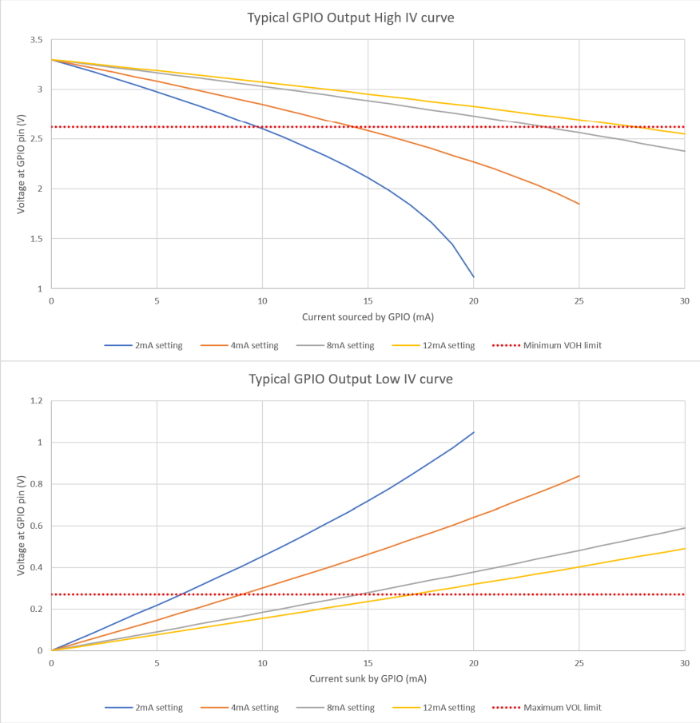
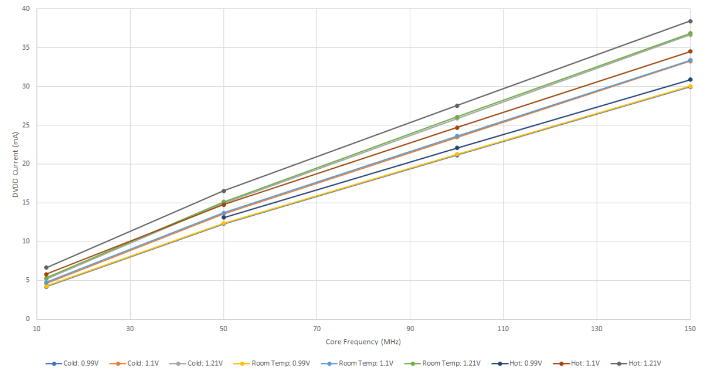

## Chapter 5. Electrical and Mechanical

Physical and electrical details of the RP2040 chip.

**5.1. Package**

PIN 1

_Figure 166. Top down
view (left, top) and
side view (right, top),
along with bottom
view (left, bottom) of
the RP2040 QFN-56
package_

$F05A **NOTE**

There is no standard size for the central GND pad (or ePad) with QFNs. However, the one on RP2040 is smaller than
most. This means that standard 0.4mm QFN-56 footprints provided with CAD tools may need adjusting. This gives
the opportunity to route between the central pad and the ones on the periphery, which can help with maintaining
power and ground integrity on cheaper PCBs. See Minimal Design Example for an example.

5.1. Package **609**

$F05A **NOTE**

Leads have a matte Tin (Sn) finish. Annealing is done post-plating, baking at 150°C for 1 hour. Minimum thickness
for lead plating is 8 micromns, and the intermediate layer material is CuFe2P (roughened Copper (Cu)).

**5.1.1. Thermal characteristics**

The thermal characteristics of the package are shown in Table 610.

_Table 610. Thermal
data for the RP2040
QFN 56 package._

θJA (°C/W) ψJT (°C/W) ψJB (°C/W) TJ (°C) TT (°C) θJC (°C/W) θJB (°C/W)
48.00 0.80 29.20 42.00 41.8 19.01 29.03

**5.1.2. Recommended PCB Footprint**

Dimensions in mm

3.20

1.175

5.40

3.20

6.00

7.75

6.00
0.20

0.875

0.40

5.40

7.75

0.20

_Figure 167.
Recommended PCB
Footprint for the
RP2040 QFN-56
package_

**5.1.3. Package markings**

The RP2040 7×7 mm QFN-56 package is marked as seen in Figure 168, with specifications as shown in Table 611.
Coordinate origin is bottom-left of the package.

5.1. Package **610**

_Figure 168. Package
marking format_

_Table 611. Marking
requirements and
dimensions_

Line Step Item Coord. X Coord. Y Char. Height Char. Width Char. Space
1 1 Pin 1 Dot 0.5 6 0.5 0.5

2 1 Logo 3.5 2.395 3.83 3.05

3 1 RP2-B2 0.555 1.585 0.61 0.37 0.09

3 2 YY/WW 4.235 1.585 0.61 0.37 0.09

4 1 XXXXXX.00 0.555 0.775 0.61 0.37 0.09
4 2 TTT
(optional)

### 5.155 0.775 0.61 0.37 0.09

$F05A **NOTE**

At Line 3, Step 1, the "RP2-B2" marking denotes device name "RP2" and silicon revision "B2."

**5.2. Storage conditions**

In order to preserve the shelf and floor life of bare RP2040 devices, the recommended storage conditions in line with J-
STD (020E & 033D) for RP2040 (classified MSL1) should be kept under 30°C and 85% relative humidity.

**5.3. Solder profile**

RP2040 is a Pb-free part, with a Tp value of 260°C.

All temperatures refer to the center of the package, measured on the package body surface that is facing up during
assembly reflow (live-bug orientation). If parts are reflowed in other than the normal live-bug assembly reflow
orientation (i.e., dead-bug), Tp shall be within ±2°C of the live-bug Tp and still meet the Tc requirements; otherwise, the
profile shall be adjusted to achieve the latter.

5.2. Storage conditions **611**

Time

Temperature

Tp

### TL

Tc -5°C

Tsmax Preheat Area

### 25

Time 25°C to Peak

Tsmin

ts

tp

t

Max. Ramp Up Rate = 3°C/s
Max. Ramp Down Rate = 6°C/s

User tp

User Tp $2264 Tc

Supplier tp

Supplier Tp $2265 Tc

Tc -5°C

Tc

_Figure 169.
Classification profile
(not to scale)_

$F05A **NOTE**

Reflow profiles in this document are for classification/preconditioning, and are not meant to specify board assembly
profiles. Actual board assembly profiles should be developed based on specific process needs and board designs,
and should not exceed the parameters in Table 612.

_Table 612. Solder
profile values_ **Profile feature Value**
Temperature min (Tsmin) 150°C

Temperature max (Tsmax) 200°C

Time (ts) from (Tsmin to Tsmax) 60 $2014 120 seconds
Ramp-up rate (TL to Tp) 3°C/second max.

Liquidous temperature (TL) 217°C

Time (tL) maintained above TL 60 to 150 seconds

Peak package body temperature (Tp) 260°C

Classification temperature (Tc) 260°C
Time (tp) within 5°C of the specified classification temperature (Tc) 30 seconds

Ramp-down rate (Tp to TL) 6°C/second max.

Time 25°C to peak temperature 8 minutes max.

5.3. Solder profile **612**

**5.4. Compliance**

RP2040 is compliant to Moisture Sensitivity Level 1.

RP2040 is compliant to the requirement of REACH Substances of Very High Concern (SVHC) that ECHA announced on
25 June 2020.
RP2040 is compliant to the requirement and standard of Controlled Environment-related Substance of RoHS directive
(EU) 2011/65/EU and directive (EU) 2015/863.
Package Level reliability qualifications carried out on RP2040:

- Temperature Cycling per JESD22-A104
- HAST per JESD22-A110
- HTSL per JESD22-A103
$F05A **NOTE**

A tin whiskers test is not performed as RP2040 is a bottom only termination device (QFN package) which not
applicable to JEDEC standard (JESD201A).

**5.5. Pinout**

**5.5.1. Pin Locations**

_Figure 170. RP2040
QFN-56 package
pinout_

5.4. Compliance **613**

**5.5.2. Pin Definitions**

**5.5.2.1. Pin Types**

In the following GPIO Pin table (Table 614), the pin types are defined as shown below.

_Table 613. Pin Types_ **Pin Type Direction Description**

Digital In Input only Standard Digital. Programmable Pull-Up, Pull-Down, Slew Rate,
Schmitt Trigger and Drive Strength. Default Drive Strength is 4mA.
Digital IO Bi-directional

Digital In (FT) Input only Fault Tolerant Digital. These pins are described as Fault Tolerant,
which in this case means that very little current flows into the pin
whilst it is below 3.63V and IOVDD is 0V. There is also enhanced ESD
protection on these pins. Programmable Pull-Up, Pull-Down, Slew Rate,
Schmitt Trigger and Drive Strength. Default Drive Strength is 4mA.

Digital IO (FT) Bi-directional

Digital IO / Analogue Bi-directional (digital),
Input (Analogue)

Standard Digital and ADC input. Programmable Pull-Up, Pull-Down,
Slew Rate, Schmitt Trigger and Drive Strength. Default Drive Strength
is 4mA.

USB IO Bi-directional These pins are for USB use, and contain internal pull-up and pull-down
resistors, as per the USB specification. Note that external 27Ω series
resistors are required for USB operation.

Analogue (XOSC) Oscillator input pins for attaching a 12MHz crystal. Alternatively, XIN
may be driven by a square wave.

**5.5.2.2. Pin List**

_Table 614. GPIO pins_ **Name Number Type Power Domain Reset State Description**

GPIO0 2 Digital IO (FT) IOVDD Pull-Down User IO

GPIO1 3 Digital IO (FT) IOVDD Pull-Down User IO

GPIO2 4 Digital IO (FT) IOVDD Pull-Down User IO
GPIO3 5 Digital IO (FT) IOVDD Pull-Down User IO

GPIO4 6 Digital IO (FT) IOVDD Pull-Down User IO

GPIO5 7 Digital IO (FT) IOVDD Pull-Down User IO

GPIO6 8 Digital IO (FT) IOVDD Pull-Down User IO

GPIO7 9 Digital IO (FT) IOVDD Pull-Down User IO
GPIO8 11 Digital IO (FT) IOVDD Pull-Down User IO

GPIO9 12 Digital IO (FT) IOVDD Pull-Down User IO

GPIO10 13 Digital IO (FT) IOVDD Pull-Down User IO

GPIO11 14 Digital IO (FT) IOVDD Pull-Down User IO
GPIO12 15 Digital IO (FT) IOVDD Pull-Down User IO

GPIO13 16 Digital IO (FT) IOVDD Pull-Down User IO

GPIO14 17 Digital IO (FT) IOVDD Pull-Down User IO

GPIO15 18 Digital IO (FT) IOVDD Pull-Down User IO

5.5. Pinout **614**

Name Number Type Power Domain Reset State Description

GPIO16 27 Digital IO (FT) IOVDD Pull-Down User IO
GPIO17 28 Digital IO (FT) IOVDD Pull-Down User IO

GPIO18 29 Digital IO (FT) IOVDD Pull-Down User IO

GPIO19 30 Digital IO (FT) IOVDD Pull-Down User IO

GPIO20 31 Digital IO (FT) IOVDD Pull-Down User IO

GPIO21 32 Digital IO (FT) IOVDD Pull-Down User IO
GPIO22 34 Digital IO (FT) IOVDD Pull-Down User IO

GPIO23 35 Digital IO (FT) IOVDD Pull-Down User IO

GPIO24 36 Digital IO (FT) IOVDD Pull-Down User IO

GPIO25 37 Digital IO (FT) IOVDD Pull-Down User IO

GPIO26 / ADC0 38 Digital IO /
Analogue

### IOVDD /

### ADC_AVDD

Pull-Down User IO or ADC
input

GPIO27 / ADC1 39 Digital IO /
Analogue

### IOVDD /

### ADC_AVDD

Pull-Down User IO or ADC
input

GPIO28 / ADC2 40 Digital IO /
Analogue

### IOVDD /

### ADC_AVDD

Pull-Down User IO or ADC
input

GPIO29 / ADC3 41 Digital IO /
Analogue

### IOVDD /

### ADC_AVDD

Pull-Down User IO or ADC
input

_Table 615. QSPI pins_ **Name Number Type Power Domain Reset State Description**

QSPI_SD3 51 Digital IO IOVDD QSPI data

QSPI_SCLK 52 Digital IO IOVDD Pull-Down QSPI clock

QSPI_SD0 53 Digital IO IOVDD QSPI data

QSPI_SD2 54 Digital IO IOVDD QSPI data

QSPI_SD1 55 Digital IO IOVDD QSPI data
QSPI_CSn 56 Digital IO IOVDD Pull-Up QSPI chip select

_Table 616. Crystal
oscillator pins_ **Name Number Type Power Domain Description**
_XIN_ 20 Analogue (XOSC) IOVDD Crystal oscillator. XIN
may also be driven by
a square wave.

XOUT 21 Analogue (XOSC) IOVDD Crystal oscillator.

_Table 617. Serial wire
debug pins_ **Name Number Type Power Domain Reset State Description**
_SWCLK_ 24 Digital In (FT) IOVDD Pull-Up Debug clock

SWD 25 Digital IO (FT) IOVDD Pull-Up Debug data

_Table 618.
Miscellaneous pins_
**Name Number Type Power Domain Reset State Description**

RUN 26 Digital In (FT) IOVDD Pull-Up Chip enable /
reset

5.5. Pinout **615**

Name Number Type Power Domain Reset State Description

TESTEN 19 Digital In IOVDD Pull-Down Test enable
(connect to Gnd)

_Table 619. USB pins_ **Name Number Type Power Domain Description**

USB_DP 47 USB IO USB_VDD USB Data +ve. 27Ω
series resistor
required for USB
operation

USB_DM 46 USB IO USB_VDD USB Data -ve. 27Ω
series resistor
required for USB
operation

_Table 620. Power
supply pins_ **Name Number(s) Description**
_IOVDD_ 1, 10, 22, 33, 42, 49 IO supply

DVDD 23, 50 Core supply

VREG_VIN 44 Voltage regulator input supply

VREG_VOUT 45 Voltage regulator output
USB_VDD 48 USB supply

ADC_AVDD 43 ADC supply

GND 57 Common ground connection via
central pad

**5.5.3. Pin Specifications**

The following electrical specifications are obtained from characterisation over the specified temperature and voltage
ranges, as well as process variation, unless the specification is marked as 'Simulated'. In this case, the data is for
information purposes only, and is not guaranteed.

**5.5.3.1. Absolute Maximum Ratings**

_Table 621. Absolute
maximum ratings for
digital IO (Standard
and Fault Tolerant)_

Parameter Symbol Minimum Maximum Units Comment
I/O Supply Voltage IOVDD -0.5 3.63 V

Voltage at IO VPIN -0.5 IOVDD + 0.5 V

**5.5.3.2. ESD Performance**

_Table 622. ESD
performance for all
pins, unless otherwise
stated_

Parameter Symbol Maximum Units Comment

Human Body Model HBM 2 kV Compliant with JEDEC
specification JS-001-
2012 (April 2012)

5.5. Pinout **616**

Parameter Symbol Maximum Units Comment

Human Body Model
Digital (FT) pins only

HBM 4 kV Compliant with JEDEC
specification JS-001-
2012 (April 2012)

Charged Device Model CDM 500 V Compliant with
JESD22-C101E
(December 2009)

**5.5.3.3. Thermal Performance**

_Table 623. Thermal
Performance_
**Parameter Symbol Minimum Typical Maximum Units Comment**
_Case
Temperature_

### TC -40 85 °C

**5.5.3.4. IO Electrical Characteristics**

_Table 624. Digital IO
characteristics -
Standard and FT
unless otherwise
stated_

Parameter Symbol Minimum Maximum Units Comment
Pin Input Leakage
Current

IIN 1 μA

Input Voltage High
@ IOVDD=1.8V

### VIH 0.65 * IOVDD IOVDD + 0.3 V

Input Voltage High
@ IOVDD=2.5V

### VIH 1.7 IOVDD + 0.3 V

Input Voltage High
@ IOVDD=3.3V

### VIH 2 IOVDD + 0.3 V

Input Voltage Low
@ IOVDD=1.8V

### VIL -0.3 0.35 * IOVDD V

Input Voltage Low
@ IOVDD=2.5V

### VIL -0.3 0.7 V

Input Voltage Low
@ IOVDD=3.3V

### VIL -0.3 0.8 V

Input Hysteresis
Voltage @
IOVDD=1.8V

VHYS 0.1 * IOVDD V Schmitt Trigger
enabled

Input Hysteresis
Voltage @
IOVDD=2.5V

VHYS 0.2 V Schmitt Trigger
enabled

Input Hysteresis
Voltage @
IOVDD=3.3V

VHYS 0.2 V Schmitt Trigger
enabled

Output Voltage
High @
IOVDD=1.8V

VOH 1.24 IOVDD V IOH = 2, 4, 8 or
12mA depending
on setting

5.5. Pinout **617**

Parameter Symbol Minimum Maximum Units Comment

Output Voltage
High @
IOVDD=2.5V

VOH 1.78 IOVDD V IOH = 2, 4, 8 or
12mA depending
on setting

Output Voltage
High @
IOVDD=3.3V

VOH 2.62 IOVDD V IOH = 2, 4, 8 or
12mA depending
on setting

Output Voltage
Low @
IOVDD=1.8V

VOL 0 0.3 V IOL = 2, 4, 8 or
12mA depending
on setting
Output Voltage
Low @
IOVDD=2.5V

VOL 0 0.4 V IOL = 2, 4, 8 or
12mA depending
on setting

Output Voltage
Low @
IOVDD=3.3V

VOL 0 0.5 V IOL = 2, 4, 8 or
12mA depending
on setting

Pull-Up Resistance RPU 50 80 kΩ
Pull-Down
Resistance

RPD 50 80 kΩ

Maximum Total
IOVDD current

IIOVDD_MAX 50 mA Sum of all current
being sourced by
GPIO and QSPI
pins
Maximum Total
VSS current due to
IO (IOVSS)

IIOVSS_MAX 50 mA Sum of all current
being sunk into
GPIO and QSPI
pins

_Table 625. USB IO characteristics_

Parameter | Symbol | Minimum | Maximum | Units | Comment
--- | --- | --- | --- | --- | --- 
Pin Input Leakage Current | I_{IN} | | 1 | μA | 
Single Ended Input Voltage High | V_{IHSE} | 2 | | V |
Single Ended Input Voltage Low | V_{ILSE} | | 0.8 | V | 
Differential Input Voltage High | V_{IHDIFF} | 0.2 | | V |
Differential Input Voltage Low | V_{ILDIFF} | | -0.2 | | V |
Output Voltage High | V_{OH} | 2.8 | USB_VDD | V |
Output Voltage Low | V_{OL} | 0 | 0.3 | V |

Pull-Up Resistance _-RPU2_ | R_{PU2} |  0.873 |  1.548 kΩ | 

Parameter | Symbol | Minimum | Maximum | Units | Comment
--- | --- | --- | --- | --- | --- 
Pull-Up Resistance _-RPU1&2_ | R_{PU1&2} | 1.398 | 3.063 | kΩ | 
Pull-Down Resistance | RPD | 14.25 | 15.75 | kΩ | 

_Table 626. ADC characteristics_

Parameter | Symbol | Minimum | Maximum | Units | Comment
--- | --- | --- | --- | --- | --- 
ADC Input Voltage Range | V_{PIN_ADC} | 0 | ADC_AVDD | V |
Effective Number of Bits | ENOB | 8.7 | | bits | See Section 4.9.3
Resolved Bits | | | 12 | bits |
ADC Input Impedance |
R_{IN_ADC} | 100 | | kΩ |

_Table 627. Oscillator pin characteristics when using a Square Wave input_

Parameter | Symbol | Minimum | Maximum | Units | Comment
---| ---| ---| ---| ---| ---
Input Voltage High | V_{IH} | 0.65*IOVDD | IOVDD + 0.3 | V | XIN only. XOUT floating
Input Voltage Low  | V_{IL} | 0 | 0.35*IOVDD | V | XIN only. XOUT floating

See Section 2.16 for more details on the Oscillator, and Minimal Design Example for information on crystal usage.

#### 5.5.3.5. Interpreting GPIO output voltage specifications

The GPIOs on RP2040 have four different output drive strengths, which are nominally called 2, 4, 8 and 12mA modes.
These are not hard limits, nor do they mean that they will always be sourcing (or sinking) the selected amount of
milliamps. The amount of current a GPIO sources or sinks is dependant on the load attached to it. It will attempt to drive
the output to the IOVDD level (or 0V in the case of a logic 0), but the amount of current it is able to source is limited,
which will be dependant on the selected drive strength. Therefore the higher the current load is, the lower the voltage
will be at the pin. At some point, the GPIO will be sourcing so much current, that the voltage is so low, it won’t be
recognised as a logic 1 by the input of a connected device. The purpose of the output specifications in Table 624 are to
try and quantify how much lower the voltage can be expected to be, when drawing specified amounts of current from
the pin.
The Output High Voltage (VOH) is defined as the lowest voltage the output pin can be when driven to a logic 1 with a
particular selected drive strength; e.g., 4mA being sourced by the pin whilst in 4mA drive strength mode. The Output
Low Voltage is similar, but with a logic 0 being driven.

In addition to this, the sum of all the IO currents being sourced (i.e. when outputs are being driven high) from the IOVDD
bank (essentially the GPIO and QSPI pins), must not exceed IIOVDD_MAX. Similarly, the sum of all the IO currents being sunk
(i.e. when the outputs are being driven low) must not exceed IIOVSS_MAX.

_Figure 171. Typical Current vs Voltage curves of a GPIO output._

Figure 171 shows the effect on the output voltage as the current load on the pin increases. You can clearly see the
effect of the different drive strengths; the higher the drive strength, the closer the output voltage is to IOVDD (or 0V) for
a given current. The minimum VOH and maximum VOL limits are shown in red. You can see that at the specified current
for each drive strength, the voltage is well within the allowed limits, meaning that this particular device could drive a lot
more current and still be within VOH/VOL specification. This is a typical part at room temperature, there will be a spread of
other devices which will have voltages much closer to this limit. Of course, if your application doesn’t need such tightly
controlled voltages, then you can source or sink more current from the GPIO than the selected drive strength setting, but
experimentation will be required to determine if it indeed safe to do so in your application, as it will be outside the scope
of this specification.

## 5.6. Power Supplies

_Table 628. Power Supply Specifications_

Power Supply | Supplies | Min | Typ | Max | Units
-------------|----------|-----|-----|-----|-----------
IOVDD[^a] | Digital | IO | 1.62 | 1.8 / 3.3 | 3.63 | V
DVDD[^b] | Digital | core | 1.05 | 1.1 | 1.16 | V
VREG_VIN | Voltage | regulator | 1.62 | 1.8 / 3.3 | 3.63 | V
USB_VDD | USB | PHY | 3.135 | 3.3 | 3.63 | V
ADC_AVDD[^c] | ADC | 1.62 | 3.3 | 3.63 | V

[^a] If IOVDD <2.5V, GPIO VOLTAGE_SELECT registers should be adjusted accordingly. See Section 2.9 for details.
[^b] Short term transients should be within +/-100mV.
[^c] ADC performance will be compromised at voltages below 2.97V

## 5.7. Power Consumption

### 5.7.1. Peripheral power consumption

Baseline readings are taken with only clock sources and essential peripherals (BUSCTRL, BUSFAB, VREG, Resets, ROM,
SRAMs) active in the WAKE_EN0/WAKE_EN1 registers. Clocks are set to default clock settings. Each peripheral is activated in
turn by enabling all clock sources for the peripheral in the WAKE_EN0/WAKE_EN1 registers. Current consumption is the
increase in current when the peripheral clocks are enabled.

_Table 629. Baseline power consumption_

Peripheral | Typical DVDD Current Consumption (μA/MHz)
----|----
DMA | 2.6
I2C0 | 3.9
I2C1 | 3.8
IO + Pads | 23.6
PIO0 | 12.3
PIO1 | 12.5
PWM | 5.0
RTC | 1.1
SIO | 1.9
SPI0 | 1.7
SPI1 | 1.8
Timer | 1.2
UART0 | 3.5
UART1 | 3.7
Watchdog | 1.0 
XIP | 37.6

Because of fixed external reference clocks of 48 MHz, as well as the variable system clock input, ADC and USBCTRL
power consumption does not vary linearly with system clock (as it does for other peripherals which only have system
and/or peripheral clock inputs). Absolute DVDD current consumption of the ADC and USBCTRL blocks at standard
clocks (system clock of 125 MHz) is given below:

_Table 630. Baseline power consumption for ADC and USBCTRL_

Peripheral | Typical DVDD Current Consumption (μA/MHz)
------------------|----------------------
ADC | 0.1
USBCTRL | 1.3

### 5.7.2. Power consumption for typical user cases

The following data shows the current consumption of various power supplies on 3 each of typical (tt), fast (ff) and slow
(ss) corner RP2040 devices, with four different software use-cases.

!> **NOTE**  
!> For power consumption of the Raspberry Pi Pico, please see the [Raspberry Pi Pico Datasheet](https://datasheets.raspberrypi.com/pico/pico-datasheet.pdf).

Firstly, 'Popcorn' (Media player demo) using the VGA, SD Card, and Audio board. This demo uses VGA video, I2S audio and 4-bit SD Card access, with a system clock frequency of 48MHz.

!> **NOTE**  
!> For more details of the VGA board see the [Hardware design with RP2040](https://datasheets.raspberrypi.com/rp2040/hardware-design-with-rp2040.pdf) book.

Secondly, the BOOTSEL mode of RP2040. These measurements are made both with and without USB activity on the
bus, using a Raspberry Pi 4 as a host.

The third use-case uses the hello_dormant binary which puts RP2040 into a low power state, DORMANT mode.
The final use-case uses the hello_sleep binary code which puts RP2040 into a low power state, SLEEP mode.

Table 631 has two columns per power supply, 'Typical Average Current' and 'Maximum Average Current'. The former is
the current averaged over several seconds that you might expect a typical RP2040 to consume at room temperature
and nominal voltage (e.g., DVDD=1.1V, IOVDD=3.3V, etc). The 'Maximum Average Current' is the maximum current
consumption (again averaged over several seconds) you might expect to see on a worst-case RP2040 device, across
the temperature extremes, and maximum voltage (e.g., DVDD=1.21V, etc).

!> **NOTE**  
!> The 'Popcorn' consumption measurements are heavily dependant on the video being displayed at the time. The
!> 'Typical' values are obtained over several seconds of video, with varied colour and intensity. The 'Maximum' values
!> are measured during periods of white video, when the required current is at its highest.

_Table 631. Power Consumption_

Software Use-case | Typical Average DVDD Current | Max. Average DVDD current | Typical Average IOVDD Current | Max. Average IOVDD current | Typical Average USB_VDD Current | Max. Average USB_VDD current | Units
--------|------|------|------|------|---|---|------
Popcorn | 10.9 | 16.6 | 24.8 | 35.5 | - | - | mA
BOOTSEL mode - Active | 9.4 | 14.7 | 1.2 | 4.3 | 1.4 | 2.0 | mA
BOOTSEL mode - Idle | 9.0 | 14.3 | 1.2 | 4.3 | 0.2 | 0.6 | mA
Dormant | 0.18 | 4.2 | - | - | - | - | mA
Sleep | 0.39 | 4.5 | - | - | - | - | mA

#### 5.7.2.1. Power Consumption versus frequency

To give an indication of the relationship between the core frequency that RP2040 is operating at, and the current
consumed by the DVDD supply, Figure 172 shows the measured results of a typical RP2040 device, continuously
running FFT calculations on both cores, at various core clock frequencies. Figure 172 also shows the effects of case
temperature, and DVDD voltage upon the current consumption.

_Figure 172. DVDD Current vs Core Frequency of a typical RP2040 device, whilst running FFT calculations_

